# 第 1 章 必备基础知识

## 1.1 计算机组成 

### 1.1.1 硬件

计算机硬件主要由五个部分组成，分别是：运算器、控制器、存储器、输⼊设备、输出设备。

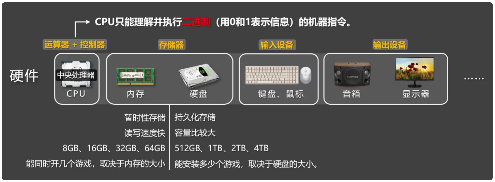

### 1.1.2 软件

计算机软件主要分为：系统软件、应⽤软件。

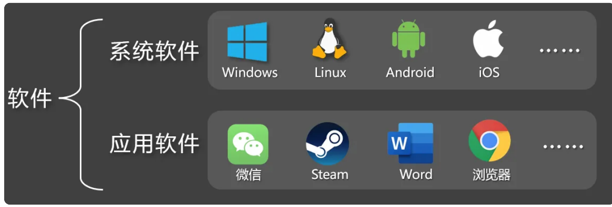

| 类型     | 作用                                                         |
| -------- | ------------------------------------------------------------ |
| 系统软件 | 直接管理和控制计算机硬件的软件，为应⽤软件提供运⾏平台，它负责协调硬件资源（如内存、处理器）并提供通⽤服务，例如：⽂件管理、设备控制、任务调度。 |
| 应用软件 | ⽤于执⾏特定任务的软件，满⾜⽤户的具体需求，如：⽂档编辑、数据分析、娱乐等，它依赖系统软件提供的资源和服务。 |

## 1.2 计算机语言

### 1.2.1 计算机语言、代码、程序

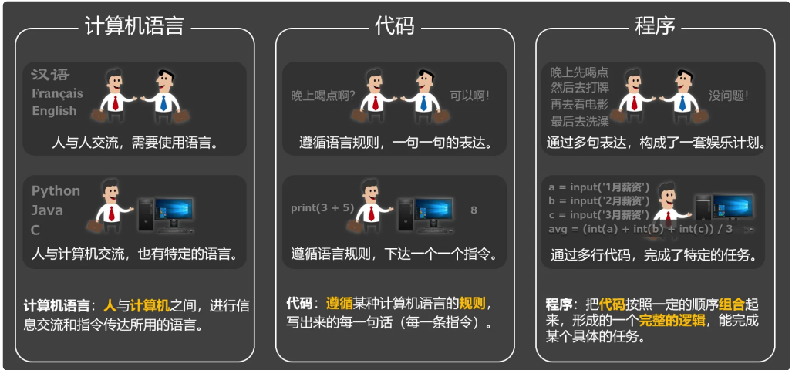

### 1.2.2 计算机语⾔简史

#### 第1代：机器语言

计算机问世的初期，⼈们只能通过『机器语⾔』（⼜称机器码）来操作计算机，所谓机器语⾔，就是 0 和 1 组成的⼆进制内容。⽽且在当时，录⼊和修改信息通常都需要：拨动开关、或插拔连线、或使⽤打孔纸带来输⼊指令。


- 优点：机器可直接执行，速度最快；硬件直接控制
- 缺点：二进制编写，人极难读写和维护；完全依赖硬件，无移植性。

> 例如：在 x86 的 CPU 架构下，使⽤机器码编写 1 + 1 的运算代码如下：

```
10110000 00000001 00000100 00000001
```

#### 第2代：汇编语言

⽤机器语⾔编程，程序员很难理解每⼀条指令的含义，为了解决这个问题，『汇编语⾔』应运⽽⽣，它将机器语⾔中的⼆进制指令，转化为更容易记忆的助记符 （如 MOV 、 ADD 、 LOAD 等），从⽽让程序员能以近似“英⽂简写”的⽅式进⾏编程，简单说 就是：『汇编语⾔』是对『机器语⾔』的“⼈性化翻译”，汇编语⾔`显著降低了编程的⻔槛`，也为 后续⾼级语⾔的诞⽣，打下了基础。

- 优点：比机器语言易读写；执行效率高；
- 缺点：仍依赖特定CPU指令集；编程效率低；代码量大；

> 例如：在 x86 的 CPU 架构下，使⽤『汇编语⾔』编写 1 + 1 的运算代码如下：

```asm
mov al, 1 
add al, 1
```

⚠️注意：『汇编语⾔』需要翻译成『机器码』，才能交给 CPU 执⾏，因为 CPU 只认⼆进制指 令。

#### 第3代：高级语言

相对『机器语⾔』和『汇编语⾔』⽽⾔，『⾼级语⾔』更接近⼈类的⾃然语⾔，它允许程序员使⽤ 英语来编写程序，并向程序员屏蔽了⼤部分的底层细节，语⾔中的符号和算式，也和⽇常的数学算 式差不多，它更容易被掌握，常⻅的『⾼级语⾔』有：C、C++、Java、PHP、Go、Rust、 JavaScript、Python 等。

- 优点：接近自然语言，易学易用；代码简洁；硬件无关，移植性好；丰富的库和工具
- 缺点：执行需编译/解释，效率较低；对硬件控制能力弱

> 例如：下⾯的 Python 代码，可以输出 "Hello, world!"

```py
print("Hello, world!")
```

> 例如：下⾯的 Java 代码，可以输出 "Hello, world!"

```java
public class HelloWorld {
 	public static void main(String[] args){
 		System.out.println("Hello, world!");
 	}
}
```

⚠️注意：计算机不能直接执⾏『⾼级语⾔』，同样需要将其转换为『机器语⾔』才能被计算机 执⾏。

### 1.2.3 编译型语⾔与解释型语⾔

对于⾼级语⾔来说，我们会根据其转换成⼆进制指令过程的不同，可将其分为：『编译型』和『解 释型』

#### 编译型语⾔

将程序翻译成计算机能理解的⼆进制内容，并且通常会⽣成⼀个可执⾏⽂件，例如在 windows 系 统上⽣成的可执⾏⽂件是 .exe ⽂件，常⻅的『编译型』语⾔有：C、C++、Go、Rust 等。

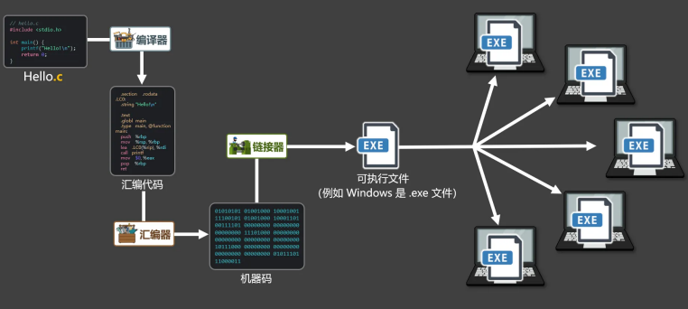

- 优势：同⼀运⾏平台，代码只需编译⼀次，且执⾏效率⾼。 
- 劣势：跨平台性差，⼤型项⽬编译时间较⻓，开发效率略低。

#### 解释型语⾔

将程序⼀句⼀句的翻译为：计算机可以执⾏的指令，整个过程通常不⽣成可执⾏⽂件，常⻅的解释型语⾔有：Python、Php、JavaScript 等。

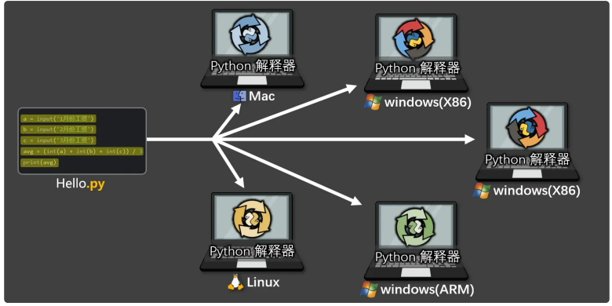

- 优势：跨平台性好，⽆需编译，开发调试灵活⾼效。
-  劣势：每次运⾏都需要解释，执⾏效率较低。

#### 编译+解释混合型

Java 是典型的**编译与解释混合型语言**，这种设计是它“一次编写，到处运行”能力的关键。

简单概括它的执行过程：**Java源码 (.java) → 编译 → 字节码 (.class) → 解释/即时编译 → 机器码执行**

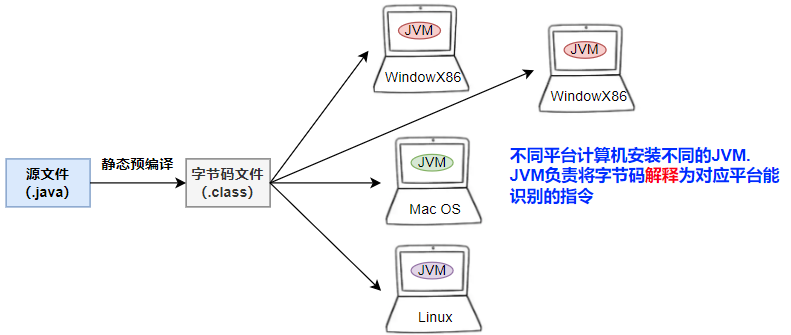

> 有人说python也是编译+解释的混合型的？

- Java 通过“先静态编译为字节码，再在JVM上解释/JIT编译执行”的**混合模式**，完美结合了编译型和解释型语言的优点，目标是**平衡启动速度和运行性能**。

- Python是一门“先（隐式）编译为字节码，再由虚拟机解释执行”的语言。它没有JIT编译步骤，其“编译”主要服务于语法分析和生成中间格式，而非性能优化。其核心执行模型仍然是解释型的。虽然它确实经历了“编译”和“解释”两个阶段，但我们通常**不称之为“混合型语言”**，因为它缺乏关键的 **运行时编译优化** 环节。

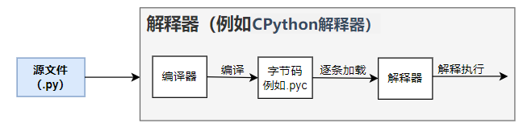

| 特性           | **Java**                                     | **Python (CPython)**                      |
| :------------- | :------------------------------------------- | :---------------------------------------- |
| **编译产出**   | 显式生成 `.class` 字节码文件                 | 隐式生成 `.pyc` 字节码文件（可缓存）      |
| **执行引擎**   | **解释器 + JIT编译器（如HotSpot）**          | **纯解释器**（CPython标准实现）           |
| **性能核心**   | 依赖JIT将热点字节码编译为优化后的**机器码**  | 依赖解释器**直接执行字节码**              |
| **“混合”含义** | **编译 + 解释 + 即时编译**，旨在提升峰值性能 | **编译 + 解释**，旨在实现跨平台和开发便利 |

> 结论：Python是高级语言，是解释型语言。


### 1.2.4 TIOBE排行

**TIOBE 排行榜** 是衡量编程语言流行度的一个**长期、月度更新**的指标。它由荷兰的 TIOBE 公司发布，始于2001年，已成为业界观察语言趋势的重要参考。https://www.tiobe.com/tiobe-index/

**核心要义：它衡量的是“流行度”或“关注度”，而非“最好用”或“代码量最多”。** 标题 “TIOBE Programming Community Index” 也点明了它反映的是 开发者社区的活跃度和关注度。

TIOBE 采用 **自动化算法**，主要数据来源于全球主流搜索引擎的查询结果。语言流行度与招聘需求、技术文章、教程数量高度相关，是开发者学习、企业技术选型的“风向标”之一。它衡量的是“讨论热度”，而非“实际代码行数”或“项目数量”。一门成熟语言可能仍在关键系统中大量运行，但讨论度低，排名就会靠后，而新闻事件、大型会议可能导致某个语言的搜索量短期激增。

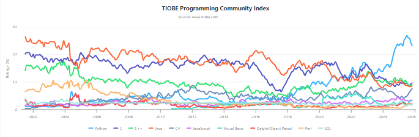

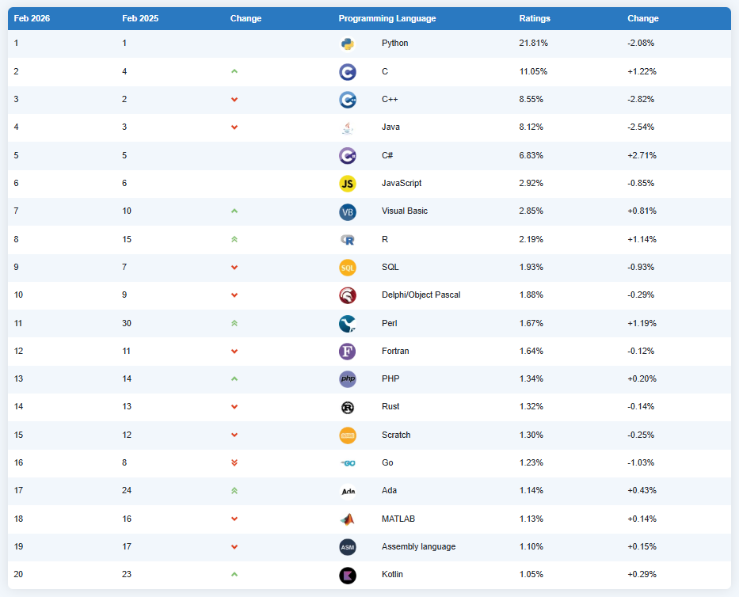

## 1.3 Python语言概述

### 1.3.1 Python的起源

Python 的作者 Guido van Rossum 来⾃荷兰（国内爱称：⻳叔），1982年从阿姆斯特丹大学获得了数学和计算机硕士学位。他发现⽤： C、Fortran 等语⾔写程序太费劲，⽽ Shell 虽然轻松，但功能却很有限。1989 年圣诞节，⻳叔开始动⼿编写⼀种既能像 C 那样全⾯操控系统，⼜能像 Shell ⼀样好上⼿的解释器，并以他喜爱的喜剧 《Monty Python’s Flying Circus》（巨蟒剧团之飞翔的马戏团）为灵感，命名为“Python”。

Python 的设计哲学是“优雅、明确、简单”，Python 提倡：最好只有⼀种⽅法来做⼀件事，它的第⼀个公开版本于 1991 年问世，如今已成为全球最受欢迎的编程语⾔之⼀。


### 1.3.2 Python的特点

优点：

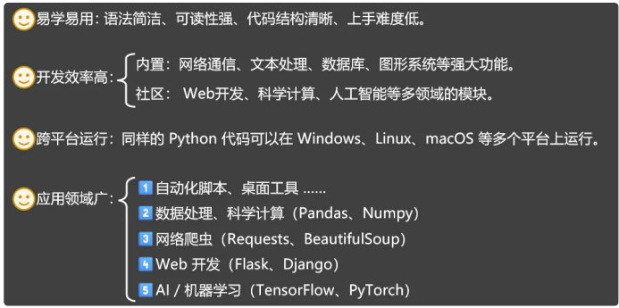

缺点：

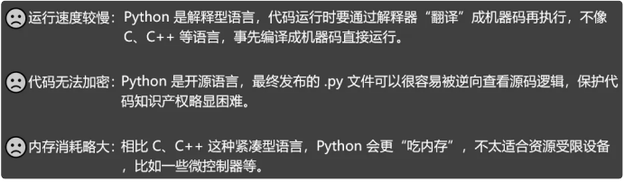

### 1.3.4 Python版本

Python有2个版本，Python2 和 Python3。

Python 3.x 是现在和未来主流的版本。相对于Python的早期版本是一个比较大的升级，且为了不带入过多的累赘， `Python 3.0在设计的时候没有考虑向下兼容`，因而许多早期Python版本设计的程序都无法在 Python 3.0上正常执行。但随着Python3使用越来越广泛，大部分新项目开始使用Python3，且大部分三方库已经支持Python3.x，Python3.x已经成为趋势。

- Python 3.0发布于2008年

- 2020年： Python 2 官⽅停⽌维护，Python 2.7被确定为最后一个 Python 2.x 版本。同时 Python 3.9 发布。
-  2021年：Python 3.10 发布。 
- 2022年：Python 3.11 发布，平均性能提升 10%-60% 。 
- 2023年：Python 3.12 发布，进⼀步优化性能和类型提示。  
- 2024年：Python 3.13 发布。 
- 2025年：Python 3.14 发布。

- 当前课程使用的版本是Python3.12.8

### 1.3.4 Python解释器

由于整个Python语言从规范到解释器都是开源的，所以理论上，只要水平够高，任何人都可以编写Python解释器来执行Python代码（当然难度很大）。事实上，确实存在多种Python解释器。

- **CPython**
  - 当我们从Python官方网站下载并安装好Python 3.x后，我们就直接获得了一个官方版本的解释器：CPython。这个解释器是用C语言开发的，所以叫CPython。在命令行下运行python就是启动CPython解释器。
  
  - CPython是使用最广的Python解释器。教程的所有代码也都在CPython下执行。
  
- IPython
  - IPython是基于CPython之上的一个交互式解释器，也就是说，IPython只是在交互方式上有所增强，但是执行Python代码的功能和CPython是完全一样的。好比很多国产浏览器虽然外观不同，但内核其实都是调用了IE。
  - CPython用>>>作为提示符，而IPython用In [序号]:作为提示符。

- PyPy
  - PyPy是另一个Python解释器，它的目标是执行速度。PyPy采用JIT技术，对Python代码进行动态编译（注意不是解释），所以可以显著提高Python代码的执行速度。绝大部分Python代码都可以在PyPy下运行，但是PyPy和CPython有一些是不同的，这就导致相同的Python代码在两种解释器下执行可能会有不同的结果。如果你的代码要放到PyPy下执行，就需要了解PyPy和CPython的不同点。
- Jython
  - Jython是运行在Java平台上的Python解释器，可以直接把Python代码编译成Java字节码执行。

-  IronPython
  - IronPython和Jython类似，只不过IronPython是运行在微软.Net平台上的Python解释器，可以直接把Python代码编译成.Net的字节码。

> 小结：Python的解释器很多，但使用最广泛的还是CPython。如果要和Java或.Net平台交互，最好的办法不是用Jython或IronPython，而是通过网络调用来交互，确保各程序之间的独立性。
