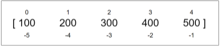
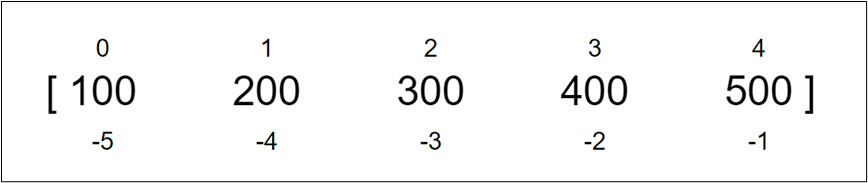
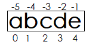
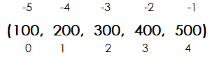

# 第5章 Python的容器类型

## 5.1 容器概述

Python 提供了多种内置的容器类型，用于存储和组织数据。内置的主要容器类型有：列表list、元组tuple、字符串str、集合set、字典dict等，另外Python还在collections模块中提供了更多容器类型，例如：双端队列deque，defaultdict等。

### 5.1.1 常见容器类型及区别

| 类型                      | 示例                  | 可变 | 有序 | 重复   | 使用场景                 | 对应的数据结构                                    | 扩容 |
| :------------------------ | :-------------------- | :--- | :--- | :----- | :----------------------- | ------------------------------------------------- | ---- |
| **列表（list）**          | `[1, 2, 3]`           | √    | √    | √      | 有序数据集合，需要修改   | 动态数组                                          | √    |
| **集合（set）**           | `{1, 2, 3}`           | √    | ×    | ×      | 唯一元素集合，集合运算   | 哈希表                                            | √    |
| **字典（dict）**          | `{'a': 1, 'b': 2}`    | √    | ×    | 键唯一 | 键值对映射，快速查找     | 哈希表（3.7+保持插入顺序）                        | √    |
| **字节数组（bytearray）** | `bytearray(b'hello')` | √    | √    | √      | 需要存储和处理二进制数据 | 动态数组                                          | √    |
|                           |                       |      |      |        |                          |                                                   |      |
| **范围（range）**         | `range(5)`            | ×    | √    | ×      | 等差数字序列，节省内存   | 惰性结构，只存储start,end,step,现计算，不存储元素 | 无   |
| **字符串（str）**         | `'hello'`             | ×    | √    | √      | 文本处理，字符序列       | 静态数组                                          | 无   |
| **元组（tuple）**         | `(1, 2, 3)`           | ×    | √    | √      | 固定数据集合             | 静态数组                                          | 无   |
| **字节串（bytes）**       | `b'hello'`            | ×    | √    | √      | 不可变二进制数据         | 静态数组                                          | 无   |
| **冻结集合（frozenset）** | `frozenset([1, 2])`   | ×    | ×    | ×      | 不可变集合               | 定长哈希表                                        | 无   |

```python
# ------------------可变容器-----------------------
# 列表
listDemo = [1, 2, 3, 4, 5, 3, 4, 5]
print(f"列表{listDemo}")
listDemo.append(6)
print(f"追加元素6之后列表{listDemo}")
listDemo[0] = 10
print(f"修改[0]为10之后列表{listDemo}")
print()

# 集合
setDemo = {1, 2, 3, 4, 5, 3, 4, 5}
print(f"集合{setDemo}")
setDemo.add(6)
print(f"添加元素6之后集合{setDemo}")
setDemo.remove(3)
print(f"删除元素3之后集合{setDemo}")
print()

# 字典
dictDemo = {"name": "Irene", "age": 18}
print(f"字典{dictDemo}")
dictDemo["sex"] = "female"
print(f"修改字典之后字典{dictDemo}")
del dictDemo["age"]
print(f"删除字典的age之后字典{dictDemo}")
print()

# 字节数组
bytearrayDemo = bytearray(b'hello')
print(f"字节数组{bytearrayDemo}")
bytearrayDemo[0] = 65
print(f"修改字节数组[0]元素之后字节数组{bytearrayDemo}")
print()
```

```python
# ------------------不可变容器-----------------------
# 范围
rangeDemo = range(1, 10)
print(f"{rangeDemo}遍历", end="：")
for i in rangeDemo:
    print(i, end=" ")
print("\n")
# rangeDemo[0]=100 # 不可修改，也没有提供修改元素的方法

# 字符串
stringDemo = "Irene"
print(f"字符串{stringDemo}")
stringDemo = stringDemo.replace('r', 'a');  # 原对象不可修改，返回新对象
print(f"替换字符串r为a之后字符串{stringDemo}")
print()

# 元组
tupleDemo = (1, 2, 3, 4, 5)
print(f"元组{tupleDemo}")
# tupleDemo[0] = 10  # 不可修改，也没有提供修改元素的方法
print()

# 字节
bytesDemo = b'Irene'
print(f"字节串{bytesDemo}")
bytesDemo = bytesDemo.replace(b'r', b'a')
print(f"替换字节串r为a之后字节串{bytesDemo}")
print()

# 冻结集合
frozensetDemo = frozenset([1, 2, 3, 4, 5])
print(f"冻结集合{frozensetDemo}")
# frozensetDemo.add(6) # 冻结集合不可修改，也没有提供修改元素的方法
```

### 5.1.2 容器通用基础操作

- 检查元素x是否为容器中的成员：x in container
- 获取容器的长度：len(container)
- 遍历容器：for x in container: 
- 容器：找最大值max(container)、最小值min(container)
- 容器元素求累加和：sum(container) `要求元素是数值类型`

```python
"""
    1、容器的通用操作：
    - 检查成员是否为容器中的元素：x in sequence
    - 获取容器的长度：len(sequence)
    - 遍历容器：for x in sequence : 
    - 容器找最大值max(sequence)、最小值min(sequence)
    - 容器元素求累加和：sum(container) 要求元素是数值类型
"""
print("-" * 20, "容器之列表list类型", "-" * 20)
nums = [1, 2, 3, 4, 5]
print("nums：", nums)
print("4在列表中吗？", 4 in nums)
print("列表的长度是：", len(nums))
for num in nums:
    print(num)
print("列表中的最大值是：", max(nums))
print("列表中的最小值是：", min(nums))
print("元素的累加和是：", sum(nums)) # 要求元素是数值类型

print("-" * 20, "容器之集合set类型", "-" * 20)
words = {"hello", "world", "python","atguigu"}
print("words：", words)
print("hello在集合中吗？", "hello" in words)
print("集合的长度是：", len(words))
for word in words:
    print(word)
print("集合中的最大值是：", max(words))
print("集合中的最小值是：", min(words))
```


## 5.2 序列类型

> 说明：序列（sequence）类型是**有序**的容器，支持索引访问。常见的序列类型包括：列表（List）、字符串（String）、元组（Tuple）等
>
> 元素：有序、可重复（range比较特殊，除外，不会出现重复情况）

### 5.2.1 序列类型通用的操作



- 根据索引方式访问序列的元素：例如sequence[0]
- 通过切片方式访问序列的元素 [start : end : step] ，按照步长复制[start, end)范围的元素。以step为准。
  - step为正，从左往右，start缺省为0，end缺省为len。start和end不缺省的话，选择正下标值或对应的负下标值效果相同。
  - step为负，从右往左，start缺省为-1，end缺省为-len-1。start和end不缺省的话，选择正下标值或对应的负下标值效果相同。
  - step缺省为1。
- 获取元素x的索引：sequence.index(x)
- 序列拼接相加：sequence1 + sequence2
- 序列乘法：sequence1 * n
- 元素x数量统计：sequence.count(x)
- 遍历列表元素：x代表元素，i代表元素索引，sequence代表序列
  - for x in sequence：遍历所有元素
  - for i,x in enumerate(sequence)：遍历所有元素的下标+元素
  - for i in range(len(sequence)) ：遍历所有元素的下标[0, len-1]
  - for i in range(start, end, step)：遍历部分元素。start默认值是0，step默认值是1。
    - step为正，range产生递增数列，数列中的值可以用来当下标
    - step为负，range产生递减数列，数列中的值可以用来当下标


```python
nums = [0,10, 20, 30, 40, 50, 60, 70, 80, 90, 100]

# 访问元素
# 正序索引：索引从0开始
# 倒序索引：索引从-1开始
# 根据访问单个元素
print("nums[0]：", nums[0])
print("nums[-1]：", nums[-1])
# 获取元素索引
print("nums.index(40)：", nums.index(40))

# 切片
print("步长缺省为1：")
print(f"{nums=}")
print("nums[1:5]，范围[1:5)", nums[1:5])
print("nums[3:-1]，范围[3:-1)", nums[3:-1])
print("nums[:5]，start缺省为0，范围[0,5)", nums[:5])
print("nums[5:]，end缺省为len，范围[5,len)", nums[5:])
print("nums[:]，start缺省为0，end缺省为len，范围[0,len)", nums[:])

print("步长为正数：")
print(f"{nums=}")
print("nums[1:5:2]，范围[1:5)步长2", nums[1:5:2])
print("nums[3:-1:2]，范围[3:-1)步长2", nums[3:-1:2])
print("nums[:5:2]，start缺省为0，范围[0,5)步长2", nums[:5:2])
print("nums[5::2]，end缺省为len，范围[5,len)步长2", nums[5::2])
print("nums[::2]，start缺省为0，end缺省为len，范围[0,len)步长2", nums[::2])

print("步长为负数：")
print(f"{nums=}")
print("nums[5:1:-2]，倒序范围[5:1)步长2", nums[5:1:-2])
print("nums[-1:5:-2]，倒序范围[-1:5)步长2", nums[-1:5:-2])
print("nums[:5:-2]，start缺省为-1，倒序范围[-1:5)步长2", nums[:5:-2])
print("nums[4::-2]，end缺省为-len-1，倒序范围[4:-12)步长2", nums[4::-2])
print("nums[::-2]，start缺省为-1，end缺省为-len-1，倒序范围[-1, -len-1)步长2", nums[::-2])

# 序列相加，拼接
nums = [1,2,3]
nums = nums + [6,7]
print("nums + [6,7]：", nums)
nums = nums * 2 # 列表重复2次
print("nums * 2：", nums)
#
# 元素数量统计（元素可重复）
nums = [1,2,3,3,4,3,2,3,3]
print("nums.count(3)：", nums.count(3))

# 遍历
nums = [1,2,3]
for num in nums:
    print(num)

for i in range(len(nums)):
    print(f"第{i+1}个数字：{nums[i]}")

for i,num in enumerate(nums):
    print(f"第{i+1}个数字：{num}")
```

### 5.2.2 列表（有序可变[]）

- 列表是一个可变的集合，是一个元素有序、可重复的序列。
- 列表使用 [] 定义，数据之间使用 , 分隔。
- 列表中每个元素都有对应的位置值，称为索引或下标，索引值：从左往右从0开始逐个向后递增，从右往左从-1开始逐个向前递减。
- 列表中元素可以是不同的类型。



#### 1、创建列表

```python
# 创建列表
list_demo1 = [10,20,30,40,50] # []代表列表
print("list_demo1：", list_demo1)
list_demo2 = list(range(10)) # 使用range创建列表
print("list_demo2：", list_demo2)
list_demo3 = list("hello world") # 字符串转列表
print("list_demo3：", list_demo3)
list_demo4 = list() # 空列表
print("list_demo4：", list_demo4)
```

#### 2、容器、序列通用操作

```python
# 检查成员是否为列表中的元素
listDemo = [10, 20, 30, 40, 50]
print(f"10 in {listDemo}：", 10 in listDemo)  # True
print(f"60 in {listDemo}：", 10 in listDemo)  # False

# 获取列表长度
print("列表的长度", len(listDemo))

# 访问列表元素
print("listDemo[0]：", listDemo[0])  # 获取索引[0]的元素10
print("listDemo[-2]：", listDemo[-2])  # 获取索引[-2]的元素40

# 列表切片
listDemo = [10, 20, 30, 40, 50]
print(listDemo[:])  # 复制整个列表
print(listDemo[2:])  # 复制索引[2]到末尾的所有元素
print(listDemo[:-2])  # 复制开头到索引[-2]（不含）的所有元素
print(listDemo[1:-2])  # 复制索引[1]到索引[-2]（不含）的所有元素

print(listDemo[::2])  # 从头开始，步长为2获取元素
print(listDemo[::-2])  # 从尾开始，步长为2倒序获取元素
print(listDemo[1::2])  # 从[1]开始，步长为2获取元素
print(listDemo[-2::-2])  # 从[-2]开始，步长为2倒序获取元素

# 遍历列表
# 方式一：直接遍历元素
listDemo = [10, 20, 30, 40, 50]
print("列表遍历", end="：")
for num in listDemo:
    print(num, end=" ")
print()

# 方式二：通过索引遍历元素
listDemo = [10, 20, 30, 40, 50]
print("列表遍历", end="：")
for i in range(len(listDemo)):
    print(listDemo[i], end=" ")
print()

# 方式三：使用enumerate()同时获取下标和元素
listDemo = [10, 20, 30, 40, 50]
print("列表遍历", end="：")
for i, num in enumerate(listDemo):
    print(f"{i}={num}", end=" ")
print()


# 列表相加/拼接
one = [1, 2, 3]
two = ['a', 'b', 'c']
three = one + two # 列表相加
print(f"{one} + {two} = {three}")
# [1, 2, 3] + ['a', 'b', 'c'] = [1, 2, 3, 'a', 'b', 'c']

# 列表相乘/重复
listDemo1 = [10, 20, 30]
listDemo2 = listDemo1 * 3
print(f"{listDemo1} * 3 = {listDemo2} ")
# [10, 20, 30] * 3 = [10, 20, 30, 10, 20, 30, 10, 20, 30]

# 列表统计
listDemo = [3, 5, 8, 6, 3, 3, 9, 3, 7]
print(f"列表{listDemo}的最大值：", max(listDemo))
print(f"列表{listDemo}的最小值：", min(listDemo))
print(f"列表{listDemo}元素之和：", sum(listDemo)) #只适用于元素是数值类型
print(f"列表{listDemo}中3的数量：", listDemo.count(3))
```


#### 3、向列表添加元素

```python
# 列表添加元素
listDemo = [10, 20, 30, 40, 50]
listDemo.append(60)  # 末尾追加元素
listDemo.insert(1, 70)  # 指定位置插入元素，例如在[1]位置插入70
print(listDemo)  # [10, 70, 20, 30, 40, 50, 60]
```

#### 4、删除列表元素

```python
# 列表删除元素
listDemo = [10, 20, 30, 40, 50, 60, 70, 80, 90, 100]
print(f"删除之前列表：{listDemo}")
# 方式一：指定下标删除元素
del listDemo[1]
print(f"删除[1]元素之后列表：{listDemo}")
# 方式二：通过切片删除元素
del listDemo[1:4]
print(f"删除[1:4]元素之后列表：{listDemo}")
# 方式三：使用remove()方法删除指定元素
listDemo.remove(60)
print(f"删除60元素之后列表：{listDemo}")
# 方式四：使用pop()方法删除指定元素
listDemo.pop(1)
print(f"删除[1]元素之后列表：{listDemo}")
# 列表清空
listDemo.clear()
print(f"清空列表之后列表：{listDemo}")
```


#### 5、修改列表中的元素

```python
# 列表元素修改
# 方式一：通过下标修改单个元素
listDemo = [10, 20, 30, 40, 50, 60]
print(f"修改之前列表：{listDemo}")
listDemo[0] = 'a'
print(f"替换[0]元素后列表：{listDemo}")  # ['a', 20, 30, 40, 50, 60]

# 方式二：通过切片修改多个元素
listDemo[2:4] = ['a', 'b', 'c', 'd']
print(f"替换[2,4)后的列表：{listDemo}")  # [10, 20, 'a', 'b', 'c', 'd', 50, 60]


```

#### 6、列表排序、反转

```python
listDemo = [3, 5, 8, 6, 3, 3, 9, 3, 7]
listDemo.reverse()
print(f"列表{listDemo}反转后：", listDemo)
listDemo.sort()
print(f"列表{listDemo}排序后：", listDemo)
listDemo.sort(reverse=True)
print(f"列表{listDemo}倒序排序后：", listDemo)
```


#### 7、列表嵌套

列表中元素可以为列表。

```python
# 列表嵌套
listDemo = [[1, 2, 3], [4, 5, 6], [7, 8, 9]]
for inner_list in listDemo:
    print(inner_list)
```


#### 8、语法糖之一：列表推导式

列表推导式是 Python 中一种简洁创建列表的方式，它将一个可迭代对象（如列表、元组、集合、字符串等）的元素通过某种运算或条件筛选后生成一个新的列表。

Python**仅原生支持 4 种推导式 / 表达式**：（其他推导式请看后面相关内容）

- 列表推导式：`[表达式 for 元素 in 可迭代对象]` → 直接生成列表
- # 集合推导式：`{表达式 for 元素 in 可迭代对象}` → 直接生成集合
- 字典推导式：`{键:值 for 元素 in 可迭代对象}` → 直接生成字典
- 生成器表达式：`(表达式 for 元素 in 可迭代对象)` → 生成生成器

```python
# 列表推导式
# （1）基础的列表推导式
# 用range生成1-9的数列，列表推导式将这些数字依次放入列表中
listDemo = [i for i in range(1, 10)]
print(listDemo)

# 用range生成1-9的数列，然后用列表推导式生成1-9的平方
listDemo = [i * i for i in range(1, 10)]
print(listDemo)

# 用range生成0-4的数列，然后对每个数进行平方运算(x**2)
listDemo = [x**2 for x in range(5)]
print(listDemo)  # [0, 1, 4, 9, 16]

# 用列表生成一个列表，新列表中的元素是原列表中的每个数平方
listDemo = [1, 2, 3, 4, 5]
listDemo2 = [i * i for i in listDemo]
print(listDemo2)
```

```python
# （2）列表推导式中添加条件
# 用range生成1-9的数列，然后通过条件判断i % 2 == 0筛选出偶数
listDemo = [i for i in range(1, 10) if i % 2 == 0]
print(listDemo) # [2, 4, 6, 8]
```

```python
# （3）包含多个循环的列表推导式
# 使用列表推导式生成所有可能的元素组合对
list1 = [1, 2, 3]
list2 = ["a", "b", "c"]
tuple_list = [(i, j) for i in list1 for j in list2]
print(tuple_list)
# [(1, 'a'), (1, 'b'), (1, 'c'), (2, 'a'), (2, 'b'), (2, 'c'), (3, 'a'), (3, 'b'), (3, 'c')]
```

1、什么是语法糖

语法糖（Syntactic Sugar）是编程语言中的一种特性，它指的是在不影响语言功能的前提下，为程序员提供更简洁、更易读的语法形式。语法糖本身并不增加语言的功能，而是让代码更容易编写和理解。语法糖的特点：

- 简化代码：让复杂的操作用更简单的语法表达。
- 提高可读性：使代码更接近自然语言或逻辑思维。
- 不改变语义：语法糖只是对底层实现的封装，不会影响程序的实际行为。

2、python中的语法糖有很多，例如：

- for循环：底层是迭代器，请看后续小节
- 推导式：底层是产生列表、集合、字典、生成器的代码
- 装饰器：底层是函数包装，请看后续小节

```python
  # 普通写法
  squares = []
  for x in range(10):
      squares.append(x ** 2)
  
  # 语法糖写法（列表推导式）
  squares = [x ** 2 for x in range(10)]
```


#### 9、zip函数

zip 函数用于将1个或多个可迭代对象打包成一个迭代器，将对应位置的元素组合成元组。

```python
# zip函数
# 基本用法
list1 = [1, 2, 3]
list2 = ['a', 'b', 'c']
result = list(zip(list1, list2))
print(result)  # [(1, 'a'), (2, 'b'), (3, 'c')]

# 循环遍历
for i, j in zip(list1, list2):
    print(f"{i} = {j}")
# 输出：
# 1 = a
# 2 = b
# 3 = c

# 不同长度的列表
list3 = [1, 2, 3, 4, 5]
list4 = ['a', 'b', 'c']
result2 = list(zip(list3, list4))
print(result2)  # [(1, 'a'), (2, 'b'), (3, 'c')]
# 注意：zip会以最短的序列为准

```

```python
# 解压操作
zipped = [(1, 'a'), (2, 'b'), (3, 'c')]
numbers, letters = zip(*zipped)
print(numbers)  # (1, 2, 3)
print(letters)  # ('a', 'b', 'c')
```

#### 10、常用函数

| **函数**                         | **说明**                                          |
| -------------------------------- | ------------------------------------------------- |
| **list.insert(index,x)**         | 在指定位置插入x                                   |
| **list.append(x)**               | 在列表末尾追加x                                   |
| **list1.extend(list2)**          | 在列表1的末尾追加列表2的数据                      |
| **del list[index]**              | 删除指定位置的数据或切片                          |
| **list.remove(x)**               | 删除第一次出现的x                                 |
| **list.pop([index])**            | 删除指定位置的数据，默认为末尾数据                |
| **list.clear()**                 | 清空列表中元素                                    |
| **list[index] = x**              | 修改指定位置的数据                                |
| **list1[start:end] = list2**     | 修改列表切片的数据                                |
| **sorted(list[,reverse=True])**  | 返回排序后的新列表，可选降序                      |
| **list.sort([reverse=True])**    | 对列表就地排序，可选降序                          |
| **list.reverse()**               | 反转列表中的元素                                  |
| **list.index(x[,start,[,end]])** | 返回x在列表中首次出现的位置，可指定起始和结束范围 |
| **list.count(x)**                | 返回x的数量                                       |
| **len(list)**                    | 返回列表元素个数                                  |
| **max(list)**                    | 返回列表中最大值                                  |
| **min(list)**                    | 返回列表中最小值                                  |
| **sum(list)**                    | 返回列表中所有元素和                              |
| **list.copy()**                  | 拷贝列表                                          |
| **list(x)**                      | 将序列转换为列表                                  |


### 5.2.3 字符串（有序不可变）

- 字符串是不可变的、有序的。
- 字符串中元素不可修改。
- 字符串使用单引号、双引号或三重引号定义。
- 字符串中每个元素都有对应的位置值，称为索引或下标，索引值：从左往右从0开始逐个向后递增，从右往左从-1开始逐个向前递减。



> 字符串对象不可变，字符串没有append，insert，remove，replace、sort、reverse等操作方法

#### 1、创建字符串

```python
# 创建字符串
s1 = 'hello'  # 字符串可以是单引号
s2 = "hello"  # 字符串可以是双引号
# 多行文本可以使用"""
s3 = """
    hello
    world
"""
# 多行文本可以使用'''
s4 = '''
    hello
    atguigu
'''
print(s1)
print(s2)
print(s3)
print(s4)
```


#### 2、容器、序列相同的操作

（1）容器通用操作

- 检查元素x是否为容器中的成员：x in container
- 获取容器的长度：len(container)
- 遍历容器：for x in container: 
- 容器：找最大值max(container)、最小值min(container)
- 容器元素求累加和：sum(container) `要求元素是数值类型`

（2）序列通用操作

- 访问序列的元素

  - 根据索引方式访问序列的元素：例如sequence[0]
  - 通过切片方式访问序列的元素：例如sequence[1:3]
- 获取元素x的索引：sequence.index(x)
- 序列拼接相加：sequence1 + sequence2
- 序列乘法：sequence1 * n
- 元素x数量统计：sequence.count(x)
- 遍历列表元素：x代表元素，i代表元素索引，sequence代表序列
  - for x in sequence
  - for i in range(len(sequence))
  - for i,x in enumerate(sequence)

```python
# 检查成员是否为字符串中的元素
strDemo = "hello"
print(f"l in {strDemo}=", 'l' in strDemo)

# 字符串的长度
strDemo = "hello"
print(f"{strDemo}字符串的长度=",len(strDemo))

# 索引和切片
strDemo = "helloworld"
print(f"{strDemo}字符串的[0]=",strDemo[0])
print(f"{strDemo}字符串的[-1]=",strDemo[-1])
print(f"{strDemo}字符串的[1:5]=",strDemo[1:5])
print(f"{strDemo}字符串的[4:-3]=",strDemo[2:-3])
print(f"{strDemo}字符串的[::2]=",strDemo[::2])
print(f"{strDemo}字符串的[::-1]=",strDemo[::-1])
print(f"l在{strDemo}中的索引=",strDemo.index("l"))

# 遍历
for s in "hello":
    print(s, end=", ")
print()

for i,s in enumerate("hello"):
    print(f"第{i+1}个字符是{s}")

for i in range(len("hello")):
    print(f"第{i+1}个字符是{strDemo[i]}")

# 字符串相加
strDemo = "hello"
print(f"字符串的拼接{strDemo}", end=" + ")
strDemo += "world"
print(f"world=",strDemo)

# 字符串乘法
str1 = "hello"
str2 = str1 * 3
print(f"{str1} * 3 =",str2)

# 字符串的统计
strDemo = "hello"
print(f"{strDemo}字符串的统计=",strDemo.count("l"))
print(f"{strDemo}最大字符=",max(strDemo))
print(f"{strDemo}最小字符=",min(strDemo))
```


#### 3、原始字符串

所有的字符串按照字面意思处理，没有转义字符。需在字符串前加上r / R。

```python
# 原始字符串
strDemo = r"hello\nworld"
print(strDemo)
```


#### 4、常用函数

| **函数**                            | **说明**                                                     |
| ----------------------------------- | ------------------------------------------------------------ |
| **str.replace(old,new[,max])**      | 把将字符串中的old替换成new,如果指定max，则替换不超过max次    |
| **str.split([x][,n])**              | 按x分隔字符串，默认按任何空白字符串分隔并在结果中丢弃空字符串。可指定最大分隔次数 |
| **str.rsplit([x][,n])**             | 与split()类似，从右边开始分隔                                |
| **x.join(seq)**                     | 以x作为分隔符，将序列中所有的字符串合并为一个新的字符串      |
| **str.strip([x])**                  | 截掉字符串两边的空格或指定字符                               |
| **str.lstrip([x])**                 | 截掉字符串左边的空格或指定字符                               |
| **str.rstrip([x])**                 | 截掉字符串右边的空格或指定字符                               |
| **str.removeprefix()**              | 截掉字符串指定前缀                                           |
| **str.removesuffix()**              | 截掉字符串指定后缀                                           |
| **str.upper()**                     | 将所有字符转为大写                                           |
| **str.lower()**                     | 将所有字符转为小写                                           |
| **str.swapcase()**                  | 反转字符串中字母大小写                                       |
| **str.capitalize()**                | 将字符串第一个字母变为大写，其他字母变为小写                 |
| **str.title()**                     | 将字符串每个单词首字母大写                                   |
| **len(str)**                        | 返回字符串长度                                               |
| **max(str)**                        | 返回字符串中最大值                                           |
| **min(str)**                        | 返回字符串中最小值                                           |
| **str.find(x[,start][,end])**       | 返回字符串中第一个x的索引值，不存在则`返回-1`，可指定字符串开始结束范围 |
| **str.rfind(x[,start][,end])**      | 与find()类似，从右边开始查找                                 |
| **str.index(x[,start][,end])**      | 返回字符串中第一个x的索引值，不存在则`报错`，可指定字符串开始结束范围 |
| **str.rindex(x[,start][,end])**     | 与index()类似，从右边开始查找                                |
| **str.count(x[,start][,end])**      | 返回字符串中x的个数，可指定字符串开始结束范围                |
| **str.startswith(x[,start][,end])** | 检查字符串是否以x开头，可指定字符串开始结束范围              |
| **str.endswith(x[,start][,end])**   | 检查字符串是否以x结尾，可指定字符串开始结束范围              |
| **str.isspace()**                   | 检查字符串是否非空且只包含空白                               |

##### （1）字符串替换

```python
# 字符串替换
str1 = "hello world"
str2 = str1.replace("world", "python") # 原字符串对象不会改变
print(f"{str1}字符串替换=",str2)
```


##### （2）多个字符串连接

```python
# 多个字符串连接
words = ['hello', 'world', 'python']
separator = '-'
result = separator.join(words)
print(f"使用 '{separator}' 连接 {words} =", result)
```


##### （3）字符串中查找子字符串

```python
# find() 方法检测字符串中是否包含子字符串，如果包含则返回子字符串开始的索引值，否则返回 -1。
text = "hello world"
substring = "world"
position = text.find(substring)
print(f"{text} 中 {substring} 的位置(从0开始) =", position)

# 如果找不到子字符串，则返回 -1
not_found = text.find("java")
print(f"{text} 中查找 java 返回值 =", not_found)


# index() 方法与 find() 类似，但如果子字符串不在原字符串中会抛出异常 ValueError。
try:
    text = "hello world"
    substring = "world"
    position = text.index(substring)
    print(f"'{text}' 中 '{substring}' 的位置(从0开始) =", position)
    
    # 尝试查找不存在的子字符串会引发 ValueError 异常
    # text.index("java")  # 取消注释此行查看错误信息
except ValueError as e:
    print("未找到指定子字符串:", e)
```

##### （4）字符串拆分

```python
# split() 方法通过指定分隔符对字符串进行切片，并返回分割后的列表。
sentence = "hello world python"
# 默认情况下，split() 使用空白字符作为分隔符
parts = sentence.split() 
print(f"{sentence}按空格分割后得到 =", parts)

# 指定逗号作为分隔符
default_split = "apple,banana,orange".split(',')
print("使用逗号分割 'apple,banana,orange' =", default_split)
```


##### （5）去掉首或尾的部分

```python
# strip() 方法用于移除字符串头尾指定的字符（默认为空格或换行符）
text_with_spaces = "   hello world   "
stripped_text = text_with_spaces.strip()
print(f"'{text_with_spaces}' 去除首尾空格后 = '{stripped_text}'")

# 指定要去除的字符
text_with_chars = "***hello world***"
stripped_chars = text_with_chars.strip('*')
print(f"'{text_with_chars}' 去除首尾星号后 = '{stripped_chars}'")

# lstrip() 方法用于移除字符串开头指定的字符
text = "___hello world___"
left_stripped = text.lstrip('_')
print(f"'{text}' 去除开头下划线后 = '{left_stripped}'")

# rstrip() 方法用于移除字符串末尾指定的字符
text = "___hello world___"
right_stripped = text.rstrip('_')
print(f"'{text}' 去除末尾下划线后 = '{right_stripped}'")

# removeprefix() 方法用于移除字符串的指定前缀（Python 3.9+）
url = "https://www.example.com"
without_protocol = url.removeprefix('https://')
print(f"'{url}' 移除前缀 'https://' 后 = '{without_protocol}'")

# 如果没有匹配的前缀，则返回原字符串
no_change = url.removeprefix('http://')
print(f"'{url}' 尝试移除前缀 'http://' 后 = '{no_change}'")

# removesuffix() 方法用于移除字符串的指定后缀（Python 3.9+）
filename = "document.pdf"
without_extension = filename.removesuffix('.pdf')
print(f"'{filename}' 移除后缀 '.pdf' 后 = '{without_extension}'")

# 如果没有匹配的后缀，则返回原字符串
no_change = filename.removesuffix('.txt')
print(f"'{filename}' 尝试移除后缀 '.txt' 后 = '{no_change}'")

```

##### （6）转大小写

```python
# upper() 方法将字符串中的所有小写字母转换为大写字母
text = "hello world"
upper_text = text.upper()
print(f"'{text}' 转换为大写 = '{upper_text}'")

# lower() 方法将字符串中的所有大写字母转换为小写字母
text = "HELLO WORLD"
lower_text = text.lower()
print(f"'{text}' 转换为小写 = '{lower_text}'")

# swapcase() 方法将字符串中的大写字母转换为小写，小写字母转换为大写
text = "Hello World"
swapped_text = text.swapcase()
print(f"'{text}' 大小写互换 = '{swapped_text}'")

# capitalize() 方法将字符串的第一个字符转换为大写，其余字符转换为小写
text = "hello world"
capitalized_text = text.capitalize()
print(f"'{text}' 首字母大写 = '{capitalized_text}'")

# title() 方法将字符串中每个单词的首字母转换为大写
text = "hello world python"
title_text = text.title()
print(f"'{text}' 每个单词首字母大写 = '{title_text}'")

# casefold() 方法类似于 lower()，但更加强大，适用于多语言环境
text = "HELLO WORLD"
casefolded_text = text.casefold()
print(f"'{text}' casefold 转换 = '{casefolded_text}'")

```

#### 5、其他函数

| **函数**                                       | **说明**                                                     |
| ---------------------------------------------- | ------------------------------------------------------------ |
| **s.center(width[,x])**                        | 返回长度为width且居中的字符串，空白使用x填充，默认为空格     |
| **s.ljust(width[,x])**                         | 返回长度为width且左对齐的字符串，空白使用x填充，默认为空格   |
| **s.rjust(width[,x])**                         | 返回长度为width且右对齐的字符串，空白使用x填充，默认为空格   |
| **s.zfill(width)**                             | 返回长度为width且右对齐的字符串，空白使用0填充               |
| **s.splitlines([keepends])**                   | 按行分隔字符串，返回每行字符串组成的列表，可选是否保留换行符 |
| **s.partition(x)**                             | 使用x将字符串分隔为3部分，如果分隔后不足3部分或字符串中没有x则以空白填充 |
| **s.rpartition(x)**                            | 与partition()类似，从右边开始分隔                            |
| **s.encode(encoding='UTF-8',errors='strict')** | 对字符串使用指定格式编码，并指定错误处理方案                 |
| **s.expandtabs([tabsize])**                    | 将字符串中\t转化为空格，可指定每个\t空格数                   |
| **s.format_map(dict)**                         | 使用字典等映射关系数据来格式化字符串                         |
| **s.isalnum()**                                | 检查字符串是否非空且只包含字母(英文字母+汉字)和数字          |
| **s.isalpha()**                                | 检查字符串是否非空且只包含字母(英文字母+汉字)                |
| **s.isascii()**                                | 检查字符串是否只包含ASCII字符，空字符串也是ASCII             |
| **s.isdecimal()**                              | 检查字符串是否非空且只包含十进制字符                         |
| **s.isdigit()**                                | 检查字符串是否非空且只包含数字                               |
| **s.isidentifier()**                           | 检查字符串是否是有效的标识符                                 |
| **s.isupper()**                                | 检查字符串中是否包含至少一个区分大小写的字符，且所有这些(区分大小写的)字符都是大写 |
| **s.islower()**                                | 检查字符串中是否包含至少一个区分大小写的字符，且所有这些(区分大小写的)字符都是小写 |
| **s.isnumeric()**                              | 检查字符串是否非空且只包含数值字符                           |
| **s.isprintable()**                            | 检查字符串是否可打印                                         |
| **s.istitle()**                                | 检查字符串是否非空且符合title格式                            |
| **str.maketrans(str1,str2[,str3])**            | 生成翻译表table供translate()使用。如果只传一个参数，它是一个字典\{"old1":"new1","old2":"new2"\}。如果传两个参数，需要str1和str2为等长的字符串，str1中的每个字符都将映射到str2中相同位置的字符。如果有第三个参数，它必须是一个字符串，其中字符将在结果中被删除。 |
| **s.translate(table)**                         | 使用给定的翻译表替换字符串中的每个字符                       |

##### （1）字符串填充

```python
# center() 方法返回一个指定宽度并居中对齐的字符串，两侧使用指定字符填充
text = "hello"
centered_text = text.center(15, '*')
print(f"'{text}' 居中对齐(宽度15,填充*) = '{centered_text}'")

# 使用默认空格填充
centered_default = text.center(15)
print(f"'{text}' 居中对齐(宽度15,默认填充) = '{centered_default}'")

# ljust() 方法返回一个指定宽度并左对齐的字符串，右侧使用指定字符填充
text = "hello"
left_justified = text.ljust(15, '-')
print(f"'{text}' 左对齐(宽度15,填充-) = '{left_justified}'")

# 使用默认空格填充
left_default = text.ljust(15)
print(f"'{text}' 左对齐(宽度15,默认填充) = '{left_default}'")

# rjust() 方法返回一个指定宽度并右对齐的字符串，左侧使用指定字符填充
text = "hello"
right_justified = text.rjust(15, '.')
print(f"'{text}' 右对齐(宽度15,填充.) = '{right_justified}'")

# 使用默认空格填充
right_default = text.rjust(15)
print(f"'{text}' 右对齐(宽度15,默认填充) = '{right_default}'")

# zfill() 方法返回指定长度的字符串，原字符串右对齐，前面填充0
number = "42"
zero_filled = number.zfill(8)
print(f"'{number}' 用0填充到长度8 = '{zero_filled}'")

# 对于负数，负号会在0之前
negative_number = "-42"
negative_zero_filled = negative_number.zfill(8)
print(f"'{negative_number}' 用0填充到长度8 = '{negative_zero_filled}'")
```


##### （2）字符串分割

```python
# splitlines() 方法按照行('\r', '\n', '\r\n')分割字符串，返回包含各行的列表
multiline_text = """第一行
第二行
第三行"""

lines = multiline_text.splitlines()
print(f"原始多行文本:\n{multiline_text}")
print(f"splitlines() 分割结果 = {lines}")

# keepends=True 保留换行符
lines_with_endings = multiline_text.splitlines(True)
print(f"splitlines(True) 分割结果 = {lines_with_endings}")

# partition() 方法从左边开始查找分隔符，将字符串分割成三部分：分隔符前、分隔符、分隔符后
text = "hello-world-python"
partition_result = text.partition('-')
print(f"'{text}' 以 '-' 分割 = {partition_result}")

# 如果找不到分隔符，则返回 (原字符串, '', '')
no_separator = "helloworld"
partition_no_match = no_separator.partition('-')
print(f"'{no_separator}' 以 '-' 分割 = {partition_no_match}")

# rpartition() 方法从右边开始查找分隔符，将字符串分割成三部分：分隔符前、分隔符、分隔符后
text = "hello-world-python"
rpartition_result = text.rpartition('-')
print(f"'{text}' 从右以 '-' 分割 = {rpartition_result}")

# 如果找不到分隔符，则返回 ('', '', 原字符串)
no_separator = "helloworld"
rpartition_no_match = no_separator.rpartition('-')
print(f"'{no_separator}' 从右以 '-' 分割 = {rpartition_no_match}")
```

##### （3）字符串格式化

```python
# format_map() 方法使用字典作为参数来格式化字符串
template = "姓名: {name}, 年龄: {age}, 城市: {city}"
data = {"name": "张三", "age": 25, "city": "北京"}
formatted_text = template.format_map(data)
print(f"模板字符串: {template}")
print(f"字典数据: {data}")
print(f"format_map 格式化结果: {formatted_text}")

# 与 format() 的区别：format_map 直接接受字典
another_template = "课程: {course}, 成绩: {score}"
course_data = {"course": "Python", "score": 95}
result = another_template.format_map(course_data)
print(f"课程信息格式化: {result}")
```


##### （5）字符串翻译

```python
# maketrans() 方法创建字符映射表，用于字符替换
# translate() 方法根据转换表转换字符串中的字符
# 通常与 maketrans() 方法配合使用
# 单个字典参数版本
translation_dict = {'h': 'H', 'l': 'L', 'o': 'O'}
dict_table = str.maketrans(translation_dict)
simple_text = "hello"
dict_translated = simple_text.translate(dict_table)
print(f"\n原文本: {simple_text}")
print(f"字典映射: {translation_dict}")
print(f"翻译后: {dict_translated}")
print()

# 两个参数版本：str1 中的字符映射到 str2 中对应位置的字符
str1 = "abc"
str2 = "123"
translation_table = str.maketrans(str1, str2)
original_text = "bacadb"
translated_text = original_text.translate(translation_table)
print(f"原文本: {original_text}")
print(f"映射规则: {str1} -> {str2}")
print(f"翻译后: {translated_text}")

# 三个参数版本：第三个参数是要删除的字符
str1 = "aeiou"
str2 = "AEIOU"
str3 = ","
remove_translation = str.maketrans(str1, str2, str3)
text_with_spaces = "hello,world"
result_with_removal = text_with_spaces.translate(remove_translation)
print(f"\n原文本: '{text_with_spaces}'")
print(f"映射规则: 小写元音->大写元音, 删除,")
print(f"翻译后: '{result_with_removal}'")
```


### 5.2.4 元组（有序不可变()）

- 元组（tuple）是一个不可变的、有序的元素集合。
- 不能对元组中的元素进行修改操作。
- 元组使用 () 定义，数据之间使用,分隔。
- 元组中每个元素都有对应的位置值，称为索引或下标，索引值：从左往右从0开始逐个向后递增，从右往左从-1开始逐个向前递减。
- 元组中元素可以是不同的类型。
- 元组的使用方式与列表类似。



#### 1、创建元组

```python
# 创建元组
tuple_demo1 = (10,20,30,40,50)
print("tuple_demo1：", tuple_demo1)
tuple_demo2 = tuple(range(10)) # 使用range创建元组
print("tuple_demo2：", tuple_demo2)
tuple_demo3 = tuple("hello world") # 字符串转元组
print("tuple_demo3：", tuple_demo3)
tuple_demo4 = tuple() # 空元组
print("tuple_demo4：", tuple_demo4)
tuple_demo5 = (10,) # 元组中只有一个元素时，必须用逗号隔开
print("tuple_demo5：", tuple_demo5)
# (x for x in range(10))得到的是一个生成器对象，而不是一个元组对象，所以需要用tuple()函数将其转换为元组对象。
tuple_demo6 = tuple(x for x in range(10))
print("tuple_demo6：",tuple_demo6)
```


#### 2、容器、序列类型相同的操作

- （1）容器通用操作

  - 检查元素x是否为容器中的成员：x in container
  - 获取容器的长度：len(container)
  - 遍历容器：for x in container: 
  - 容器：找最大值max(container)、最小值min(container)

  （2）序列通用操作

  - 访问序列的元素

    - 根据索引方式访问序列的元素：例如sequence[0]
    - 通过切片方式访问序列的元素：例如sequence[1:3]
  - 获取元素x的索引：sequence.index(x)
  - 序列拼接相加：sequence1 + sequence2
  - 序列乘法：sequence1 * n
  - 元素x数量统计：sequence.count(x)
  - 遍历列表元素：x代表元素，i代表元素索引，sequence代表序列
    - for x in sequence
    - for i in range(len(sequence))
    - for i,x in enumerate(sequence)

```python
# 检查成员是否为元组中的元素
tupleDemo = (10, 20, 30, 40, 50)
print(f"10 in {tupleDemo}：", 10 in tupleDemo)

# 获取元组长度
tupleDemo = (10, 20, 30, 40, 50)
print("元组的长度", len(tupleDemo))

# 访问元组元素
# 根据索引方式访问元组的元素
tupleDemo = (10, 20, 30, 40, 50)
print(f"tupleDemo[0]：", tupleDemo[0])
print(f"tupleDemo[-2]：", tupleDemo[-2])

# 通过切片方式访问元组的元素
tupleDemo = (10, 20, 30, 40, 50)
print(tupleDemo[:])
print(tupleDemo[2:])

# 遍历元组
tupleDemo = (10, 20, 30, 40, 50)
for num in tupleDemo:
    print(num, end=" ")
print()

# 元组拼接相加
tupleDemo1 = (10, 20, 30)
tupleDemo2 = (40, 50, 60)
tupleDemo3 = tupleDemo1 + tupleDemo2
print(tupleDemo3)

# 元组乘法
tupleDemo1 = (10, 20, 30)
tupleDemo2 = tupleDemo1 * 3
print(tupleDemo2)

# 元组找最大值max、最小值min、元素数量统计count
tupleDemo = (10, 20, 30, 40, 30, 60)
print(f"元组{tupleDemo}的最大值：", max(tupleDemo))
print(f"元组{tupleDemo}的最小值：", min(tupleDemo))
print(f"元组{tupleDemo}的总和：", sum(tupleDemo))
print(f"元组{tupleDemo}元素数量统计：", tupleDemo.count(30))

```

#### 3、元组不可变

```python
# --------------元组不可变-------------------
tupleDemo1 = (1, 2, 3)
print(id(tupleDemo1))
tupleDemo2 = (4, 5, 6)
tupleDemo1 += tupleDemo2
print(id(tupleDemo1))

# 列表可变
listDemo1 = [10, 20, 30, 40, 50, 60]
print(id(listDemo1))
listDemo2 = [10,20]
listDemo1 += listDemo2
print(id(listDemo1))

# 如果元组中元素是可变数据类型，其嵌套项可以被修改。
tupleDemo = ([1, 2], [3, 4])
print(id(tupleDemo), tupleDemo)
tupleDemo[0][0] = 10
print(id(tupleDemo), tupleDemo)
tupleDemo[0].append(20)
print(id(tupleDemo), tupleDemo)
```


## 5.3 集合（无序可变\{\}）

- 集合是无序的，且不包含重复元素。
- 集合使用 \{\} 定义，数据之间使用 , 分隔，也可以使用set()定义。
- 集合没有索引，所以不能通过切片方式访问集合元素。
- 集合中元素可以是不同的类型。
- 集合可以进行数学上的集合操作，如并集、交集和差集。
- 集合适用于需要快速成员检查、消除重复项和集合运算的场景。

### 5.3.1 创建集合

```python
# 创建集合
set_demo1 = set() # 创建空集合
print("set_demo1：", set_demo1)
set_demo2 = {1,2,3,4,5} # {}代表集合
print("set_demo2：", set_demo2)
set_demo3 = {x for x in range(1,11)} # 集合推导式
print("set_demo3：",set_demo3)
set_demo4 = set("hello world") # 字符串转换集合
print("set_demo4：",set_demo4)
set_demo5 = set(range(1,11)) # 使用range创建集合
print("set_demo5：",set_demo5)
```


### 5.3.2 与序列的对比

| 特性          | 序列                     | 集合                   |
| :------------ | :----------------------- | :--------------------- |
| **顺序**      | 有序，保持插入顺序       | 无序                   |
| **重复元素**  | 允许重复                 | 自动去重               |
| **索引/切片** | 支持（seq[0], seq[1:3]） | 不支持                 |
| **内存使用**  | 通常更节省               | 通常更大（哈希表实现） |
| **查找效率**  | O(n) 线性查找            | O(1) 平均查找时间      |
| **可变性**    | 有可变和不可变类型       | 有可变和不可变类型     |

### 5.3.3 容器相同的操作

- 检查元素x是否为容器中的成员：x in container
- 获取容器的长度：len(container)
- 遍历容器：for x in container: 
- 容器：找最大值max(container)、最小值min(container)
- 容器元素求累加和：sum(container) `要求元素是数值类型`

```python
# 检查成员是否为集合中的元素
setDemo = {1, 2, 3, 4, 5}
print(f"1 in {setDemo}：", 1 in setDemo)

# 获取集合的长度
setDemo = {1, 2, 3, 4, 5}
print("集合的长度", len(setDemo))

# 遍历集合
setDemo = {1, 2, 3, 4, 5}
for num in setDemo:
    print(num, end=" ")
print()

# 找最大值max(sequence)、最小值min(sequence)、总和
setDemo = {4, 1, 3, 2, 5}
print(f"集合{setDemo}的最大值：", max(setDemo))
print(f"集合{setDemo}的最小值：", min(setDemo))
print(f"集合{setDemo}的总和：", sum(setDemo))
```

### 5.3.4 向集合中添加元素

```python
# 向集合中添加元素
setDemo = {1, 2, 3, 4, 5}
print(f"集合{setDemo}")
setDemo.add(6)
print(f"添加元素6：", setDemo)
setDemo.update([7, 8, 9])
print(f"添加元素[7, 8, 9]：", setDemo)
```

### 5.3.5 从集合中删除元素

- remove(目标元素)：目标元素存在时删除元素，目标元素不存在时报错
- discard(目标元素)：目标元素存在时删除元素，目标元素不存在时安静的忽略
- pop()：删除集合中的第一个元素

> 在不确定元素是否存在的场景下，推荐使用 discard() 以避免程序中断。

```python
# 删除集合中的元素
setDemo = {1, 2, 3, 4, 5}
print(f"集合{setDemo}")
setDemo.remove(3)
print(f"删除元素3：", setDemo)
# setDemo.remove(6) # 抛出 KeyError: 6
setDemo.discard(4)
print(f"删除元素4：", setDemo)
setDemo.discard(6)  # 不报错，集合保持不变
print(f"删除元素6：", setDemo)
setDemo.pop()
print(f"删除集合中的第一个元素：", setDemo)
setDemo.clear()
print(f"清空集合：", setDemo)
```

### 5.3.6 差集、并集、交集计算

```python
# 集合判断
setDemo1 = {1, 2, 3}
setDemo2 = {1, 2, 3, 7, 8}
print("setDemo1和setDemo2是否完全不同，没有交集：",setDemo1.isdisjoint(setDemo2))
print("setDemo1是setDemo2的子集吗：",setDemo1.issubset(setDemo2))
print("setDemo1是setDemo2的父集吗：",setDemo1.issuperset(setDemo2))
```

```python
# 集合运算符
setDemo1 = {1, 2, 3, 4, 5}
setDemo2 = {1, 2, 3, 7, 8}
print(f"{setDemo1} | {setDemo2} 并集 = ",setDemo1 | setDemo2)  # 集合的并集
print(f"{setDemo1} & {setDemo2} 交集 = ",setDemo1 & setDemo2)  # 集合的交集
print(f"{setDemo1} - {setDemo2} 差集 = ",setDemo1 - setDemo2)  # 集合的差集
print(f"{setDemo1} ^ {setDemo2} 异或集 = ",setDemo1 ^ setDemo2)  # 集合的异或集
```

```python
# 集合并集计算
setDemo1 = {1, 2, 3, 4, 5}
setDemo2 = {1, 2, 3, 7, 8}
setDemo3 = {1, 2, 3, 5, 6}
print("setDemo1集合 = ", setDemo1)
print("setDemo2集合 = ", setDemo2)
print("setDemo3集合 = ", setDemo3)
print("setDemo1.union(setDemo2,setDemo3)并集 = ",setDemo1.union(setDemo2,setDemo3)) # 集合的并集，setDemo1集合不变，返回新集合
```

```python
# 集合交集计算
setDemo1 = {1, 2, 3, 4, 5}
setDemo2 = {1, 2, 3, 7, 8}
setDemo3 = {1, 2, 3, 5, 6}
print("setDemo1集合 = ", setDemo1)
print("setDemo2集合 = ", setDemo2)
print("setDemo3集合 = ", setDemo3)
print("setDemo1.intersection(setDemo2,setDemo3)交集 = ",setDemo1.intersection(setDemo2,setDemo3)) # 集合的交集，setDemo1集合不变，返回新集合
print("setDemo1.intersection(setDemo2,setDemo3)计算交集后setDemo1 = ",setDemo1)
setDemo1.intersection_update(setDemo2,setDemo3) # 集合的交集，setDemo1集合被修改，返回None
print("setDemo1.intersection(setDemo2,setDemo3)计算交集后setDemo1 = ",setDemo1)
```

```python
# 集合差集计算
setDemo1 = {1, 2, 3, 4, 5}
setDemo2 = {1, 2, 3, 7, 8}
setDemo3 = {1, 2, 3, 5, 6}
print("setDemo1集合 = ", setDemo1)
print("setDemo2集合 = ", setDemo2)
print("setDemo3集合 = ", setDemo3)
#  difference和difference_update：用于计算差集（即当前集合中存在但其他集合中不存在的元素）
print("setDemo1.difference(setDemo2,setDemo3)的差集",setDemo1.difference(setDemo2,setDemo3)) # 集合的差集，setDemo1集合不变，返回新集合
print("setDemo1.difference(setDemo2,setDemo3)计算差集后setDemo1 =", setDemo1)
setDemo1.difference_update(setDemo2,setDemo3) # 集合的差集，setDemo1集合被修改，返回None
print("setDemo1.difference_update(setDemo2,setDemo3)计算差集后setDemo1 = ", setDemo1)

# symmetric_difference和symmetric_difference_update：用于计算两个集合的对称差集（即只存在于其中一个集合中的元素）
setDemo1 = {1, 2, 3, 4, 5}
setDemo2 = {1, 2, 3, 7, 8}
print("setDemo1.symmetric_difference(setDemo2)差集 = " ,setDemo1.symmetric_difference(setDemo2)) # 集合的对称差集，setDemo1集合不变，返回新集合
print("setDemo1.symmetric_difference(setDemo2)计算差集后setDemo1 =", setDemo1)
setDemo1.symmetric_difference_update(setDemo2) # 集合的对称差集，setDemo1集合被修改，返回None
print("setDemo1.symmetric_difference_update(setDemo2)计算差集后setDemo1 = ", setDemo1)
```


## 5.4 字典（键值对\{\}）

- 一个无序的键值对集合，键是唯一的，而值可以重复。
- 字典使用 \{\} 定义，键（key）和值（value）使用 : 连接，每个键值对之间使用 , 分隔。如\{key1 : value1, key2 : value2\}
- 字典没有索引。
- 字典可以通过键来获取对应的值。
- 值可以取任何数据类型，但键必须是不可变的，如字符串、数字、元组。

### 5.4.1 创建字典

```python
# 创建字典
dict1 = {} # 创建空字典
print("dict1：", dict1)

dict2 = dict() # 创建空字典
print("dict2：", dict2)

dict3 = {"name": "Irene", "age": 18, "sex": "female"}
print("dict3：", dict3)

dict4 = dict(name="Bob", age=20, gender="female")
print("dict4：", dict4)

dict5 = dict([("name", "Tom"), ("age", 22), ("gender", "male")])
print("dict5：", dict5)

dict6 = {x: x**2 for x in range(4)}
print("dict6：", dict6)
```

### 5.4.2 获取字典的长度

```python
# 获取字典长度
dictDemo = {"name": "Irene", "age": 18, "sex": "female"}
print("字典的长度：", len(dictDemo))
```

### 5.4.3 检查key是否存在

```python
# 检查成员是否为字典中的key
dictDemo = {"name": "Irene", "age": 18, "sex": "female"}
print(f"name in {dictDemo}：", "name" in dictDemo) # 可以检查key
print(f"Irene in {dictDemo}：", "Irene" in dictDemo) # 无法检查value
```

### 5.4.4 根据key获取value

```python
# 根据key获取value
dictDemo = {"name": "Irene", "age": 18, "sex": "female"}
print(f"{dictDemo['name']} 的年龄是：", dictDemo["age"])
print(f"{dictDemo['name']} 的性别是：", dictDemo["sex"])
# print(f"{dictDemo['name']} 的电话是：", dictDemo["tel"]) # KeyError: 'tel'

print(f"{dictDemo.get('name')}的年龄是", dictDemo.get("age"))
print(f"{dictDemo.get('name')}的性别是", dictDemo.get("sex"))
print(f"{dictDemo.get('name')}的电话是", dictDemo.get("tel")) # None

```

### 5.4.5 向字典添加元素

```python
# 向字典中添加元素
dictDemo = {"name": "Irene", "age": 18, "sex": "female"}
dict_demo["tel"] = "1234567890"
print("添加tel：", dict_demo)
dict_demo.update({"email": "irene@gmail.com"})
print("添加email：", dict_demo)
```

### 5.4.5 修改value

```python
dict_demo = {"name": "Irene", "age": 18, "sex": "female"}
# 修改
dict_demo["name"] = "lily"
print("修改name：", dict_demo)
dict_demo.update({"name": "lucy"})
print("修改name：", dict_demo)
```

### 5.4.6 删除字典元素

```python
# 删除字典元素
dictDemo = {"name": "Irene", "age": 18, "sex": "female", 'tel': '1234567890', 'email': 'irene@gmail.com'}
# 删除
dict_demo.pop("name")
print("删除name：", dict_demo)
dict_demo.popitem()
print("删除最后一个元素：", dict_demo)
del dict_demo["age"]
print("删除age：", dict_demo)
dict_demo.clear()
print("清空字典：", dict_demo)
```

### 5.4.7遍历字典

```python
dict_demo = {"name": "Irene", "age": 18, "sex": "female"}
# 遍历
print("遍历所有key：",end=" ")
for key in dict_demo:
    print(key, end=" ")
print()

print("遍历所有value：",end=" ")
for value in dict_demo.values():
    print(value, end=" ")
print()

print("遍历所有键值对：")
for key,value in dict_demo.items():
    print(key,"->", value)
```

### 5.4.8 常用函数

| **函数**                           | **说明**                                                     |
| ---------------------------------- | ------------------------------------------------------------ |
| **del dict[key]**                  | 根据key删除键值对                                            |
| **dict.pop(key[,default])**        | 获取key所对应的value，同时删除该键值对，可设置默认值         |
| **dict.popitem()**                 | 取出字典中的最后插入的键值对，字典为空则报错                 |
| **dict.clear()**                   | 清空字典                                                     |
| **dict1.update(dict2)**            | 将dict2中的键值对更新到dict1中                               |
| **dict.get(key[,default])**        | 获取字典中key对应value，可设置默认值                         |
| **dict.setdefault(key[,default])** | 获取字典中key对应value，可设置默认值。若key不存在于字典中，将会添加key并将value设为默认值 |
| **dict.keys()**                    | 获取字典所有的key，返回一个视图对象。字典改变，视图也会跟着变化 |
| **dict.values()**                  | 获取字典所有的value，返回一个视图对象                        |
| **dict.items()**                   | 获取字典所有的(key,value)，返回一个视图对象                  |
| **dict.copy()**                    | 拷贝字典                                                     |
| **dict.fromkeys(seq[,default])**   | 以序列seq中元素做字典的key创建一个新字典，可设置value的默认值 |


## 5.5 frozenset（自选，拓展）

```python
# 创建frozenset集合
frozenset_demo1 = frozenset() # 创建空集合
print("frozenset_demo1：", frozenset_demo1)
frozenset_demo2 = frozenset([1,2,3,4,5]) # 根据列表的元素创建frozenset
print("frozenset_demo2：", frozenset_demo2)
frozenset_demo3 = frozenset({x for x in range(1,11)})#根据set的元素创建frozenset
print("frozenset_demo3：",frozenset_demo3)
frozenset_demo4 = frozenset("hello world") # 根据字符串的元素创建frozenset
print("frozenset_demo4：",frozenset_demo4)
frozenset_demo5 = frozenset(range(1,11)) # 根据range范围的值创建frozenset
print("frozenset_demo5：",frozenset_demo5)

frozenset_demo = frozenset({11,25,3,40,5,5,25})
print("frozenset_demo元素无序且不可重复：", frozenset_demo)

# 添加元素（不可以）
# frozenset_demo.add(6) #错误
# print("添加元素6：", frozenset_demo)
# frozenset_demo.update({7,8,9})#错误
# print("添加元素7,8,9：", frozenset_demo)

# 删除元素（不可以）
# frozenset_demo.remove(25)
# print("删除元素25：", frozenset_demo)
# frozenset_demo.discard(100)
# print("删除元素100：", frozenset_demo)
# frozenset_demo.pop()
# print("删除第一个元素：", frozenset_demo)
# frozenset_demo.clear()
# print("清空元素：", frozenset_demo)

# 集合运算（只支持返回新集合的操作）
set_one = frozenset({1,2,3,4,5})
set_two = frozenset({11,25,3,40,5})
print("set_one集合：", set_one)
print("set_two集合：", set_two)
print("set_one交集set_two：")
print("&计算交集：", set_one & set_two)
print("set_one集合不变：", set_one)
print("intersection计算交集：", set_one.intersection(set_two))
print("set_one集合不变：", set_one)
# print("intersection_update：", set_one.intersection_update(set_two)) #错误

set_one = frozenset({1,2,3,4,5})
set_two = frozenset({11,25,3,40,5})
print("set_one集合：", set_one)
print("set_two集合：", set_two)
print("set_one并集set_two：")
print("|计算并集：", set_one | set_two)
print("set_one集合不变：", set_one)
print("union计算并集：", set_one.union(set_two))
print("set_one集合不变：", set_one)
# print("update计算并集：", set_one.update(set_two))#错误

set_one = frozenset({1,2,3,4,5})
set_two = frozenset({11,25,3,40,5})
print("set_one集合：", set_one)
print("set_two集合：", set_two)
print("set_one差集set_two：")
print("-计算差集：", set_one - set_two)
print("set_one集合不变：", set_one)
print("difference计算差集：", set_one.difference(set_two))
print("set_one集合不变：", set_one)
# print("difference_update：", set_one.difference_update(set_two))#错误

set_one = frozenset({1,2,3,4,5})
set_two = frozenset({11,25,3,40,5})
print("set_one集合：", set_one)
print("set_two集合：", set_two)
print("set_one对称差集set_two：")
print("^计算对称差集：", set_one ^ set_two)
print("set_one集合不变：", set_one)
print("symmetric_difference计算对称差集：", set_one.symmetric_difference(set_two))
print("set_one集合不变：", set_one)
# print("symmetric_difference_update：", set_one.symmetric_difference_update(set_two))#错误
```

#
