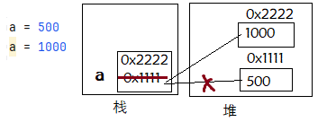
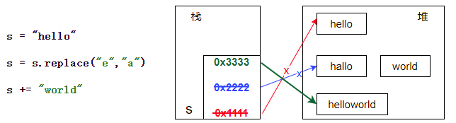
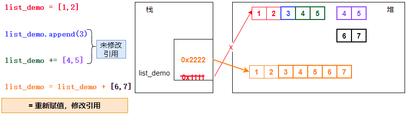
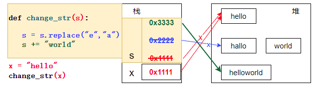
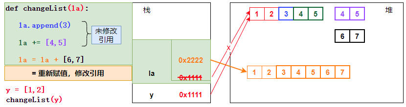
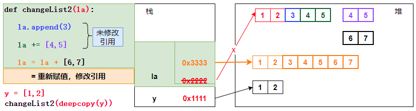
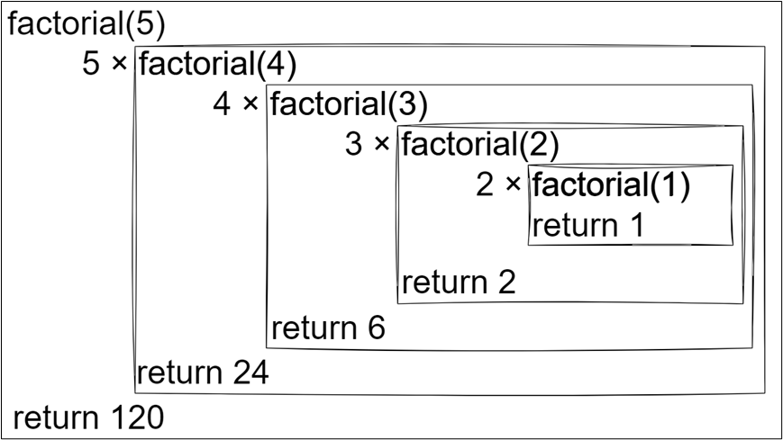
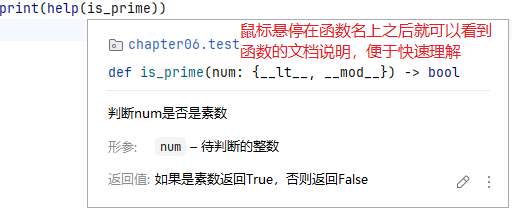

# 第6章 Python函数

## 6.1 函数的概念

函数（function）是 Python 中用于封装可重复执行代码块的基本单元，它能够接收输入参数、执行特定逻辑，并可选择性地返回结果。

简单的说：函数代表一个独立的可复用的功能。

通过使用函数，程序编写、阅读、测试和修复起来都更加容易。Python中的函数必须先定义后使用，Python提供了许多内建函数，比如print()。也可以自己创建函数，这被叫做用户自定义函数。

## 6.2 函数的定义

### 6.2.1 函数的定义格式

Python 定义函数使用 def 关键字，一般格式如下：

```python
def 函数名 (参数列表) :
        函数体
        return [表达式]
```

- 格式：
  - 函数代码块以def关键词开头，后接函数标识符名称和圆括号 ()，()后面以冒号结束。
  - 函数体开始缩进。
- 函数名：
  - 函数名是程序员给这个函数起的名称，需要遵循标识符的命名规则。函数名一般是一个动词，第一个单词小写，其他每个单词的首字母大写，即小驼峰命名法。
- 参数列表：
  - 函数在完成某个功能时，可能需要一些数据，在定义函数时指定函数参数来接收这些数据。例如在屏幕上打印信息，需要把要打印的信息传递给print()函数。如果有多个参数，参数之间使用逗号分隔。函数也可以没有参数，但是小括弧不能省略。
- 函数体：
  - 函数体一般包含3个部分：文档说明，功能代码，return [表达式]语句。
  - 函数的第一行语句可以选择性地使用文档字符串—用于存放函数说明。用三个引号括起来，单引号和双引号都可以。
  - return [表达式] 结束函数，返回一个值给调用方。不带表达式的return或没有return语句相当于返回 None。


### 6.2.2 函数的定义和调用

- 函数必须先定义再调用；
- 函数定义后不调用是不会执行的；
- 调用一次执行一次；

```python
# -----------------------函数的演示----------------------------
# 定义函数
def print_hello():
    """
    打印hello world
    """
    print("hello world")

# 调用函数。先定义，再调用。
print_hello()
print("--------")
print_hello()
print()

# -----------------------
# 定义函数，并接收参数
def print_star(line,column):
    """
    打印指定行数和列数的星号
    """
    for i in range(line):
        for j in range(column):
            print("*", end=" ")
        print()
# 调用函数
print_star(5,10)
print()

# -----------------------
# 定义函数，并返回结果
def add(a, b):
    """
    返回两个数的和
    """
    return a + b

# 调用函数
print("add(1, 2) = ", add(1, 2))
print("add(2, 3) = ", add(2, 3))
```

### 6.2.3 函数的好处

- 使程序变得更简短而清晰
- 可以提高程序开发的效率
- 提高了代码的重用性
- 便于程序分工协作开发
- 便于代码的集中管理
- 有利于程序维护


## 6.3 返回值

### 6.3.1 函数体中没有return语句

```python
# =================函数返回值的演示========================
# 定义函数，函数体没有return语句，表示没有返回值
def print_hello():
    """
    打印hello
    """
    print("hello")

# 调用函数
print_hello() # print_hello函数没有返回值，所以不用接收返回值
# 在Python中函数没有返回值，也可以打印它的结果，但结果是None
print("结果：", print_hello()) # print_hello函数没有返回值，所以结果是None
result = print_hello() # 在Python中函数没有返回值，也可以用变量接收返回值，但结果是None
print("result=",result)
```

### 6.3.2 函数体有`return`语句

```python
# 定义函数，函数体有return语句，但return后面没有值，表示没有返回值
def print_star(line,column):
    """
    打印指定行数和列数的星号
    """
    if line <= 0 or column <= 0:
        return # 作用是提前结束函数的执行
    for i in range(line):
        for j in range(column):
            print("*", end=" ")
        print()

# 调用函数
print_star(5,10) # print_star函数没有返回值，所以不用接收返回值
print("结果是", print_star(3,5)) # 结果是None
result = print_star(5,10)  # 结果是None
print("result=",result)
```

### 6.3.3 函数体有`return 值`语句

```python
# 定义函数
def add(a, b):
    """
    返回两个数的和
    """
    return a + b # 返回结果

# 调用函数
add(1, 2) # add函数有返回值，不接收返回值也是可以的，返回值就丢失了。因为add函数中没有打印语句，看起来像没有执行一样
print("add(1, 2) = ", add(1, 2)) # 直接输出返回值
result = add(1, 2) # 可以用变量接收返回值
print("result=",result)
```

## 6.4 参数

### 6.4.1 形参和实参

- 在定义函数时，指定的参数称为形式参数，简称为形参（函数的提供者）；在调用函数时，给函数传递的参数称为实际参数，简称为实参（函数的调用者）

- 在定义函数时，形参没有分配存储空间，也没有值，相当于一个占位符；在调用函数时， 会在栈区中给函数分配存储空间， 然后给形参/局部变量分配存储空间，传递的是实际的数据。当函数执行结束，函数所占的栈空间会被释放，函数的形参/局部变量也会被释放

### 6.4.2 参数传递

#### 1、python 中变量没有类型

在 python 中，类型属于对象，变量是没有类型的

```python
a=10
a="helloworld"
```

以上代码中，`10`是数字类型，`"helloworld" `是 str 类型，而变量 a 是没有类型，它仅仅是一个对象的引用（一个指针），可以是指向数字类型对象，也可以是指向str 类型对象。

#### 2、引用的概念

在 Python 中，变量和数据是分开存储的，数据保存在内存中的一个位置，变量中保存着数据在内存中的地址，变量中记录数据的地址，就叫做引用。使用id()函数可以查看变量中保存数据所在的内存地址。

> 注意：当给一个变量重新赋值的时候，本质上是修改了数据的引用，变量不再引用对之前的数据，变量改为对新赋值的数据引用，变量的名字类似于便签纸贴在数据上。

```python
a = 500
print(id(a))
a = 1000
print(id(a))
```




#### 3、可变与不可变类型

在Python常见的类型中，数字类型、string、tuple是不可更改的对象，而list、set、dict等则是可以修改的对象。

（1）不可变(immutable)类型：所有的修改操作都会产生新对象，即修改引用。

```python
s = "hello"
print("s：",s, ",id(s)：", id(s))
s = s.replace("e","a")
print("s：",s, ",id(s)：", id(s))
s += "world"
print("s：",s, ",id(s)：", id(s))
```




（2）可变(mutable)类型：

- 有些操作基于原对象进行修改的，不产生新对象，例如：append、remove、+=、*=等

- 有些操作是会产生新对象的，例如：=、union、difference等


```python
list_demo = [1,2]
print("list_demo：",list_demo, ",id(list_demo)：", id(list_demo))
list_demo.append(3)
print("list_demo：",list_demo, ",id(list_demo)：", id(list_demo))
list_demo += [4,5]
print("list_demo：",list_demo, ",id(list_demo)：", id(list_demo))
list_demo = list_demo + [6,7]
print("list_demo：",list_demo, ",id(list_demo)：", id(list_demo))
```




#### 4、Python的参数传递机制

- 不可变类型：如整数、字符串、元组等类型。效果类似c++的值传递。如fun(a)，在fun函数中对形参做任何修改，不会影响实参a 本身。因为对形参做任何修改本质上都是形参指向新对象，所以与原来的实参对象无关。

- 可变类型：如列表，字典等类型。效果类似c++的引用传递。如 fun(a)，在fun函数中对形参进行修改，分为2种情况：
  - 基于形参原对象进行修改，此时实参a也会受影响，因为形参和实参指向同一个对象。

  - 修改产生新对象，即给形参重新赋值新对象，此时不会影响实参a。因为新对象与实参对象无关。


> Python 中一切都是对象，严格意义我们不能说值传递还是引用传递，我们应该说传不可变对象和传可变对象。

##### 不可变类型示例

```python
# 实参是不可变类型的对象
# 定义函数
def change_str(s):
    print(f"{s} 的id是：{id(s)}")
    s = s.replace('e','a')
    print(f"{s} 的id是：{id(s)}")
    s += "world"
    print(f"{s} 的id是：{id(s)}")

# 调用函数
x = "hello"
print("x=",x, ",id(x)=", id(x))
change_str(x)
print("x=",x, ",id(x)=", id(x))
```



##### 可变类型示例

```python
# 实参是可变类型的对象
# 定义函数
def changeList(la):
    print("la：", la, ",id(la)：", id(la))
    la.append(3)
    print("la：", la, ",id(la)：", id(la))
    la += [4, 5]
    print("la：", la, ",id(la)：", id(la))
    la = la + [6, 7]
    print("la：", la, ",id(la)：", id(la))

# 调用函数
y = [1,2]
print("y：",y, ",id(y)：", id(y))
changeList(y)
print("y：",y, ",id(y)：", id(y))
```



##### 两种运算符区别

> 对于可变类型来说，还有一个小细节，la *= 2  和 la = la * 2 有差别：
>
> - la *= 2 使用原地址
> - la = la * 2 返回新地址
>
> 类似的还有：+=。

#### 5、使用deepcopy防止可变类型参数被修改

- 根据Python的参数传递机制的原理，如果参数是可变类型（例如：列表、集合、字典等），那么在函数中对可变参数的内容做修改，会影响实参。如果此时希望对形参的修改不影响实参，那么可以通过`copy.deepcopy()`来实现。本质上相当于是复制了一个实参对象给形参。

```python
# 定义函数
def change_list(la):
    print(f"{la} 的id是：{id(la)}")
    la[0] = 100
    print(f"{la} 的id是：{id(la)}")
    la.append(6)
    print(f"{la} 的id是：{id(la)}")
    
# 调用函数
import copy
listDemo = [1,2]
print(f"函数调用前：{listDemo}，listDemo.id = {id(listDemo)}")
change_list(copy.deepcopy(listDemo))
print(f"函数调用后：{listDemo}，listDemo.id = {id(listDemo)}")
```



### 6.4.3 函数可使用的参数形式

#### 1、位置参数

- 实参的顺序、个数必须与形参完全一致

```python
# 1. 位置参数
# 定义函数
def print_info(name, age):
    print(f"{name} 的年龄是：{age}")

# 调用函数    
print_info("张三", 18)
```


#### 2、默认值参数

- 定义默认值参数时要求：含默认值的形参必须在所有不含默认值的形参后面
- 含默认值的形参，可以不用指定实参

```python
# 2. 默认参数，默认参数必须放在非默认参数后面
# 定义函数
def print_info(name, age=18):
    print(f"{name} 的年龄是：{age}")

# 调用函数
print_info("张三", 20) # 可以正常给age形参赋值
print_info("张三") # 也可以不给age形参赋值，此时age就是默认值
```


#### 3、关键字参数

- 调用方法时，实参可以使用形参名作为关键字来指定给哪个形参赋值，此时实参的顺序就不用与形参完全一致了

```python
# 3. 关键字参数
# 定义函数
def print_info(name, age, gender='男'):
    print(f"{name} 的年龄是：{age}，性别是：{gender}")

# 调用函数
# 可以通过关键字参数给形参赋值, 此时name和age，gender的顺序可以任意
print_info(age=18, name="张三")
print_info(gender='女',name="张三", age=18)
```

#### 4、强制使用位置参数或关键字参数

- 强制使用位置参数或关键字参数：/ 前的参数必须使用位置传参，* 后的参数必须用关键字传参。

```py
# 6. 强制使用位置参数或关键字参数：/ 前的参数必须使用位置传参，* 后的参数必须用关键字传参。
# 定义函数
def print_info(name, age, /, gender, hobby, *,  city):
    print(f"{name} 的年龄是：{age}，性别是：{gender}，爱好是：{hobby}，城市是：{city}")
# 调用函数
print_info("张三", 18, "男", "看电影", city="上海")
print_info("张三", 18, gender="男", hobby="看电影", city="上海")
```

#### 5、解包传参

```
（1）通过*[列表]、*(元组)解包传参：此时元素的顺序、个数需要满足所有参数通过位置传参要求
（2）通过**{字典}解包传参：此时字典的key与形参名对应，满足所有参数通过关键字传参要求
注意：如果参数不含*args和**kwargs可变长度参数，那么所有参数都可以使用上述2种解包方式；
     如果参数含*args可变长度参数，*args及其前面的参数只能使用列表、元组解包传参，后面的参数使用字典解包传参；
     如果参数含**kwargs可变长度参数，**kwargs的参数只能使用字典解包传参；
```

```python
# 5. 解包传参
# 定义函数
def print_info(name, age):
    print(f"{name} 的年龄是：{age}")
# 调用函数
print_info(*["张三", 18]) # 列表解包，要求列表元素个数与参数个数一致
print_info(*("张三", 18)) # 元组解包，要求元组元素个数与参数个数一致
print_info(*{"张三", 18}) # 不推荐用集合，因为集合是无序的
print_info(**{"name": "张三", "age": 18}) # 字典解包，要求字典的key与参数名一致
```

#### 6、可变长度参数

- `*args`: 接收任意数量的位置参数，存储为tuple类型
- `**kwargs`: 接收任意数量的关键字参数，存储为dict类型
- 如果一个函数包含可变长度参数和普通参数，那么建议普通参数在前，可变长度参数在后
  - 一个函数中最多只能有一个`*args` 和  `**kwargs` 的可变长度参数
  - `**kwargs`可变长度参数后面不允许再有任何参数。
  - `*args`可变长度参数后面可以有参数。`*args`后面的参数必须通过关键字传参。如果包含`*args`的函数想要定义默认值参数，必须定义在`*args`后面

```python
# 定义函数，，*hobby表示可变长度参数，*hobby会变成一个元组。
def print_info( *hobby):
    print(f"爱好是：{hobby}")
# 调用函数
print_info("跑步", "看电影", "看小说")

# 定义函数，习惯上普通参数在前，可变长度参数一般放在形参列表的最后
def print_info(name, *hobby):
    print(f"{name} 的爱好是：{hobby}")
# 调用函数
print_info("张三", "跑步", "看电影", "看小说")

# 定义函数，如果可变参数后面还有普通参数，那么普通参数必须使用关键字参数给普通参数赋值
def print_info(name, *hobby, age):
    print(f"{name} 的爱好是：{hobby}，年龄：{age}")
# 调用函数
print_info( "张三","跑步", "看电影", "看小说", age = 18)
```

```python
# 定义函数，**contact_person表示可变长度参数，**contact_person会变成一个字典。
def print_info(name, **contact_person):
    print(f"{name} 的联系人有：{contact_person}")
# 调用函数
print_info("张三", mon = "12345678901", dad = "12345678902")

# 定义函数，**contact_person可变长度参数必须在最后
def print_info(name, *hobby, **contact_person):
    print(f"{name} 的爱好是：{hobby}，联系人有：{contact_person}")
# 调用函数
print_info("张三","跑步", "看电影", "看小说", mon = "12345678901", dad = "12345678902")

```


## 6.5 函数的嵌套调用

- 在一个函数中调用另一个函数，当内层调用函数执行完之后才会继续执行外层函数的其他语句。

```python
def print_info_a():
    print("print_info_a函数开始执行...")
    print_info_b()
    print("print_info_a函数执行完毕...")

def print_info_b():
    print("\tprint_info_b函数开始执行...")
    print("\tprint_info_b函数执行完毕...")

print_info_a()
```

执行结果：

```
print_info_a函数开始执行...
	print_info_b函数开始执行...
	print_info_b函数执行完毕...
print_info_a函数执行完毕...
```

## 6.6 递归

### 6.5.1 递归的概念

递归是一种重要的编程思想，其核心理念是函数调用自身来解决问题。

1、基本概念

- 自我调用：函数在执行过程中调用自己
- 问题分解：将复杂问题分解为相同类型但规模更小的子问题
- 逐步简化：通过不断缩小问题规模，最终达到可直接解决的程度

2、递归的两个关键要素

（1）递归情况（Recursive Case）

- 函数调用自身的部分
- 将问题转化为规模更小的同类问题
- 逐步向基础情况靠近

（2）基础情况（Base Case）

- 递归的终止条件
- 防止无限递归的发生
- 最简单可以直接求解的情况

### 6.7.2 递归的案例演示

> 案例：求一个整数n的阶乘！

- 不使用递归

```python
# 求一个整数n的阶乘！
# （1）不使用递归
# 定义函数
def factorial_loop(n):
    """
    计算n的阶乘：5! = 5 * 4 * 3 * 2 * 1
    """
    result = 1
    for i in range(1,n+1):
        result *= i
    return result

# 调用函数
print("factorial_loop(5)=",factorial_loop(5))
```

- 使用递归

```python
#（2）使用递归
# 定义函数
def factorial_recursion(n):
    """
    计算n的阶乘：
       5! = 5 * 4!
       4! = 4 * 3!
       3! = 3 * 2!
       2! = 2 * 1!
       1! = 1
    """
    if n <= 1:
        return 1
    return n * factorial_recursion(n-1)

# 调用函数
print("factorial_recursion(5)=",factorial_recursion(5))
```

### 6.7.3 递归的执行过程



## 6.7 函数是一种数据类型

在Python中，函数是一等公民，函数也有一种数据类型。

```python
# 函数是一种数据类型
# 定义函数
def my_function():
    print("我是函数体")

# 打印函数的类型
print(type(my_function))
```

所以，函数也是一个对象，它可以：

- 函数可以被赋值给变量
- 函数可以作为参数传递给其他函数
- 函数可以作为函数的返回值
- 函数可以存储在数据结构中

这种特性使得Python支持高阶函数、闭包、装饰器等高级编程技术。

### 6.7.1 给变量赋值一个函数

```python
# 可以使用函数可以给变量赋值
def greet():
    print("Hello!")
say_hello = greet # 注意greet后面没有()
say_hello()
```

> 注意：
>
> - say_hello = greet # 赋值给say_hello变量的是一个函数
> - say_hello = greet() # 赋值给say_hello变量的是函数的返回结果，这里是None，因为greet()函数没有返回值

### 6.7.2 函数作为参数传递

```python
# 函数可以作为参数传递
def say_hi():
    print("Hi!")
    
def call_function(func): 
    func() # 这里要求传给func的实参是一个函数。

call_function(say_hi) # say_hi是一个函数，它作为参数被传给了call_function函数
```

### 6.7.3 函数作为返回值

```python
# 函数可以作为返回值
def get_function():
    def inner_function():
        print("Inner function")
    return inner_function

#调用get_function函数
func = get_function() # 得到的是一个函数
func() # 调用func()函数
```

### 6.7.4 函数被存储到数据结构中

```python
# 函数可以被存储到数据结构中
def add(a, b):
    return a + b

def subtract(a, b):
    return a - b

def multiply(a, b):
    return a * b

def divide(a, b):
    return a / b

# 将函数存储在列表中，同样也可以被存储在元组、字典等容器中
operations = [add, subtract, multiply, divide]
for operation in operations:
    result = operation(5, 3)
    print(operation.__name__ , ": ", result)
```


## 6.8 匿名函数

### 6.8.1 Lambda表达式

Python使用 lambda 来定义匿名函数，所谓匿名，指其不用 def 的标准形式定义函数。

```python
lambda 参数列表: 表达式
```

- lambda 只是一个表达式，函数体比def简单很多。
- lambda的主体是一个表达式，而不是一个代码块，所以仅仅能在lambda表达式中封装有限的逻辑进去。
- lambda函数拥有自己的命名空间，且不能访问自己参数列表之外或全局命名空间里的参数。

### 6.8.2 Lambda表达式作为函数的参数

#### 1、作为自定义函数的参数

```python
# 自定义函数
def operate(a, b, func):
    return func(a, b)

# 匿名函数作为自定义函数的参数传递
print(operate(5, 2, lambda a, b: a + b))
print(operate(5, 2, lambda a, b: a - b))
print(operate(5, 2, lambda a, b: a * b))
print(operate(5, 2, lambda a, b: a / b))
```

#### 2、作为内置函数的参数

```python
"""
    一些好用的内置函数：
    sorted：排序
    filter：过滤筛选
    map：映射转换
"""
# 匿名函数也可以作为内置函数的参数传递
student_list = [{"name": "zhang3", "age": 36}, {"name": "li4", "age": 14}, {"name": "wang5", "age": 27}]

student_list = sorted(student_list, key=lambda s: s["age"])
print("按照年龄排序：", student_list)

filter_result = filter(lambda s: s["age"] > 18, student_list)
print("18岁以上的：", list(filter_result))

map_result = map(lambda s: s["name"], student_list)
print("姓名：", list(map_result))
```

#### 3、作为标准库中函数的参数

```python
"""
    也可以作为标准库函数的参数：
    标准库中一些好用的函数：
    functools.reduce：对可迭代对象进行累积计算
    heapq.nlargest：找出可迭代对象中最大的 n 个元素
    heapq.nsmallest：找出可迭代对象中最小的 n 个元素
"""
import functools
import heapq
list_demo = [3, 5, 6, 2, 1, 8, 4, 9, 10]
print("累加：", functools.reduce(lambda a, b: a + b, list_demo))
print("最大值：", functools.reduce(lambda a, b: a if a > b else b, list_demo))
print("最小值：", functools.reduce(lambda a, b: a if a < b else b, list_demo))
print("最大的3个偶数：", heapq.nlargest(3, list_demo, key=lambda x: x if x % 2 == 0 else float('-inf')))
print("最小的3个奇数：", heapq.nsmallest(3, list_demo, key=lambda x: x if x % 2 != 0 else float('inf')))

```

### 6.8.3 Lambda表达式作为函数返回值

```python
"""
    匿名函数作为返回值
"""
def get_func(operate):

    match operate:
        case "add":
            return lambda a, b: a + b
        case "sub":
            return lambda a, b: a - b
        case "mul":
            return lambda a, b: a * b
        case "div":
            return lambda a, b: a / b
        case _:
            return None

func = get_func("add")
print(f"{func.__name__}的结果：", func(1,2))
```

## 6.9 函数的说明文档（了解）

函数说明文档的好处

1. 提高代码可读性
   清晰描述函数的功能和用途
   帮助其他开发者快速理解函数的作用
2. 便于维护和调试
   提供函数的详细说明，方便后续修改
   减少因误解函数功能而产生的错误
3. 自动生成文档
   Python可以通过 help() 函数查看文档字符串
   支持自动化工具生成API文档
4. 提升开发效率
   团队协作时，文档能减少沟通成本
   IDE可以显示文档提示，提高编码效率
5. 规范开发标准
   统一团队的代码注释风格
   有助于培养良好的编程习惯

```python
# =================函数说明文档的演示========================
# 定义一个函数，可以判断一个数是否是素数
def is_prime(num):
    """
    判断num是否是素数
    :param num: 待判断的整数
    :return: 如果是素数返回True，否则返回False
    """
    if num < 2:
        return False
    import math
    for i in range(2, int(math.sqrt(num)+1)):
        if num % i == 0:
            return False
    return True

# 调用函数
print("7是素数吗？", is_prime(7))
help(is_prime)
```

> PyCharm中将鼠标悬停在函数名上方也可以看到函数说明文档。



## 6.10 函数注释（了解）

Python 3.x 引入了函数注释，以增强函数的注释功能。

可以使用:对参数逐个进行注释，注释内容可以是任何形式，比如参数的类型、作用、取值范围等等，返回值使用->标注，所有的注释都会保存到函数的`__annotations__`属性中。另外，使用函数注释并不影响默认参数的使用。

```python
# 普通的自定义函数：
def print_info_normal(name, species, age):
    print(f"{name} 的品种是：{species}，年龄是：{age}")

# 调用函数
print_info_normal("旺财", "泰迪", 5)
print(print_info_normal.__annotations__)

# 添加了注释的自定义函数：
def print_info_special(name:str, species: "狗狗的品种", age:(1, 99)=1) -> "返回None":
    print(f"{name} 的品种是：{ species}，年龄是：{age}")
# 调用函数
print_info_special("旺财", "泰迪")
# 获取函数的注释信息
print(print_info_special.__annotations__)
```
