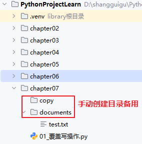

# 第7章 文件/目录操作

## 7.1 基本概念

### 7.1.1 文件的概念

在计算机中，文件是存储在磁盘上的**数据集合**。文件可以包含各种类型的数据，如文本、图像、音频、视频或程序代码。

在编写程序的时候，数据是以二进制的形式存储在内存的，将数据写到磁盘文件的过程称之为**持久化**。

### 7.1.2 文件路径和文件名

文件系统通过文件路径和文件名来定位和管理文件。

（1）文件名通常包含文件的名称和扩展名。扩展名（又称为文件后缀名）用于表示文件的类型（例如 .txt 表示文本文件，.jpg 表示图像文件）。

（2）文件路径可以是绝对路径（从文件系统的根目录开始）或相对路径（相对于当前工作目录）。

- 绝对路径：
  - 在windows系统，绝对路径从盘符开始，例如：D:\atguigu\hello.py
  - 在Linux、MacOS等其他系统，绝对路径从根目录/开始，例如：/users/hello.py

- 相对路径：
  - 在windows系统，不是以盘符开始的都是相对路径，例如：./atguigu/hello.py 或 ../../hello.py
  - 在Linux、MacOS等其他系统，不是从根路径/开始的都是相对路径：例如：./atguigu/hello.py 或 ../../hello.py
  - ./代表当前路径，../代表上级目录

### 7.1.3 文件的分类

1、纯文本文件

有统一的编码，可以被看做存储在磁盘上的长字符串。

纯文本文件编码格式常见的有ASCII、ISO-8859-1/Latin1、GB2312、GBK、UTF-8、UTF-16等。

2、二进制文件

没有字符编码的概念，直接由0与1组成。

如图片文件（jpg、png），视频文件（avi）等。

## 7.2 文件的打开和关闭

### 7.2.1 open打开文件

open函数的完整形式：

```python
open(file,mode="r",buffering=-1, encoding=None,errors=None,newline=None,closefd=True,opener=None)
```

`open()` 函数会返回一个**文件对象**，该对象的类型由打开模式决定，我们通过这个对象执行读取、写入等标准文件操作。

- 当以**文本模式**（`'w'`、`'r'`、`'wt'`、`'rt'` 等）打开文件时，`open()` 会返回一个 `TextIOWrapper` 类型的对象；
- 当以**二进制模式**打开文件时，返回的类会有所不同：
  - 以**二进制只读模式**打开时，返回 `BufferedReader` 对象；
  - 以**二进制写入 / 追加模式**打开时，返回 `BufferedWriter` 对象；
  - 以**二进制读写模式**打开时，返回 `BufferedRandom` 对象。

| 参数      | 说明                                                         | 是否必选        |
| --------- | ------------------------------------------------------------ | --------------- |
| file      | 指定要打开的**文件位置 + 文件名**，或传入一个**整数型的文件描述符**（操作系统层面标识打开文件的编号） | 必选            |
| mode      | 指定文件的**操作类型**（读 / 写 / 追加）和**打开格式**（文本 / 二进制） | 可选，默认是r   |
| buffering | 控制 Python 对文件的**读写缓冲机制**，本质是**减少磁盘 IO 次数**（磁盘读写速度远慢于内存，缓冲先把数据存内存，达到阈值再一次性写入磁盘，提升效率） | 可选，默认-1    |
| encoding  | 指定**文本模式（t）下文件的字符编码 / 解码规则**，Python 会按该编码将磁盘上的字节转换为字符串（读），或把字符串转换为字节写入磁盘（写）。**仅文本模式有效**，二进制模式（b）设置`encoding`会直接报错。默认None表示使用**当前系统的默认编码**（Windows 多为 gbk，Linux/Mac 多为 utf-8） | 可选，默认 None |
| errors    | 指定**文本模式**下，当**编码 / 解码出现错误**时的处理方式。仅文本模式有效，二进制模式无编码错误，设置无效。 | 可选，默认 None |
| newline   | 仅对**文本模式**有效，控制 Python 对文件**读取时的换行符解析**和**写入时的换行符替换**，解决跨平台换行符不一致的问题（Windows`\r\n`、Linux/Mac`\n`、旧 Mac`\r`） | 可选，默认 None |
| closefd   | 控制调用文件对象的`close()`方法时，**是否关闭底层的文件描述符**。 | 可选，默认 True |
| opener    | 指定一个**自定义的文件打开函数**，替代 Python 内置的默认文件打开逻辑，实现自定义的文件访问控制（如权限校验、加密文件打开、自定义路径解析）。极高级的开发需求（如自定义文件权限、沙箱内打开文件、网络文件流），**新手完全用不到**。 | 可选，默认 None |

模式由**基础操作符**和**格式符**组合而成，核心基础符 3 个、格式符 2 个，还有扩展符 2 个，组合规则：**格式符可省略（默认文本），扩展符按需加**。

|     类型     | 符号 |           含义           |                           注意事项                           |
| :----------: | :--: | :----------------------: | :----------------------------------------------------------: |
| **基础操作** |  r   |       只读（默认）       |               文件不存在则报错，文件指针在开头               |
|              |  w   |           只写           |           文件不存在则创建，存在则**清空原有内容**           |
|              |  a   |          追加写          |        文件不存在则创建，文件指针在末尾，不覆盖原内容        |
| **格式标识** |  t   | 文本模式（默认，可省略） |     读写的是**字符串**，需指定`encoding`，支持换行符处理     |
|              |  b   |        二进制模式        | 读写的是**bytes 字节串**，可以用于读写非文本文件（图片 / 视频 / 压缩包 / 可执行文件），也可以读写文本文件（读写字节内容，**禁止指定 encoding**） |
| **扩展标识** |  +   | 读写模式（叠加在基础后） | 如`r+`（读 + 写，不清空）、`w+`（写 + 读，清空）、`a+`（追加 + 读） |
|              |  x   |        独占创建写        |           文件不存在则创建，存在则报错（避免覆盖）           |

buffering仅支持**整数**，分 3 种情况，**新手一般无需修改，用默认值 - 1 即可**：

| 取值 |                             含义                             |
| :--: | :----------------------------------------------------------: |
|  -1  | 默认缓冲：文本模式用**系统默认缓冲区大小**（一般 4096/8192 字节），二进制模式用**固定块缓冲** |
|  0   | 无缓冲：数据直接读写磁盘，**仅对二进制模式（b）有效**，文本模式设置 0 会报错 |
|  ≥1  | 1 表示**行缓冲**（仅文本模式有效，遇到`\n`就刷盘）；<br />≥2 表示**固定大小缓冲**（单位：字节，如 buffering=4096 表示 4K 缓冲） |

errors常用取值：

|       取值       |                             含义                             |
| :--------------: | :----------------------------------------------------------: |
|      strict      | 严格模式（默认）：出现编码错误直接抛出`UnicodeError`，终止程序 |
|      ignore      |   忽略模式：跳过错误的字符，继续处理，可能导致**字符丢失**   |
|     replace      | 替换模式：将错误的字符替换为`�`（占位符），不会终止程序，避免乱码 |
| backslashreplace |    转义替换：将错误字符替换为 Python 转义序列（如`\x80`）    |
| surrogateescape  | 代理转义：适合读取系统文件，将无法解码的字节存为代理字符，写入时还原 |

### 7.2.2 close关闭文件

```python
f.close()
```

## 7.3 文件读写操作

### 7.3.1 文件写操作

#### 1、覆盖写

```python
def write_one():
    fw = open("./documents/test.txt", "w",encoding="utf-8")
    fw.write("hello world\n")
    fw.write("hello atguigu\n")
    fw.close()

def write_two():
    fw = open("./documents/test.txt", "w",encoding="utf-8")
    fw.write("你好，世界\n")
    fw.write("你好，尚硅谷\n")
    fw.close()

# write_one()
write_two()
```



#### 2、追加写

```python
def write_append():
    fw = open("./documents/test.txt", "a",encoding="utf-8")
    fw.write("python\n")
    fw.write("ai\n")
    fw.close()

write_append()
```


### 7.3.2 文件读操作

#### 1、read([size])

- read()表示读取文件所有内容
- read([size]) 可以从文件中读取数据，size 表示要从文件中读取的数据的长度。文本文件中换行符也算作一个字符。

```python
print("一次读取所有内容".center(50, "-"))
fr = open("documents/test.txt", "r", encoding="utf-8")
print(fr.read())
fr.close()

print("一次读取10个字符".center(50, "-"))
fr = open("documents/test.txt", "r", encoding="utf-8")
print(fr.read(10))
fr.close()
```


#### 2、readLine([size])

- readLine()可以从纯文本文件读取一行
- readLine(size)可以从纯文本文件读取一行中的size个字符。如果一行不够size个字符，只读一行。

```python
print("一次读一行".center(50,"-"))
fr = open("documents/test.txt", "r", encoding="utf-8")
print(fr.readline())
fr.close()

print("一次读一行".center(50,"-"))
fr = open("documents/test.txt", "r", encoding="utf-8")
print(fr.readline(3)) # 读取3个字符
fr.close()

print("一次读一行".center(50,"-"))
fr = open("documents/test.txt", "r", encoding="utf-8")
print(fr.readline(30)) # 读取30个字符，如果一行的字符数小于30，则返回该行所有字符
fr.close()
```

#### 3、readLines([size])

- readLines()：读取所有行并返回列表
- readLines(size)：可以从纯文本文件读取size个字符所在的所有行。例如：第1行有5个字符，第2行有10个字符，第3行有5个字符，size为8则会读取2行。

```python
print("一次读取所有行，返回列表".center(50, "-"))
fr = open("documents/test.txt", "r", encoding="utf-8")
print(fr.readlines())
fr.close()

print("一次读取一行或多行".center(50, "-"))
fr = open("documents/test.txt", "r", encoding="utf-8")
print(fr.readlines(3)) # 读取3个字符所在的行
fr.close()

print("一次读取一行或多行".center(50, "-"))
fr = open("documents/test.txt", "r", encoding="utf-8")
print(fr.readlines(30)) # 读取30个字符所在的行
fr.close()
```


### 7.3.3 复制文件

| 复制方式               | 操作对象      | 是否复制内容 | 是否复制权限 | 是否复制元数据 (时间) | 大文件友好   | 自动处理文件 | 推荐场景                                   |
| ---------------------- | ------------- | ------------ | ------------ | --------------------- | ------------ | ------------ | ------------------------------------------ |
| **read() + write()**   | 字符串 / 字节 | ✅            | ❌            | ❌                     | ❌ **爆内存** | 手动开 / 关  | 小文本文件                                 |
| **shutil.copyfileobj** | 文件对象      | ✅            | ❌            | ❌                     | ✅ **流式**   | 手动开 / 关  | 大文件 / 网络流 / 自定义                   |
| **shutil.copyfile**    | 路径          | ✅            | ❌            | ❌                     | ✅            | ✅ 自动       | 只复制内容，最快                           |
| **shutil.copy**        | 路径          | ✅            | ✅            | ❌                     | ✅            | ✅ 自动       | 复制内容 + 权限                            |
| **shutil.copy2**       | 路径          | ✅            | ✅            | ✅                     | ✅            | ✅ 自动       | 复制内容+权限+元数据，**最完整备份，推荐** |

1、使用shutil.copy/shutil.copy2

`shutil` 是 Python 内置的文件操作工具库。

- `shutil.copy(src, dst)`：仅复制文件内容和**文件权限**；
- `shutil.copy2(src, dst)`：复制文件内容 + 权限 +**元数据**（创建时间、修改时间等，更推荐，接近系统复制）。
- `copyfileobj` 专门为文件对象复制设计，默认分块大小是 8192 字节，可手动设置更大的分块（比如 1024*1024=1MB，大文件建议设 1MB~16MB），进一步提升速度。`copy/copy2`底层直接依赖`copyfileobj`实现核心的文件内容复制。

```python
import shutil
shutil.copy2(r"documents/哈希表.mp4", r"copy/哈希表_copy.mp4")
```

```python
import shutil
shutil.copyfileobj(open("documents/哈希表.mp4", "rb"), open("copy/哈希表_copy.mp4","wb"), 1024*1024)
```

2、使用read(size)

```python
import os
# 复制大文件
def copy_big_file(src, dst):
    fr = open(src, "rb")
    fw = open(dst, "wb")
    # 获取源文件大小（字节）
    file_size = os.path.getsize(src)
    copied_size = 0  # 已复制大小
    while True:
        data = fr.read(1024*1024)
        if not data:
            break
        fw.write(data)
        # 更新已复制大小并打印进度
        copied_size += len(data)
        progress = (copied_size / file_size) * 100
        print(f"\r复制进度：{progress:.2f}% ({copied_size}/{file_size} 字节)", end="")
    print("\n复制完成！")
    fr.close()
    fw.close()

# 测试
copy_big_file("documents/哈希表.mp4", "copy/哈希表_copy.mp4")
```

## 7.4 操作文件和目录

### 7.4.1 获取文件或目录属性

```python
"""
    演示获取文件或目录信息
"""
import os.path
import time

print("test.txt文件大小：", os.path.getsize("documents/test.txt"))
print("test.txt文件创建时间：", os.path.getctime("documents/test.txt"))
print("test.txt文件最后访问时间：", os.path.getatime("documents/test.txt"))
print("test.txt文件最后修改时间：", os.path.getmtime("documents/test.txt"))
mtime = time.localtime(os.path.getmtime("documents/test.txt"))
print("test.txt文件最后修改时间：", time.strftime("%Y-%m-%d %H:%M:%S", mtime))

print("test.txt文件是否是文件：", os.path.isfile("documents/test.txt"))
print("test.txt文件是否是目录：", os.path.isdir("documents/test.txt"))
print("test.txt文件是否存在：", os.path.exists("documents/test.txt"))

print("文件名：", os.path.basename("documents/test.txt"))
print("文件所在目录名：", os.path.dirname("documents/test.txt"))
print("文件绝对路径：", os.path.abspath("documents/test.txt"))

tuple_result = os.path.split("documents/test.txt")
print("文件所在目录名：", tuple_result[0])
print("文件名：", tuple_result[1])
print("文件名（不带扩展名）：", os.path.splitext(tuple_result[1])[0])
```

### 7.4.2 操作文件

#### 1、创建文件

```python
# 创建文件
open("documents/test1.txt", "w").close()
```

#### 2、重命名/移动文件

- os.rename
- shutil.move

```python
# 重命名文件
# 如果目标文件「已存在」，windows下则报错
os.rename("documents/test1.txt", "documents/test2.txt")
```

```python
# 结果：backup/test.txt
# 如果目标文件「已存在」，windows下则报错
shutil.move("test.txt", "backup/")
```

```python
# 移动并重命名：test.txt → backup/new_name.txt
# 如果目标文件「已存在」，windows下则直接覆盖
shutil.move("test.txt", "backup/new_name.txt")
```

| 方法          | 适用场景              | 原理                                         | 跨磁盘   | 移动目录 |
| ------------- | --------------------- | -------------------------------------------- | -------- | -------- |
| `shutil.move` | 通用移动 / 重命名     | 同磁盘直接重命名，跨磁盘是先复制再删除原文件 | ✅ 支持   | ✅ 支持   |
| `os.rename`   | 仅同磁盘/同分区重命名 | 同磁盘重命名                                 | ❌ 不支持 | ✅ 支持   |

#### 3、删除文件

```python
# 删除文件
os.remove("documents/test2.txt")
```


### 7.4.3 操作目录

#### 1、获取当前工作目录

```python
import os

current_working_directory = os.getcwd()
print("当前工作目录：", current_working_directory)
```

#### 2、切换目录

```python
import os

print("获取当前工作目录：", os.getcwd())

os.chdir("..")
print("切换工作目录：", os.getcwd())

```


#### 3、创建目录

```python
import os

if not os.path.exists("code"):
    os.mkdir("code")
    print("创建目录code成功")

if not os.path.exists("code/python/section/one"):
    os.makedirs("code/python/section/one")
    print("创建目录code/python/section/one成功")
```

#### 3、遍历目录

- os.listdir：不递归遍历子目录

- os.walk：递归遍历子目录

  ```python
  # 返回一个3元组(dirpath文件夹路径, dirnames文件夹名字, filenames文件名)
  os.walk(
      top,  # 要遍历的目录
      topdown=True,  # 可选，默认为True:自顶向下，False:自底向上
      onerror=None,  # 可选，指定遍历过程中发生异常时的处理函数，用于捕获 / 处理遍历错误（如权限不足、文件被占用）
      followlinks=False,  # 可选，控制是否跟随目录的软链接 / 快捷方式进行递归遍历（Python3.5 + 正式支持）
  )
  ```


示例代码：

```python
# 1、不递归遍历子目录
print("遍历当前目录下的所有文件和目录（不递归）：")
project_dir = os.path.dirname(os.getcwd())
for s in os.listdir(project_dir):
    print(s)
print()
```

```python
# 2、递归遍历子目录
print("遍历当前目录下的所有文件和目录（递归）：")
current_dir = os.getcwd()
for root, dirs, files in os.walk(current_dir):
    print("当前目录：",root)
    print("当前目录的子目录：",dirs)
    print("当前目录下的子文件：",files)
    print("-" * 20)
```

#### 5、重命名/移动目录

- os.rename
- shutil.move

```python
## 如果目标目录python_code「已存在」，则报错
os.rename("code","python_code")
```

```python
# 结果：backup/test
# 如果目标目录backup/test「已存在」，则报错
shutil.move("test", "backup/")
# 结果：backup/test
# 如果目标目录backup/test「已存在」，则结果 backup/test/test
# 如果目标目录backup/test/test「已存在」，则报错
shutil.move("test", "backup/test")
```

#### 6、删除目录

- os.rmdir：删除一级空目录
- os.removedirs：删除多级空目录
- shutil.rmtree：递归删除非空目录（谨慎使用）

```python
import os
import shutil

# 删除一级空目录
one_dir = "./python_code/python/section/one"
if os.path.exists(one_dir):
    os.rmdir(one_dir)

# 依次删除多级空目录
dirs = "./python_code/python/section"
if os.path.exists(dirs):
    os.removedirs(dirs)
    # section是空目录，删除
    # python是空目录，删除
    # python_code是空目录，删除

copy_dir = "./copy"
if os.path.exists(copy_dir):
#      os.rmdir(copy_dir) # 报错，因为copy_dir不是空目录
    shutil.rmtree(copy_dir) # 删除目录及其子目录，请谨慎使用，删除后不在回收站
```

#### 7、复制目录

`shutil`库的`copytree()`是官方推荐的方法，能递归复制目录下的所有内容，还能保留文件元数据，无需自己写递归逻辑，简单又高效。

```python
import shutil

shutil.copytree("documents","documents_copy")
```

#### 8、获取目录大小

```python
import os

# 定义函数：递归统计目录大小
def get_dir_size(path):
    if not os.path.exists(path):
        return 0
    if os.path.isfile(path):
        return os.path.getsize(path)
    total_size = 0
    for inner_sub in os.listdir(path):
        sub_path = os.path.join(path, inner_sub)
        total_size += get_dir_size(sub_path)
    return total_size
# 调用函数
print("documents目录大小：", get_dir_size('./documents'), "字节")
```

```python
# 使用os.walk+生成器 ：获取目录大小
total_size = sum(os.path.getsize(os.path.join(r, f)) for r, _, fs in os.walk(r"documents") for f in fs if not os.path.islink(os.path.join(r, f)))
print(f"目录总大小：{total_size} 字节")
```


## 7.5 附录：函数速查

### 1、open()返回的文件对象的函数

| 方法 / 属性              | 作用             | 说明                                                         |
| ------------------------ | ---------------- | ------------------------------------------------------------ |
| `read(size=-1)`          | 读取文件内容     | 不写参数读取全部；传入数字读取指定字节数                     |
| `readline()`             | 读取一行         | 每次只读取文件的**一行**，读到末尾返回空字符串               |
| `readlines()`            | 读取所有行       | 返回**列表**，每个元素是一行内容（包含换行符）               |
| `write(s)`               | 写入字符串       | 把字符串写入文件，返回写入的字符数                           |
| `writelines(lines)`      | 批量写入行       | 传入列表 / 可迭代对象，逐行写入（不会自动加换行）            |
| `flush()`                | 强制刷新缓冲区   | 把内存中的数据立刻写入磁盘，防止数据丢失                     |
| `close()`                | 关闭文件         | 必须关闭，释放系统资源（推荐用 `with` 自动关闭，详见异常和错误章节） |
| `seek(offset, whence=0)` | 移动文件指针     | 移动到文件指定位置，用于随机读写。 移动的字节数offset，负数表示从倒数第几位开始。  whence从哪个位置开始移动；0为开头，1为当前位置，2为末尾。whence不为0时需使用'b'二进制模式打开文件。 |
| `tell()`                 | 获取当前指针位置 | 返回文件指针当前在第几个字节                                 |
| `truncate(size=None)`    | 截断文件         | 保留前 size 字节，删除后面内容                               |
| `closed`                 | 判断是否关闭     | 属性，返回 `True`/`False`                                    |
| `mode`                   | 获取打开模式     | 属性，返回文件打开方式（`r`/`w`/`a` 等）                     |
| `name`                   | 获取文件名       | 属性，返回打开的文件路径 / 名称                              |

### 2、os操作文件或目录函数

| **函数**                   | **说明**                         |
| -------------------------- | -------------------------------- |
| **os.rename(old,new)**     | 重命名文件                       |
| **os.remove(file)**        | 删除文件                         |
| **os.mkdir(dir)**          | 创建目录，不支持递归创建         |
| **os.makedirs(dir)**       | 递归创建目录                     |
| **os.getcwd()**            | 获取当前路径                     |
| **os.chdir(dir)**          | 进入指定目录                     |
| **os.listdir(dir)**        | 获取目录下文件和目录列表         |
| **os.walk(dir)**           | 递归遍历子目录                   |
| **os.rmdir(dir)**          | 删除空目录                       |
| **os.removedirs(dir)**     | 递归删除空目录                   |
| **shutil.rmtree(dir)**     | 递归删除非空目录（谨慎使用）     |
|                            |                                  |
| **os.path.abspath(path)**  | 将相对路径转换为绝对路径         |
| **os.path.basename(path)** | 获取路径中的文件名部分           |
| **os.path.dirname(path)**  | 获取路径中的目录部分             |
| **os.path.join(\*paths)**  | 拼接多个路径，自动处理路径分隔符 |
| **os.path.split(path)**    | 将路径分割为目录和文件名的元组   |
| **os.path.splitext(path)** | 将路径分割为文件名和扩展名的元组 |
| **os.path.exists(path)**   | 判断路径是否存在                 |
| **os.path.isfile(path)**   | 判断路径是否为文件               |
| **os.path.isdir(path)**    | 判断路径是否为目录               |
| **os.path.getsize(path)**  | 获取文件的大小，以字节为单位     |
| **os.path.getctime(path)** | 获取文件/目录的创建时间          |
| **os.path.getatime(path)** | 获取文件/目录的最后访问时间      |
| **os.path.getmtime(path)** | 获取文件/目录的最后修改时间      |

### 3、shutil操作文件或目录

| 函数                                   | 功能                                                         | 说明 / 注意事项                                |
| -------------------------------------- | ------------------------------------------------------------ | ---------------------------------------------- |
| `shutil.copy(src, dst)`                | 复制文件                                                     | 仅复制**内容 + 权限**，不保留元数据（时间等）  |
| `shutil.copy2(src, dst)`               | 复制文件（保留元数据）                                       | 比 copy 更完整，推荐优先用                     |
| `shutil.copyfile(src, dst)`            | 仅复制文件内容                                               | 不复制权限，dst 必须是文件路径                 |
| `shutil.copyfileobj(fsrc,fdst,length)` | 把一个已打开的`文件对象`，复制到另一个已打开的`文件对象`，操作的是**文件对象**，不是文件路径，需要自己打开和关闭 | 底层**按缓冲区分块读写**，适合大文件，不占内存 |
|                                        |                                                              |                                                |
| `shutil.copytree(src, dst)`            | 复制整个目录树                                               | 递归复制文件夹及所有子文件 / 子目录            |
| `shutil.move(src, dst)`                | 移动文件 / 目录                                              | 也可用于**重命名**文件或文件夹                 |
| `shutil.rmtree(path)`                  | 删除整个目录树                                               | 递归删除文件夹（含所有内容），**慎用**         |
