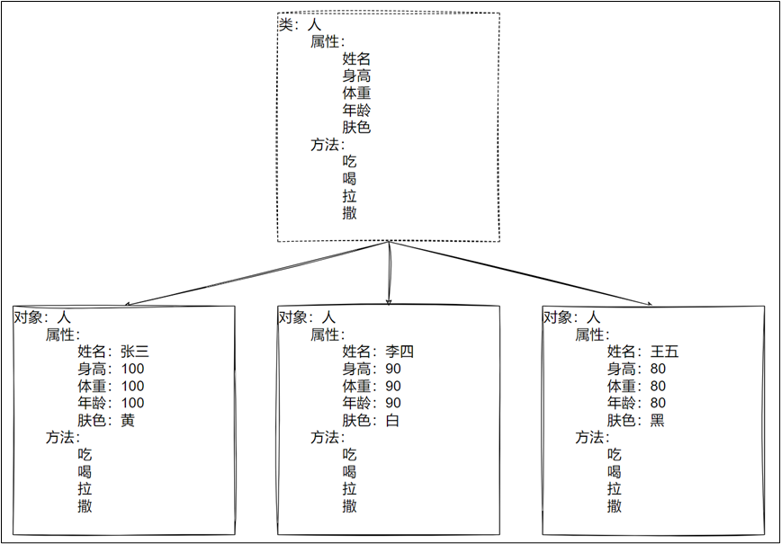
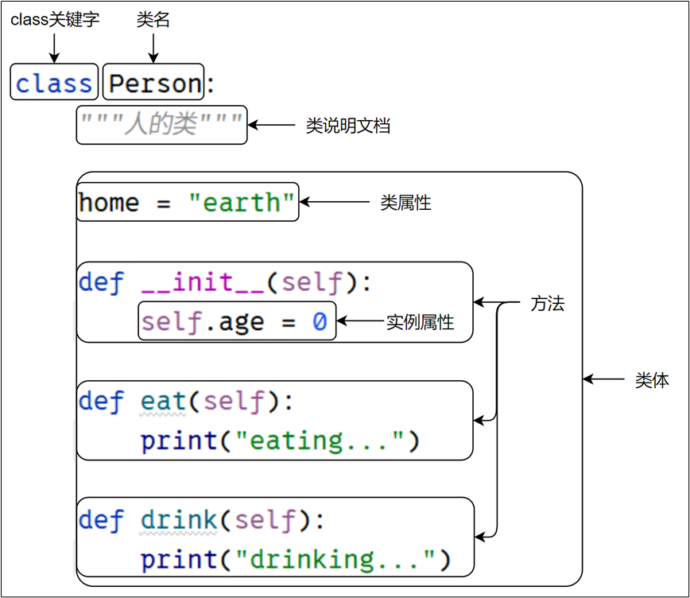

# 第8章 面向对象之类和对象

## 8.1 面向过程和面向对象编程

面向过程编程（Procedural Programming）和面向对象编程（OOP）是两种不同的编程范式，它们在软件开发中都有广泛的应用。

Python是一种混合型的语言，既支持面向过程的编程，也支持面向对象的编程。

- 面向过程的编程是一种以过程为中心的编程方式，主要关注解决问题的步骤，并将这些步骤写成函数或方法。
- 面向对象的编程是一种以对象为中心的编程方式，主要关注在解决问题的过程中涉及哪些对象以及这些对象如何交互。

### 8.1.1 面向过程示例

想象一下，你要做一顿美味的晚餐。在面向过程编程的思维下，你会把整个做饭的过程拆分成一系列的步骤。

```python
def buy():
    print("去超市购买食材。")
def wash():
    print("清洗蔬菜。")
def cut():
    print("切菜。")
def cook():
    print("开始烹饪。")
def serve():
    print("上菜啦！")

buy()
wash()
cut()
cook()
serve()
```

上面就是一个典型的面向过程的程序，我们把整个做饭的过程分解成了一个个函数，每个函数完成一个特定的任务，然后按照顺序依次调用这些函数，就可以完成做晚餐的任务啦。这种方式非常直接，适合一些简单的任务，它注重的是程序的流程和步骤。

但是呢，当我们的程序变得越来越复杂，会出现什么问题呢？比如说，我们现在想做不同类型的菜，有些菜可能不需要洗菜，有些菜可能不需要切菜，或者你要同时做几道菜，那我们的代码就会变得越来越长，越来越乱，而且上面的代码步骤是没有通用性的。


### 8.1.2 面向对象示例

用面向对象的思想实现上面的做菜功能。

```python
"""
    面向对象编程
"""
class Dish:
    def __init__(self, name):
        self.name = name
    def prepare(self):
        pass

class Salad(Dish):
    def prepare(self):
        print(f"为 {self.name} 购买食材。")
        print(f"清洗 {self.name} 的蔬菜。")
        print(f"切 {self.name} 的蔬菜。")
        print(f"将 {self.name}装盘。")

class Stew(Dish):
    def prepare(self):
        print(f"为 {self.name} 购买食材。")
        print(f"清洗 {self.name} 的肉。")
        print(f"切 {self.name} 的肉。")
        print(f"烹饪 {self.name}。")
        print(f"将 {self.name}装盘。")

class Soup(Dish):
    def prepare(self):
        print(f"为 {self.name} 购买食材。")
        print(f"煮 {self.name}。")

salad = Salad("蔬菜沙拉")
stew = Stew("炖肉")
soup = Soup("紫菜鸡蛋汤")

salad.prepare()
print()

stew.prepare()
print()

soup.prepare()
print()
```

在这里，我们创建了一个 Dish 类，它就像是一个菜的模板。然后我们创建了 Salad、Stew 和 Soup 这些子类，它们都继承自 Dish 类。每个子类都有自己的 prepare 方法，这个方法描述了如何准备这道菜。

这样，我们可以看到面向对象编程的优势啦 首先，我们把相关的数据（比如菜的名字）和操作（比如准备菜的过程）都封装在了一个类里面，这叫做 “封装”。而且，不同类型的菜可以有自己独特的准备方法，我们可以根据需要去修改或扩展这些方法，而不会影响其他类。这就像是每个菜都有自己的制作过程。

还有，当我们想要添加新的菜品时，我们只需要创建一个新的子类，定义它自己的 prepare 方法就好，不需要修改原来的代码。

### 8.1.3 面向对象编程思想的历史

对象作为编程实体最早是于1960年代由Simula 67语言引入思维。Simula这一语言是奥利-约翰·达尔和克利斯登·奈加特在奥斯陆的挪威计算中心为模拟环境而设计的。（据说，他们是为了模拟船只而设计的这种语言，并且对不同船只间属性的相互影响感兴趣。他们将不同的类型船只归纳为不同的类，而每一个对象，基于它的类，可以定义它自己的属性和行为。）

这种办法是分析式程序的最早概念体现。在分析式程序中，我们将真实世界的对象映射到抽象的对象，这叫做“模拟”。Simula不仅引入了“类”的概念，还应用了实例这一思想，这可能是这些概念的最早应用。

## 8.2 类和对象



### 8.2.1 类（Class）和对象（Object）

类描述了所创建的对象共同的属性（是什么）和方法（能做什么），属性和方法统称为类的成员。

- 类是对大量对象共性的抽象
- 类是创建对象的模板
- 类是客观事物在人脑中的主观反映

对象是类的具体实例，拥有类定义的属性和方法。

-  在自然界中，只要是客观存在的事物都是对象
- 类是抽象的，对象是类的实例（Instance），是具体的。
- 一个对象有自己的状态（属性）、行为（方法）和唯一的标识（本质上指内存中所创建的对象的地址）。

### 8..2.2 定义类

> 定义类的语法格式：

```python
class 类名:
    """类说明文档"""
    类体
```

- 类名一般使用大驼峰命名法。
- 类体中可以包含类属性（也叫类变量）、方法、实例属性（也叫实例变量）等。

> 示例：定义一个人的类，包含 `__init__() `方法、`eat() `方法和 `drink() `方法。



```python
class Person:
    """人的类"""

    home = "earth"

    def __init__(self):
        self.age = 0

    def eat(self):
        print("eating...")

    def drink(self):
        print("drinking...")
```

### 8.2.3 类的操作之一：成员引用

> 语法格式：

```python
类名.成员名
```

> 示例

```python
# 获取类的成员
print("类的文档说明：",Person.__doc__)
print("类变量home：",Person.home)
# print("实例变量age：",Person.age) # 报错，注意age前面有self，所以是实例变量，不是类变量，不能通过类名获取
print("类的成员：",Person.__init__)
print("类的方法：",Person.eat) # 注意eat后面没有()，否则就是调用eat方法了
print("类的方法：",Person.drink) # 注意drink后面没有()，否则就是调用drink方法了
```

```
类的文档说明： 
    人的类
    
类变量home： earth
类的成员： <function Person.__init__ at 0x0000017C8CABB7E0>
类的方法： <function Person.eat at 0x0000017C8CB35B20>
类的方法： <function Person.drink at 0x0000017C8CB35DA0>
```


### 8.2.4 类的操作之二：实例化

创建类的对象的过程称为实例化。

> 创建对象的语法格式：

```python
变量名 = 类名()
变量名 = 类名(实参列表)
```

> 示例代码：

```python
# 创建对象
p = Person()  # 创建一个对象
print(p.home)  # earth
print(p.age)  # 0
p.eat()  # eating...
p.drink()  # drinking...
```


## 8.3 `__init()__`方法

`__init__()` 是一个特殊的方法，也被称作构造函数。`__init__() `方法的主要作用是在创建类的对象时，对对象的属性进行初始化。当你使用类名创建一个新的对象时，Python 会自动调用 `__init__() `方法，并将新创建的对象作为第一个参数（通常命名为 self）传递给它。

注意：

- `self`：这是一个约定俗成的参数名，它代表类的实例对象本身。在方法内部，通过 `self` 可以访问和修改对象的属性。
- `__init__() `方法不是必需的。如果类中没有定义 `__init__() `方法，Python 会使用默认的构造函数，该构造函数不执行任何操作。
- `__init__() `方法只能返回 None，不能返回其他值。如果尝试返回其他值，会引发 TypeError 异常

```python
"""
    演示构造函数
"""
# 定义类
class Person:
    """人的类"""
    def __init__(self, name, age):
        """
        构造函数
        :param name: 姓名
        :param age: 年龄
        """
        self.name = name
        self.age = age
    def print_info(self):
        """
        打印信息
        """
        print("姓名：", self.name)
        print("年龄：", self.age)

# 创建对象
person = Person("张三", 18)
person.print_info()
```

## 8.4 self

- self用于构造方法和实例方法中，通过self调用类的实例属性和实例方法。
- self代表类的实例自身。调用实例方法时，实例对象会作为第一个参数被传入。因此，我们调用p.eat()时就相当于调用了Person.eat(p)。

```python
"""
    演示self的使用
"""
class Person:
    """人的类"""

    home = "earth"

    def __init__(self, name):
        self.name = name
        print("__init__中id(self)=", id(self))

    def eat(self):
        print(f"{self.name} is eating...")
        print("eat中id(self)=", id(self))

    def drink(self):
        print(f"{self.name} is drinking...")
        print("drink中id(self)=", id(self))

    def eat_and_drink(self):
        self.eat()  # 在类中调用eat()方法
        self.drink()  # 在类中调用drink()方法
        print("eat_and_drink中id(self)=", id(self))

# 创建对象
p = Person("张三")
print("id(p)：", id(p))

# 调用方法
p.eat()
Person.eat(p) # 类名.方法名(对象) 与 对象.方法名()效果一样

# 调用方法
p.eat_and_drink()
```

## 8.5 属性

### 8.5.1 类属性

在类中方法外定义的属性，称为类属性，也叫类变量。

- 它的值是整个类及其所有实例对象共享的
- 建议通过 `类名.类属性` 的方式访问和修改它
- 也可以通过`实例对象名.类属性` 的方式访问它
- 但是不推荐通过 `实例对象名.类属性 = 值`的方式修改它，否则会给这个实例对象动态地添加一个与类属性同名的实例属性，并不是真的修改类属性，这会造成代码的歧义

```py
"""
    演示类属性
"""
# 定义类
class Person:
    """人的类"""
    home = "earth"

# 访问类属性
print("Person.home = ", Person.home) # 推荐通过“类名.类属性”的方式访问
# 通过 对象名访问类属性
p1 = Person()
p2 = Person()
print("p1.home = ", p1.home) # 也支持通过“对象名.类属性”的方式访问，但是不推荐
print("p2.home = ", p2.home) # 也支持通过“对象名.类属性”的方式访问，但是不推荐
# home是Person类及其所有实例对象共享的属性

# 修改类属性
Person.home = "mars" # 推荐通过“类名.类属性 = 值”的方式修改类属性
print("Person.home = ", Person.home)
print("p1.home = ", p1.home)
print("p2.home = ", p2.home)
# home是Person类及其所有实例对象共享的属性

# 不推荐通过对象名修改类属性
p1.home = "venus" # 本质上是给p1对象动态添加了一个home属性，和类属性home无关联
print("Person.home = ", Person.home) # Person类属性home的值没有改变
print("p1.home = ", p1.home) # p1对象属性home的值是自己添加的
print("p2.home = ", p2.home) # p2对象属性home的值没有改变
```

### 8.5.2 实例属性

在类`__init__`方法中通过`self.属性名`方式定义的属性叫实例变量，也叫实例属性。

- 每一个实例对象的实例属性值都是独立的
- 只能通过`实例对象名.实例属性`的方式访问和修改，不能通过`类名.实例属性`的方式访问和修改

```python
"""
    演示实例属性
"""
# 定义类
class Person:
    """人的类"""
    def __init__(self, name, age):
        """
        构造函数
        :param name: 姓名
        :param age: 年龄
        """
        self.name = name
        self.age = age

# 创建对象
p1 = Person("张三", 18)
p2 = Person("李四", 20)
print("p1.name = ", p1.name , "p1.age = ", p1.age)
print("p2.name = ", p2.name , "p2.age = ", p2.age)
# print("Person.name = ", Person.name , "Person.age = ", Person.age) # 错误
```

## 8.6 方法

Python的类中有三种方法：类方法、实例方法、静态方法。

### 8.6.1 类方法

- 类方法在类中通过 @classmethod 定义，第一个参数为cls，代表类本身。
- 在类方法中可以访问本类的类属性和本类的其他类方法。
- 在类外面，推荐使用`类名.类方法`方式调用类方法。非常方便，适合一些和类整体相关的操作。
- 在类外面，不推荐但是也支持`实例对象名.类方法`的方式调用。 

```python
"""
    演示类方法
"""
# 定义类
class Person:
    """人的类"""
    home = "earth"

    def __init__(self, name):
        """
        构造函数
        :param name: 姓名
        """
        self.name = name

    @classmethod
    def print_home(cls):
        """
        打印家庭住址
        """
        print("家庭住址：", cls.home) # 在类方法中只能访问类属性、类方法
        # print("姓名：", self.name)  # 报错，无法在类方法中访问实例属性

# 创建对象
Person.print_home() # 推荐
p1 = Person("张三")
p1.print_home() # 不推荐。但是允许
```


### 8.6.2 实例方法

- 实例方法在类中定义，第一个参数为self，代表实例本身。
- 在类的外面，可以通过`实例对象名.实例方法(【参数】)`的方式调用实例方法。或通过`类名.实例方法(实例对象名【,其他参数】)`
- 在实例方法中可以：
  - 访问本类的类属性、类方法：推荐用`类名.类属性`和`类名.类方法`的方式访问
  - 访问本类的实例属性、其他实例方法：使用`self.实例属性`和`self.实例方法`的方式访问

```python
"""
    演示实例方法
"""
class Person:
    """人的类"""

    home = "earth"

    def __init__(self, name):
        self.name = name

    @classmethod
    def print_home(cls):
        print("家庭住址：", cls.home)

    def eat(self):
        print(f"{self.name} is eating in {Person.home}") # 在实例方法中访问类属性、实例属性

    def print_info(self):
        self.eat()  # 在实例方法中调用eat()实例方法
        Person.print_home() # 在实例方法中调用print_home()类方法

    def show_home(self):
        print(f"{self.home} VS {Person.home}") # 类属性建议通过类名访问

# 创建对象
p = Person("张三")

# 调用方法
p.print_info()
Person.print_info(p) # 类名.方法名(对象) 与 对象.方法名()效果一样

print("="*20)

p.show_home()
p.home = "venus" # 给对象添加了home实例属性（不推荐）
p.show_home()
```

> 实例方法和类方法的对比：
>
> - 装饰器不同：
>   - 实例方法：不需要特殊装饰器
>   - 类方法：使用 @classmethod 装饰器
> - 参数不同
>   - 实例方法：第一个参数是 self，指向调用该方法的实例对象
>   - 类方法：第一个参数是 cls，指向调用该方法的类本身
> - 访问权限不同
>   - 实例方法：可以访问实例属性、实例方法和类属性、类方法
>   - 类方法：只能直接访问类属性和类方法，不能直接访问实例属性和实例方法
> - 在类外面调用方式不同
>   - 实例方法：通过`实例对象.实例方法`调用（更简洁、推荐），或 `类名.实例方法(实例对象) `调用（等效，但麻烦）
>   - 类方法：可以通过`类名.类方法()`调用（推荐），或`实例对象.类方法()`调用（支持，但不推荐，可读性不好）
> - 使用场景不同
>   - 实例方法：用于操作实例相关的数据和行为
>   - 类方法：用于操作类相关的数据，常用于工厂方法或类属性操作


### 8.6.3 静态方法

- 静态方法在类中通过 @staticmethod 定义
- 可以通过类名或实例调用，但它不会访问类或实例的内部信息，更像是一个工具函数，只是为了方便组织代码，把它放在了类里面。
- 虽然在静态方法中可以访问类属性，调用类方法，但是一般不会这么做

```python
"""
    演示静态方法
"""

# 定义类
class Person:
    """人的类"""
    home = "earth"

    def __init__(self, name):
        self.name = name

    @classmethod
    def print_home(cls):
        print("家庭住址：", cls.home)

    def eat(self):
        print(f"{self.name} is eating in {Person.home}")

    @staticmethod
    def say(word):
        print("当前方法的参数word = ", word)
        print("当前类的属性home = ", Person.home) # 允许，但是不推荐
        Person.print_home() # 允许， 但是不推荐
        # print("实例属性name = ", self.name) # 错误
        # self.eat() # 错误


# 调用静态方法
Person.say("hello")
# 创建对象
p = Person("张三")
p.say("hi")
```

> 类方法和静态方法的对比：
>
> - 相同点
>   - 都只能访问类属性和类方法，不能直接访问实例属性。`但是`，一般在静态方法中也`不`访问类属性和类方法。
>   - 在类外面都可以通过 类名.方法名 和 实例名.方法名 调用。`但是`，推荐用`类名.方法名 `
> - 不同点
>   - 装饰器不同：
>     - 静态方法使用 @staticmethod 装饰器
>     - 类方法使用 @classmethod 装饰器
>   - 参数不同：
>     - 静态方法不接收特殊的第一个参数，定义时不需要 self 或 cls
>     - 类方法自动接收第一个参数 cls，指向调用该方法的类
>   - 使用场景不同：
>     - 静态方法适用于与类相关但不需要类或实例数据的工具函数
>     - 类方法适用于需要访问类属性或创建类实例的工厂方法

### 8.6.4 在类外面定义方法

- 在类外面定义的函数可以作为一个对象赋值给类中的变量，此时这个变量就相当于方法名了。

```python
"""
    演示在类外面定义函数，再赋值给类中的变量
"""
# 在类外面定义函数
def eating(self):
    print(f"{self.name} is eating...")

# 定义类
class Person:
    """人的类"""
    def __init__(self, name):
        self.name = name
    eat = eating

# 创建实例对象，调用方法
p = Person("张三")
p.eat()

```

### 8.6.5 特殊方法/魔法方法

方法名中有两个前缀下划线和两个后缀下划线的方法为特殊方法，也叫魔法方法。上文提到的` __init__() `就是一个特殊方法。这些方法会在进行特定的操作时自动被调用。

几个常见的特殊方法：

（1）`__new__(cls, *args)`：对象实例化时第一个调用的方法。需要调用`super().__new__(cls)`创建实例对象，并返回实例对象。通常不需要重写该方法。

（2）`__init__(self, 实例属性参数)`：也被称作构造函数。`__init__() `方法的主要作用是在创建类的对象时，对实例对象的属性进行初始化。如果当前类没有实例属性需要初始化，就不需要重写该方法。

（3）`__del__(self)`： 对象的销毁器，定义了当对象被垃圾回收时的行为。使用 del xxx 时不会主动调用 __del__() ，除非此时引用计数==0。

（4）`__getattribute__(self, name)`：属性访问拦截器，定义了属性被访问前的操作。name是指属性名（name参数名可以自己命名）。必须使用 `super().__getattribute__(name) `来避免无限递归。`super().__getattribute__(name)`获取的就是属性值，最后必须返回属性值。

（5）`__setattr__(self, name, value)`：属性赋值拦截器，定义了属性被赋值前的操作。name是指属性名，value是给属性的值（name和value可以自己命名）。必须使用`super().__setattr__(name,value)`来避免无限递归。

（6）`__eq__()`：这就是控制对象 “相等性判断（==）” 的核心方法。绝大多数情况下，自定义类都需要重写`__eq__()`。默认继承自`object`类的`__eq__()`方法，其逻辑是判断两个对象是否是内存中的同一个实例（即比较内存地址，等价于`is`运算符）。

类似的`__ge__()、__gt__()、__le__()、__lt__()、__ne__()`等

（7）`__str__(self)`：默认实现会返回 `<类名 object at 0x内存地址>。`被`str(对象)`、`print(对象)`、`format(对象)`**隐式调用**。如果重写，一般面向**用户**（简洁友好可读）。

（8）`__repr__(self)`：默认实现会返回 `<类名 object at 0x内存地址>`。被`repr(对象)`、`直接输出列表等容器（此时用元素对象.__repr__()）`、调试工具**隐式调用**。如果重写，面向**开发者**（准确可还原）。缺`__str__`时会自动调用`__repr__`，缺`__repr__`时则返回默认的内存地址格式。

```python
"""
    特殊的方法
"""
# 定义类
class Person:
    """演示常见特殊方法的类"""

    # (1) __new__(): 创建实例对象时第一个调用的方法
    # @classmethod
    def __new__(cls, *args, **kwargs):
        print(f"1. 调用 __new__ 方法，创建 {cls.__name__} 的实例")
        instance = super().__new__(cls)
        return instance

    # (2) __init__(): 对象属性的初始化方法，创建对象时自动调用
    def __init__(self, name,age):
        print("2. 调用 __init__ 方法，初始化对象")
        self.name = name
        self.age = age

    # (3) __del__(): 对象销毁时调用的方法
    def __del__(self):
        print(f"7. 调用 __del__ 方法，销毁对象")

    # (4) __str__(): str(对象)、print(对象)、format(对象)自动调用
    def __str__(self):
        print("5. 调用 __str__ 方法")
        return f"姓名：{self.name}, 年龄：{self.age}"

    # (5) __repr__(): repr(对象)、Python 交互式解释器直接输入对象、调试工具自动调用
    def __repr__(self):
        print("6. 调用 __repr__ 方法")
        return f"Person(name='{self.name}, age={self.age})')"

    # (6) __getattribute__(): 属性访问拦截器，获取对象属性值时自动调用
    def __getattribute__(self, field_name):
        print(f"4. 访问属性 '{field_name}' (通过 __getattribute__ 拦截)")
        # 注意：这里必须使用 super() 来避免无限递归
        return super().__getattribute__(field_name)

    #（7) __setattr__(): 属性赋值拦截器，修改属性值的时候会自动调用
    def __setattr__(self, field_name, field_value):
        print(f"3. 赋值属性 '{field_name}' = {field_value} (通过 __setattr__ 拦截)")
        if field_name == "age" and field_value<=0:
            super().__setattr__(field_name, 0)
        else:
            super().__setattr__(field_name, field_value)

# 演示过程
print("=== 创建对象 ===")
obj = Person("张三",-18)

print("\n=== 获取属性值 ===")
name_value = obj.name
print("name_value:", name_value)
age_value = obj.age
print("age_value:", age_value)

print("\n=== 使用 str() 和 repr() ===")
print(obj) # 自动调用 __str__() 方法
print("repr(obj):", repr(obj)) # 自动调用 __repr__() 方法

print("\n=== 删除对象引用 ===")
del obj

```


### 8.6.6 动态增删类的属性和方法

#### 1、动态添加类属性和类方法/静态方法

在类定义之后，

- 动态添加类属性：通过`类名.属性名 = 值` 的方式绑定到类上

- 动态添加类方法：

  （1）在类外面定义函数，加@classmethod装饰器且第一个参数为cls

  （2）通过 `类名.新方法名 = 函数名` 的方式绑定到类上

- 动态添加静态方法：

  （1）在类外面定义函数，加@staticmethod装饰器

  （2）通过 `类名.新方法名 = 函数名` 的方式绑定到类上

```python
"""
    演示动态添加类属性和方法
"""
# 定义类
class Person:
    def __init__(self, name=None):
        self.name = name

# 演示动态添加类属性和方法
Person.home = "earth" # 动态添加类属性

print(f"Person.home = {Person.home}") # 通过类名访问类属性
p1 = Person("张三")
p2 = Person("李四")
print(f"p1.name = {p1.name}, p1.home = {p1.home}") # 通过实例对象访问类属性
print(f"p2.name = {p2.name}, p2.home = {p2.home}") # 通过实例对象访问类属性

# 定义类方法
@classmethod
def come_from(cls):
    print(f"I come from {cls.home}")

# 定义静态方法
@staticmethod
def print_info():
    print("I'm a Person")

Person.come_from = come_from # 动态添加类方法
Person.print_info = print_info # 动态添加静态方法

Person.come_from()
Person.print_info()
```

#### 2、动态添加实例属性和方法

在类定义并创建实例对象之后：

- 动态添加实例属性：通过`实例对象名.属性名 = 值` 的方式绑定到具体的实例对象上，只有该实例对象拥有这个属性

- 动态添加实例方法：
  - （1）在类外面定义函数，且第一个参数为self
  - （2）通过`实例对象名.方法名 = types.MethodType(函数名,实例对象名)` 的方式绑定到具体的实例对象上，而且只有这个对象有这个方法。
  - （3）通过 `类名.方法名 = types.MethodType(函数名,实例对象名)` 的方式绑定到具体的实例对象上，所有对象用这个方法，它的值都来源于你绑定的这个实例对象
  
  - （4）通过 `类名.方法名 = 函数名`的方式绑定到类上，该类所有实例对象都有这个方法。每一个对象的属性是用自己的。

```python
import types

# 定义类
class Person:
    def __init__(self, name=None):
        self.name = name

    def eat(self):
        print(f"{self.name} is eating...")

# 创建对象
p1 = Person("张三")
p2 = Person("李四")

p1.age = 18 # 给p1对象动态添加实例属性
print(f"p1.name = {p1.name}，p1.age = {p1.age}")
# print(f"p2.name = {p2.name}，p2.age = {p2.age}") # 错误，p2没有属性age

# 在类外面定义实例方法
def drink(self):
    print(f"{self.name} is drinking...")

# 给p1对象动态添加实例方法
# p1.drink = drink # 报错
p1.drink = types.MethodType(drink, p1)
p1.drink()  # 张三在吃饭
p2.drink() # 错误，p2没有drink方法


# 在类外面定义实例方法
def sleep(self):
    print(f"{self.name} is sleeping...")

# 给类动态添加实例方法
Person.sleep = sleep #正确
#Person.sleep = types.MethodType(sleep, p1) #允许，但有问题，sleep的所有实例属性都从p1取
p1.sleep()
p2.sleep()
```

#### 3、动态删除属性和方法

- del 类名.属性名  或  delattr(类名, 属性名)
- del 实例对象名.属性名  或  delattr(实例对象名, 属性名)
- del 类名.方法名

```python
# 定义类
class Person:
    """人的类"""
    home = "earth"
    address = "地球"

    def __init__(self, name):
        self.name = name
        self.age = 18

    def eat(self):
        print(f"{self.name} is eating...")

    @classmethod
    def come_from(cls):
        print(f"I come from {cls.home}")

# 演示过程
print("删除类方法和类属性之前：")
print(Person.__dict__) # 显示类属性和方法

del Person.home # 删除类属性
delattr(Person, "address") # 删除类属性
del Person.come_from # 删除类方法
del Person.eat  # 删除类的实例方法

print("删除类方法、实例方法和类属性之后：")
print(Person.__dict__) # 显示类属性和方法

# 创建对象
p1 = Person("张三")
p2 = Person("李四")

print("p1删除实例属性之前：")
print(p1.__dict__) # 显示实例属性
del p1.name # 删除实例属性
delattr(p1, "age") # 删除实例属性

print("p1删除实例属性之后：")
print(p1.__dict__) # 显示实例属性

print("p2的实例属性：")
print(p2.__dict__) # 显示实例属性

```


#### 4、`__slots__`变量

Python允许在定义类的时候，定义一个特殊的 `__slots__ `变量，

- `__slots__`用来限制该类的实例能拥有的实例变量。
  - 实例变量可以是实例属性，也可以是通过`实例对象名.实例变量 = types.MethodType(函数名,实例对象名)`方式动态添加的实例方法

- `__slots__`对类属性、类方法和静态方法、以及其他方式定义和添加的实例方法没有限制。

- `__slots__`仅对当前类生效，对其子类无效。

```python
class Person:
    __slots__ = ('name', 'age', 'eat') #定义的是一些变量名

    # def __init__(self, name, age,gender):
    #     self.name = name
    #     self.age = age
    #     self.gender = gender #错误，不允许有gender

    def __init__(self, name, age):
        self.name = name
        self.age = age

    # def eat(self): #方法名与变量名冲突，报错
    #     print("吃")

    @classmethod
    def show(cls):
        print("我是一个人")

    def drink(self):
        print("喝水")

#测试
Person.show()
#动态添加类属性
Person.home = "地球"
print(Person.home)

# 动态添加类方法
@classmethod
def run(cls):
    print("跑")
Person.run = run # 可以
Person.run()

p = Person("张三",23)
#动态添加实例属性
# p.gender = "男" #错误

p.drink()
#动态添加实例方法
def eat(self):
    print("吃")
# Person.eat = eat #给限定的eat变量赋值一个函数对象
p.eat = types.MethodType(eat,p) # 可以
p.eat()

def sleep(self):
    print("睡觉")
Person.sleep = types.MethodType(sleep,p) #可以
# p.sleep = types.MethodType(sleep,p) #错误，不能动态给实例对象单独增加slots限定变量之外的实例方法
p.sleep()
```
