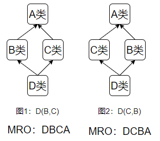
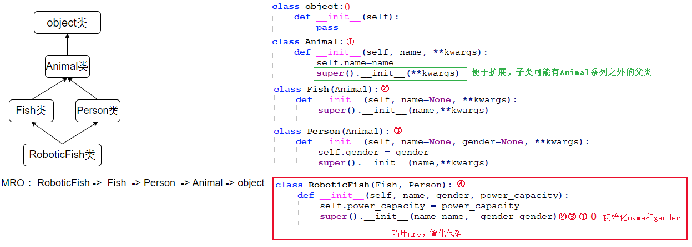
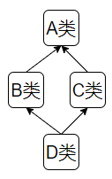

# 第9章 面向对象三大基本特征

## 9.1 封装

### 9.1.1 封装的目的/意义

不管是 Java 还是 Python，**封装都是面向对象的三大特性之一，核心目的完全相同**，只有实现方式不同：

1. **隐藏内部实现**：把类的私有数据（属性）和操作数据的方法绑定在一起，外部无需知道类的内部如何存储、如何处理数据；例如：list列表
2. **保证数据安全**：限制外部对属性的随意修改，通过统一接口做数据校验、日志记录、联动更新等，避免非法数据进入；
3. **降低耦合度**：外部仅通过类暴露的接口和类交互，后续类的内部实现修改时，只要接口不变，外部代码无需任何调整。

Java 把「私有化属性」作为实现封装的**唯一常规手段**，所以慢慢形成了「私有化 = 封装」的认知；而 Python 提供了**多种更灵活的方式**，私有化只是其中一种（还不是最常用的），这是两者的核心差异。

### 9.1.2 约定式封装：单下划线 `_attr`

这是 Python 中**实现封装的标准方式**，没有语法强制限制，而是通过**行业编程约定**定义「类的内部成员」：

- 写法：属性 / 方法以**单个下划线**开头，如`self._age`、`def _calc_score(self):`；
- 含义：向其他开发者传递明确信号 ——「这是类的内部实现细节，外部代码不要直接访问 / 修改 / 调用」；
- 约束：代码检查工具（PyCharm等）会对外部访问`_attr`的行为给出**警告**，团队开发中靠这个规范代码，而非 Python 语法限制；
- 核心作用：实现「逻辑上的封装」，区分「外部可调用的接口」和「内部自用的实现」。

```python
# 定义类
class Student:
    def __init__(self, math, english):
        self.math = math
        self.english = english
        self._total = math + english  # 内部属性，外部无需关注

    # 内部实现：单下划线标识，外部不要调用
    def _calc_average(self):
        return self._total / 2

    # 外部接口：公开方法，供外部调用
    def get_average(self):
        return self._calc_average()  # 调用内部方法

# 测试
# 创建对象
s = Student(90, 80)
print(s.get_average())  # 外部调用公开接口，正确用法
print(s._total) # 外部访问内部属性，，PyCharm会给出警告（语法上能运行）
print(s._calc_average())  # 外部调用内部方法，PyCharm会给出警告（语法上能运行）
```

### 9.1.3 接口式封装：@property装饰器

这是 Python 中**最优雅的封装方式**，也是替代 Java「getter/setter」的核心方案，核心目标是 **「给属性加逻辑，同时保持外部访问接口的简洁性」**。

- 把 getter/setter 方法的逻辑**绑定到属性名**上，外部依然用`对象.属性`访问 / 修改，无需像 Java 那样写`getXxx()`/`setXxx()`；
  - 巧妙使用@property装饰器标记一个返回私有属性值的方法，这类方法通常称为getter方法
  - 巧妙使用@getter方法名.setter装饰器标记一个设置私有属性值的方法，这类方法通常称为setter方法
- 封装逻辑对外部**完全透明**，后续如果给原本的公开属性加校验，外部代码**无需任何修改**；

- 注意：@property装饰的方法不要和变量重名，否则可能导致无限递归。

> 原来Person类的代码：

```python
# 定义类
class Person:
    def __init__(self, name=None, age=None):
        self.name = name
        self.age = age
```

> 新修改Person类的代码

```python
# 新定义Person类
class Person:
    def __init__(self, name=None, age=None):
        self.name = name
        self.__age = age

    @property
    def age(self):
        return self.__age

    @age.setter
    def age(self, age):
        if age<0 or age>100:
            raise ValueError("年龄超出范围")
        self.__age = age
```

> 测试代码（不变）

```python
# 测试
# 创建对象
p = Person("张三",18)
print(f"姓名：{p.name},年龄：{p.age}")
p.name = "张三丰"
p.age = 23
print(f"姓名：{p.name},年龄：{p.age}")
```

### 9.1.4 名称改写式封装：双下划线 `__attr` 

Python 中**没有像 Java 那样的`private`关键字**，双下划线`__attr`是唯一的「语法级别的封装手段」，这是最接近其他编程语言的`私有化`方式了。但本质是**名称改写（name mangling）**，而非真正的私有。

- 定义双下划线属性`__secret`时，Python 会在编译时将其改写，外部访问是`_类名__secret`。外部直接通过`对象.__secret实例属性` 或 `类名.__secret类属性`访问会报错，只能通过改写后的名称强行访问，即`对象._类名__secret实例属性`和`类名._类名__secret类属性`。
- `__方法`类似。

> 示例一

```py
# 定义类
class Person:
    """人的类"""
    __home = "earth"  # 私有类属性

    def __init__(self, name,age=0):
        self.__name = name # 私有实例属性
        if self.__check_age(age):
            self.__age = age # 私有实例属性

    def __check_age(self,age): # 私有方法
        if age<0 or age>100:
            raise ValueError("年龄超出范围")
        return True

    def __str__(self):
        return f"姓名：{self.__name},年龄：{self.__age}"

# 演示使用
p = Person("张三", 18) # 创建对象
# p2 = Person("张三", -18) # 创建对象
print(p)

# print(Person.__home) # 报错， __home 属性是私有的，不能直接访问
# print(p.__name)  # 报错， __name 属性是私有的，不能直接访问
# p.__check_age(100) # 报错，__check_age() 是私有方法，不能直接访问

print(f"Person.__home = {Person._Person__home}") # __home 名称改写为 _Person__home
print(f"p.__name = {p._Person__name}")  # __name名称改写为 _Person__name
print(f"p.__age = {p._Person__age}") # __age名称改写为 _Person__age
print(p._Person__check_age(20)) # __check_age私有方法 名称改写为  _Person__check_age
```

> 示例二

这种方式在 Python 中**极少用于日常封装**，原因有二：

1. 依然可以通过改写后的名称强行访问，不是「真正的私有」；
2. 写法繁琐，破坏了 Python 的简洁性，且违背「约定优于强制」的设计哲学；
3. 仅在**类的继承场景**中，需要防止子类意外覆盖父类内部属性时，才会偶尔使用。

```python
# 定义父类
class Parent:
    def __init__(self):
        self.__info = "父类的内部信息"  # 改写为 _Parent__info

# 定义子类
class Child(Parent):
    def __init__(self):
        super().__init__()
        self.__info = "子类的信息"  # 改写为 _Child__info，不会覆盖父类的__info

# 测试
# 创建对象
p = Parent()
c = Child()

# print(p.__info)  # 直接访问，报错：AttributeError
print(p._Parent__info)  # 强行访问，输出：父类的内部信息
print(c._Child__info)   # 输出：子类的信息
print(c._Parent__info)  # 子类能拿到父类改写后的属性，输出：父类的内部信息
```

> 选择：`_属性` 和` __属性`

✅ 用单下划线 `_name`（约定私有）的场景

- 类的内部成员，**希望子类能继承 / 修改**，但不希望外部业务代码随意访问；
- 模块内的变量 / 函数，仅希望在模块内部使用，不希望被`import *`导入；
- 临时的、辅助性的成员，开发调试时需要便捷访问，无需强保护。

✅ 用双下划线 `__name`（原生私有）的场景

- 类的核心成员，**绝对不希望子类重写 / 修改**，避免命名冲突；
- 类的敏感成员（如密码、核心配置），需要语言层面的保护，防止外部代码误访问 / 修改；
- 框架 / 库的底层类设计，需要严格的封装，避免使用者随意修改内部逻辑。

### 9.1.5 最小封装原则

> Python 的「伪私有」本质：Python**没有真正的、不可突破的私有**，哪怕是双下划线的`__name`，也能通过`_类名__name`绕开访问，这和 Java/C++ 的`private`（真正的语法私有，外部完全无法访问）有本质区别。

Python 的设计哲学里有一句经典的话：**“We are all consenting adults here”**（我们都是成年人），意思是 Python 不会强制限制开发者的任何操作，更倾向于 **“约定优于强制”**。

Python 的私有设计思路是：**阻止粗心的错误，而非阻止恶意的破坏**。无论是单下划线的 “约定私有”，还是双下划线的 “原生私有”，都是为了**规范协作**，而非限制开发者的操作。

> Python 社区对封装的理解，总结成一句话就是：**「能不封装就不封装，需要封装时极简封装」**，这和 Java 的「所有属性都要封装」形成鲜明对比。

具体落地规则：

1. **简单属性（无校验、无逻辑、无内部关联）**：直接公开，不用`_`、不用`property`，比如`self.name`、`self.gender`；
2. **类内自用的属性 / 方法（外部无需关注）**：用单下划线`_attr`做约定式封装，区分内部实现和外部接口；
3. **需要数据校验 / 日志 / 联动逻辑的属性**：用`property`做接口式封装，保持外部访问的简洁性；
4. **继承场景中防止子类覆盖**：才考虑用双下划线`__attr`做名称改写式封装。

这种原则的核心是：**避免过度封装**—— 封装的目的是为了让代码更安全、更易维护，而不是为了封装而封装，Python 拒绝为了「形式上的封装」写繁琐的代码。

## 9.2 继承

在 Python 中，**所有没有显式指定父类的类，默认继承自`object`类**，`object`是 Python 中所有类的**根类（顶级父类）**。

### 9.2.1 继承的目的和意义

**让一个子类（派生类）复用另一个父类（基类 / 超类）的属性和方法**，同时子类可以根据需求**扩展、重写**父类的内容，实现**代码复用**和**功能扩展**，避免重复编写相同代码。

继承的核心是 **“is a” 关系 **（子类是父类的一种），当两个类满足 **“子类是父类的具体实现 / 特殊类型”** 时，适合用继承：

1. 狗**是一种**动物 → Dog 继承 Animal；
2. 学生**是一种**人 → Student 继承 Person；
3. 矩形**是一种**图形 → Rectangle 继承 Shape。

简单理解：子类是父类的 “升级版”，天生拥有父类的所有能力，还能自己加新能力、改造原有能力。

继承的优点：

1. **代码复用**：父类的通用逻辑只写一次，所有子类直接复用，减少冗余；
2. **功能扩展**：子类可通过新增方法 / 重写方法快速扩展功能，符合 “开闭原则”（对扩展开放，对修改关闭）；
3. **结构清晰**：通过继承梳理类之间的层级关系，代码结构更直观。

继承的缺点：

1. **耦合度高**：子类和父类强关联，父类的修改会直接影响所有子类，增加维护成本；
2. **多继承复杂**：多继承会导致 MRO、菱形继承等问题，代码可读性和可维护性下降；
3. **灵活性低**：继承是静态的，编译时确定，无法动态改变继承关系。

### 9.2.2 演示单继承

语法格式：

```python
class 子类名(父类名):
    子类体
```

构造方法`__init__`是类的特殊方法，用于**初始化实例属性**：

1. 如果**子类没有重写`__init__`**，实例化子类时会**自动调用父类的`__init__`**；
2. 如果**子类重写了`__init__`**，实例化子类时会**优先执行子类的`__init__`**，父类的`__init__`不会自动执行，需要通过`super()`**手动调用**（否则父类的初始化逻辑会丢失）。

示例演示：

```python
"""
    演示单继承
"""
# 定义父类
class Person:
    def __init__(self, name, age):
        self.name = name
        self.age = age

    def eat(self):
        print(f"{self.name}吃东西....")

# 定义子类
class Student(Person):
    def __init__(self, name,age,score): # 子类构造方法
        super().__init__(name,age) # 调用父类的构造方法，为继承的name和age初始化代码
        self.score = score

    def study(self):
        print(f"{self.name}在学习，年龄为{self.age}，得分为{self.score}")

# 定义子类
class Teacher(Person):
    def __init__(self, name, age, major): # 子类构造方法
        super().__init__(name, age)
        self.major = major

    def teach(self):
        print(f"{self.name}老师，年龄为{self.age}，主攻{self.major}")

# 定义子类
class Doctor(Person):
    def work(self):
        print(f"{self.name}医生，年龄为{self.age}")

# 测试
# 创建对象
s = Student("张三", 18, 90)
s.eat()
s.study()

t = Teacher("李四", 28, "Python")
t.eat()
t.teach()

d = Doctor("王五", 38)
d.eat()
d.work()
```

### 9.2.3 属性覆盖问题

父类的同名类属性不会被覆盖，但是父类非`__attr`私有的同名实例属性会被覆盖。

- 如果父子类同名属性逻辑意义相同，那么父类声明过了，子类不必重新定义，直接使用即可。
- 如果父子类同名属性逻辑意义不同，那么应该使用不同的名字进行区别。
- 如果父类某个属性绝对不希望子类覆盖 / 修改，那么就应该使用`__attr`方式私有化处理。

```python
class Parent:
    # 类属性
    a = 10
    _b = 10
    __c = 10
    def __init__(self):
        # 实例属性
        self.x = 10
        self._y = 10
        self.__z = 10

class Child(Parent):
    a = 20 # 父类类属性a不会覆盖（语法允许，但是不建议）
    _b = 20 # 父类类属性_b不会覆盖（语法允许，但是不建议）
    __c = 20 # 父类类属性__c不会覆盖（语法允许，但是不建议）
    def __init__(self):
        super().__init__()
        # self.x = 20 # 父类实例属性x被覆盖（语法允许，但是不建议）
        # self._y = 20 # 父类实例属性_y被覆盖（语法允许，但是不建议）
        self.__z = 20 # 父类实例属性__z不会被覆盖，因为父类属性__z被改写为_Parent__z（语法允许，但是不建议）

    def show(self):
        print("父子类的类属性：")
        print(f"父类的a={Parent.a},子类a={Child.a}")
        print(f"父类的_b={Parent.a},子类_b={Child._b}")
        print(f"父类的__c={Parent._Parent__c},子类__c={Child.__c}")
        print("父子类的实例属性：")
        print(f"x={self.x}") # 如果子类没有同名的x属性，则会直接访问父类的x属性
        print(f"_y={self._y}") # 如果子类没有同名的_y属性，则会直接访问父类的_y属性
        print(f"__z={self.__z}") # 如果子类没有同名的__z属性，则会报错，因为父类属性__z被改写为_Parent__z
        print(f"_Parent__z={self._Parent__z}")

# 测试
c = Child()
c.show()
```


### 9.2.4 演示多继承

- 调用方法时先在子类中查找，若不存在则从左到右依次查找父类中是否包含方法。

语法格式：

```python
class 类名(父类1, 父类2, ...):
    类体
```

示例演示：

```python
"""
    演示多继承
    功能组合：通过多继承将不同的能力（飞行、游泳、行走）组合到一个类中
    清晰结构：每个能力类职责单一，便于维护和扩展
"""
# 定义父类
class Flyable:
    """
    飞行能力类
    注意：使用此类的子类需要提供 name 属性
    """
    def fly(self):
        print(f"{self.name} 正在飞行")

# 定义父类
class Swimming:
    """
    游泳能力类
    注意：使用此类的子类需要提供 name 属性
    """
    def swim(self):
        print(f"{self.name} 正在游泳")

# 定义父类
class Walkable:
    """
    行走能力类
    注意：使用此类的子类需要提供 name 属性
    """
    def walk(self):
        print(f"{self.name} 正在行走")

# 定义父类
class Bird:
    """鸟类基类"""
    def __init__(self, name):
        self.name = name

    def make_sound(self):
        print(f"{self.name} 在鸣叫")

# 定义子类
class Duck(Bird, Flyable, Swimming, Walkable):
    """鸭子类 - 继承鸟类和多种能力"""
    def __init__(self, name):
        super().__init__(name)

    def catch_fish(self):
        print(f"{self.name} 抓 fish")


# 使用示例
duck = Duck("小黄鸭")
duck.fly()
duck.swim()
duck.walk()
duck.make_sound()
duck.catch_fish()
```

> 混入类（Mixin Class）是一种设计模式，用于将特定功能模块化，然后通过多重继承组合到主类中。

例如：

- Flyable、Swimming、Walkable 都是混入类，每个类都提供单一功能：飞行、游泳、行走。这些类都假设子类具有 name 属性。
- Duck 类通过多继承组合了多种能力。Duck类先继承了 Bird类 的基础属性和方法，然后通过混入类获得了飞行、游泳、行走能力。

> 混入类模式的特点：

- 混入类通常不单独实例化。它们一般不包含 init 方法或只包含简单的初始化。通过约定或文档说明混入类的依赖（如要求子类提供 name 属性）。
- 主要目的是提供可重用的功能。
- 通过多重继承将功能组合到目标类中。
- 降低了代码重复，提高了代码的模块化程度。

> 混入类的设计优势：

- 单一职责：每个混入类只负责一种能力
- 可重用性：混入类可以在不同类中重复使用
- 灵活性：可以根据需要组合不同的能力
- 清晰结构：功能模块化，便于维护和扩展

### 9.2.5 重写父类的方法

子类可以重写父类的方法，方法名相同即为重写。python中没有方法重载的概念，后定义的同名方法就会覆盖之前定义的方法。

#### 1、重写父类实例方法

可以在子类中使用如下方式来调用父类非`__method`私有的实例方法：

- super().实例方法名() 
- 父类名.实例方法名(self) 

```python
"""
    子类复用或重写父类的方法
"""
# 定义父类
class Flyable:
    """
    飞行能力类
    注意：使用此类的子类需要提供 name 属性
    """
    def fly(self):
        print(f"{self.name} 正在飞行")

# 定义父类
class Bird:
    """鸟类基类"""
    def __init__(self, name):
        self.name = name

    def make_sound(self):
        print(f"{self.name} 在鸣叫")

    def eat(self):
        print(f"{self.name}吃东西....")


# 定义子类
class Duck(Bird, Flyable):
    """鸭子类 - 继承鸟类和飞行能力"""
    def __init__(self, name, price):
        super().__init__(name)
        self.price = price

    def catch_fish(self): # 添加新方法
        print(f"{self.name} 抓 fish")

    def make_sound(self): # 重写父类Bird的make_sound方法
        print(f"{self.name} 嘎嘎嘎")

    def eat(self, food): # 重写父类Bird的eat方法，允许形参列表不同
        print(f"{self.name} 吃{food}....")

    def fly(self): # 重写父类Flyable的fly方法
        super().fly() # 调用父类的方法
        # Flyable.fly(self) # 调用父类的方法
        print(f"{self.name} 飞也飞不高")


# 测试
duck = Duck("小黄鸭", 10)
duck.catch_fish()
duck.make_sound()
duck.eat("虫子")
duck.fly()
```

#### 2、重写父类的类方法和静态方法（了解）

可以在子类中用如下方式调用父类非`__method`私有的类方法和静态方法。

- super().类方法名() ：此时父类方法cls参数接收的是子类类型
- 父类名.类方法名() ：此时父类方法cls参数接收的是父类类型
- 父类名.静态方法()：没有cls参数。
- 子类中不支持super().静态方法名()的方式访问父类的静态方法。

```python
# 定义父类
class Bird:
    info = "鸟类"
    
    @classmethod
    def print_info(cls):
        print(f"Bird类.print_info，cls类名是{cls.__name__},{cls.info=},{Bird.info=}")

    @staticmethod
    def show():
        print(f"Bird类.show,{Bird.info=}")

# 定义子类
class Duck(Bird):
    info = "鸭子"
    
    @classmethod
    def print_info(cls):
        super().print_info() # 给父类print_info方法cls的参数是Duck类
        # Bird.print_info() # 给父类print_info方法cls的参数是Bird类
        print(f"Duck类.print_info，cls类名是{cls.__name__},{cls.info=},{Duck.info=}")

    @staticmethod
    def show():
        Bird.show()  # 给父类show方法cls的参数是Bird类
        print(f"Duck类.show,{Duck.info=}")

# 测试
Duck.print_info()
Duck.show()
```


### 9.2.6 方法解析顺序MRO

#### 1、什么是MRO

如果多个父类有**同名方法**，子类调用时会按**固定顺序**查找，这个顺序就是**方法解析顺序（Method Resolution Order，MRO）**。MRO（Method Resolution Order）是 Python 为**多继承**设计的**方法 / 属性查找规则**，本质是一个**类的线性搜索顺序列表**。可使用 类名.__mro__ 访问类的继承链来查看方法解析顺序。

Python3 中 MRO 遵循**C3 算法**，简单总结：

1. 先找**子类自己**的方法；
2. 再按**父类定义的顺序**从左到右查找；
3. 最后找**共同的祖先类**。

C3 算法的三个关键性质：

1. 局部优先顺序：子类优先于父类，同一父类的多个子类保持声明顺序。例如图1是先B在C，图2是先C后B。
2. 一致性：如果类D继承类B，类B继承类A ，那么在MRO中D应该在B之前，B应该在A之前。
3. 单调性：子类的MRO不会破坏父类的 MRO 顺序（避免查找混乱）。即如果在所有父类的MRO中，类C、B都在类A之前，那么在子类的MRO中，B、C也应该在A之前。而在 Python 2.2 之前使用的是 DFS（深度优先搜索）算法，此时图1的MRO顺序就为DBAC，这就破坏了子类C优先于父类A的原则，即破坏了单调性（单次调用）。自 Python 2.3 起引入C3算法，此时图1的MRO顺序就为DBCA，遵循了子类B、C优先于A类的原则。




#### 2、演示MRO

情况一：按照MRO顺序，找到了对应的方法就停止。

情况二：按照MRO顺序，找到了对应的方法，但对应方法中还有super().方法()语句，那么继续沿着MRO方向调用父类的方法，直到没有super().方法()语句为止。

```python
# 定义父类
class A:
    def show_one(self):
        print("A的show_one")
    def show_two(self):
        print("A的show_two")
    def show_three(self):
        print("A的show_three")
    def show_four(self):
        print("A的show_four")

# 定义父类
class B(A):
    def show_one(self):
        print("B")
    def show_two(self):
        print("B的show_two")
    def show_three(self):
        print("B的show_three")
        super().show_three()
    def show_four(self):
        print("B的show_four")
        super().show_four()

# 定义父类
class C(A):
    def show_one(self):
        print("C的show_one")
    def show_two(self):
        print("C的show_two")
    def show_three(self):
        print("C的show_three")
    def show_four(self):
        print("C的show_four")
        super().show_four()


# 定义子类
class D(B,C):
    def show_one(self):
        print("D的show_one")
    def show_two(self):
        print("D的show_two")
        super().show_two()
    def show_three(self):
        print("D的show_three")
        super().show_three()
    def show_four(self):
        print("D的show_four")
        super().show_four()

# 测试
d = D()
print("查看D类的mro：")
print(D.mro())
print()
print("调用show_one方法".center(50, "-"))
d.show_one()
print("调用show_two方法".center(50, "-"))
d.show_two()
print("调用show_three方法".center(50, "-"))
d.show_three()
print("调用show_four方法".center(50, "-"))
d.show_four()
```


#### 3、巧用MRO完成初始化

> 父类们

```python
# 定义父类
class Animal:
    """动物类"""
    def __init__(self, name, **kwargs):
        print("Animal父类构造方法")
        self.name=name
        super().__init__(**kwargs)

# 定义父类
class Fish(Animal):
    """鱼类类"""
    def __init__(self, name=None, **kwargs):
        print("Fish父类构造方法")
        super().__init__(name,**kwargs)  # 传递剩余参数

# 定义父类
class Person(Animal):
    """人类类"""
    def __init__(self, name=None, gender=None, **kwargs):
        print("Person父类构造方法")
        self.gender = gender
        super().__init__(name,**kwargs)  # 传递剩余参数
```

> 子类

```python
# 定义子类
class RoboticFish(Fish, Person):
    """鱼形机器人类"""
    def __init__(self, name, gender, power_capacity):
        print("RoboticFish子类构造方法")
        self.power_capacity = power_capacity
        super().__init__(name=name,  gender=gender)

    def __str__(self):
        return f"鱼形机器人名字：{self.name}，性别：{self.gender}，电量：{self.power_capacity}"

# 测试
# 查看方法解析顺序MRO
print(RoboticFish.__mro__)
r = RoboticFish("落雁", "女",98)
print(r)
```




#### 4、MRO解决了菱形继承问题

经典结构：`D`继承`B`和`C`，`B`和`C`又都继承自`A`，形成一个菱形（钻石）结构：



如果没有 MRO 的 C3 算法，调用`D`的方法时，`A`的方法可能会被**B 和 C 各调用一次**，造成逻辑重复、资源浪费。C3 算法会将**共同基类（A）放在 MRO 列表的最后一个父类之后**，保证**共同基类只被查找一次**，彻底避免重复执行的问题。在菱形继承中，**super () 的查找对象不是当前类的父类，而是 MRO 列表的下一个父类**，这是 super () 的核心底层逻辑，也是 MRO 解决菱形继承的关键。

#### 5、特殊需求：突破MRO

实际开发中，偶尔会有特殊需求：**不按 MRO 顺序**，强行调用**某个特定父类**的方法（比如 MRO 中先找 B，但你想直接调用 C 的方法）。此时可以通过 **父类名.方法名 (实例，参数)** 的方式，突破 MRO 的限制，精准调用指定父类的成员。

```python
class A:
    def func(self):
        print("A的func")

class B(A):
    def func(self):
        print("B的func")

class C(A):
    def func(self):
        print("C的func")

class D(B, C):
    pass

d = D()
# 1. 按MRO顺序，默认调用B的func
d.func()  # 输出：B的func

# 2. 突破MRO，强行调用C的func（语法：父类名.方法名(实例)）
C.func(d) # 输出：C的func

# 3. 突破MRO，强行调用A的func
A.func(d) # 输出：A的func
```

**注意**：这种方式**尽量少用**，因为它破坏了 MRO 的设计规则，会让多继承代码的逻辑变得混乱，仅适用于**特殊调试 / 定制化场景**。

> 如果用`父类名.方法名(self,参数)`或 `super(父类,self).方法名(参数)`，可以跳过某些父类的初始化代码。

```python
# 定义子类
class RoboticFish(Fish, Person):
    """鱼形机器人类"""
    def __init__(self, name, gender, power_capacity):
        print("RoboticFish子类构造方法")
        self.power_capacity = power_capacity
        
        # 跳过MRO顺序中某些父类
        # 写法一
        Person.__init__(self, name,gender)
        
        # 写法二
        # super(Fish, self).__init__(name,gender) # 表示找Fish之后的父类的init

    def __str__(self):
        return f"鱼形机器人名字：{self.name}，性别：{self.gender}，电量：{self.power_capacity}"
```

#### 6、避坑指南

- 原则 1：多继承时，先查 MRO 再写代码
  - 只要写了多继承代码，**第一时间用`类名.mro()`查看查找顺序**，确认方法 / 属性的执行逻辑，避免凭直觉写代码导致的歧义（比如以为会执行 C 的方法，实际 MRO 先找了 B）。
- 原则 2：避免多继承中大量的同名方法
  - MRO 能解决同名方法的冲突，但**大量的同名方法**会让代码的可读性急剧下降（别人看代码时必须查 MRO 才能知道执行逻辑）。
  - 实际开发中，多继承尽量用于**复用不同父类的不同方法**（父类之间无同名成员），而非解决同名方法的冲突。

## 9.3 多态

多态（Polymorphism）是一种编程思想 / 特性。多态的字面意思是 “多种形态”，在编程中的核心定义是：**同一操作作用于不同的对象上，可以产生不同的执行结果**。简单说就是：不同的对象，对同一个方法调用，能做出不同的响应。

实现多态效果的方式有2种：

- 基于继承+方法重写的多态：这是大多数面向对象编程语言的实现方式（例如Java）
- 基于鸭子类型的多态：这是 Python 实现多态的核心方式

### 9.3.1 基于继承的多态

```python
"""
    演示多态
"""
# 定义父类
class Animal:
    def go(self):
        pass

# 定义子类
class Dog(Animal):
    def go(self):
        print("小狗跑")

# 定义子类
class Fish(Animal):
    def go(self):
        print("鱼儿游")

# 定义子类
class Bird(Animal):
    def go(self):
        print("鸟儿飞")

# 定义函数
def go(animal):
    animal.go()  # 将不同的实例传入，执行不同的方法

# 创建对象，调用函数
dog = Dog()
fish = Fish()
bird = Bird()
go(dog)
go(fish)
go(bird)
```

### 9.3.2 基于鸭子类型的多态

**Python（动态类型语言）**：不需要继承、不需要声明类型，完全靠鸭子类型实现多态 —— 只要不同对象有同名的方法，调用这个方法时就会表现出不同行为，就可以实现多态效果。

```python
# 定义类
class Dog:
    def go(self):
        print("小狗跑")

# 定义类
class Fish:
    def go(self):
        print("鱼儿游")

# 定义类
class Bird:
    def go(self):
        print("鸟儿飞")

# 定义函数
def go(animal):
    animal.go()  # 将不同的实例传入，执行不同的方法

# 创建对象，调用函数
dog = Dog()
fish = Fish()
bird = Bird()
go(dog)
go(fish)
go(bird)
```

## 9.4 抽象类（了解）

抽象类是指包含抽象方法的类，抽象类不能被直接实例化。子类继承抽象类之后，必须重写所有抽象方法。父类定义抽象方法的意义是约定所有子类必须包含某个方法。

python中的抽象类必须满足2个要求：

（1）继承abc.ABC

（2）抽象方法上加装饰器@abstractmethod

```python
class Person(abc.ABC):
    def __init__(self,name,age):
        self.name = name
        self.age = age

    @abc.abstractmethod
    def eat(self):
        pass

    def show(self):
        print(f"姓名：{self.name}，年龄：{self.age}")

class Student(Person):
    def eat(self):
        print("吃学生餐")

# p = Person("张三",23) #错误
p = Student("张三",23)
p.show()
p.eat()
```

## 9.5 案例：愤怒的小鸟

> 游戏背景：

在这个模拟的愤怒的小鸟游戏世界里，绿色的小猪偷走了小鸟们的蛋，这引发了小鸟们的愤怒，它们决定展开反击。每只小鸟都具有独特的颜色，并且各自拥有不同的技能，玩家需要操控这些小鸟，利用它们的技能去攻击小猪们建造的各种障碍物，从而达成击败小猪、夺回鸟蛋的目标。

### 9.5.1 类的设计

#### 1、Birds 基类

1）设计目的

作为所有小鸟类的基类，它定义了小鸟的通用属性和行为，为后续具体小鸟类的扩展提供基础框架，体现了面向对象编程中的抽象和封装思想。

2）属性设计

name：用于标识每只小鸟的名称，方便区分不同个体。

color：代表小鸟的颜色，这是小鸟的一个显著特征，在游戏中可以对应不同类型的小鸟。

skill_description：描述小鸟所具备的独特技能，让玩家了解每只小鸟的特殊能力。

3）方法设计

fly()：描述小鸟飞行的基本动作，是小鸟在游戏中的常见行为，所有子类都可以重写该方法来展示不同的飞行特点。

call()：模拟小鸟发出叫声的行为，同样可以被子类重写以体现不同小鸟的叫声差异。

use_skill()：用于触发小鸟的特殊技能，展示小鸟使用技能的情况，子类可以根据自身技能特点进行相应实现。

#### 2、具体小鸟子类（RedBirds、YellowBirds、BlueBirds）

1）设计目的

继承自 Birds 基类，每个子类代表一种特定颜色的小鸟，它们在继承基类属性和方法的基础上，重写部分方法以展示不同小鸟的独特行为和技能，体现了面向对象编程中的继承和多态思想。

2）属性设计

通过调用基类的 `__init__ `方法，初始化各自的 name、color 和 skill_description 属性，确保每只小鸟都有自己的独特标识和技能。

3）方法设计

fly()：重写基类的 fly() 方法，展示不同小鸟的飞行特点，如红鸟以稳定速度飞行，黄鸟快速飞行，蓝鸟优雅飞行。

call()：重写基类的 call() 方法，模拟不同小鸟的叫声，增加游戏的趣味性。

#### 3、Obstacle障碍类

1）设计目的

代表游戏中的障碍物，如木头堡垒、石头塔楼等，负责处理障碍物被小鸟攻击的逻辑，与小鸟类进行交互，体现了面向对象编程中的对象交互和封装思想。

2）属性设计

name：标识障碍物的名称，方便区分不同类型的障碍物。

strength：表示障碍物的强度，即它能够承受的伤害值，当强度降为 0 时，障碍物被摧毁。

3）方法设计

be_attacked(bird)：模拟障碍物被小鸟攻击的过程，根据小鸟的类型计算伤害，并更新障碍物的强度，同时输出攻击和受损信息，让玩家了解游戏进展。

### 9.5.2 设计思路

#### 1、Birds 类的方法

1）fly()

作为通用的飞行方法，提供了小鸟飞行的基本描述，子类可以根据自身特点进行个性化实现，以体现不同小鸟的飞行风格。

2）call()

模拟小鸟发出叫声的行为，为游戏增加生动性，子类可以重写该方法来展示不同小鸟的叫声特点。

3）use_skill()

用于触发小鸟的特殊技能，通过输出技能描述，让玩家了解小鸟使用技能的情况，不同子类可以根据自身技能进行不同的实现。

#### 2、具体小鸟子类的方法

fly() 和 call()：重写基类的方法，根据不同小鸟的特点进行个性化实现，展示不同小鸟的飞行和叫声差异，体现了多态性。

#### 3、Obstacle 类的方法

be_attacked(bird)：接收一个小鸟对象作为参数，根据小鸟的类型计算伤害，并更新障碍物的强度。通过判断障碍物的强度是否小于等于 0，输出障碍物是否被摧毁的信息，实现了障碍物与小鸟之间的交互逻辑。

> 通过这样的类和方法设计，整个游戏模拟程序具有良好的扩展性和可维护性，方便后续添加更多类型的小鸟和障碍物，以及实现更复杂的游戏逻辑。

### 9.5.3 代码实现

```python
"""
    愤怒的小鸟
"""
# 定义鸟类基类
class Birds:
    def __init__(self, name, color, skill_description):
        self.name = name
        self.color = color
        self.skill_description = skill_description

    def fly(self):
        print(f"{self.name} 正在飞行...")

    def call(self):
        print(f"{self.name} 发出叫声...")

    def use_skill(self):
        print(f"{self.name} 使用了技能：{self.skill_description}")

# 定义红鸟子类
class RedBirds(Birds):
    def __init__(self):
        super().__init__("红火", "红色", "撞击前方障碍物，造成大量伤害")

    def fly(self):
        print("红火以稳定的速度向前飞行...")

    def call(self):
        print("红火发出 'wei呀....' 的叫声")

# 定义黄鸟子类
class YellowBirds(Birds):
    def __init__(self):
        super().__init__("小黄", "黄色", "瞬间加速，穿透薄障碍物")

    def fly(self):
        print("小黄快速向前飞行...")

    def call(self):
        print("小黄发出 '啾啾啾....' 的叫声")

# 定义蓝鸟子类
class BlueBirds(Birds):
    def __init__(self):
        super().__init__("小蓝", "蓝色", "分裂成三只小鸟，分散攻击")

    def fly(self):
        print("小蓝优雅地向前飞行...")

    def call(self):
        print("小蓝发出 '叽叽叽....' 的叫声")

# 定义障碍物类
class Obstacle:
    def __init__(self, name, strength):
        self.name = name
        self.strength = strength

    def be_attacked(self, bird):
        print(f"{bird.name} 冲向了 {self.name}")
        bird.use_skill()
        if isinstance(bird, RedBirds):
            damage = 80
        elif isinstance(bird, YellowBirds):
            damage = 50
        elif isinstance(bird, BlueBirds):
            damage = 30 * 3  # 分裂成三只，每只造成 30 点伤害
        self.strength -= damage
        if self.strength <= 0:
            print(f"{self.name} 被摧毁了！")
        else:
            print(f"{self.name} 还剩余 {self.strength} 点强度")

# 模拟游戏过程
if __name__ == "__main__":
    # 创建不同颜色的小鸟
    red_bird = RedBirds()
    yellow_bird = YellowBirds()
    blue_bird = BlueBirds()

    # 创建障碍物
    obstacle1 = Obstacle("木头堡垒", 100)
    obstacle2 = Obstacle("石头塔楼", 200)

    # 红鸟攻击木头堡垒
    obstacle1.be_attacked(red_bird)

    # 黄鸟攻击石头塔楼
    obstacle2.be_attacked(yellow_bird)

    # 蓝鸟攻击石头塔楼
    obstacle2.be_attacked(blue_bird)

```
