# 第12章 Python高级语法

## 12.1 深拷贝和浅拷贝

- 直接赋值：对象的引用（别名），不产生拷贝。
- 浅拷贝：拷贝父对象，不会拷贝对象的内部的子对象。拷贝后只有第一层是独立的。
- 深拷贝：完全拷贝了父对象及其子对象。拷贝后所有层都是独立的。

### 12.1.1 直接赋值

```python
"""
    演示直接赋值
"""
# 定义函数
def show_list(list_name, list_demo, tab_count=0):
    print("\t" * tab_count,f"{list_name}={list_demo}")
    print("\t" * tab_count,f"{list_name} 的id是：{id(list_demo)}")
    print("\t" * tab_count,f"{list_name} 的各个元素的id是：")
    for index,element in enumerate(list_demo):
        # print("\t" * tab_count,f"{element} = {id(element)}")
        if isinstance(element, list):
            show_list(f"{list_name}[{index}]", element, tab_count + 1)
        else:
            print("\t" * (tab_count + 1),f"{element} = {id(element)}")

# 定义列表
list1 = [10, 20, 30, [1, 2, 3]]
list2 = list1 #直接赋值

# 打印列表元素、列表地址、及其元素地址
show_list("list1", list1)
print()
show_list("list2", list2)
print()

#修改list1列表的元素
list1[0] = 100
list1[3][1] = 200

print(f"{"*" * 20}修改list1后{"*" * 20}\n")

show_list("list1", list1)
print()
show_list("list2", list2)
print()
```


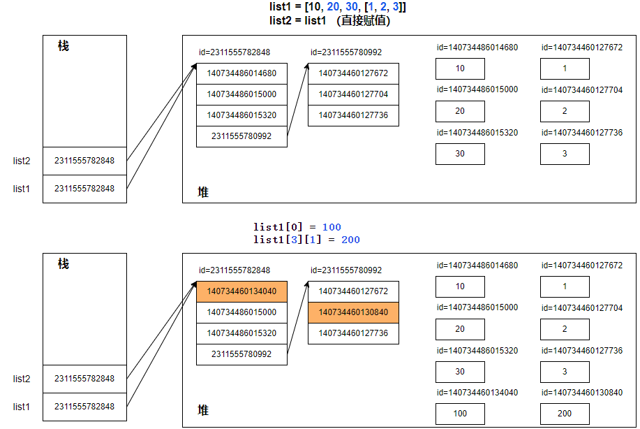

### 12.1.2 浅拷贝

如下操作都属于浅拷贝：

- 切片操作（如 [:]）。
- 使用工厂函数（如 list() / set()）。
- 使用 copy 模块的 copy() 函数。

> 示例代码：创建一个列表，其中包含整型和列表元素，使用 copy() 对其浅拷贝。
>

```python
"""
    浅拷贝
"""
import copy

# 定义函数
def show_list(list_name, list_demo, tab_count=0):
    print("\t" * tab_count,f"{list_name}={list_demo}")
    print("\t" * tab_count,f"{list_name} 的id是：{id(list_demo)}")
    print("\t" * tab_count,f"{list_name} 的各个元素的id是：")
    for index,element in enumerate(list_demo):
        # print("\t" * tab_count,f"{element} = {id(element)}")
        if isinstance(element, list):
            show_list(f"{list_name}[{index}]", element, tab_count + 1)
        else:
            print("\t" * (tab_count + 1),f"{element} = {id(element)}")

# 定义列表
list1 = [10, 20, 30, [1, 2, 3]]
list2 = copy.copy(list1) # 浅拷贝

# 打印列表元素、列表地址、及其元素地址
show_list("list1", list1)
print()
show_list("list2", list2)
print()

#修改list1列表的元素
list1[0] = 100
list1[3][1] = 200

print(f"{"*" * 20}修改list1后{"*" * 20}\n")

show_list("list1", list1)
print()
show_list("list2", list2)
print()
```

- list2是复制list1得到的一个新对象，所以list2和list1地址不同。
- 因为是浅拷贝，2个列表中各个元素还是同一地址。
- 因为list1[0] 是不可变类型元素，所以修改list1[0]之后可以看到 list1[0] 指向了新的引用。
- 因为list1[3]是可变类型的元素，所以修改不会产生新对象。

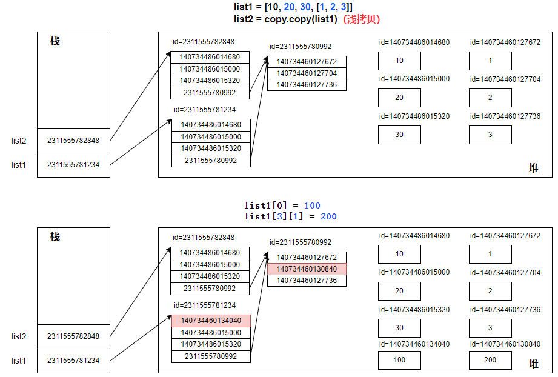

### 12.1.3 深拷贝

使用 copy 模块的 deepcopy() 函数实现深拷贝。

```python
"""
    深拷贝
"""
import copy

# 定义函数
def show_list(list_name, list_demo, tab_count=0):
    print("\t" * tab_count,f"{list_name}={list_demo}")
    print("\t" * tab_count,f"{list_name} 的id是：{id(list_demo)}")
    print("\t" * tab_count,f"{list_name} 的各个元素的id是：")
    for index,element in enumerate(list_demo):
        # print("\t" * tab_count,f"{element} = {id(element)}")
        if isinstance(element, list):
            show_list(f"{list_name}[{index}]", element, tab_count + 1)
        else:
            print("\t" * (tab_count + 1),f"{element} = {id(element)}")

# 定义列表
list1 = [10, 20, 30, [1, 2, 3]]
list2 = copy.deepcopy(list1) # 深拷贝

# 打印列表元素、列表地址、及其元素地址
show_list("list1", list1)
print()
show_list("list2", list2)
print()

#修改list1列表的元素
list1[0] = 100
list1[3][1] = 200

print(f"{"*" * 20}修改list1后{"*" * 20}\n")

show_list("list1", list1)
print()
show_list("list2", list2)
print()
```

- list2是复制list1得到的一个新对象，所以list2和list1地址不同。
- 因为是深拷贝，新列表中各个可变类型元素的地址都发生了改变，不可变类型元素拷贝后地址不变。。
- 因为list1[0] 是不可变类型元素，所以修改list1[0]之后可以看到 list1[0] 指向了新的引用。
- 因为list1[3]和list2[3]是不同的地址，所以无论list1[3]怎么修改都与list2[3]无关。

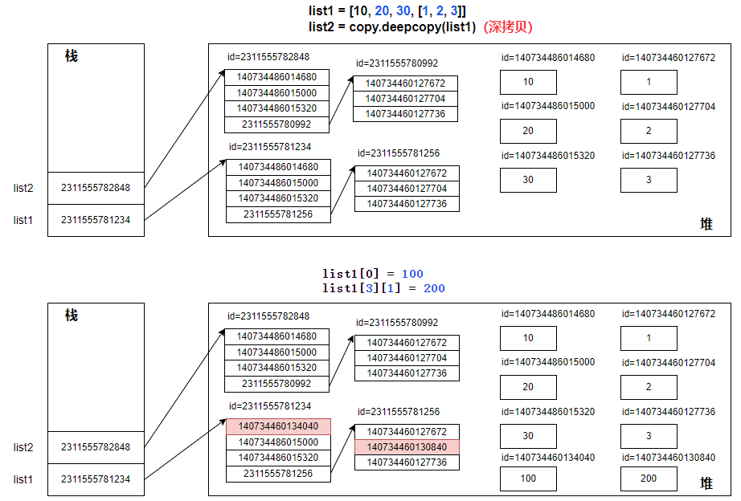

### 12.1.4 拷贝的特殊情况

（1）非容器类型（如数字）、其他“原子”类型的对象（如字符串）：无法拷贝

（2）元组变量如果只包含原子类型对象，则不能对其深拷贝

```python
"""
    拷贝的特殊情况
"""
#非容器类型不支持深拷贝
import copy

a = 1
print("整数的id和值是：", id(a), a)  # 140732039489976 1

b = copy.copy(a)
print("浅拷贝后的id和值是：", id(b), b)  # 140732039489976 1  不变

c = copy.deepcopy(a)
print("深拷贝后的id和值是：",id(c), c)  # 140732039489976 1   不变

# 只包含原子类型的元组容器类型不支持深拷贝
tuple1 = (1, 2, 3)
print("只包含整数元素的元组id和值是：",id(tuple1), tuple1) # 1587803444800 (1, 2, 3)
tuple2 = copy.copy(tuple1)
print("浅拷贝后元组id和值是：",id(tuple2), tuple2) # 1587803444800 (1, 2, 3)  不变
tuple3 = copy.deepcopy(tuple1)
print("深拷贝后元组id和值是：",id(tuple3), tuple3) # 1587803444800 (1, 2, 3)  不变

# 包含非原子类型的元组容器类型支持深拷贝
tuple1 = (1, 2, 3, [10, 20, 30])
print("包含列表元素的元组id和值是：",id(tuple1), tuple1) # 1587803480256 (1, 2, 3, [10, 20, 30])
tuple2 = copy.copy(tuple1)
print("浅拷贝后元组id和值是：",id(tuple2), tuple2) # 1587803480256 (1, 2, 3, [10, 20, 30]) 不变
tuple3 = copy.deepcopy(tuple1)
print("深拷贝后元组id和值是：",id(tuple3), tuple3) # 1587803483376 (1, 2, 3, [10, 20, 30]) 新地址
```

## 12.2 闭包

当调用的函数执行完毕后，函数内的变量就会被销毁。但有时希望在调用函数后函数内的数据能够保存下来重复使用，这时候可以用到闭包（**closure**）。闭包可以避免使用全局值，并提供某种形式的数据隐藏。

构建闭包的条件：

- 外部函数内定义一个内部函数。
- 内部函数用到外部函数中的变量。
- 外部函数将内部函数作为返回值。

**基础类型层面**：闭包和普通函数属于同一类型（ `function`），没有本质的类型差异。

**核心特征层面**：闭包是「绑定了外部自由变量」的特殊函数，普通函数无此绑定（可通过`__closure__`等属性区分）。所有函数对象都有一个 `__closure__ `属性，如果它是一个闭包函数，则该属性返回单元格对象的元组，每个单元格对象都对应着闭包所引用的外部函数作用域中的一个变量。对于普通函数，`__closure__ `属性的值通常为 None。

```python
"""
    演示闭包
"""
def outer():
    """外部函数"""
    a = 1
    b = 2
    def inner():
        """内部函数"""
        print(f"{a=},{b=}")
    return inner

# 调用外部函数，获取内部函数inner
inner_func = outer()
objects = inner_func.__closure__
for obj in objects:
    print(obj.cell_contents)
```

## 12.3 命名空间和作用域

### 12.3.1 什么是命名空间

命名空间（Namespace）是从名称到对象的映射，现在，大多数命名空间都使用Python字典实现。这个字典里的**键（key）** 是变量 / 函数 / 类的名字，**值（value）** 是这些名字对应的实际对象（比如数字、字符串、函数体、类实例等）。

它的核心作用是：**避免名字冲突**。比如你在两个不同的地方定义了同名变量`x`，命名空间会帮 Python 区分这两个`x`分别属于哪个 “区域”，不会混淆。

各个命名空间是独立的，没有任何关系的，所以一个命名空间中不能有重名，但不同的命名空间是可以重名而没有任何影响。

```python
# 全局命名空间
x = 10

def func():
    # 函数内部的局部命名空间
    x = 20
    print("局部x:", x)  # 输出 20

func()
print("全局x:", x)     # 输出 10
```

### 12.3.2 三种命名空间

一般有三种命名空间，在不同时刻创建，且拥有不同的生命周期：

1）内置名称：

- 内置名称的命名空间是在 Python 解释器启动时创建的，永远不会被删除。

2）一个模块的全局名称

- 模块的全局命名空间在导入并读取模块定义时创建。通常，模块的命名空间也会持续到解释器退出。

- 从脚本文件读取或交互式读取的，由解释器顶层调用执行的语句，是` __main__ `模块调用的一部分，也拥有自己的全局命名空间。

- 内置名称实际上也在模块里，即 builtins模块。


3）一个函数调用中的局部名称

- 函数的局部命名空间在函数被调用时被创建，并在函数返回或抛出未在函数内被处理的异常时被删除。当然，每次递归调用都有自己的局部命名空间。

> 补充说明：

当涉及**嵌套函数 / 闭包**时，“局部命名空间” 会被拆分为两层，因此扩展为 4 种：

|           命名空间类型           | 对应作用域 |                     核心特点                     |
| :------------------------------: | :--------: | :----------------------------------------------: |
|     内置命名空间（Built-in）     | 内置作用域 | Python 解释器自带，全局可用（如`print`、`len`）  |
|      全局命名空间（Global）      | 全局作用域 | 模块级别，整个.py 文件内可用（如全局变量、函数） |
| 外层 / 嵌套命名空间（Enclosing） | 外层作用域 |    嵌套函数的外层函数内部，仅内层函数可访问。    |
|      局部命名空间（Local）       | 局部作用域 |          嵌套函数的内层函数内部可访问。          |

**外层 / 嵌套命名空间本质是 “特殊的局部命名空间”** —— 它属于外层函数的局部命名空间，只是因为内层函数能访问它，才被单独拆分出来。

面试 / 入门答题：优先说 “3 种（内置、全局、局部）”，补充 “嵌套场景下可细分为 4 种（增加外层 / 嵌套）”。


### 12.3.4 四种作用域（LEGB原则）

Python 里的作用域主要分为 4 种，遵循 **LEGB** 查找规则（从内到外查找变量）：

1、L（Local）- 局部作用域：在函数内部定义的变量，只能在这个 “函数局部区域” 内访问。

2、E（Enclosing）- 嵌套作用域（闭包作用域）：嵌套函数中，内层函数能访问外层函数（非全局）的变量，这个外层函数的作用域就是嵌套作用域。

3、G（Global）- 全局作用域：在所有函数、类外部定义的变量，整个程序的所有地方（除非被局部变量覆盖）都能访问。

4、B（Built-in）- 内置作用域：Python 自带的内置函数、关键字（如`print`、`len`、`int`）的作用域，无需定义就能直接使用。

> 示例代码

```python
# =================四种变量作用域====================
# G (Global): 模块级别变量
x = 1 # 全局变量
def outer():
    # 在函数中定义变量，会开启新的变量作用域
    
    # E (Enclosing): 闭包，因为y被内部函数inner使用，且inner被返回到outer之外，所以y被保存在闭包中
    y = 2 # 外层函数变量，在整个outer函数中都可以访问

    # 在外部函数体中定义内部函数
    def inner():
        # 在函数中定义变量，会开启新的变量作用域
        # L (Local): 函数内部变量
        z = 3 # 局部变量，仅限于inner函数内部访问
        print(f"在inner中访问局部变量z的值是：{z}")  # 访问局部变量
        print(f"在inner中访问嵌套变量y的值是：{y}")  # 访问外层函数变量
        print(f"在inner中访问全局变量x的值是：{x}")  # 访问全局变量
        print(f"在inner中访问内建函数print")  # 访问内建函数

    # print(f"在outer中访问内层函数变量z的值是：{z}") # 报错
    print(f"在outer中访问局部变量y的值是：{y}")
    print(f"在outer中访问全局变量x的值是：{x}")
    print(f"在outer中访问内建函数print")

    return inner

# 调用外部函数函数
print("调用outer函数".center(50, "-"))
inner_fun = outer()

print("调用inner函数".center(50, "-"))
inner_fun()

print("main函数".center(50, "-"))
# print(f"在main中访问内层函数变量z的值是：{z}") # 报错
# print(f"在main中访问外层函数变量y的值是：{y}") # 报错
print(f"在main中访问全局变量x的值是：{x}")
print(f"在main中访问内建函数print")
```

Python 中只有模块（module），类（class）以及函数（def、lambda）才会引入新的作用域，其它的代码块（如 if/elif/else/、try/except、for/while等）是不会引入新的作用域的，也就是说这些语句内定义的变量，其外部也可以访问。

```python
# if-else语句块中定义变量，不会开启新的变量作用域
import random
a= random.randint(1,10) # 全局变量
if a>5:
    result = "big" # 全局变量，因为当前if不在函数，闭包中
    print("a的值是：",a)
else:
    result = "small"
print("result的值是：",result) # if-else语句块外，仍然可以访问result
```

### 12.3.5 global和nonlocal关键字

global 语句用于表明特定变量在全局作用域里，并应在全局作用域中重新绑定。

nonlocal 语句表明特定变量在外层作用域中，并应在外层作用域中重新绑定。

在最内层作用域访问全局作用域或外层作用域的变量时，若不使用 global 或 nonlocal 语句，这些变量将为只读，尝试写入这样的变量将在最内层作用域中创建一个新的局部变量，而使得同名的外部变量保持不变。

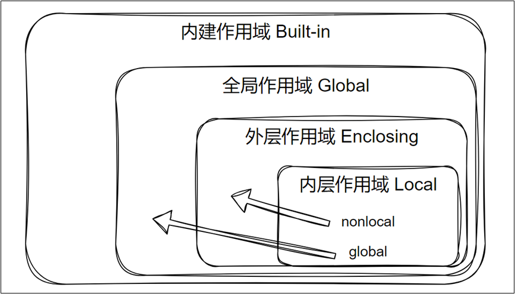

#### 1、global关键字

在函数中不使用 global 声明全局变量时不能修改全局变量的指向，即不能让全局变量指向新地址。

- 可变类型：在函数中修改可变类型的全局变量的内容，可以不加global关键字。因为此时全局变量引用的地址并未改变。如果修改地址呢？
- 不可变类型：在函数中修改不可变类型的全局变量值，必须加global关键字。因为不可类型的变量，一旦修改就意味着指向新地址。

> 可变类型

```python
# =========可变类型在局部修改可以不使用global关键字===========
listDemo = [1,2,3] #  可变类型，全局变量
# 定义函数
def change_list():
    listDemo.append(4)
    print("change_list()函数中，listDemo的值是：",listDemo) # listDemo= [1,2,3,4]
    # listDemo = [4,5,6] # 错误，因为Python 默认会把这个变量当作局部变量

# 调用函数
print("调用change_list()函数之前，listDemo的值是：",listDemo)  # listDemo= [1,2,3]
change_list()
print("调用change_list()函数之后，listDemo的值是：",listDemo)  # listDemo= [1,2,3,4]
```

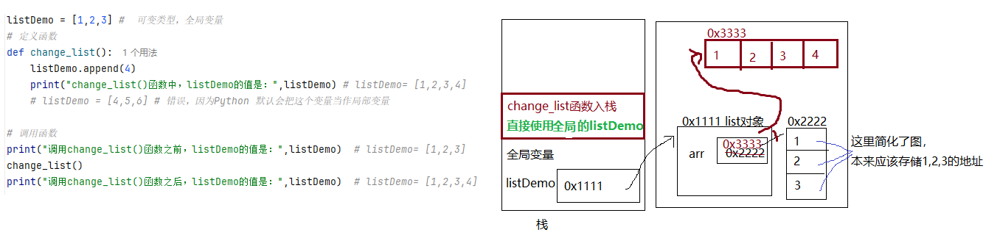

> 非可变类型

```python
# =============未使用global关键字无法修改不可变类型全局变量的值=============
x = "global"
# 定义函数
def change_x_one():
    # x += "local" # 错误，因为没有global关键字，无法修改全局变量
    x = "local" # 没有global关键字，给x赋值，Python 默认会把这个变量当作局部变量
    print("change_x_one()函数中，x的值是：",x) # x= local

# 调用函数
print("调用change_x_one()函数之前，x的值是：",x) # x= global
change_x_one()
print("调用change_x_one()函数之后，x的值是：",x) # x= global
print()
```

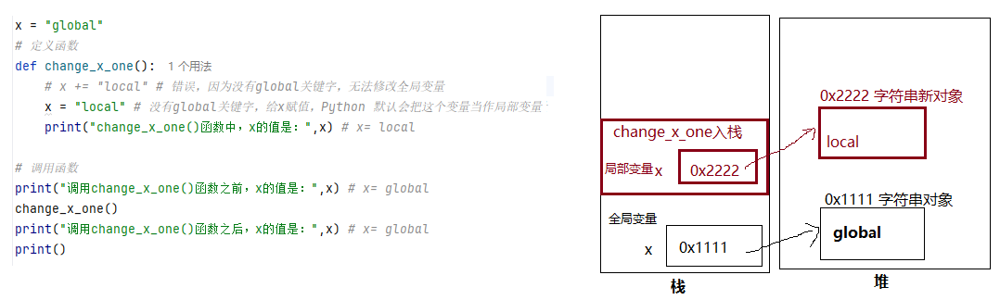

```python
# ===============使用global关键字才可以修改不可变类型全局变量的值=================
# global关键字，可以修改全局变量的值
x = "global"
# 定义函数
def change_x_two():
    global x # 添加global关键字，修改全局变量的值
    x = "local"
    print("change_x_two()函数中，x的值是：",x) # x= local

# 调用函数
print("调用change_x_two()函数之前，x的值是：",x) # x= global
change_x_two()
print("调用change_x_two()函数之后，x的值是：",x) # x= local
print()
```

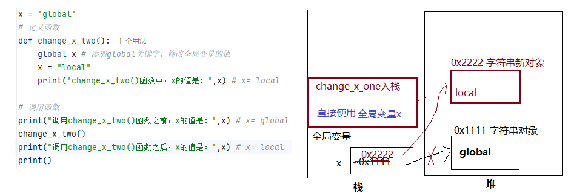

#### 2、nonlocal

nonlocal 也用作内部作用域修改外部作用域的变量的场景，不过此时外部作用域不是全局作用域而是嵌套作用域。

```python
# ========使用nonlocal关键字在内部作用域修改外部作用域不可变类型变量的值==============
def function_outer():
    str_demo = "outer"
    print("function_outer()函数中，str_demo的值是：",str_demo)
    def function_inner():
        nonlocal str_demo
        str_demo = "inner"
    # 调用内部函数
    print("调用内部函数function_inner()后")
    function_inner()
    print("function_outer()函数中，str_demo的值是：",str_demo)

# 调用外部函数
function_outer() 
```


## 12.4 迭代器iterator

迭代器是遍历容器中元素的一种方式，而迭代器是一个可以记住遍历位置的对象。迭代器对象从容器的第一个元素开始访问，直到所有的元素被访问完结束。迭代器只能前进不会后退，即是单向的。字符串，列表或元组对象都可用于创建迭代器。

### 12.4.1 迭代器协议

1. 任何提供了`__iter__()`方法的对象，都是可迭代对象(Iterable)，该方法用于返回一个迭代器对象(Iterator)
2. 任何迭代器对象都必须包含`__next__()`方法，用于遍历容器中的元素。`__next__()`方法将返回容器中的一个元素，同时迭代器移动到下一个元素的位置。当元素用尽时，`__next__()` 将引发 StopIteration 异常。

```python
from collections.abc import Iterator

list_demo = [1, 2, 3] # 可迭代对象

# 使用迭代器对象遍历列表
iterator = list_demo.__iter__()
while True:
    try:
        print(iterator.__next__())
    except StopIteration:
        break
```


### 12.4.2 内置函数`iter()`和`next()`

- 内置函数`iter(容器对象)`：等价于 `容器对象.__iter__()`，用于返回一个迭代器对象。
- 内置函数`next(迭代器对象)`：等价于`迭代器对象.__next__()`，用于遍历容器中的元素。

```python
from collections.abc import Iterator

list_demo = [1, 2, 3] # 可迭代对象
iterator = iter(list_demo) # 等价于 list_demo.__iter__()
# 判断对象是否是迭代器
print(isinstance(iterator, Iterator)) # True
while True:
    try:
        print(next(iterator)) # 等价于iterator.__next__()
    except StopIteration:
        break
```


### 12.4.3 for循环（语法糖）与迭代器

python中的for循环是一种语法糖，遍历时本质上使用的是迭代器，但是语法上比直接使用迭代器更简洁，可读性更好。

1、什么是语法糖

（1）语法糖（Syntactic Sugar）是编程语言中的一种特性，它指的是在不影响语言功能的前提下，为程序员提供更简洁、更易读的语法形式。语法糖本身并不增加语言的功能，而是让代码更容易编写和理解。语法糖的特点：

- 简化代码：让复杂的操作用更简单的语法表达。
- 提高可读性：使代码更接近自然语言或逻辑思维。
- 不改变语义：语法糖只是对底层实现的封装，不会影响程序的实际行为。

（2）python中的语法糖有很多，例如：

- for循环：底层是迭代器
- 推导式：底层是产生列表、集合、字典、生成器的代码
- 装饰器：本质上是函数包装，请看后续小节

2、for循环语法糖

所有可迭代对象都可以使用for循环遍历元素：

- 容器，如 list 、 tuple 、 dict 、 set 、 str 等。
- generator ，包括生成器和带 yield 的generator function。

查看对象是否是可迭代对象，要么查看它是否包含`__iter__()`方法，要么用`isinstance(对象, Iterable)`进行类型判断。

> 判断是否是可迭代对象：

```python
"""
    判断是否是可迭代对象
"""
from collections.abc import Iterable

print(isinstance([], Iterable))  # True
print(isinstance((), Iterable))  # True
print(isinstance(set(), Iterable))  # True
print(isinstance({}, Iterable))  # True
print(isinstance("hello", Iterable))  # True
print(isinstance(open(r"document\myfile.txt"), Iterable))  # True
print(isinstance(100, Iterable))  # False
```

> 用for循环遍历可迭代对象

```python
"""
    用for循环遍历可迭代对象
"""
import os

for element in [1, 2, 3]: # 列表
    print(element)
for element in (1, 2, 3): # 元组
    print(element)
for key in {"one": 1, "two": 2}: # 字典
    print(key)
for char in "hello": # 字符串
    print(char)
for line in open(r"document\myfile.txt"): # 读文件操作
    print(line, end="")
```


### 12.4.4 自定义迭代器类型

了解了迭代器协议背后的机制后，就可以为类添加迭代器行为了。

1、可迭代对象：定义 `__iter__()` 方法用于返回一个迭代器对象

2、迭代器对象：

- 位置属性：用于记录当前元素的位置

- 定义` __next__() `方法：用于返回当前元素，并将迭代器移动到下一个元素的位置

3、一个类也可以同时是可迭代对象和迭代器对象，即同时包含`__iter__()` 方法和` __next__() `方法，此时 `__iter__() `可以简单地返回 self。

#### 案例1：定义序列的反向迭代器

```python
"""
    自定义迭代器类型
"""
class Reverse:
    """对一个序列执行反向循环的迭代器"""
    def __init__(self, data):
        self.data = data
        self.index = len(data)

    def __iter__(self):
        return self

    def __next__(self):
        if self.index == 0:
            raise StopIteration
        self.index = self.index - 1
        return self.data[self.index]

# 创建迭代器对象
rev = Reverse([2, 3, 5, 7, 11, 13, 17, 19])
for char in rev:
    print(char)
```

#### 案例2：定义单向链表的迭代器

```python
# 定义单链表类
class LinkedList:
    # 定义链表节点类
    class ListNode: # 内部类
        def __init__(self, val=0, next_node=None):
            self.val = val  # 节点值
            self.next = next_node  # 指向下一个节点的指针

    def __init__(self):
        self.head = None  # 链表头节点

    # 尾插法添加节点
    def append(self, val):
        new_node = self.ListNode(val)
        if not self.head:  # 链表为空，头节点直接指向新节点
            self.head = new_node
            return
        # 遍历到链表尾部
        current = self.head
        while current.next:
            current = current.next
        current.next = new_node

    # 打印链表所有节点值
    def print_list(self):
        current = self.head
        while current:
            print(current.val, end=" -> ")
            current = current.next
        print("None")

    # 创建迭代器对象
    def __iter__(self):
        return LinkedList.LinkedIterator(self)

    # 自定义迭代器类
    class LinkedIterator: # 内部类
        def __init__(self, linked_list):
            self.linked_list = linked_list
            self.current = linked_list.head

        def __next__(self):
            if not self.current:
                raise StopIteration
            val = self.current.val
            self.current = self.current.next
            return val

# 测试
if __name__ == "__main__":
    linked_list_demo = LinkedList()
    linked_list_demo.append(1)
    linked_list_demo.append(2)
    linked_list_demo.append(3)
    linked_list_demo.print_list()
    print("遍历元素：")
    for item in linked_list_demo:
        print(item)
```

## 12.5 生成器generate

### 12.5.1 什么是生成器

生成器（generator）是一个用于创建迭代器的简单而强大的工具。它的写法类似于标准的函数，但当它要返回数据时会使用` yield 语句`，而不是普通函数的return语句。当在生成器函数中使用 yield 语句时，函数的执行将会暂停，并将 yield 后的表达式作为本次迭代的值返回。结论：只要函数中包含`yield`语句，函数就会返回一个生成器对象。

生成器（Generator）可以看成是Python中一种特殊的迭代器，它自带`__next__()`魔法方法，每次调用`__next__()`方法函数会从上次暂停的地方继续执行（它会记住上次执行语句时的所有数据值），直到再次遇到 yield 语句。这样，生成器函数可以逐步产生值，而不需要一次性计算并返回所有结果，从而避免一次性生成大量数据并占用大量内存。当我们调用内置函数`next(生成器对象)`函数时，也会自动调用生成器对象的`__next__()`方法。

生成器也可以与其他迭代工具（如for循环）无缝配合使用，提供简洁和高效的迭代方式。

当生成器执行完所有yield语句，继续调用`__next__`方法就会自动引发StopIteration异常。

### 12.5.2 创建生成器

#### 1、使用函数创建生成器

```python
"""
    （1）演示使用函数创建生成器
"""
# 定义生成器函数
def simple_generator():
    """基本的生成器函数"""
    yield 1
    yield 2
    yield 3

# 创建生成器对象
s = simple_generator()
# 使用迭代器迭代生成器
while True:
    try:
        print(next(s))
    except StopIteration:
        break

print("使用for循环迭代生成器：")
s = simple_generator()
for i in s:
    print(i)

"""
    （2）演示使用函数创建生成器
    所谓斐波那契数列就是从第3个数开始，等于前2个数之和。
"""
def fibonacci_generator(n):
    """斐波那契数列生成器"""
    a, b = 0, 1
    count = 0
    while count < n:
        yield a
        a, b = b, a + b
        count += 1

print("使用for循环迭代生成器：")
s = fibonacci_generator(10)
for i in s:
    print(i)
```

> 普通函数与生成器函数的区别：

|          | 普通函数       | 生成器函数    |
| -------- | -------------- | ------------- |
| 返回值   | return         | yield         |
| 状态保持 | 无             | 有            |
| 调用行为 | 一次性执行完毕 | 暂停/恢复执行 |
| 内存使用 | 存储所有结果   | 按需生产      |

> 提示：生成器可以看成是特殊的迭代器

```python
# 定义生成器函数
def simple_generator():
    """基本的生成器函数"""
    yield 1
    yield 2
    yield 3

#等价于下面的代码
class simple_generator:
    def __init__(self):
        self.items = [1,2,3] #只不过生成器不需要一次产生所有结果元素，而是每次迭代产生
        self.index = 0
    def __next__(self):
        if self.index>=len(self.items):
            raise StopIteration
        item = self.items[self.index]
        self.index += 1
        return item
    def __iter__(self):
        return self
```

#### 2、推导式语法糖：创建生成器

```python
"""
    演示使用推导式创建生成器
"""
# 使用推导式创建生成器
print("使用推导式创建生成器".center(50,"-"))
s = (x**2 for x in range(10)) # 这是生成器
print("生成器对象s：",type(s),s)
# 遍历生成器
for i in s:
    print(i)

"""
    等价代码
"""
print("推导式等价于如下函数定义".center(50,"-"))
def sequence_generate():
    for x in range(10):
        yield x ** 2
s = sequence_generate()
for i in s:
    print(i)

"""
    生成器与元组
"""
print("生成器与元组".center(50,"-"))
tup = tuple(x**2 for x in range(10)) # 这才是元组
print("元组对象tup：",type(tup),tup)
"""
元组是立即计算并存储所有元素
生成器表达式是惰性求值，按需生成元素
"""
```

### 12.5.3 使用send()函数向生成器发送值

普通的生成器只能单向输出值（通过 `yield`），而 `send()` 实现了**双向通信**—— 你可以在生成器运行的过程中，动态地向它传入外部数据，影响它的执行逻辑。这让生成器不再只是简单的 “值生成器”，而是可以变成一个能响应外部指令的 “协程” 或 “状态机”。

|                 操作                  |                        效果                         |
| :-----------------------------------: | :-------------------------------------------------: |
| `next(生成器)` 或 `生成器.__next__()` |    让生成器执行到下一个 `yield`，只拿值，不传值     |
|          `生成器.send(None)`          |                和 `next()` 完全等价                 |
|           `生成器.send(值)`           | 给生成器传一个值，再让它执行到下一个 `yield` 并拿值 |

实际应用场景：

- **动态控制的进度监控器**：生成器负责执行任务并汇报进度，通过 `send()` 动态调整进度汇报的频率
- **协程调度**：简单的任务协作（比如生产者 - 消费者模型中，消费者向生产者发送 “是否继续生产” 的指令）
- **动态配置调整**：比如爬虫生成器运行时，通过 `send()` 动态修改爬取速度、代理 IP 等；
- **交互式程序**：生成器作为核心逻辑，外部通过 `send()` 传入用户输入，控制程序执行。

#### 1、执行过程分析

```sql
"""
    演示send函数向生成器发送值
"""
# 定义生成器函数
def generator_with_send():
    """支持send()的生成器"""
    print("生成器开始执行：")
    value = yield 1
    print(f"Received: {value}")
    value = yield 2
    print(f"Received: {value}")
    yield 3

# 创建生成器进行测试
g = generator_with_send()
# 使用next()函数启动生成器
# print(next(g)) # 执行到 yield 1，返回元素1，暂停执行，等待接收外部值
# 当调用 send() 来启动生成器时，它必须以 None 作为调用参数，因为这时在第1个 yield 1之前没有可以接收值的 yield 表达式。
print(g.send(None)) # g.send(None) 与 next(g) 等价
print(g.send(20)) # 发送20给生成器，生成器接收到20，赋值给value，并继续执行到yield 2，返回元素2，暂停执行，等待接收外部值
print(g.send(30)) # 继续发送30给生成器，生成器接收到30，赋值给value，并继续执行到yield 3，返回元素3，结束生成器
# print(g.send(40)) # yield 3 后面没有yield，发生StopIteration异常
```

#### 2、案例1：send函数控制步长

```python
# 定义生成器函数
def generator_with_send():
    """支持send()的生成器"""
    step = 1
    num = 1
    while True:
        value = yield num # value接收send函数的值
        if value: # 如果value不为None，则修改step的值
            step = value
        num += step

# 创建生成器
g = generator_with_send()
# 启动生成器并获取5个元素
for i in range(5):
    print(next(g)) # 也可以用g.send(None)
print("修改step的值为2：", g.send(2))
# 再获取5个元素
for i in range(5):
    print(next(g))  # 也可以用g.send(None)
print("修改step的值为-3：", g.send(-3))
# 再获取5个元素
for i in range(5):
    print(next(g))  # 也可以用g.send(None)
```

#### 3、案例2：send函数控制任务内容

```python
# 定义生成器函数
def task_with_send():
    task_id = 0
    int_value = 0
    char_value = "A"
    while True:
        # task_id 为 0 则 int_value +1，task_id 为 1 则 char_value +1
        match task_id:
            case 0:
                send_value = yield int_value  # 返回 int_value，并接收 send() 发送来的值给 task_id
                int_value += 1
            case 1:
                send_value = yield char_value  # 返回 char_value，并接收 send() 发送来的值给 task_id
                char_value = chr(ord(char_value) + 1)
            case _:
                send_value = yield  # 返回 None
        task_id = send_value if send_value in [0, 1] else task_id

# 创建生成器
g = task_with_send()
# 启动生成器
print(g.send(None))
# 由用户输入任务
while True:
    task = input("输入任务(0或1)：")
    if task: # 如果用户输入不为空，则修改任务
        print(g.send(int(task)))
    else: # 如果用户输入为空，则任务保持不变
        # print(g.send(None)) # 也可以换成 next(g)
        print(next(g))
```

## 12.6 装饰器

### 12.6.1 什么是装饰器

装饰器允许在不修改原有函数代码的基础上，动态地增加或修改函数的功能。装饰器本质上是一个接收函数作为输入并返回一个新的包装过后的函数的对象。

语法格式：

```python
def decorator(func):
    def inner(参数):
        # 添加功能
        func(参数)
        # 添加功能

    return inner
```

decorator 是一个装饰器函数，它接受一个函数 func 作为参数，并返回一个内部函数 inner。在 inner 函数内部，我们可以执行一些额外的操作，然后调用原始函数 func，并返回其结果。

### 12.6.2 定义和使用装饰器

当我们定义完一个装饰器函数之后，有2种方式来用它装饰其他函数：

- 直接调用装饰器函数，并将需要装饰的函数作为参数传给装饰器函数，并用变量接收结果。
  - 如果变量与被装饰的函数同名，那么被装饰的函数功能已经发生了改变，它的功能 = 原来的功能 + 装饰器增加的功能
  - 如果变量与被装饰的函数不同名，那么就相当于定义了一个新函数，它的功能 = 被装饰函数的功能 + 装饰器增加的功能，而原来的被装饰函数功能不变
- 使用`@装饰器函数名`标记需要被装饰的函数。此时被装饰函数的功能就 = 原来的功能 + 装饰器增加的功能

```python
"""
    演示装饰器
"""
from math import sqrt

# 定义一个装饰器函数
def get_absolute(f): # 外部函数
    # 定义内部函数
    def inner(x):
        x = abs(x)  # 求x的绝对值
        return f(x) # 内部函数使用了外部函数的参数f，所以会创建闭包

    return inner # 返回内部函数

# （1）方式一：调用get_absolute装饰器函数装饰fun_one函数
# 定义一个函数
def fun_one(x):
    return sqrt(x)
fun_one = get_absolute(fun_one) # fun_one已经被装饰器get_absolute装饰过了
print(fun_one(-9)) # 3.0

# （2）方式二：使用@的语法，使用get_absolute装饰器函数装饰fun_two函数
# 定义一个函数
@get_absolute
def fun_two(x):
    return sqrt(x)
print(fun_two(-9)) # 3.0
```


### 12.6.3 多层装饰器

多个装饰器的装饰过程：离函数最近的装饰器先装饰，然后外面的装饰器再进行装饰。

多个装饰器的执行过程：外面的装饰器先执行，离函数最近的装饰器最后执行。

```python
"""
    演示多层装饰器
"""
from math import sqrt

# 定义一个装饰器函数
def get_absolute(f): # 外部函数
    # 定义内部函数
    def inner(x):
        x = abs(x)  # 求x的绝对值
        return f(x) # 内部函数使用了外部函数的参数f，所以会创建闭包

    return inner # 返回内部函数

# 定义另一个装饰器函数
def get_integer(f):
    def inner(x):
        x = int(x)
        return f(x)

    return inner

@get_integer
@get_absolute
def get_sqrt(x):
    """开根号"""
    return sqrt(x)
# 使用多个装饰器装饰get_sqrt函数

print(get_sqrt("-4"))  # 2.0

```

### 12.6.4 带参数的装饰器

```python
"""
    演示带参数的装饰器
"""
from math import sqrt

# 求根号n次
def times(n):
    # 将参数转换为非负数
    def get_absolute(f):
        def inner(x):
            x = abs(x)
            for i in range(n):
                x = f(x)
            return x

        return inner
    return get_absolute

# 使用times装饰器函数装饰get_sqrt函数
@times(3)
def get_sqrt(x):
    """开根号"""
    return sqrt(x)

#调用get_sqrt函数
print(get_sqrt(-256))
```

### 12.6.5 装饰器类

方式一：

- `__call__`方法，call方法的参数是被装饰函数。在call中定义内部函数，核心逻辑写在内部函数里，然后call返回内部函数。
- `__init__`方法：如果装饰器带参数，就在`__init__`方法的形参列表定义该参数。如果装饰器不带参数，`__init__`可以不写。

```python
"""
    演示类装饰器
"""
from math import sqrt

# 定义一个类，它是一个装饰器类
class AbsoluteDecoratorClass:
    def __init__(self, times=1):
        self.times = times

    def __call__(self, func):
        def wrapper(x):
            x = abs(x)
            for i in range(self.times):
                x = func(x)
            return x
        return wrapper

# 使用AbsoluteDecoratorClass类装饰get_sqrt函数
# @AbsoluteDecoratorClass() #()不能省略
@AbsoluteDecoratorClass(3)
def get_sqrt(x):
    """开根号"""
    return sqrt(x)

# 调用get_sqrt函数
print(get_sqrt(-256))  # 2.0
```

方式二：

（1） `__call__`方法，call方法的参数就是被装饰函数的参数。

（2）`__init__`方法，必须包含一个参数用于接受被装饰函数。

```python
"""
    演示类装饰器
"""
from math import sqrt

# 定义一个类，它是一个装饰器类
class AbsoluteDecoratorClass:
    def __init__(self, func):
        self.func = func

    def __call__(self, x):
        x = abs(x)
        return self.func(x)

# 使用AbsoluteDecoratorClass类装饰get_sqrt函数
@AbsoluteDecoratorClass
def get_sqrt(x):
    """开根号"""
    return sqrt(x)

# 调用get_sqrt函数
print(get_sqrt(-4))  # 2.0

```


## 12.7 泛型（了解）

**Python 有泛型**，但核心作用是**类型提示**（而非运行时类型约束），依赖`typing`模块（3.9 + 可简化）。Python 泛型不改变动态类型的本质，运行时仍可传入任意类型，仅辅助编码阶段的类型检查。

- **类型提示（Type Hints）**：帮助开发者 / 编辑器（如 PyCharm）在编码阶段明确容器 / 函数的预期类型，提升代码可读性和维护性。
- **静态类型检查工具**：如`mypy`可以基于泛型的类型提示做静态检查，提前发现类型错误。

Python 3.5 + 引入`typing`模块（Python 3.9 + 可直接用内置类型），提供泛型相关的工具，核心包括：

- 泛型容器：
  - Python 3.9之前：`List[T]`、`Dict[K, V]`、`Tuple[T1, T2]`、`Set[T]`等
  - Python 3.9之后：`list[T]`、`dict[K, V]`、`tuple[T1, T2]`、`set[T]`等
- 自定义泛型类 / 函数：`Generic[T]`
- 通用类型：`Any`、`Union`、`Optional`、`Literal`等
  - `Any`：表示变量/返回值可以是任意类型
  - `Union[Type1, Type2, ...]`表示变量 / 返回值可以是**指定类型中的任意一种**（Python 3.10 + 支持更简洁的`Type1 | Type2`写法）
  - `Optional[T]`是`Union[T, None]`的**简写形式**，表示变量 / 返回值可以是指定类型，也可以是`None`
  - `Literal[字面量值1,字面值2,...]`，表示变量/返回值类型的值是指定几个字面量值，例如`Literal["red", "blue", "green"]`

### 12.7.1 mypy工具

#### 第一步：安装mypy包

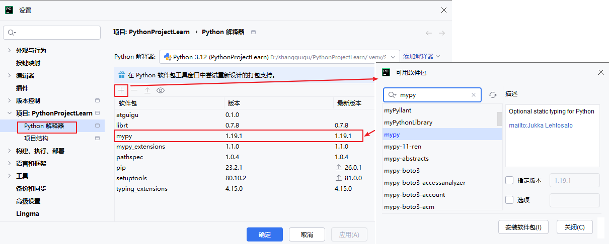

#### 第二步：添加mypy工具

| 字段              | 值                                                           |
| :---------------- | :----------------------------------------------------------- |
| Name              | mypy                                                         |
| Program           | `$PyInterpreterDirectory$/python`                            |
| Arguments         | `-m mypy $FilePath$`或`-m mypy --show-error-codes --strict $FilePath$` |
| Working directory | `$ProjectFileDir$`                                           |

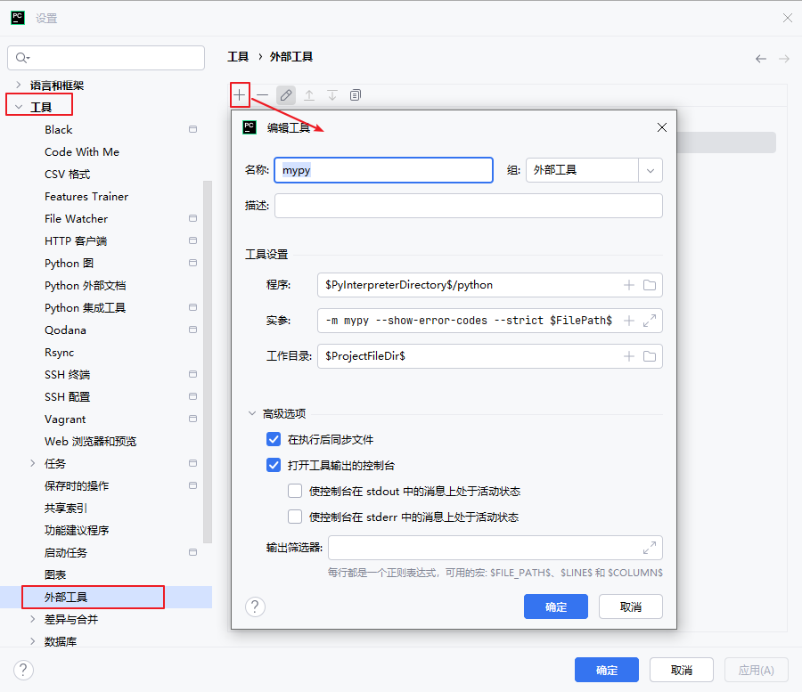

#### 第三步：使用mypy工具

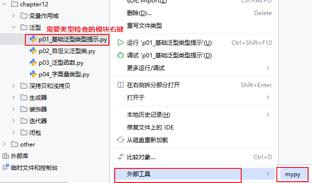

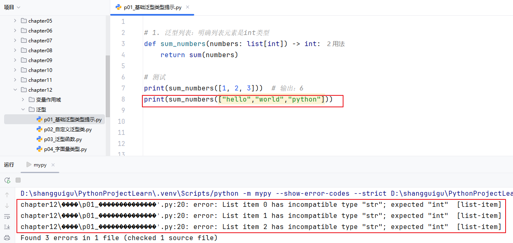

### 12.7.1 案例1：字面量类型

字面量类型用于约定变量或返回值的取值范围。但并不真正约束取值。

```python
from typing import Literal

def set_color(color: Literal["red", "blue", "green"]) -> None:
    print(f"设置颜色为：{color}")

set_color("red")    # 正常
set_color("yellow") # 编辑器/mypy报错：Argument of type "Literal['yellow']" cannot be assigned to parameter of type "Literal['red', 'blue', 'green']"
```

### 12.7.2 案例2：内置容器支持泛型

```python
# 1. 泛型列表：明确列表元素是int类型
def sum_numbers(numbers: list[int]) -> int:
    return sum(numbers)

# 2. 泛型字典：键是str，值是float
def get_scores() -> dict[str, float]:
    return {"math": 95.5, "english": 88.0}

# 3. 泛型元组：固定长度和类型
def get_point() -> tuple[int, int]:
    return (10, 20)

# 测试
print(sum_numbers([1, 2, 3]))  # 输出：6
print(sum_numbers(["hello","world","python"]))
print(sum_numbers([1.0, 2.0, 3.3, 4.5]))
print(get_scores())            # 输出：{'math': 95.5, 'english': 88.0}
print(get_point())             # 输出：(10, 20)
```

### 12.7.3 案例3：自定义类型变量T

```python
from typing import TypeVar, List

# 定义可接受任意类型的类型变量
T = TypeVar('T')

# 泛型函数：返回列表中第一个元素
def first_element(lst: List[T]) -> T:
    if not lst:
        raise ValueError("列表不能为空")
    return lst[0]

# 测试不同类型列表
print(first_element([1, 2, 3]))    # 输出：1（int类型）
print(first_element(["a", "b"]))   # 输出：a（str类型）
print(first_element([3.14, 2.71])) # 输出：3.14（float类型）
```

### 12.7.4 案例4：类型变量约束

```python
from typing import TypeVar, List

class Animal:
    def speak(self) -> str:
        return "..."

class Dog(Animal):
    def speak(self) -> str:
        return "Woof!"

class Cat(Animal):
    def speak(self) -> str:
        return "Meow!"

# 绑定到 Animal 或其子类
A = TypeVar('A', bound=Animal)

def make_sounds(animals: List[A]) -> List[str]:
    return [animal.speak() for animal in animals]

dogs = [Dog(), Dog()]
cats = [Cat(), Cat()]
bears = ["熊大","熊二"]

dog_sounds = make_sounds(dogs)  # ["Woof!", "Woof!"]
cat_sounds = make_sounds(cats)  # ["Meow!", "Meow!"]
bear_sounds = make_sounds(bears)
```


### 12.7.5 案例5：自定义泛型类

```python
from typing import Generic, TypeVar, List

T = TypeVar('T')

class Stack(Generic[T]):
    """泛型栈类"""
    def __init__(self) -> None:
        self.items: List[T] = []

    def push(self, item: T) -> None:
        self.items.append(item)

    def pop(self) -> T:
        return self.items.pop()

    def is_empty(self) -> bool:
        return len(self.items) == 0


# 使用示例
int_stack = Stack[int]()  # 指定类型参数
int_stack.push(42)
value = int_stack.pop()  # value: int

str_stack = Stack[str]()
str_stack.push("hello")
text = str_stack.pop()  # text: str
```
