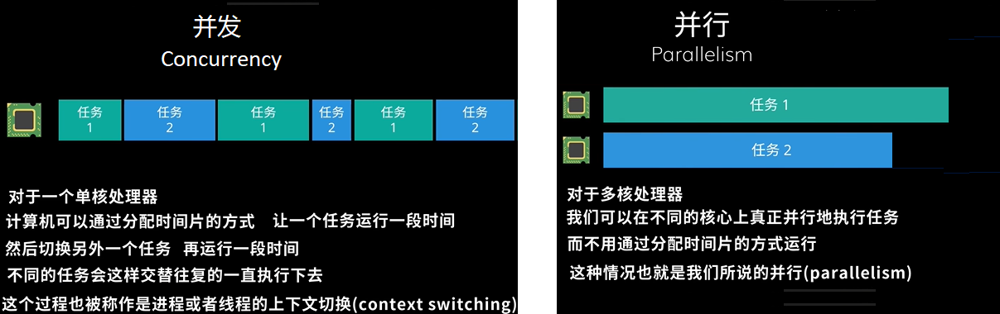
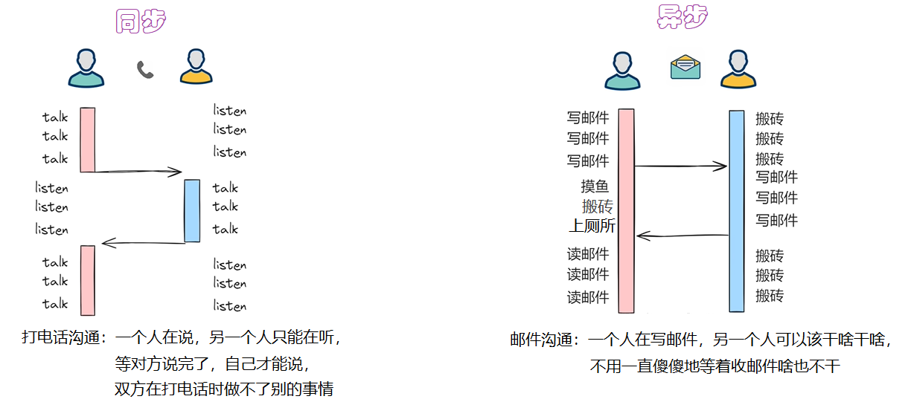
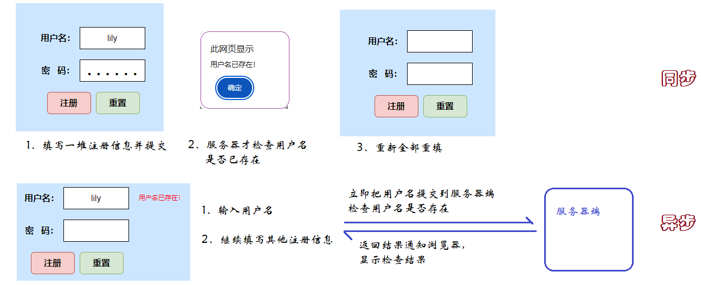
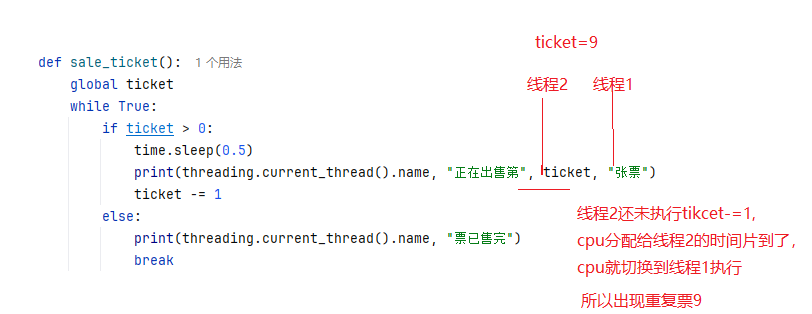
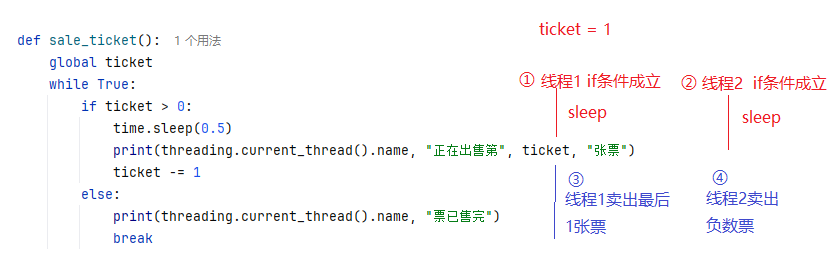
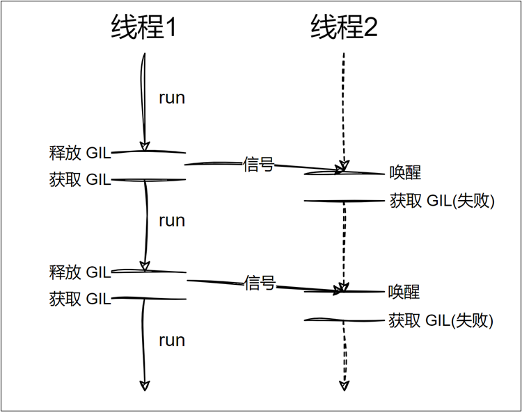

# 第13章 进程和线程

## 13.1 相关的基本概念

### 13.3.1 并行和并发

- 并发：单个 CPU 处理多个任务。各个任务交替执行一段时间。
- 并行：多个 CPU 同时执行多个任务。

> 关于并行和并发，关注的是任务是否`同时`执行



### 13.3.2 同步和异步

- 同步：只能有一个任务执行，当前任务执行的时候，其他任务要等待。即多个任务排队执行。
- 异步：多个任务同时执行，任务之间互相不影响。

> 关于同步和异步关注的是调用者是否需要等待被调用任务完成才能继续执行。

案例1：



案例2：



## 13.2 进程

### 13.2.1 什么是进程

- 操作系统中一个正在运行的程序或软件就是一个进程。
- 进程是操作系统进行资源分配的基本单位。
- 每个进程都有自己独立的一块内存空间。
- 一个进程崩溃后，在保护模式下不会对其他进程产生影响。
- 多进程是指在操作系统中同时运行多个程序。

### 13.2.2 创建进程的4种方式

Unix/Linux操作系统提供了一个 os.fork() 系统调用。Windows 中没有 fork() 调用，不过Python提供了一个跨平台的多进程模块 multiprocessing。

- multiprocessing 模块提供了一个 Process 类来表示进程
- multiprocessing 模块提供了一个Pool类表表示进程池

> 不同创建方式的对比

|        方式        |             优点             |           缺点           |   适用系统    |
| :----------------: | :--------------------------: | :----------------------: | :-----------: |
| 创建Process 类对象 |   简单直观、跨平台、易扩展   |   创建大量进程时开销大   | Windows/Linux |
|  继承 Process 类   |      面向对象、封装性好      |        代码量略多        | Windows/Linux |
|    Pool 进程池     | 复用进程、降低开销、批量处理 |  任务需统一、灵活性稍低  | Windows/Linux |
|     os.fork()      |    轻量级、系统级原生支持    | 不跨平台、封装差、易出错 |  Linux/macOS  |

### 13.2.3 方式一：直接创建multiprocessing.Process 类对象

> 语法格式：
>

```python
multiprocessing.Process(group=None, target=None, name=None, args=(), kwargs={}, *, daemon=None)
```

- group：应当始终为 None，它的存在仅是为了与 threading.Thread 兼容。
- target：接收一个函数对象，该函数最终由进程的run() 方法来调用执行，默认为 None。
- name：进程名称，默认为 None 则自动分配。
- args：需要给target目标函数的参数元组。
- kwargs：需要给target目标函数的关键字参数字典。
- daemon：是否为守护进程，True 或 False。默认为None则继承父进程的daemon值。

> Process类的一些属性和方法：

- name属性：获取进程名称。
- pid属性：获取进程号。
- daemon属性：判断或设置进程是否为守护进程。
- exitcode属性：获取子进程的退出状态码。
- start()：启动进程，调用传入 target 的对象。start() 只能被调用一次。
- run()：默认调用target接收的函数，子类可以重写此方法来自定义行为。
- join([timeout])：阻塞主进程，直到子进程结束或超时。timeout参数可选，意为阻塞多少秒。
- terminate()：强制终止子进程。
- kill()：杀死进程，与 terminate() 类似，但更彻底。
- is_alive()：检查进程是否仍在运行。

> 其他相关方法：

- os.getpid()：获取当前进程编号。
- os.getppid()：获取当前进程的父进程编号。
- multiprocessing.current_process()：获取当前进程对象（Process类型对象）。

> 示例代码：同时读写文件

```python
"""
    演示使用multiprocessing.Process方式创建进程
"""
import time
import multiprocessing

# 向文件中写入数据
def write_file():
    with open("atguigu.txt", "a") as f:
        while True:
            f.write("尚硅谷让天下没有难学的技术\n")
            f.flush()
            time.sleep(0.5)

# 从文件中读取数据
def read_file():
    with open("atguigu.txt", "r") as f:
        while True:
            time.sleep(0.1)
            print(f.read(1), end="")
"""
注意：在Windows上执行要加上if __name__ == "__main__"。
Unix/Linux：使用fork方式，直接复制父进程内存空间，不会重新执行导入主模块的脚本。
Windows系统使用spawn方式创建新进程，会重新导入主模块的脚本。没有 if __name__ == "__main__": 保护，子进程就会重新执行创建进程的代码，导致无限递归创建进程
"""
if __name__ == "__main__":
    # 创建一个子进程用于写文件
    p1 = multiprocessing.Process(target=write_file)
    # 创建一个子进程用于读文件
    p2 = multiprocessing.Process(target=read_file)
    # 启动子进程
    p1.start()
    # 启动子进程
    p2.start()
```

### 13.2.4 方式二：继承multiprocessing.Process类创建进程

**适用场景**：进程逻辑复杂，需要封装更多属性和方法时。

```python
"""
    继承multiprocessing.Process类创建进程
"""
import multiprocessing
import time

# 自定义进程类：用于生成指定内容的文本文件
class FileGenerateProcess(multiprocessing.Process):
    # 初始化方法：接收自定义参数（文件名、文件内容、延迟时间）
    def __init__(self, file_name, content, delay=1):
        # 必须先调用父类Process的初始化方法
        super().__init__()
        # 定义进程的私有属性，方便在run方法中使用
        self.file_name = file_name  # 要生成的文件名
        self.content = content  # 文件要写入的内容
        self.delay = delay  # 模拟任务耗时（秒）

    # 重写run方法：进程启动后自动执行的核心逻辑
    def run(self):
        """进程的核心任务：生成文本文件"""
        try:
            # 模拟任务耗时（比如真实场景中读取/处理数据的时间）
            time.sleep(self.delay)

            # 写入文件（每个进程独立操作，互不干扰）
            with open(self.file_name, 'w', encoding='utf-8') as f:
                f.write(self.content)

            # 打印进程执行结果，方便查看
            print(f"进程[{self.name}]完成：已生成文件 {self.file_name}")
        except Exception as e:
            print(f"进程[{self.name}]失败：生成 {self.file_name} 出错，错误信息：{e}")


if __name__ == "__main__":
    # 主进程：准备要生成的文件任务列表
    file_tasks = [
        (r"document\user_info.txt", "用户信息1\nID: 001\n姓名: 张三"),
        (r"documents\goods_info.txt", "商品信息1\nID: 101\n名称: 笔记本电脑"), # 故意写错，演示进程独立性
        (r"document\order_info.txt", "订单信息1\nID: 201\n金额: 5999元")
    ]

    # 存储进程对象的列表，方便统一管理
    process_list = []

    print("开始批量生成文件（多进程执行）...")
    start_time = time.time()  # 记录开始时间，对比多进程耗时

    # 遍历任务列表，创建并启动自定义进程
    for file_name, content in file_tasks:
        # 创建自定义进程实例（指定文件名、内容，延迟1秒）
        p = FileGenerateProcess(file_name=file_name,content=content)
        # 将进程加入列表
        process_list.append(p)
        # 启动进程（自动执行run方法）
        p.start()

    # 等待所有子进程执行完毕（主进程阻塞）
    for p in process_list:
        p.join()

    # 计算总耗时
    total_time = round(time.time() - start_time, 2)
    print(f"\n所有文件生成完成！总耗时：{total_time} 秒")

```

### 13.2.5 方式三：multiprocessing.Pool()进程池

当需要创建大量进程时，手动创建`Process`效率低，`Pool`会预先创建固定数量的进程，复用进程执行多个任务，减少进程创建 / 销毁的开销。

**适用场景**：任务数量多（如几十 / 上百个）、任务逻辑统一的场景（如批量计算、批量处理文件）。

创建进程池的语法格式：

```python
multiprocessing.Pool(processes=None, initializer=None, initargs=(),maxtasksperchild=None, context=None)
```

注意：使用时一般只指定 processes 参数。

- processes：要使用的工作进程数量。如果 processes 为 None 则使用 os.cpu_count() 所返回的数值。
  - I/O 密集型任务的特点是：大部分时间花费在等待磁盘读取数据上，而不是 CPU 计算。过多的进程反而有可能导致资源竞争（如文件句柄、内存等），拖慢速度。
  -  CPU密集型任务增加进程数量对效率有提升，但超过一定数量（物理CPU可用核数）会拖慢速度，上下文切换（Context Switching）开销增加。

- initializer（代表初始化函数） + initargs（函数需要的参数） 搭配使用，用于指定子进程启动时自动执行的初始化函数，例如：子进程需要共用数据库连接、日志配置、全局参数，避免每个任务重复初始化，提升效率。initializer接收一个函数，initargs接收一个元组，哪怕是一个参数也要用(参数,)的元组来表示。

- maxtasksperchild：一个工作进程在它退出或被一个新的工作进程代替之前能完成的任务数量，为了释放未使用的资源。默认的 maxtasksperchild 是 None，意味着工作进程寿与池齐。如果`maxtasksperchild=5` 表示每个子进程做完 5 个任务就销毁，新建子进程接替。使用它的意义：（1）子进程执行任务时产生的内存垃圾，重启后彻底释放（2）避免子进程长期运行累积错误状态（3）关闭子进程持有的文件 / 连接句柄

- context：可被用于指定启动的工作进程的上下文。创建context对象，multiprocessing.get_context("spawn")，Windows 开发（必须用 `spawn`）

  ，跨平台代码强制指定 `spawn` 保证兼容性，高性能 Linux 任务用 `fork`。spawn表示重新启动全新 Python 解释器，不共享父进程资源。fork表示直接复制父进程所有资源。

> Pool类的属性和方法：

- `map(self, func, args, chunksize=None)`：一键批量提交多个任务（多个任务的任务函数是相同的），`map`会自动将参数列表args中的每个元素传给任务函数func，在返回结果前会阻塞主进程；args有几个元素，就有几个任务，每一个任务都会调用一次func函数。chunksize参数用于控制**任务分块大小**，决定每次给子进程分配多少个任务，None表示自动计算分块大小（`len(args) / 进程数`），`chunksize=n` → 每 n 个任务打包成一块，发给一个子进程一次性执行。如果单个任务比较耗时，chunksize值小一点比较好，如果单个任务比较简单，chunksize大一点可以减少通信次数，从而实现提速。map函数的返回值是所有任务函数执行的返回值结果列表。

  - map函数的func最多只能有1个参数，如果需要多个数据，则参数类型需要是字典、元组、或自定义类型

    ```
    def f(dict_demo):
    	变量1 = dict_demo["key1"]
    	变量2 = dict_demo["key2"]
    ...
    线程池.map(f, [字典1,字典2])
    
    或
    def f(tuple_demo):
    	变量1,变量2 = tuple_demo
    ...
    线程池.map(f, [(元组),(元组)])
    
    或
    def f(data):
    	变量1,变量2 = data.实例属性1,data.实例属性2
    ...
    线程池.map(f, [Data(...),Data(...)]) #Data是自定义类型，包含n个实例属性
    ```

  - starmap函数的func可以有多个参数

    ```
    def f(参数1，参数2):
    ...
    线程池.starmap(f, [(元组),(元组)])
    ```

- `apply(self,func, args=(), kwds={})`：一次提交一个任务，使用 args 参数以及 kwds 命名参数`同步`调用 func任务函数 , 在返回结果前会阻塞主进程。返回的是任务函数执行后的返回值结果。

  - func可以有任意个参数。如果没有参数，args可以不传。如果有1个参数，args=(参数, )。如果有n个参数，args=(参数1,参数2, ...)

- `apply_async(self,func, args=(), kwds={}, callback=None,error_callback=None)`：一次提交一个任务，使用 args 参数以及 kwds 命名参数`异步`（全称 **asynchronous** /eɪˈsɪŋkrənəs/（异步的），日常编程里都简写读 **async** /əˈsɪŋk/ ）调用 func任务函数，并立即返回一个ApplyResult 对象，不会阻塞。

  - 如果callback指定了回调函数，任务接收后就会自动调用callback对应的函数，且任务结果会自动作为callback函数的参数。同时error_callback可以指定处理任务异常的函数，error_callback对应函数的参数是异常对象。
  - 如果callback没有指定回调函数，那么可以通过 ApplyResult 对象的get()获取结果。

- `close()`：阻止后续任务提交到进程池，当所有任务执行完成后，工作进程会退出。

- `terminate()`：不必等待未完成的任务，立即停止工作进程。当进程池对象被垃圾回收时，会立即调用 terminate()。

- `join()`：阻塞主进程，等待工作进程结束。调用 join() 前必须先调用 close() 或者 terminate()。

注意：从3.8版本后，进程池的进程默认是守护进程，所以需 join() 确保主进程等待。

|       特性       |              `pool.map()`              |              `pool.apply()`              |               `pool.apply_async()`                |
| :--------------: | :------------------------------------: | :--------------------------------------: | :-----------------------------------------------: |
| **任务提交方式** | 批量提交（传入所有任务函数的参数列表） |      单个提交（传入单个函数的参数）      |          单个提交（传入单个函数的参数）           |
|   **执行方式**   |       并行执行（多进程同时处理）       | 同步执行（串行，等当前任务完成才下一个） |    异步执行（并行，提交后立即返回，后台执行）     |
|    **阻塞性**    |   阻塞主进程（等所有任务完成才返回）   |  阻塞主进程（等当前单个任务完成才返回）  | 不阻塞主进程（返回任务对象，需`get()`阻塞取结果） |
|    **返回值**    |         结果列表（按参数顺序）         |             单个任务的返回值             |       `AsyncResult`对象（需`get()`取结果）        |
|   **参数格式**   |           `map(函数, 列表)`            |        `apply(函数, args=[参数])`        |         `apply_async(函数, args=[参数])`          |
|  **代码简洁度**  |          最高（一键批量处理）          |              中等（需循环）              |           中等（需循环 + 收集任务对象）           |
|    **灵活性**    |        低（仅支持简单批量任务）        |           低（串行无并行优势）           |        高（支持回调函数、超时、动态参数）         |
|   **适用场景**   |    简单批量、参数列表固定的并行任务    |      几乎不用（串行失去进程池意义）      |      复杂场景（需回调、动态提交、并行控制）       |

#### 1、示例1：map方法一键提交任务

```python
import multiprocessing
import time
import os

def file_word_count(filename): #任务函数
    try:
        with open(filename,"r",encoding="UTF-8") as fr:
            data = fr.read() #读完是一整个字符串返回
            words_list = data.split() #按照空白符
            print(f"处理{filename}成功")
            return filename,len(words_list)
    except:
        print(f"处理{filename}失败")
        return filename,0

if __name__ == "__main__":
    # 第一步：准备测试文件
    test_files = ["document/python1.txt", "document/python2.txt",
                  "document/python3.txt","document/python4.txt",
                  "document/python5.txt"]

    #启动多个进程，来统计上述5个文件的单词的数量
    #第二步：创建进程池
    with multiprocessing.Pool(2) as pool:
        #第三步：把任务提交给进程池
        #map方式中任务的数量由args参数接收的列表或元组的元素个数决定
        result = pool.map(file_word_count, test_files)
        for r in result:
            print(r)
```

```python
# def file_word_count(dict_demo):
#     filename = dict_demo["filename"]
#     num =  dict_demo["num"]
#     print(f"第{num}个文件{filename}")
#     try:
#         with open(filename,"r",encoding="UTF-8") as fr:
#             data = fr.read() #读完是一整个字符串返回
#             words_list = data.split() #按照空白符
#             print(f"处理{filename}成功")
#             return filename,len(words_list)
#     except:
#         print(f"处理{filename}失败")
#         return filename,0
#
# if __name__ == "__main__":
#     # 第一步：准备测试文件
#     test_files = [{"filename":"document/python1.txt","num":1}, {"filename":"document/python2.txt","num":2}]
#
#     #启动多个进程，来统计上述5个文件的单词的数量
#     #第二步：创建进程池
#     with multiprocessing.Pool(2) as pool:
#         #第三步：把任务提交给进程池
#         #map方式中任务的数量由args参数接收的列表或元组的元素个数决定
#         result = pool.map(file_word_count, test_files)
#         for r in result:
#             print(r)

# def file_word_count(tuple_demo):
#     filename,num = tuple_demo
#     print(f"第{num}个文件{filename}")
#     try:
#         with open(filename,"r",encoding="UTF-8") as fr:
#             data = fr.read() #读完是一整个字符串返回
#             words_list = data.split() #按照空白符
#             print(f"处理{filename}成功")
#             return filename,len(words_list)
#     except:
#         print(f"处理{filename}失败")
#         return filename,0
#
# if __name__ == "__main__":
#     # 第一步：准备测试文件
#     test_files = [("document/python1.txt",1), ("document/python2.txt",2)]
#
#     #启动多个进程，来统计上述5个文件的单词的数量
#     #第二步：创建进程池
#     with multiprocessing.Pool(2) as pool:
#         #第三步：把任务提交给进程池
#         #map方式中任务的数量由args参数接收的列表或元组的元素个数决定
#         result = pool.map(file_word_count, test_files)
#         for r in result:
#             print(r)

class Data:
    def __init__(self,filename,num):
        self.filename = filename
        self.num = num

def file_word_count(data):
    filename = data.filename
    num = data.num
    print(f"第{num}个文件{filename}")
    try:
        with open(filename,"r",encoding="UTF-8") as fr:
            data = fr.read() #读完是一整个字符串返回
            words_list = data.split() #按照空白符
            print(f"处理{filename}成功")
            return filename,len(words_list)
    except:
        print(f"处理{filename}失败")
        return filename,0

if __name__ == "__main__":
    # 第一步：准备测试文件
    test_files = [Data("document/python1.txt",1),Data("document/python2.txt",2)]

    #启动多个进程，来统计上述5个文件的单词的数量
    #第二步：创建进程池
    with multiprocessing.Pool(2) as pool:
        #第三步：把任务提交给进程池
        #map方式中任务的数量由args参数接收的列表或元组的元素个数决定
        result = pool.map(file_word_count, test_files)
        for r in result:
            print(r)

```


#### 2、示例2：apply逐个提交任务

```python
import multiprocessing
import time
import os

# 定义进程池要执行的核心任务函数
def file_word_count(filename,num):
    print(f"处理第{num}个文件，文件名{filename}")
    try:
        with open(filename,"r",encoding="UTF-8") as fr:
            data = fr.read() #读完是一整个字符串返回
            words_list = data.split() #按照空白符
            print(f"处理{filename}成功")
            return filename,len(words_list)
    except:
        print(f"处理{filename}失败")
        return filename,0

if __name__ == "__main__":
    # 第一步：准备测试文件
    test_files = ["document/python1.txt", "document/python2.txt",
                  "document/python3.txt", "document/python4.txt",
                  "document/python5.txt"]


    #启动多个进程，来统计上述5个文件的单词的数量
    #第二步：创建进程池
    with multiprocessing.Pool(2) as pool:
        #第三步：把任务提交给进程池
        #使用apply提交
        for i,file in enumerate(test_files):
            result = pool.apply(file_word_count,(file,i)) #给file_word_count传参用元组的方式
            print(result)
```

#### 3、示例3：apply_async逐个提交任务

```python
import multiprocessing
import time
import os

# 定义进程池要执行的核心任务函数
def file_word_count(filename,num):
    print(f"处理第{num}个文件，文件名{filename}")
    try:
        with open(filename,"r",encoding="UTF-8") as fr:
            data = fr.read() #读完是一整个字符串返回
            words_list = data.split() #按照空白符
            print(f"处理{filename}成功")
            return filename,len(words_list)
    except:
        print(f"处理{filename}失败")
        return filename,0

if __name__ == "__main__":
    # 第一步：准备测试文件
    test_files = ["document/python1.txt", "document/python2.txt",
                  "document/python3.txt", "document/python4.txt",
                  "document/python5.txt"]

    results = []

    #启动多个进程，来统计上述5个文件的单词的数量
    #第二步：创建进程池
    with multiprocessing.Pool(2) as pool:
        #第三步：把任务提交给进程池
        #使用apply提交
        for i,file in enumerate(test_files):
            applyResult = pool.apply_async(file_word_count,(file,i)) #给file_word_count传参用元组的方式
            results.append(applyResult)

        #第四步：遍历结果
        for r in results:
            print(r.get()) #get()是从ApplyResult中获取任务函数的结果
                          #如果没有get()，主进程就不会等这些子进程，直接往下走。有get()就会阻塞主进程往下走。

```

#### 4、示例4：apply_async结合回调函数

```python
import multiprocessing
import time
import os

# 定义进程池要执行的核心任务函数
def file_word_count(filename,num):
    print(f"处理第{num}个文件，文件名{filename}")
    try:
        with open(filename,"r",encoding="UTF-8") as fr:
            data = fr.read() #读完是一整个字符串返回
            words_list = data.split() #按照空白符
            print(f"处理{filename}成功")
            return filename,len(words_list)
    except:
        raise Exception(f"处理{filename}失败")

#定义进程任务完成后的回调函数
def handle_result(result): #参数用于接收任务函数的结果
    filename,count = result
    print(f"文件名是{filename}，单词的个数：{count}")

#定义进程发生异常后处理异常的回调函数
def handle_error(e): #参数用于接收异常对象
    print(e)

if __name__ == "__main__":
    # 第一步：准备测试文件
    test_files = ["document/python1.txt", "document/python2.txt",
                  "document/python3.txt", "document/python41.txt",
                  "document/python5.txt"]

    #启动多个进程，来统计上述5个文件的单词的数量
    #第二步：创建进程池
    pool =  multiprocessing.Pool(2) #这里不要用with
    #第三步：把任务提交给进程池
    #使用apply提交
    for i,file in enumerate(test_files):
        pool.apply_async(file_word_count,(file,i),callback=handle_result,error_callback=handle_error)
        # results.append(applyResult)

    #这里需要手动关闭和join，以阻塞主进程，让回调函数有机会执行
    pool.close()
    pool.join()
```


### 13.2.6 进程间通信

#### 1、进程之间不共享数据

```python
"""
    主进程、不同子进程之间都不共享全局变量
"""
import multiprocessing
import os

# 向list中添加10个元素
def func(num_list):
    for i in range(10):
        num_list.append(i)
        print(f"pid = {os.getpid()}, num_list_id={id(num_list)}, num_list = {num_list}")

if __name__ == "__main__":
    num_list = []
    p1 = multiprocessing.Process(target=func, args=(num_list,))
    p2 = multiprocessing.Process(target=func, args=(num_list,))
    
    p1.start()
    p2.start()

    p1.join()
    p2.join()
    print(f"主进程pid = {os.getpid()}, num_list_id={id(num_list)}, num_list = {num_list}")
```

#### 2、使用 multiprocessing.Queue()通信

进程拥有独立的内存空间，默认无法共享数据，Queue 和 Pipe 是`multiprocessing`模块提供的两种**进程间通信（IPC）** 机制，本质是操作系统层面提供的 “数据传输通道”，让不同进程能通过这个通道交换数据。

Queue 就像一个**进程安全的 “快递柜”**：

- 一个进程（生产者）往 “快递柜” 里放数据，另一个进程（消费者）从 “快递柜” 里取数据；
- 自带锁机制，支持多进程同时读写，不会出现数据错乱（线程 / 进程安全）；
- 遵循**FIFO（先进先出）** 原则，先放进去的数据先取出来。
- 默认队列是无限大小的，可以通过 maxsize 参数限制。

> Queue的方法：

- qsize()：返回队列的大致长度。由于多线程或者多进程的上下文，这个数字是不可靠的。
- empty()：如果队列是空的返回 True。由于多线程或多进程的环境，该状态是不可靠的。
- full()：如果队列是满的返回 True。由于多线程或多进程的环境，该状态是不可靠的。
- put(obj[, block[, timeout]])：将 obj 放入队列。
  - 如果可选参数 block 是 True（默认值）而且 timeout 是 None（默认值），将会阻塞当前进程，直到有空的缓冲槽。如果 timeout 是正数，将会在阻塞了最多 timeout 秒之后还是没有可用的缓冲槽时抛出 queue.Full 异常。
  - 反之（block 是 False 时），仅当有可用缓冲槽时才放入对象，否则抛出 queue.Full 异常（在这种情形下 timeout 参数会被忽略）。
- put_nowait(obj)：相当于 put(obj, False)。
- get([block[, timeout]])：从队列中`取出`并返回对象。（注意：put一次只能get一次）
  - 如果可选参数 block 是 True （默认值）而且 timeout 是 None（默认值），将会阻塞当前进程，直到队列中出现可用的对象。如果 timeout 是正数，将会在阻塞了最多 timeout 秒之后还是没有可用的对象时抛出 queue.Empty 异常。
  - 反之（block 是 False 时），仅当有可用对象能够取出时返回，否则抛出 queue.Empty 异常（在这种情形下 timeout 参数会被忽略）。
- get_nowait()：相当于 get(False)。

Windows vs Unix 系统差异：在 Windows 系统上，进程创建使用 spawn 方式，而 Unix 系统默认使用 fork，这可能导致行为不一致

序列化限制：队列依赖 pickle 模块进行对象序列化，在不同 Python 版本间可能存在兼容性差异，只有可序列化的对象才能通过队列传递，如文件对象、线程锁等无法使用

> 示例代码

```python
"""
    使用queue实现进程间通信
"""
# 间隔随机时间向queue中放入随机数
def put_in_queue_func(queue):
    current_process = multiprocessing.current_process()
    while True:
        data = random.randint(1, 50)
        queue.put(data)
        print(f"{current_process.name}已放入数据：{data}")
        time.sleep(random.random())


# 间隔随机时间从queue中取出数据
def get_from_queue_func(queue):
    current_process = multiprocessing.current_process()
    while True:
        data = queue.get()
        print(f"\t{current_process.name}拿到数据：", data)
        time.sleep(random.random())


if __name__ == "__main__":
    queue = multiprocessing.Queue()
    p1 = multiprocessing.Process(name="p1", target=put_in_queue_func, args=(queue,))
    p2 = multiprocessing.Process(name="p2", target=get_from_queue_func, args=(queue,))
    p1.start()
    p2.start()
    p1.join()
    p2.join()
```

#### 3、进程池的进程使用multiprocessing.Manager().Queue()通信

`Manager().Queue` 是**进程池（Pool）场景下的专用队列**，解决了普通 Queue 不支持进程池的问题。Manager 不仅能创建 Queue，还能创建其他共享数据结构，用法类似：manager.list()、manager.dict()、manager.Lock()等。

> 示例1

```python
"""
    进程池中的进程之间使用multiprocessing.Manager().Queue()通信
"""
import time
import random
import multiprocessing

# 间隔随机时间向queue中放入随机数
def put_in_queue_func(queue):
    while True:
        queue.put(random.randint(1, 50))
        time.sleep(random.random())

# 从queue中取出数据
def get_from_queue_func(queue):
    while True:
        print("=" * queue.get())

if __name__ == "__main__":
    queue = multiprocessing.Manager().Queue()
    pool = multiprocessing.Pool(2)
    pool.apply_async(put_in_queue_func, (queue,))
    pool.apply_async(get_from_queue_func, (queue,))
    pool.close()
    pool.join()
```

> 示例2

```python
import os
import time
import random
import multiprocessing

# 定义进程池要执行的核心任务函数
def count_file_chars(file_path,queue):
    """
    计算单个文件的字符数（含空格、换行符）
    :param file_path: 文件路径
    """
    try:
        print(f"正在处理文件：{file_path}")
        # 读取文件并计算字符数
        with open(file_path, 'r', encoding='utf-8') as f:
            content = f.read()
            char_count = len(content)

        print(f"文件处理完成：{file_path}")
        queue.put(f"{os.path.basename(file_path)}的字符数量为：{char_count}")
    except Exception as e:
        # 异常处理：文件不存在/编码错误等情况
        queue.put(f"{os.path.basename(file_path)}的错误：{str(e)}")


if __name__ == "__main__":
    # 第一步：准备测试文件
    test_files = [r"document\python1.txt", r"document\python2.txt", r"document\python3.txt", r"document\python4.txt", r"document\python5.txt"]

    # 第二步：使用进程池批量计算字符数
    # 1.创建进程池
    pool = multiprocessing.Pool(processes=2)
    # 2.创建管理器 + Manager队列。注意：不是普通Queue
    queue = multiprocessing.Manager().Queue()
    # 3.遍历文件列表，逐个提交异步任务
    for file_path in test_files:
        pool.apply_async(count_file_chars, (file_path,queue))
    # 4. 关闭进程池，等待所有任务完成
    pool.close()
    pool.join()

    # 第三步：获取结果
    while not queue.empty():
        print(queue.get())
```

#### 4、使用multiprocessing.Pipe()双向通信

Pipe 就像一根**双向的 “水管”**：

- 创建 Pipe 时会返回两个 “端口”（`conn1`和`conn2`），数据可以从一端进、另一端出；
- 支持**双向通信**（默认）：conn1 可以写也可以读，conn2 同理；
  - conn.send(数据)：写数据
  - conn.recv()：读数据
- 无内置锁机制，多进程同时读写可能出现数据错乱（需手动加锁）；
- 比 Queue 更轻量，效率更高，但安全性稍低。

```python
import time
import random
import multiprocessing

# 定义往管道中放入数字的任务函数，获取其他进程放入的字母
def put_num_in_pipe(conn):
    current_process = multiprocessing.current_process()

    with open("document/p1.txt", "w", encoding="utf-8") as f:
        while True:
            data = random.randint(1, 50)
            conn.send(data)
            print(f"{current_process.name}已放入数字：{data}")
            letter = conn.recv()
            # print(f"{current_process.name}已接收字母：{letter}")
            f.write(f"{letter}\n")
            time.sleep(random.random())

# 定义往管道中放入字母的任务函数，获取其他进程放入的数字
def put_letter_in_pipe(conn):
    current_process = multiprocessing.current_process()
    with open("document/p2.txt", "w", encoding="utf-8") as f:
        while True:
            letter = chr(random.randint(65, 90))
            conn.send(letter)
            print(f"\t{current_process.name}已放入字母：{letter}")
            data = conn.recv()
            # print(f"\t{current_process.name}已收到数字：", data)
            f.write(f"{data}\n")
            time.sleep(random.random())

if __name__ == "__main__":
    # 创建管道：duplex=True（默认）表示双向管道，False表示单向
    conn1, conn2 = multiprocessing.Pipe(duplex=True)

    p1 = multiprocessing.Process(name="p1",target=put_num_in_pipe, args=(conn1,))
    p2 = multiprocessing.Process(name="p2",target=put_letter_in_pipe, args=(conn2,))
    p1.start()
    p2.start()
    p1.join()
    p2.join()
```


## 13.3 线程

### 13.3.1 什么是线程

- 线程是处理器任务调度和执行的基本单位。

- 一个进程至少有一个线程，也可以运行多个线程。

- 多个线程之间可共享数据。

- 线程运行出错异常后，如果没有捕获，会导致整个进程崩溃。

- 多线程是指在同一进程中同时执行多个任务。


### 13.3.2 创建线程的3种方式

- threading.Thread()直接创建线程对象
- 继承threading.Thread类
- concurrent.futures.ThreadPoolExecutor()线程池方式

|                   创建方式                    |                灵活性                 |              资源开销               |                          适用场景                           |                          核心优缺点                          |
| :-------------------------------------------: | :-----------------------------------: | :---------------------------------: | :---------------------------------------------------------: | :----------------------------------------------------------: |
|      方式 1：直接使用 `threading.Thread`      |        中（仅能指定单个函数）         |        中（每次创建新线程）         |        简单的单任务场景、一次性少量线程（如 2-5 个）        | 优点：代码极简、入门友好；缺点：不适合批量创建，参数多时代码可读性差 |
| 方式 2：继承 `threading.Thread` 并重写`run()` | 高（可封装属性 / 方法、重写生命周期） |        中（每次创建新线程）         | 线程需要封装状态 / 方法、逻辑复杂的场景（如自定义线程行为） |     优点：封装性好、可扩展；缺点：代码量稍多，新手易出错     |
|      方式 3：`ThreadPoolExecutor` 线程池      |   中高（支持批量提交、获取返回值）    | 低（线程复用，避免频繁创建 / 销毁） | 批量任务、高频创建 / 销毁线程的场景（如爬虫、接口并发请求） | 优点：资源利用率高、支持获取返回值、无需手动管理线程生命周期；缺点：依赖`concurrent.futures`模块，简单场景略繁琐 |

### 13.3.3 方式一：直接创建threading.Thread()类对象

> 语法格式：
>

```python
threading.Thread(group=None, target=None, name=None, args=(), kwargs={}, *, daemon=None)
```

- group：应为 None，保留给将来实现 ThreadGroup 类的扩展使用。
- target：用于 run() 方法调用的可调用对象。默认是 None，表示不需要调用任何方法。
- name：线程名称。 在默认情况下，会以 “Thread-N” 的形式构造唯一名称，其中 N 为一个较小的十进制数值，或是 "Thread-N (target)" 的形式，其中 “target” 为 target.__name__，如果指定了 target 参数的话。
- args：用于发起调用目标函数的参数列表或元组。 默认为 ()。
- kwargs：用于调用目标函数的关键字参数字典。默认是 \{\}。
- daemon：True 或 False 来设置该线程是否为守护模式。如果是 None （默认值），线程将继承当前线程的守护模式属性。

> Thread 的属性和方法与其他常用方法

- name：线程的名称。
- daemon：线程是否为守护线程。
- ident：线程标识符。
- native_id：此线程的线程id（tid），由 OS（内核）分配。
- start()：启动线程，调用线程的 run() 方法。
- run()：定义线程的行为，默认调用传入的 target 对象。
- join([timeout=None])：阻塞主线程，直到当前线程运行完成或达到超时时间。
- is_alive()：线程是否在运行。

> 其他相关的方法

- threading.enumerate()：查看都有哪些线程。
- threading.current_thread()：返回当前线程实例。

```python
"""
    使用threading.Thread创建线程
"""
import time
import threading

def odd_print():
    """
     每隔一秒打印奇数
    """
    odd = 1
    while True:
        print(threading.current_thread().name, "奇数：", odd)
        odd += 2
        time.sleep(1)

def even_print():
    """
         每隔一秒打印偶数
        """
    even = 0
    while True:
        print(threading.current_thread().name, "偶数：", even)
        even += 2
        time.sleep(1)


if __name__ == "__main__":
    t1 = threading.Thread(target=odd_print, name="线程1")
    t2 = threading.Thread(target=even_print, name="线程2")
    t1.start()
    t2.start()

```

### 13.3.4 方式二：继承threading.Thread类创建线程

> 示例

```python
"""
    继承Thread类创建线程
"""
import threading
import time

class OddThread(threading.Thread):
    def __init__(self, name):
        super().__init__()
        self.name = name

    def run(self):
        odd = 1
        while True:
            print(threading.current_thread().name, "奇数：", odd)
            odd += 2
            time.sleep(1)

class EvenThread(threading.Thread):
    def __init__(self, name):
        super().__init__()
        self.name = name

    def run(self):
        even = 0
        while True:
            print(threading.current_thread().name, "偶数：", even)
            even += 2
            time.sleep(1)

if __name__ == "__main__":
    t1 = OddThread("线程1")
    t2 = EvenThread("线程2")
    t1.start()
    t2.start()

```

### 13.3.5 方式三：concurrent.futures.ThreadPoolExecutor 线程池

ThreadPoolExecutor 是 concurrent.futures 模块中的线程池实现，它允许我们轻松地提交任务到线程池，并管理任务的执行和结果。

语法格式：

```python
concurrent.futures.ThreadPoolExecutor(max_workers=None, thread_name_prefix="", initializer=None, initargs=())
```

- max_workers：线程池的最大线程数（默认取决于系统资源）。
- thread_name_prefix：线程名称前缀。
- initializer：可选的初始化函数。
- initargs：传递给初始化函数的参数。

> 线程池的常用方法

- submit(func, *args, **kwargs)：提交一个任务到线程池，返回一个 Future 对象。可使用 Future.result() 获取任务结果。
  - func：线程任务函数
  - *args, **kwargs：给func函数的参数

- map(func, *iterables, timeout=None, chunksize=1)：一键提交任务，多个任务在线程池中并行执行。
  - func：线程任务函数
  - Iterables：传递给目标函数的参数序列，多个序列会按位置一一对应传参。例如：func函数需要2个参数，参数序列[1,2,3],[10,20,30]，第一个任务的参数是1,10；第二个任务的参数是2,20；第三个任务的参数是3,30。多个序列长度需要一致，否则按短的截断。
  - timeout（可选）：设置超时时间，超过时间未返回会抛出 `TimeoutError`；
  - chunksize ：（可选）：指定每次分给线程的参数块大小（提升效率）

- shutdown(wait=True, cancel_futures=False)：关闭线程池，等待所有任务完成。
  - wait 表示是否等待线程池中的所有线程完成任务。
  - cancel_futures 表示是否取消尚未开始的任务。


#### 1、示例1：submit方法逐个提交任务

```py
"""
    使用线程池完成多线程
"""
import concurrent.futures
import time

# 定义线程任务函数：处理奇数
def odd_add(tname):
    odd = 1
    sum = 0
    while odd<=100:
        print(tname, "奇数：", odd)
        sum += odd
        odd += 2
        time.sleep(0.1)
    return sum

# 定义线程任务函数：处理偶数
def even_add(tname):
    even = 0
    sum = 0
    while even<=100:
        print(tname, "偶数：", even)
        sum += even
        even += 2
        time.sleep(0.1)
    return sum

# 线程任务函数：处理字母
def char_append(tname):
    str = ""
    letter = 'a'
    while letter<='z':
        print(tname, "字母：", letter)
        str +=  letter
        letter = chr(ord(letter) + 1)
        time.sleep(0.1)
    return  str

if __name__ == "__main__":
    # 使用 with 语句来确保线程被迅速清理
    with concurrent.futures.ThreadPoolExecutor(max_workers=3) as executor:
        future1 = executor.submit(odd_add, "线程1")
        future2 = executor.submit(even_add, "线程2")
        future3 = executor.submit(char_append, "线程3")
        result1 = future1.result()
        result2 = future2.result()
        result3 = future3.result()
        print("线程1的结果：", result1)
        print("线程2的结果：", result2)
        print("线程3的结果：", result3)

```

#### 2、示例2：map方法一键提交任务

```python
from concurrent.futures import ThreadPoolExecutor
import time

# 定义任务函数
def task(x, y):
    time.sleep(1)
    return f"x={x}, y={y}，结果：{x + y}"


if __name__ == "__main__":
    with ThreadPoolExecutor(max_workers=2) as executor:
        # 两个参数序列，长度需一致（否则截断到短的长度）
        params1 = [10, 20, 30]
        params2 = [1, 2, 3]

        # 传入多个参数序列
        results = executor.map(task, params1, params2)

        for res in results:
            print(res)
```


### 13.3.6 互斥锁

#### 1、线程安全问题

```python
"""
    线程不安全
"""
import threading
import time

# 售票函数
def sale_ticket():
    global ticket
    while True:
        if ticket > 0:
            time.sleep(0.5)
            print(threading.current_thread().name, "正在出售第", ticket, "张票")
            ticket -= 1
        else:
            print(threading.current_thread().name, "票已售完")
            break

if __name__ == "__main__":
    ticket = 10
    threads = [threading.Thread(target=sale_ticket, name=f"线程{i}") for i in range(3)]
    [t.start() for t in threads]
    [t.join() for t in threads]

```

运行结果：

```
线程0 正在出售第 10 张票
线程2 正在出售第 9  张票
线程1 正在出售第 9 张票
线程0 正在出售第 7 张票
线程1 正在出售第 6 张票
线程2 正在出售第 6 张票
线程0 正在出售第 4 张票
线程1 正在出售第 3 张票
线程2 正在出售第 2 张票
线程0 正在出售第 1 张票
线程0 票已售完
线程1 正在出售第 0 张票
线程1 票已售完
线程2 正在出售第 -1 张票
线程2 票已售完
```

发现上述结果中有重复票，有负数票。

> 分析原因：因为多个线程之间共享数据会存在线程安全的问题。CPU切换会发生在任意2个指令之间。






#### 2、互斥锁


某个线程要使用共享数据（包含修改操作），先将其锁定，此时其他线程不能使用。直到该线程释放资源，将资源的状态变成“非锁定”，其他的线程才能再次锁定该资源。互斥锁保证了每次只有一个线程进行写入操作，从而保证了多线程情况下数据的正确性。

- 可以通过 threading.Lock() 创建互斥锁。
- 使用 lock.acquire([blocking=True][, timeout=-1]) 来获取锁（blocking 如果为 True，线程会阻塞直到获取到锁。如果为 False，线程立即返回。获取锁成功返回 True，否则返回 False。timeout 为等待的超时时间，单位为秒。如果超时仍未获取到锁，则返回 False。）。
- 使用 lock.release() 释放锁。

```python
"""
    互斥锁保证线程安全
"""
import threading
import time

# 售票函数
def sale_ticket():
    global ticket
    thread_name = threading.current_thread().name
    current_ticket = 0 # 当前线程正在出售的票。保证正确初始化
    while True:
        lock.acquire()
        try:
            if ticket > 0:
                time.sleep(0.5)
                current_ticket = ticket
                ticket -= 1
            else:
                break
        finally:
            lock.release()
        print(f"{thread_name}卖出第{current_ticket}张票")


if __name__ == "__main__":
    ticket = 10
    lock = threading.Lock()
    threads = [threading.Thread(target=sale_ticket, name=f"线程{i}") for i in range(3)]
    [t.start() for t in threads]
    [t.join() for t in threads]

```

### 13.3.7 GIL

Python 全局解释器锁（Global Interpreter Lock, 简称 GIL）是一个锁，同一时间只允许一个线程保持 Python 解释器的控制权，这意味着在任何时间点都只能有一个线程处于执行状态。执行单线程程序时看不到 GIL 的影响，但它可能是 CPU 密集型和多线程代码中的性能瓶颈。GIL并不是Python的特性，它是在实现Python解析器（CPython）时所引入的一个概念。

Python于1991年诞生，从操作系统没有线程概念的时代就已经存在了。由于物理上的限制，各CPU厂商在核心频率上的比赛已经被多核所取代。为了利用多核，Python开始支持多线程。而为了解决多线程之间数据完整性和状态同步，于是有了GIL，GIL 提供了线程安全的内存管理。

GIL 的存在会对多线程的效率有不小影响。甚至就几乎等于Python是个单线程的程序。我们可能会想 GIL只要释放的勤快效率也不会差，至少也不会比单线程的效率差。理论上是这样。

但实际上，Python为了让各个线程能够平均利用CPU时间，会计算当前已执行的微代码数量，达到一定阈值后就强制释放GIL。而这时也会触发一次操作系统的线程调度（当然是否真正进行上下文切换由操作系统自主决定）。从释放 GIL 到获取 GIL 之间几乎是没有间隙的。所以当其他在其他核心上的线程被唤醒时，大部分情况下主线程已经又再一次获取到 GIL 了。这个时候被唤醒执行的线程只能白白的浪费CPU时间，看着另一个线程拿着 GIL 执行。然后达到切换时间后进入待调度状态，再被唤醒，再等待，以此往复恶性循环。



上述实现方式是较为原始的，Python的每个版本中也在逐渐改进GIL和线程调度之间的互动关系。例如先尝试持有GIL在做线程上下文切换，在IO等待时释放GIL等尝试。但是无法改变的是GIL的存在使得操作系统线程调度的这个本来就昂贵的操作变得更奢侈了。

总之，当你的程序需要进行大量的CPU计算时，GIL会成为性能的瓶颈。即使你有多个线程，GIL也会阻止它们在多个CPU核心上并行执行。实际上，多个线程会轮流获取GIL，这样就不能真正并行地使用多个处理器核心。而对于涉及I/O操作（如文件读写、网络请求等）的程序，GIL的影响较小。因为在I/O操作时，线程会释放GIL，其他线程可以在此时执行，这使得多线程在I/O密集型任务中能更有效地并发。

## 13.4 进程和线程的对比

### 13.4.1 区别

1、资源分配

进程拥有独立的内存空间和系统资源，每个进程都有自己的代码段、数据段和堆栈等。而线程共享所属进程的内存空间和资源，同一进程内的线程之间可以直接访问共享内存。

2、开销

创建进程需要分配独立的内存、打开文件等系统资源，开销较大。

创建线程只需在所属进程的内存空间内进行少量资源分配，开销较小。

3、并发性

在多核心 CPU 环境下，进程和线程都可以异步执行但进程之间的异步是真正的异步（每个进程在不同核心上同时执行），而线程之间的异步在单核心 CPU 上是通过时间片轮转实现的 “伪异步”（在同一时刻只有一个线程执行），在多核心 CPU 上可以实现异步。但是在Cpython中，因为GIL的存在，也不是真正的异步

4、独立性

进程之间相互独立，一个进程的崩溃通常不会影响其他进程。而同一进程内的线程之间相互影响，一个线程出现问题可能导致整个进程崩溃。

5、通信

进程间通信相对复杂，需要使用特殊的机制，如管道、消息队列、共享内存等。

线程间通信相对简单，因为它们共享内存，可以直接访问共享变量。


### 13.4.2 使用场景

1、适合使用`多线程`的情况：

I/O 密集型任务：如网络请求、文件读写等。线程共享内存，切换开销小，在等待 I/O 操作完成的时间内可以切换到其他线程执行，提高整体效率。例如一个程序需要同时从多个网站下载数据，使用多线程可以在等待网络响应时执行其他下载任务。

对资源共享要求高：线程间共享内存，方便数据共享和通信。例如在一个图形界面程序中，多个线程需要共享界面数据并进行实时更新。

2、适合使用`多进程`的情况：

CPU 密集型任务：多进程可以利用多核心 CPU 实现真正的并行计算，充分发挥硬件性能。例如进行复杂的科学计算、数据处理等任务，每个进程在不同核心上独立计算，提高计算速度。

需要隔离的任务：进程相互独立，一个进程崩溃不会影响其他进程。对于一些可能出现异常或不稳定的任务，使用多进程可以保证系统的稳定性。例如运行多个独立的服务，每个服务作为一个进程，避免一个服务出错影响其他服务。
