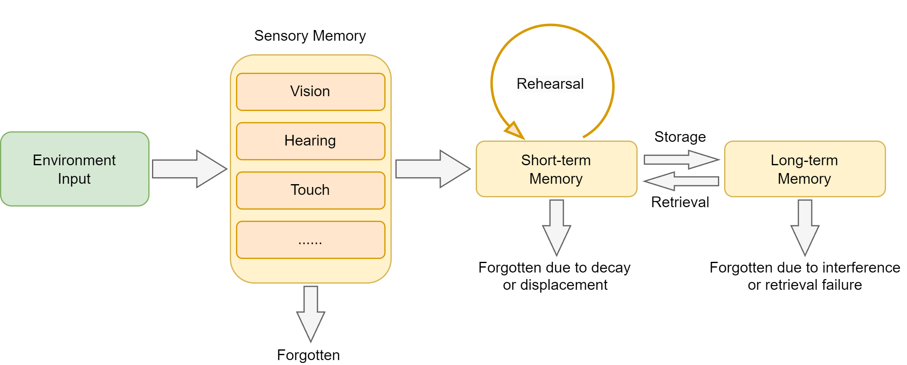
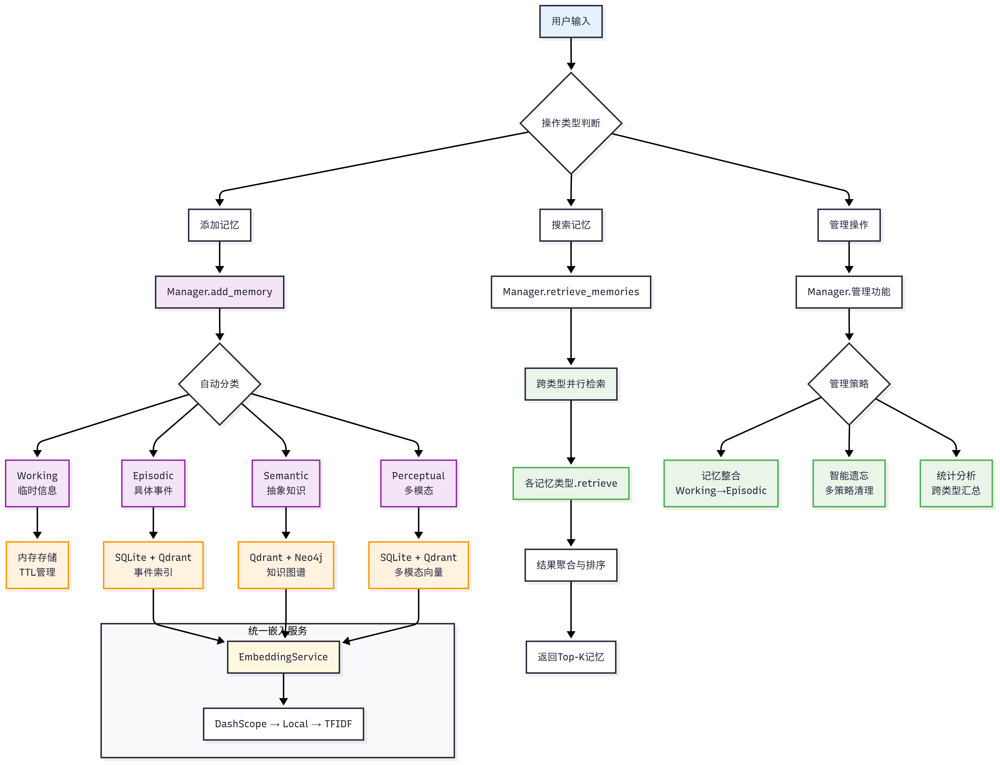
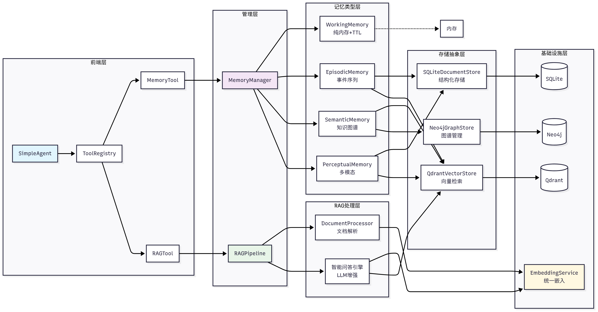
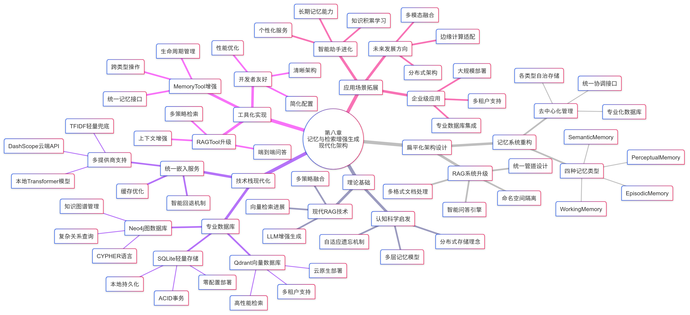

# Agentic RAG 与记忆

Agentic RAG 让模型决定“要不要检索、查哪里、是否继续查”；记忆系统让智能体保存跨任务有价值的经历、事实和偏好。两者会协作，但不能混为一谈：**RAG 面向外部知识取证，记忆面向智能体经验的持续管理**。

## 1. 固定 RAG 与 Agentic RAG

固定流水线通常每次执行同样的查询改写、检索、重排和生成。它稳定、低成本、易评估，应该是默认方案。

Agentic RAG 形成循环：

```text
理解目标 → 制定计划 → 选择数据源/工具 → 检索
    ↑                                  ↓
补充或改写 ← 判断缺口、冲突与可信度 ← 批判证据
```


智能体可以决定：

- 当前问题是否需要检索；
- 应查向量库、SQL、知识图谱还是 Web；
- 是否要拆成多个子问题；
- 当前证据是否足够、是否冲突；
- 是否改写查询、切换数据源或停止并拒答。

## 2. 三种组织方式

### 2.1 单智能体 + 多工具

一个智能体调用多个检索器、计算器和业务 API。结构简单，但规划、执行和校验都压在同一上下文中。

### 2.2 多智能体

规划、检索、核验、生成由不同角色负责，适合任务边界清晰的复杂流程。缺点是通信成本、状态同步、重复劳动和更难复现。

### 2.3 智能体 + 知识图谱

智能体根据当前证据选择图路径、向量检索或结构化查询，并在多跳过程中动态补证。能力强，错误链和成本也更长。

## 3. 不是问题越复杂，循环越多越好

每轮循环都可能增加 Token、延迟、工具费用和错误累积。必须设置：最大步数、单工具超时、总成本预算、允许的数据源、停止条件、重复查询检测和完整 Trace。简单事实查询应由路由器直接走固定 RAG。

Agentic RAG 的额外评估项包括计划成功率、工具选择准确率、平均/最大步数、无效调用率、恢复率、总成本和终止正确性。

## 4. 为什么 Agent 还需要记忆

普通对话历史只存在当前上下文，进程重启或新会话后就消失；把所有历史一直塞入 Prompt 又会无限增长。RAG 的公共知识库也不适合直接保存用户偏好、一次任务经历或短期中间状态。

`hello-agents` 从认知记忆出发，把智能体记忆分层：感官信息非常短暂，工作记忆容量有限，长期记忆又分为经历与抽象知识。这不是要复制人脑，而是为不同生命周期的数据选择不同存储和检索策略。



## 5. 四类记忆

| 类型 | 保存内容 | 典型存储 | 检索重点 |
| --- | --- | --- | --- |
| 工作记忆 | 当前任务目标、中间结果、临时偏好 | 内存 + TTL | 相关性、时效、容量 |
| 情景记忆 | “何时发生了什么”的具体经历 | SQLite + 向量库 | 语义相似、时间、重要性 |
| 语义记忆 | 稳定事实、概念、实体关系 | 图数据库 + 向量库 | 语义、图邻域、重要性 |
| 感知记忆 | 图片、音频等多模态线索 | 分模态向量集合 | 同模态/跨模态相似、时效 |

### 5.1 工作记忆

示例实现使用纯内存、TTL 和有限容量（如约 50 条），以 TF-IDF/关键词相关性结合时间衰减和重要性：

$$
score=(relevance\times time\_decay)\times(0.8+importance\times0.4)
$$

系数是该实现的启发式配置，不是认知科学定律。

### 5.2 情景记忆

记录一次问答、任务、决策或事件，可按用户、会话和时间筛选。示例评分为：

$$
score=(vector\_similarity\times0.8+recency\times0.2)
\times(0.8+importance\times0.4)
$$

### 5.3 语义记忆

把稳定知识抽象成实体和关系，存到 Neo4j，并用 Qdrant 支持语义入口。示例融合向量相似度与图相关性，再乘重要性因子。将情景自动提升为语义事实前要去重、消歧和验证，否则一次错误回答会固化成长期知识。

### 5.4 感知记忆

不同模态分集合存储，可做同模态或跨模态搜索，并使用指数时间衰减。必须保留原始媒体、模态、来源、时间、权限及生成说明。

## 6. 记忆的生命周期



完整记忆系统包括：

1. 编码：从交互中提取可保存内容与元数据；
2. 存储：按类型写入内存、关系库、图或向量库；
3. 检索：结合相关性、时间、重要性和权限召回；
4. 巩固：把高价值工作记忆提升为情景记忆，再抽象为语义记忆；
5. 遗忘：按重要性、时间或容量清理过期内容。

遗忘不是缺陷。没有清理、合并和纠错机制，记忆库会充满重复、过时和互相冲突的内容。

## 7. MemoryTool 与 MemoryManager

`hello-agents` 将操作统一为工具动作：

- `add`：写入内容、类型、会话、时间、模态、重要性；
- `search`：指定一种或多种记忆、用户、最小重要性；
- `forget`：按重要性、时间或容量删除；
- `consolidate`：把重要工作记忆转为情景记忆，再选择性抽象为语义记忆。

`MemoryManager` 负责协调四类记忆与底层存储。示例把重要性高于 0.7 的工作记忆作为巩固候选；这个阈值应按业务误记成本校准。



## 8. 记忆和 RAG 如何协作

一次文档问答可以这样分工：

- RAGTool 保存文档块，负责基于证据回答；
- 加载文档的事件写入情景记忆；
- 当前问题和中间计划进入工作记忆；
- 最终问答作为情景记录保存；
- 用户确认的重要笔记再进入语义记忆；
- 以后可先从记忆得到历史线索，再用 RAG 回查原始文档。

不要自动把模型每次回答都当作事实写入长期记忆。持久化前应区分用户陈述、外部证据、模型推断和系统行为，并支持查看、纠正和删除。

下图是 `hello-agents` 第八章的完整知识图谱，覆盖记忆类型、RAGTool、嵌入服务、Qdrant/Neo4j/SQLite、工具接口与后续演进，可用于回看本章各组件之间的关系。



## 9. 用户隔离和安全

记忆与知识库都可能含私有信息，必须在存储和查询层强制使用 `user_id/tenant_id`，而不是只靠 Prompt 提醒。RAG namespace、Qdrant Payload、SQL 条件和图查询都要注入权限过滤；日志与评估样本也要脱敏。

## 10. 本章来源

- `all-in-rag/docs/chapter7/21_agentic_rag.md`：固定 RAG 与 Agentic RAG、计划—检索—批判—改进循环、单/多智能体及图协同。
- `hello-agents/docs/chapter8/第八章 记忆与检索.md`：四类记忆、MemoryTool/MemoryManager、评分公式、巩固与遗忘、Qdrant/Neo4j/SQLite 架构。
- `knowledge-center/src/Agent/RAG.md`：检索路由、校正和分阶段证据优化，是 Agentic 检索动作的底层能力。
