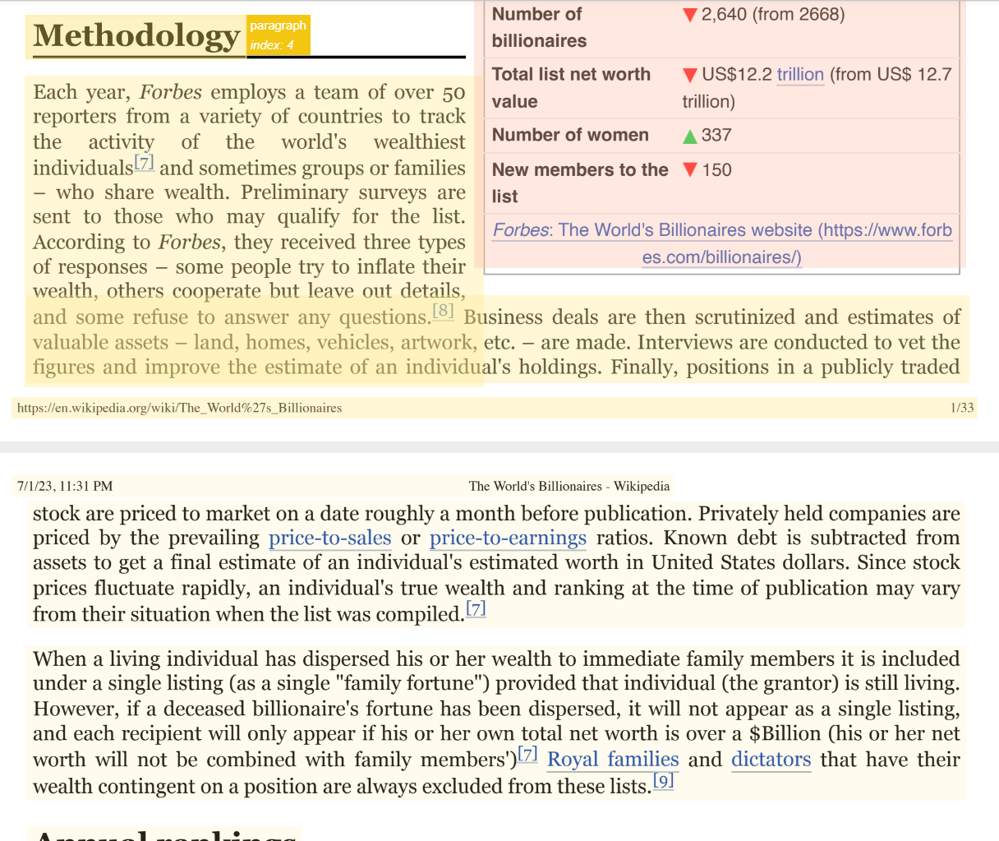
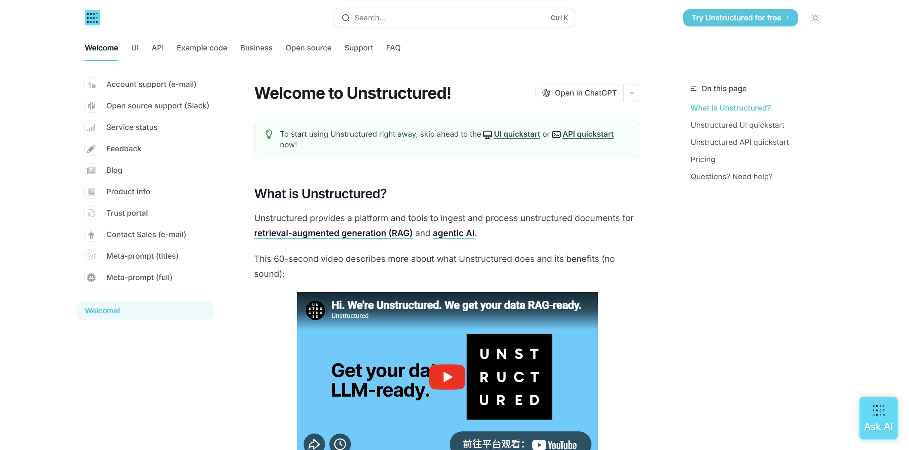
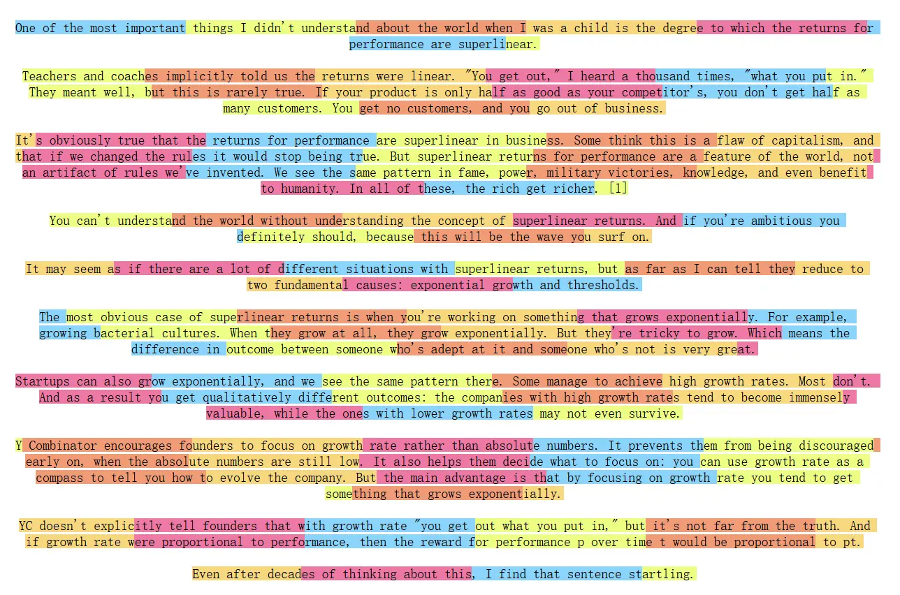
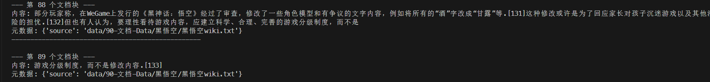

# 文档解析与分块

RAG 的第一条工程规律是：**检索系统无法找回解析阶段已经丢失的信息**。如果双栏顺序被打乱、表头与单元格分离、扫描页没有 OCR，后面的 Embedding、向量库和大模型都只能在错误文本上继续工作。

## 1. 先识别文档，而不是先选框架

同一个知识库通常同时包含原生 PDF、扫描 PDF、Word、Excel、HTML、Markdown、图片和数据库记录。应先按文档特征分流：

| 文档特征 | 首选路线 | 需要重点验收的内容 |
| --- | --- | --- |
| 原生文本、单栏、少表格 | PyMuPDF、pypdf | 阅读顺序、页眉页脚、连字符 |
| 双栏、图文混排、复杂表格 | Docling、MinerU、Marker、LlamaParse | 版面顺序、标题层级、跨页表格 |
| 扫描件或图片型 PDF | OCR 或视觉解析模型 | 漏字、错字、公式、表格线 |
| 规则表格 | Camelot、pdfplumber | 表名、单位、合并单元格、跨页关系 |
| 多格式办公文档 | Unstructured、MarkItDown 等统一入口 | 转换成功不等于结构正确 |

`knowledge-center` 对多种 PDF 工具的实际比较很有价值：Docling 对原生文本、表格和双栏布局通常较稳，也能去除部分页眉页脚；Marker 对英文和扫描材料表现较好，但标题层级需要复核；MinerU 对中文和扫描件更友好，但表格可能漏格或混入异常文本；LlamaParse 对复杂表格能力强，却引入 API、费用和数据外发问题。这里没有绝对冠军，**文档样本才是选型依据**。



上图来自 `knowledge-center` 的解析调试示例：把解析器给出的元素边界框覆盖到原页面上，能直接看出标题、正文、表格是否被识别，以及阅读顺序是否正确。只检查导出的纯文本，往往看不出布局错误。

## 2. 解析结果应保留什么

理想的中间格式不是一长串纯文本，而是一组带来源信息的元素：

```json
{
  "document_id": "manual-v3",
  "element_id": "p12-table-2",
  "type": "table",
  "text": "温度范围：-20℃ 至 60℃",
  "page": 12,
  "section_path": ["安装", "环境要求"],
  "bbox": [81, 233, 512, 604],
  "parser": "docling",
  "parser_version": "...",
  "source_hash": "..."
}
```

至少保留：

- 原始文件、文件哈希、版本、租户与权限；
- 页码、章节路径、元素类型、表格或图片位置；
- 解析器名称、版本、配置、时间和失败日志；
- 解析后的 Markdown/JSON，及其到原文位置的映射；
- 标题、表名、列名、单位、脚注和引用关系。

这些元数据既用于过滤和引用，也用于排错与增量重建。若只保存 `text + vector`，后来发现一个答案错误时，很难判断问题来自原文件、解析、切块还是检索。

## 3. Unstructured 的位置

Unstructured 的优势是把多种文件统一成 `Title`、`NarrativeText`、`ListItem`、`Table` 等元素。常见解析策略包括：

- `fast`：优先直接抽取文字，速度快，适合结构简单的原生文档；
- `hi_res`：借助版面检测恢复复杂布局，成本更高；
- `ocr_only`：面向扫描页；
- `auto`：让工具根据文件情况选择。



统一元素模型简化了下游代码，但它没有消除数据质量问题。`partition` 完成后仍要检查元素顺序、标题误判、页眉重复、表格完整度和乱码。

## 4. 表格、图片与多模态资料

表格不能简单按换行符切成若干段。至少要让每个可检索单元携带表名、列名、单位和所在章节。常用策略有三种：

1. 保留 Markdown/HTML 表格，让支持长上下文的模型整体理解；
2. 把每一行转成自包含句子，如“型号 A 的额定功率为 120 W”；
3. 同时索引表摘要、表结构和原始表，先召回摘要再返回完整表。

Camelot、pdfplumber 擅长规则表格抽取，但很难自行判断“这个表属于哪个标题”；扫描表格还要依赖 OCR。对于图表、流程图或产品图片，可以保存图片向量和图像说明，与文本向量并列检索。多模态检索的关键不是“把图片也入库”，而是保留**图片—图注—正文—页面**之间的关系。

## 5. 为什么必须分块

分块同时受四个因素约束：

- Embedding 模型有输入长度上限；
- 大块包含多个主题，池化后的向量语义变模糊；
- 小块更易命中，但可能切断条件、定义和上下文；
- 生成模型即使上下文很长，也可能忽略位于中间的信息。

所以块大小不存在通用答案。面向 FAQ 的块可以很短；制度条款要保留条件与例外；代码要保持函数或类边界；表格要保持表头；论文则应保留章节层级。



## 6. 六类常用分块策略

### 6.1 固定字符或 Token

实现简单，适合做基线。必须设置重叠以降低边界处的信息损失，但重叠过大会导致重复召回、索引膨胀和上下文浪费。

### 6.2 递归分块

按“段落 → 换行 → 句子 → 字符”逐级尝试分隔，直到块不超过上限。中文还应加入 `。！？；` 等分隔符。它比机械切字更能保持自然段结构，是通用文本的稳健默认值。



### 6.3 Markdown 结构分块

先按 `# / ## / ###` 形成章节树，再在过长章节内递归切分。每个块继承标题路径，例如：

```text
产品手册 > 安装 > 网络配置 > 代理
```

标题路径应该进入元数据，也可以拼到待嵌入文本前面，以减少“单看正文不知道主题”的情况。

### 6.4 语义分块

将文本切成句子，为相邻句子或缓冲窗口计算 Embedding，再根据距离突增点切分。断点可用百分位数、标准差、四分位距或梯度确定。它能发现自然主题变化，但速度慢、参数敏感，且每次更换 Embedding 模型都可能改变边界。

### 6.5 父子块与多向量表示

用小块召回，用大块生成：

- 子块可以是句子、小节摘要或假设性问题，负责精确命中；
- 父块可以是完整小节、页面或文档，负责提供上下文；
- 索引中保存 `child_id → parent_id`，命中子块后去重并展开父块。

一个原文还可以对应多种检索表示：原文向量、摘要向量、关键词、若干假设性问题。它们都指回同一个原始证据，不能把模型生成的摘要当作最终引用来源。

### 6.6 句子窗口

索引单句，但在元数据中保存前后若干句。命中后用窗口替换单句，兼顾精确召回和上下文连续性。LlamaIndex 提供相应节点后处理器；在其他框架中也可以用句子序号自行实现。

## 7. Unstructured 分块参数

其基本策略中几个参数容易混淆：

- `max_characters`：硬上限；
- `new_after_n_chars`：软上限，超过后优先开启新块；
- `overlap`：被拆分元素之间的重叠；
- `overlap_all`：是否连正常相邻块也重叠；
- `by_title`：遇到标题时开启新块，避免跨章节混合。

不要只调一个 `chunk_size`。如果正文层级、表格和元素类型已经解析出来，分块器就应该使用这些结构信号。

## 8. 质量检查与回归样本

每次更换解析器或分块策略，都应在固定样本上检查：

| 检查层 | 关键问题 |
| --- | --- |
| 文件层 | 是否漏文件、重复文件、版本混淆、权限错误 |
| 页面层 | 页数、阅读顺序、页眉页脚、OCR 覆盖是否正确 |
| 元素层 | 标题、列表、表格、公式、图片是否完整 |
| 块层 | 是否自包含、是否跨主题、是否丢失标题和来源 |
| 检索层 | 标准问题的相关块是否进入 Top-k |

建议保存一组“最难文档”：扫描件、双栏论文、跨页表格、中英混排、公式和代码各若干份。除了自动指标，再人工抽查边界。数据入口的回归测试，往往比继续更换大模型更能提升 RAG 的稳定性。

## 9. 本章来源

- `knowledge-center/src/Agent/RAG.md`：PDF 工具实测、解析框调试、表格解析、LangChain/Unstructured/Docling 分块、父子块、语义块和句子窗口。
- `all-in-rag/docs/chapter2/`：Unstructured 元素模型、解析策略、字符/递归/语义/Markdown 分块。
- `hello-agents/docs/chapter8/第八章 记忆与检索.md`：MarkItDown 统一入口、PDF 增强解析、Markdown 标题和 Token 重叠分块。

