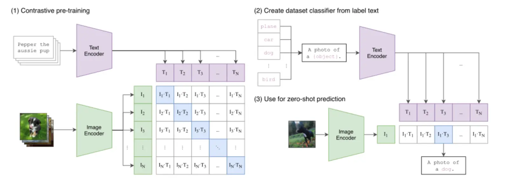
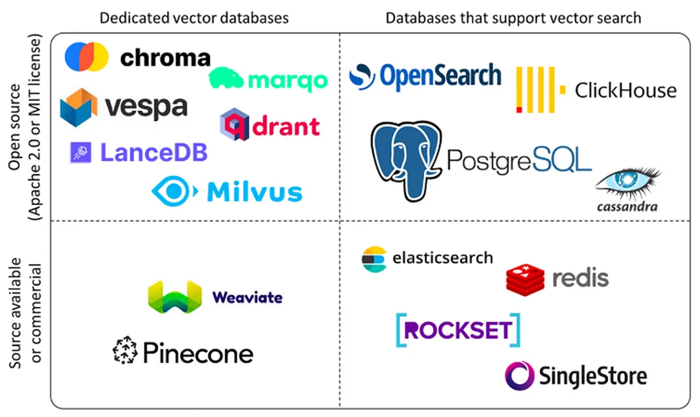
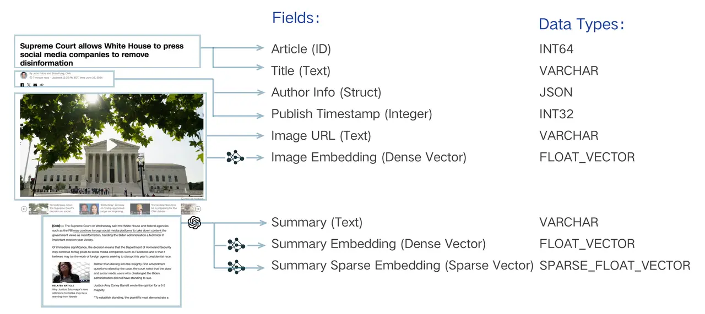
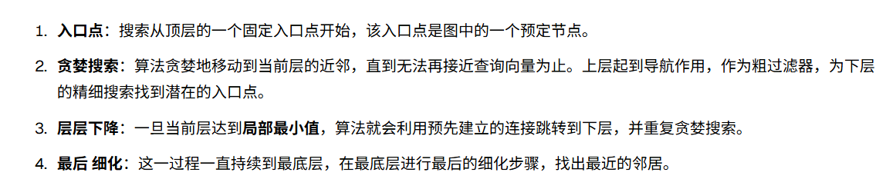
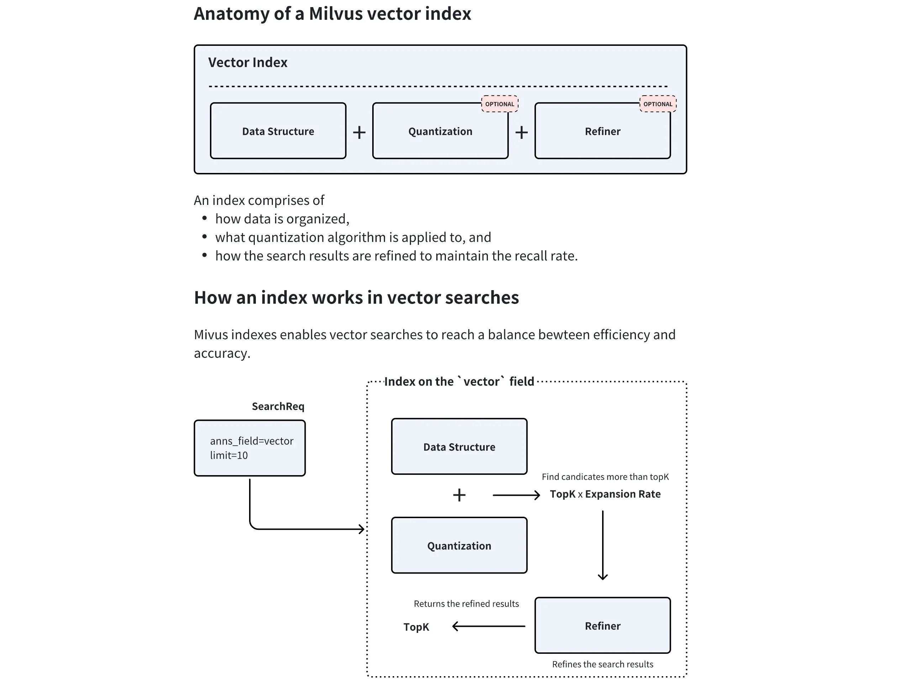
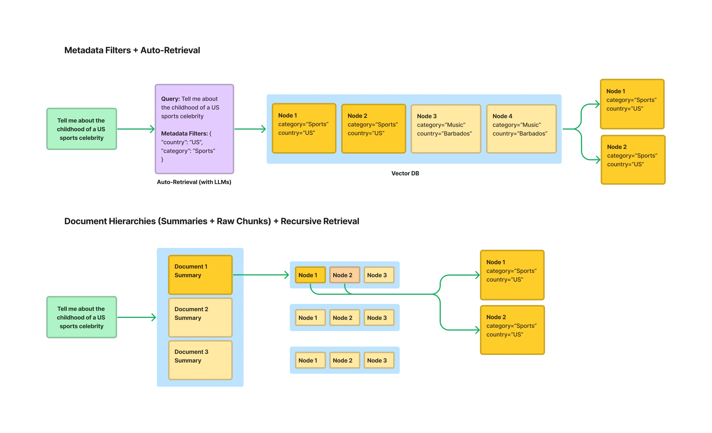

# 嵌入、向量数据库与索引

Embedding 把查询和知识表示成可比较的向量；向量数据库负责保存、过滤并在大量向量中快速找近邻。两者决定的是“候选证据能否被找出来”，不是最终答案写得是否流畅。

## 1. 三类检索表示

### 1.1 稠密向量

稠密 Embedding 擅长语义相似：即使查询与文档没有相同词，也可能靠近。模型可以从 MTEB 等公开榜单初选，但最终应使用自己的中文、英文、领域缩写、长短文本和硬负例测试。

选型至少比较：语言、领域、最大长度、向量维度、查询/文档是否要加指令、吞吐、成本、部署方式和版本稳定性。换模型后必须重建向量；因此索引记录里要保存模型名与版本。

### 1.2 稀疏向量与 BM25

稀疏表示保留具体词项，特别适合产品型号、报错码、人名、缩写和专有名词。BM25 的核心直觉是：词在当前文档中越常见越重要，在整个语料中越罕见越有区分度，同时用长度归一化和词频饱和避免长文档或重复词占便宜。

$$
\operatorname{BM25}(q,d)=\sum_{t\in q}\operatorname{IDF}(t)\cdot
\frac{f(t,d)(k_1+1)}{f(t,d)+k_1(1-b+b\cdot |d|/\operatorname{avgdl})}
$$

其中 $k_1$ 控制词频饱和，$b$ 控制文档长度归一化。中文使用 BM25 时，分词策略会直接影响效果。

### 1.3 多模态向量

CLIP、Visualized-BGE 一类模型把文本和图像投到可比较空间，可用文字查图片，也可用图片查图片。工程上通常同时索引：图片向量、图注、OCR 文本、页面位置和原始文件。

不同模态或“图片+文字查询”与“纯图片索引”的编码路径可能不同，因此同一张图片的相似度也不一定等于 1。分数只能在明确的模型、模态和归一化方式下解释。

## 2. 相似度与归一化

常见度量包括余弦相似度、内积和欧氏距离。若向量已做 L2 归一化，余弦和内积排序等价；否则不能混用。向量库中配置的度量必须与模型训练和向量归一化方式一致。

Top-k 分数不是概率。不同查询、模型、索引或数据分布下的 0.8 不代表同一置信度。需要“低于阈值就拒答”时，应在业务验证集上校准阈值，并同时观察排序和证据覆盖。

## 3. FAISS、Milvus、Qdrant 怎么分工

| 工具 | 合适场景 | 主要特点 |
| --- | --- | --- |
| FAISS | 单机原型、离线实验、内嵌索引 | 高效向量检索库；文档、权限和持久化要自己管理 |
| Milvus | 大规模、多向量、混合检索 | Collection/Partition/Schema、丰富 ANN 和混合检索能力 |
| Qdrant | 服务化向量检索、Payload 过滤 | API 友好，适合用 Payload 保存租户、会话和元数据 |
| Neo4j | 关系与多跳问题 | 不是普通向量库替代品，负责图结构；可与向量库协同 |

FAISS 只认识向量及其数值 ID，应用还要维护 `index_id → docstore_id → 原文与元数据` 的映射。生产系统里的难点常常不是最近邻算法，而是版本、删除、权限、映射和一致性。

## 4. 数据模型先于索引参数

以 Milvus 为例，一个 Collection 的 Schema 通常包含：主键、原文、稠密向量、稀疏向量、文档 ID、父块 ID、租户、权限、时间、类别等字段。

设计时注意：

- Partition 可隔离明显的数据域，但数量不能无限增长；
- Alias 可以把稳定名称原子切到新 Collection，适合无停机重建；
- 结构化字段应建立标量索引，用于权限、时间和类型过滤；
- 多向量字段可分别保存文本、图片、标题或不同模型的向量；
- 原始内容和索引要有共同版本号，删除与更新要可追踪。

## 5. ANN 索引

### 5.1 FLAT

逐一计算距离，召回最准确，适合小数据或做评测真值；代价是查询复杂度随数据量线性增长。

### 5.2 IVF_FLAT

训练聚类中心，查询时只搜索最接近的若干倒排桶。`nlist` 决定桶数量，`nprobe` 决定查询多少桶。增大 `nprobe` 通常提高召回，也增加延迟。

### 5.3 HNSW

建立多层近邻图，从稀疏高层快速导航到密集底层。建库参数 `M`、`efConstruction` 影响内存、构建速度和图质量；查询参数 `ef` 影响召回和延迟。它常用于低延迟高召回场景，但内存占用明显。

### 5.4 DiskANN

把大部分索引放 SSD，通过图搜索、缓存和量化支持超过内存容量的数据。适合超大规模，但更依赖磁盘性能和参数调优。

## 6. 量化与精化

- 标量量化（SQ）降低每个维度的精度；
- 乘积量化（PQ）把向量分段，用码本近似每一段；
- OPQ 先旋转向量空间，再做 PQ，以减少量化误差；
- 二值向量进一步降低空间，但适用模型和度量更受限制。

量化节省内存并加速搜索，却会损失召回。常见补偿方式是：先用量化索引找较大的候选集，再用原始浮点向量进行精化（refine）。

## 7. 不只是一层平面向量

结构化索引把知识库组织成类别、文档、章节和块的层级。查询先选数据源或章节，再在局部做向量检索，可减少噪声和成本。

常见组合包括：

- 句子窗口：单句索引，命中后展开邻句；
- 父子检索：小块索引，命中后返回父块；
- 层级检索：文档摘要 → 章节摘要 → 原文块；
- 元数据过滤：先约束租户、版本、日期、类别，再搜索；
- 路由索引：先决定 Excel 工作表、知识域或数据库，再调用局部检索器。

不要让 LLM 直接对不可信表达式执行 `eval`。数据分析或 Text-to-SQL 工具需要只读账号、SQL AST 校验、表白名单、行数限制和超时。

## 8. 索引选型原则

1. 用 FLAT 在代表性数据上建立召回基线；
2. 根据数据量、延迟和内存选择 IVF、HNSW 或 DiskANN；
3. 网格搜索参数，绘制 Recall@k—P95 延迟—内存曲线；
4. 测试过滤条件下的性能，而不只是无过滤 ANN；
5. 执行真实更新、删除、重建和别名切换演练；
6. 对每次模型或索引升级做固定查询集回归。

## 9. 本章来源

- `knowledge-center/src/Agent/RAG.md`：Embedding 类型、BM25、Milvus 混合向量、FLAT/IVF/HNSW/DiskANN/GPU、SQ/PQ/OPQ 与精化器。
- `all-in-rag/docs/chapter3/`：模型选型、多模态 Embedding、FAISS 映射、Milvus Schema/Partition/Alias、ANN 搜索和结构化索引。
- `hello-agents/docs/chapter8/第八章 记忆与检索.md`：Qdrant Payload、统一 Embedding 服务及 API/本地/TF-IDF 回退设计。
