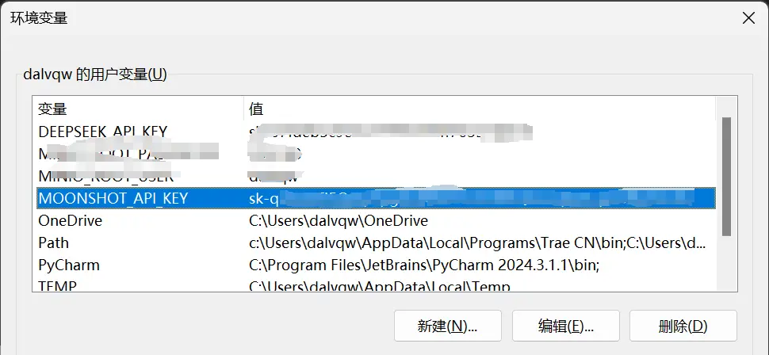
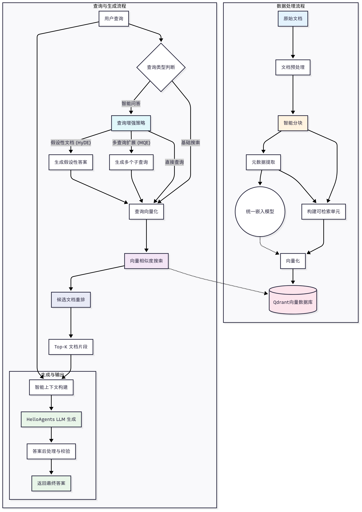

# 端到端项目

这一章不再按单项技术讲，而是还原三套来源中两条完整落地路线：普通混合 RAG/GraphRAG 食谱助手，以及带记忆的 PDF 学习助手。重点是模块之间如何连接、数据如何流动、哪些实现只是教学示例。

## 1. 项目一：食谱混合 RAG

`all-in-rag` 使用 300 多份结构清晰的 Markdown 食谱。这个数据集展示了一个非常实用的策略：**小块负责检索，完整食谱负责生成**。

### 1.1 数据准备

每份食谱解析成父文档，同时按标题/段落生成子块：

```text
parent_document
├── 菜名、分类、难度、源路径
├── 原料
├── 准备步骤
├── 制作步骤
└── 附加说明
```

子块继承 `parent_id`、标题路径、类别、难度、菜名和源文件。命中多个属于同一食谱的子块时，以父文档去重，避免同一食谱占满候选。

### 1.2 索引

- 使用中文 Embedding 模型生成稠密向量；
- FAISS 保存向量，应用保存索引 ID 与文档的映射；
- BM25 保存关键词索引；
- Embedding 结果持久化缓存，重复启动从“分钟”降到“秒级”；
- 数据、切块配置、Embedding 模型共同构成索引版本。

### 1.3 检索

1. 根据查询提取类别、难度等元数据条件；
2. 稠密检索和 BM25 并行召回；
3. 用 RRF 融合；
4. 以父文档去重；
5. 返回完整食谱作为生成证据。

查询还分为列表型、详情型和普通问答。列表型更重视覆盖与去重，详情型需要完整父文档，普通问答则可按相关小节组织上下文。

### 1.4 代码模块

来源项目按职责拆分为数据准备、索引、检索、生成与入口，而不是把所有逻辑塞进一个 Chain：

```text
data_preparation → index → retrieval → generation
                         ↘ main / interface
```

这种拆分便于单独评估：解析错时不必怀疑大模型；检索 Recall 下降时也不必改生成 Prompt。



### 1.5 后续扩展

食谱天然适合增加知识图谱、多模态图片、营养数据、库存和个性化过滤。但每加一种能力，都应先明确它解决哪类失败问题。

## 2. 项目二：Neo4j + Milvus GraphRAG 食谱系统

该项目在上一条路线之上加入图结构：

```text
Markdown
  → 文档分块与元数据
  → LLM 抽取实体关系
  → nodes.csv / relationships.csv
  → Neo4j 图索引
  → Milvus 文本向量与稀疏索引
```

短文档可以整体处理，长文档按 `##` 小节切分；文本块的 `parent_id` 与图中的 Recipe 节点对齐。

### 2.1 检索策略

- 传统通道：实体级和主题级召回，结合向量与 BM25；
- 图通道：识别实体后进行多跳查询；
- 组合通道：以轮询/交错方式融合两类证据。

路由根据问题复杂度与关系密度选择通道，并设置失败回退：图中找不到实体时回退普通检索；普通召回不足时补图路径；任何路线最终都要返回原始文本证据。

### 2.2 教学实现的边界

源项目明确属于示范性实现。生产化还需补：实体消歧、Schema 版本、增量构图、权限、置信度、删除传播、图查询超时、索引一致性和完整评估。

## 3. 项目三：带记忆的 PDF 学习助手

`hello-agents` 的案例把 RAGTool 和 MemoryTool 同时交给 Agent：RAG 负责文档取证，记忆负责保留学习过程。


### 3.1 五步使用流程

1. 上传并解析 PDF；
2. 建立文档索引；
3. 针对文档问答；
4. 保存问题、答案和用户笔记；
5. 回顾历史、统计与学习报告。

### 3.2 RAGTool 的数据管线



- MarkItDown 统一接入多种格式，复杂 PDF 走增强解析；
- Markdown 按标题和段落切分，过长块再按 Token 切并保留重叠；
- 中文不能直接用空格数估算 Token，需要适配 CJK；
- Embedding 服务支持 API、本地模型和 TF-IDF 回退；
- Qdrant 保存向量及 `user_id`、namespace、来源等 Payload；
- 高级检索可使用 MQE 和 HyDE，扩大候选池后按 `memory_id` 去重。

### 3.3 记忆写入

案例把不同信息放到不同记忆：

- “加载了某文档”是一次情景；
- 当前问题是工作记忆；
- 完成的问答可成为情景记忆；
- 用户确认的笔记或稳定概念可以进入语义记忆。

合理改进是：不要自动长期保存每条模型答案；应记录其证据、模型版本和状态，并允许用户确认、纠正、删除。

### 3.4 隔离

每次 RAG 查询和记忆查询都必须携带 `user_id` 与 `rag_namespace`。过滤应在数据库查询层强制执行，不是依赖智能体“自觉”。上传文件名也不能直接当唯一 ID，应使用内容哈希或受控 UUID。

## 4. 两个项目的共同骨架

| 层 | 食谱系统 | PDF 学习助手 | 通用结论 |
| --- | --- | --- | --- |
| 数据 | 结构化 Markdown | 用户上传 PDF | 先做解析质量检查 |
| 块 | 小节子块 + 食谱父文档 | 标题/段落 + Token 重叠 | 小块召回、大块生成 |
| 检索 | FAISS + BM25 + RRF | Qdrant + MQE/HyDE | 多路召回后统一去重 |
| 结构 | 可扩展 Neo4j 图 | 语义记忆使用 Neo4j | 关系问题才走图 |
| 状态 | 基本无用户状态 | 四类记忆 | 知识与用户记忆分离 |
| 输出 | 列表/详情/问答 | 问答/笔记/回顾 | 先识别任务类型再生成 |

## 5. 推荐的目录结构

```text
rag_app/
├── ingestion/       # 解析、清洗、分块
├── indexing/        # embedding、向量/稀疏/图索引
├── retrieval/       # 改写、路由、召回、融合、重排
├── generation/      # 上下文、Prompt、结构化输出、引用
├── memory/          # 可选：工作/情景/语义/感知记忆
├── evaluation/      # 数据集、指标、回归
├── api/             # 鉴权、流式输出、限流
└── observability/   # trace、日志、成本、告警
```

## 6. 最小可运行顺序

1. 选 20～50 个真实问题与证据，先建立评估集；
2. 支持一种高价值文档，完成解析、递归/结构分块和引用；
3. 用 FAISS 或服务化向量库建立稠密检索基线；
4. 加 BM25、RRF、父块展开和元数据过滤；
5. 分层评估并修复数据问题；
6. 再决定是否需要重排、图、记忆或 Agentic 循环。

## 7. 本章来源

- `all-in-rag/docs/chapter8/`：普通食谱 RAG 的环境、数据准备、索引检索、生成与系统整合。
- `all-in-rag/docs/chapter9/`：Neo4j + Milvus GraphRAG、图建模、索引和智能查询路由。
- `hello-agents/docs/chapter8/第八章 记忆与检索.md`：PDF 学习助手、RAGTool、MemoryTool、Gradio 效果与用户隔离。
