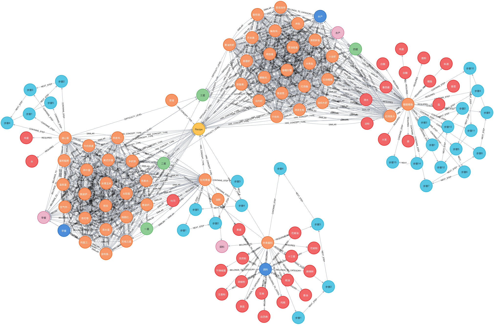

# GraphRAG

普通 RAG 以“文本相似”为主要入口；GraphRAG 把实体、关系、事件、时间和出处显式建模，再沿图结构取证。它不是向量检索的全面替代，而是为**关系、多跳和全局归纳问题**增加一条证据通道。

## 1. 普通 RAG 的关系盲区

文档分块后，原本连续的关系可能散落到不同块：

- “A 公司收购 B，公司 B 又持有 C”需要两跳推理；
- 同一实体存在别名、缩写或同名歧义；
- 一个结论需要跨文档组合人物、产品、时间和事件；
- 用户问的是“整个语料中的主要主题”，并非某个局部片段；
- 新旧制度或实体关系随时间变化，简单相似度容易混版本。

增大 Top-k 只能带回更多文本，不能保证关系链完整，还会增加噪声。图结构能把 `实体—关系—实体` 和来源显式保留下来。

## 2. 三阶段流水线

### 2.1 构图

1. 解析文档并保留来源、页码和章节；
2. 抽取实体、关系、事件、属性和时间；
3. 做实体消歧与别名合并；
4. 根据 Schema/本体约束类型和边；
5. 为节点和边保存出处、置信度、版本与有效期；
6. 写入 Neo4j 等图数据库，同时建立文本/向量索引。

如果只让模型自由抽取三元组而没有 Schema、实体解析和质量检查，图会快速充满重复实体、错误边和含义不一致的关系。

### 2.2 检索

1. 从查询识别实体、关系和约束；
2. 通过关键词/向量完成实体链接；
3. 在限定跳数、关系类型、时间和权限下扩展子图；
4. 根据路径相关性、来源质量和置信度排序；
5. 同时取回关键节点/边所对应的原文证据。

### 2.3 生成

将结构化路径、社区摘要和原始证据共同交给模型。最终引用应指向原文，而不只是“图数据库里有这条边”；因为图关系本身也可能是模型抽取或融合得到的。

## 3. 三种 GraphRAG 形态

| 形态 | 图的作用 | 适用情况 |
| --- | --- | --- |
| 知识驱动 | 业务本来就有高质量知识图谱 | 医药、供应链、组织与产品关系 |
| 索引驱动 | 从非结构化文档自动抽图 | 文档多跳、主题发现、跨文档关联 |
| 混合 | 图负责关系，向量/关键词负责原文证据 | 大多数落地系统 |

## 4. 局部问题与全局问题

局部查询围绕已知实体展开，例如“药物 A 通过什么通路影响疾病 B”。适合实体链接、邻居扩展、路径搜索和原文回查。

全局查询问整个语料的主题或趋势，例如“这些报告反映了哪些主要风险”。Microsoft GraphRAG 一类方法会对图做社区发现，预先为不同层级社区生成摘要；查询时组合相关社区报告，而不是扫描所有原文块。

社区摘要提高全局问答效率，但引入额外索引成本和摘要误差。任何重要结论仍应能下钻到节点、边及其源文档。

## 5. 图建模：从食谱项目理解

`all-in-rag` 的项目把 Markdown 食谱抽成如下节点类型：

- `Recipe`：菜谱；
- `Ingredient`：食材；
- `CookingStep`：步骤；
- `Method`：烹饪方法；
- `Tool`：厨具；
- `Difficulty`：难度；
- `Category`：分类。

关系可以表达“需要食材”“包含步骤”“使用方法”“需要工具”“属于分类”。文本块通过 `parent_id` 关联到图节点，使向量检索命中原文后可以进入图，也使图路径最终能够回到原始证据。

## 6. 三条检索通道

该项目将检索分为：

1. 传统混合检索：向量 + BM25，经 RRF 融合；
2. 图检索：实体识别后沿关系多跳扩展；
3. 组合检索：交错合并传统结果和图结果。

路由器根据问题复杂度和关系密度选择通道。示例阈值是：复杂度低于 0.4 走传统检索；高于 0.7 或关系密度高于 0.7 走图检索；中间区域组合。阈值是项目示范，不是通用常数，生产环境要用自己的标注集校准。

## 7. 代表性方向

- Microsoft GraphRAG：实体/关系抽取、社区发现、层级社区报告，强调全局与局部查询；
- LightRAG：以更轻量的双层图索引兼顾局部和全局信息；
- FRAG：先判断问题是否复杂，简单问题避免高成本图流程；
- GraphIRAG：在图上迭代检索与推理，逐步补齐证据。

这些名称代表不同设计方向。工程上更重要的是明确：图如何构建、证据如何回溯、何时走图、失败如何回退。

## 8. 质量与成本

GraphRAG 除普通 RAG 指标外，还要评估：

- 实体识别、消歧与链接准确率；
- 关系抽取准确率和方向；
- 路径是否完整、是否包含无关跳；
- 社区摘要是否覆盖关键主题；
- 图答案能否追溯到真实文档；
- 构图成本、增量更新延迟和查询延迟。

生产难点包括 Schema 演化、实体合并错误、时态关系、删除传播、权限隔离和增量重算。若业务问题主要是单文档事实问答，GraphRAG 的收益可能不足以覆盖这些复杂度。

## 9. 什么时候值得使用

适合：多跳关系、跨文档实体关联、全局主题总结、需要路径解释、已有高质量结构化关系。

不适合：知识库很小、问题基本是直接事实、实体和关系难以稳定抽取、没有构图与评估预算。此时优先把解析、混合检索和重排做好。

## 10. 本章来源

- `all-in-rag/docs/chapter7/20_kg_rag.md`：GraphRAG 的动机、构建/检索/生成、三种形态、Microsoft GraphRAG、LightRAG、FRAG 与 GraphIRAG。
- `all-in-rag/docs/chapter9/`：Neo4j + Milvus 食谱项目、图数据模型、三路检索与智能路由。
- `hello-agents/docs/chapter8/第八章 记忆与检索.md`：语义记忆中的 Neo4j 图存储、实体/关系抽取与图向量混合检索。

