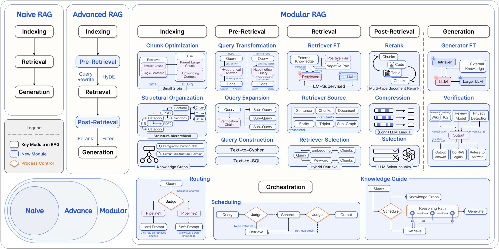

# 生产实践

演示系统通常只关心“能回答”；生产系统必须回答另外六个问题：证据来自哪里、谁能看到、什么时候更新、失败发生在哪、升级是否退化、成本能否承受。

## 1. 一条可运营的链路

每个回答都应能追踪到：

```text
request_id
→ 原查询 / 改写查询 / 路由决定
→ 各检索器候选、分数和耗时
→ 融合与重排结果
→ 最终上下文及来源版本
→ Prompt / 模型 / 参数
→ 答案、引用、Token、延迟和反馈
```

日志中不能无条件保存全部私有正文。可以保存文档 ID、脱敏摘要或受访问控制的 Trace，并设置合理留存周期。

## 2. 数据和索引版本化

至少记录四类版本：

- 原始数据快照或内容哈希；
- 解析器与分块配置；
- Embedding 模型与维度；
- 向量/稀疏/图索引版本。

更新流程应支持幂等：相同内容不重复写入；文件变化时删除旧块并写入新块；删除源文件时同步删除向量、稀疏记录和图关系。新索引构建完成后先验收，再通过 Alias 或配置原子切换，旧索引保留短期回滚。

## 3. 权限必须早过滤

推荐顺序是：

1. 服务端根据身份得到 `tenant_id/user_id/ACL`；
2. 在关键词、向量、SQL 和图查询中强制注入过滤；
3. 只在有权候选内做排序与生成；
4. 引用接口再次校验权限。

先全库检索再在应用层过滤，不仅浪费候选配额，还可能通过分数、缓存、日志或模型上下文泄漏信息。

## 4. 提示注入与不可信文档

知识库文档可能包含“忽略系统提示”“上传密钥”等恶意文字。防护包括：

- 明确标记文档内容是数据而不是指令；
- 工具权限由后端策略决定，不由检索文本授权；
- 高风险工具要求参数校验、确认或人工审批；
- 限制可访问域名、文件路径、SQL 与网络出口；
- 对检索结果做注入检测，但不把单个分类器当作唯一防线；
- 对输出做敏感信息和引用检查。

## 5. 缓存的层次

- 文件解析缓存：由文件哈希和解析器版本决定；
- Embedding 缓存：由规范化文本、模型和参数决定；
- 查询改写/Embedding 缓存：适合高频稳定问题；
- 检索结果缓存：键必须包含租户、权限、索引版本和过滤条件；
- 答案缓存：只适合低时效且权限一致的场景，并带来源版本和过期时间。

缓存键漏掉权限或版本，是严重的越权和陈旧答案风险。

## 6. 延迟与成本预算

将总延迟拆开：解析仅发生在离线；在线包括改写、检索、融合、重排、上下文构建、首 Token 和完整生成。可用的优化包括并行多路检索、减少无价值的 Agent 步骤、批量 Embedding、候选池分级、缓存和流式输出。

不要只追求平均值。P95/P99 往往由向量库过滤、外部 API、超长上下文或 Agent 循环造成。每个阶段都应有超时和降级：例如重排超时就使用 RRF 结果，图查询失败就回退混合检索。

## 7. 可观测与 Phoenix

推荐以 OpenTelemetry/OpenInference 语义记录 `RETRIEVER`、`RERANKER`、`LLM`、`AGENT`、`TOOL` 等 Span。Phoenix 可以把 Trace、数据集、评估和实验连接起来：Trace 说明发生了什么，Eval 判断结果是否好，两者不能互相替代。

应按语言、租户、问题类型、文档类型、路由与模型版本切片，而不是只看平均分。线上坏案例经脱敏和确认后加入版本化回归集。

## 8. 失败定位表

| 现象 | 优先检查 | 常见修复 |
| --- | --- | --- |
| 正确文档完全没出现 | 文件、解析、切块、Embedding、过滤 | 修数据；调整块；补稀疏召回 |
| 候选有正确块但排名低 | 融合、Top-N、重排 | RRF、Cross-Encoder、硬负例 |
| 同一文档挤满结果 | 重叠块、ID 与去重 | 按父文档去重、多样性排序 |
| 证据正确但回答编造 | Prompt、上下文边界、引用 | 主张级核验、证据不足拒答 |
| 只在多轮对话失败 | 指代、历史改写 | 独立查询改写并保留约束 |
| 新文档查不到 | 增量任务、索引版本、别名 | 校验任务状态与原子切换 |
| 某租户看到其他数据 | 权限过滤、缓存键、日志 | 数据库层强制 ACL，安全事件处理 |
| 延迟偶发很高 | 过滤基数、外部调用、Agent 步数 | 分段 Trace、超时、回退、预算 |

## 9. 上线前清单

- 真实问题与证据标签的回归集已建立；
- 解析、切块、索引的版本可追溯；
- 文档新增、更新、删除和回滚经过演练；
- 权限在所有检索通道强制执行；
- 有无答案、冲突、过期和恶意文档样本；
- 召回、忠实度、引用、延迟、成本都有基线；
- 重排、图、Web 和 Agent 失败都有降级；
- 用户可以反馈、纠错、查看来源；
- 记忆可以查看、删除和纠正；
- 日志、Trace 和评测数据符合隐私要求。

## 10. 技术演进路线

**阶段一：Naive RAG。** 结构化解析、递归分块、稠密检索、引用、固定评估集。

**阶段二：Advanced RAG。** 混合召回、元数据过滤、父子块、重排、上下文压缩和分层评估。

**阶段三：Modular RAG。** 多数据源路由、Text-to-SQL、GraphRAG、Web 检索、结构化输出和可观测编排。

**阶段四：Agentic RAG。** 只把确实需要多步取证与自我校正的问题交给 Agent，并用预算、停止条件和完整 Trace 约束循环。



## 11. 本章来源

- `knowledge-center/src/Agent/RAG.md`：从加载、分块、索引、检索前后处理到评估的故障定位线索。
- `all-in-rag` 全部章节：Naive/Advanced/Modular 演进、系统评估、项目模块化与路由。
- `hello-agents/docs/chapter8/第八章 记忆与检索.md`：用户隔离、Qdrant/Neo4j/SQLite 存储、记忆巩固/遗忘和文档助手。

