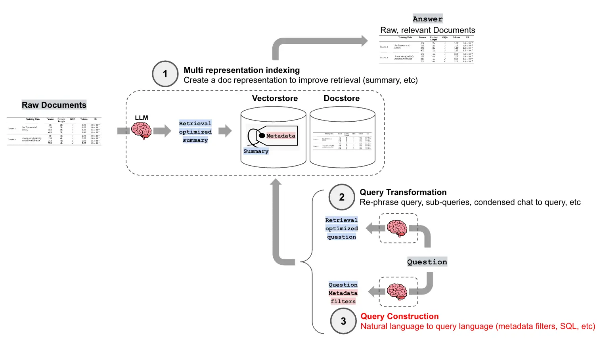
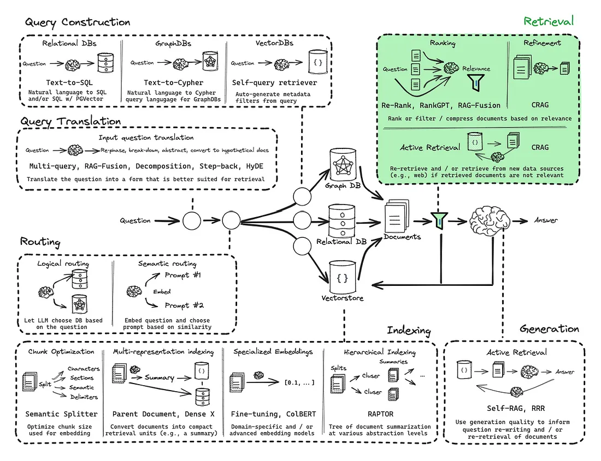
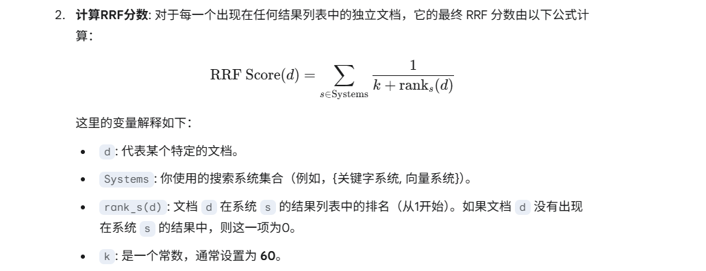
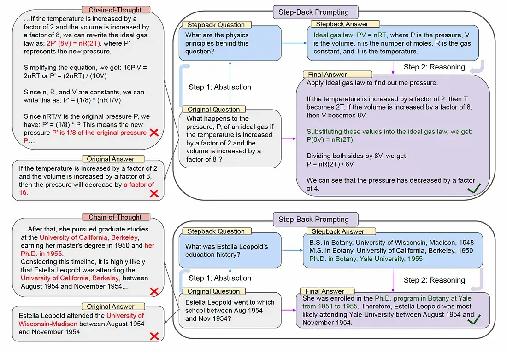
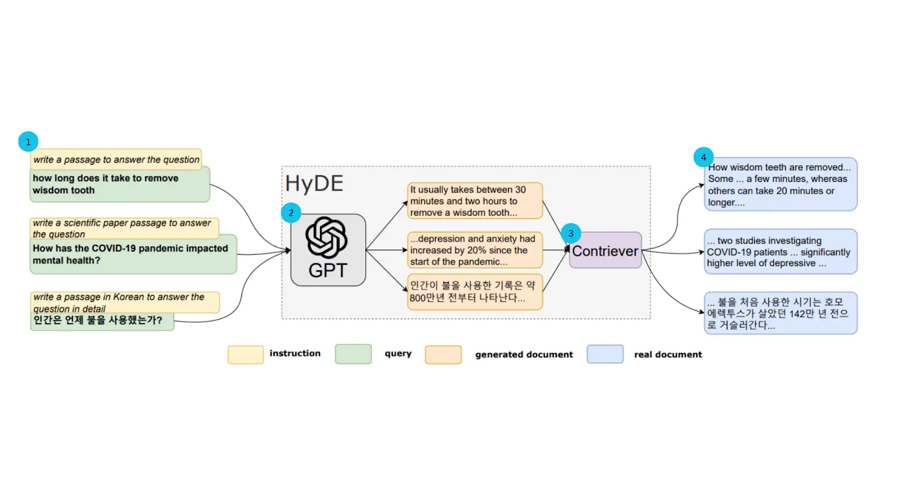
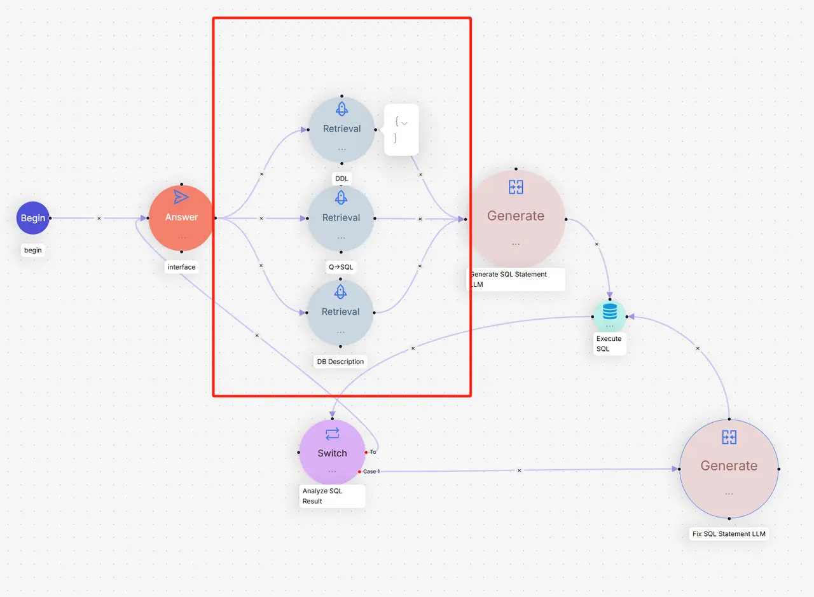
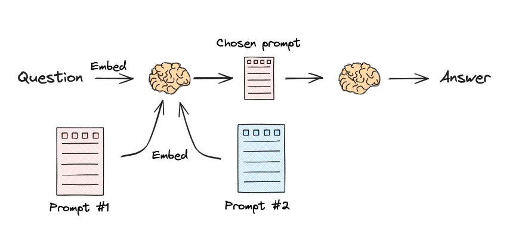
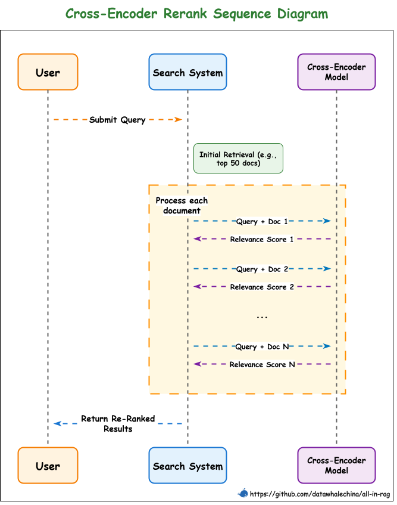
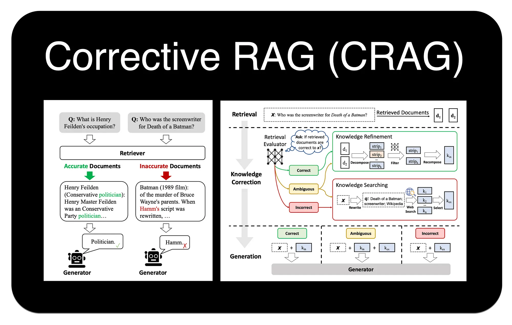

# 查询与检索优化

在线检索可分成三段：检索前让问题变得“可搜索”，检索中用多路召回扩大覆盖，检索后把候选证据变少、变准、变完整。不要一上来叠加所有技术；先定位失败发生在哪一段。



`all-in-rag` 还把查询构造、查询变换、路由、索引优化、重排与主动检索放在同一张图中。它说明“高级检索”不是某个单独算法，而是一组可按失败类型组合的模块。



## 1. 先把查询变成独立问题

多轮对话中的“它支持吗”“第二种呢”不能直接检索。应结合必要历史，将其改写为不依赖上下文的独立问题，同时保留产品型号、时间、否定词和约束条件。

改写最常见的风险是添加用户没有表达的条件。实践中应保存原查询和改写查询；遇到型号、编号或代码时尽量原样保留；在评估中检查改写是否改变意图。

## 2. 查询扩展、分解与抽象

### 2.1 Multi-Query

让模型从不同角度生成若干查询，分别检索后合并候选。它适合用户措辞与文档措辞差异较大时，但查询数量会线性增加成本，也可能引入偏题候选。

### 2.2 RAG Fusion

在 Multi-Query 基础上，用倒数排名融合（RRF）合并每路排序。某文档在多个结果列表中都靠前，就会得到更高分：

$$
\operatorname{RRF}(d)=\sum_{r\in R}\frac{1}{k+\operatorname{rank}_r(d)}
$$

$k$ 用于减弱头部名次的极端差异。RRF 只依赖排名，不要求 BM25、向量相似度等分数处于同一尺度。



### 2.3 Decomposition

复合问题要拆成子问题。例如“比较 A 与 B 的安装要求并解释差异”至少需要分别取得 A、B 的要求，再做比较。子问题分两类：

- 独立子问题可以并行检索；
- 依赖子问题必须把上一步结果带入下一步。

拆分后要保留原问题，因为最终回答必须完成整体任务，不能只罗列局部答案。

### 2.4 Step-back Prompting

先从具体问题生成一个更抽象的“后退问题”，分别检索具体证据和背景原则，再共同回答。它适合需要概念背景或通用规律的问题。



### 2.5 HyDE

让模型先生成一段假设性答案或文档，用它的向量去检索真实资料。它能跨越“短问题—长文档”的表达鸿沟；但假设文本可能带偏，因此最终证据必须来自真实文档，不能引用 HyDE 生成物。



## 3. 查询构建：把自然语言变成结构化检索

### 3.1 Self-Query

Self-Query Retriever 把“2025 年以后、难度为初级的中文资料”拆成语义查询和元数据过滤：

```text
semantic_query = "中文资料"
filter = year >= 2025 AND difficulty = "beginner"
```

元数据字段、类型、允许操作符和枚举值必须明确给模型，并校验生成的过滤表达式。权限过滤不得交给模型决定，而应由后端强制注入。

### 3.2 Text-to-SQL

Text-to-SQL 适合精确聚合、排序和关联查询，而不是把数据库每行都向量化。主要困难包括 Schema 幻觉、连接路径、业务口径和自然语言歧义。



可靠流程通常是：检索相关 DDL、字段说明和相似问法—SQL 示例，生成 SQL，做 AST 与权限校验，以只读账号执行；出错时把受控错误反馈给模型修正。还应强制 `LIMIT`、超时、表白名单，禁止 DDL/DML 和任意函数。

## 4. 路由：不是所有问题都走同一条链

可以路由到 FAQ 向量库、产品手册、SQL、知识图谱、Web 搜索或直接回答。两种典型方法：

- 逻辑路由：LLM 根据意图和工具说明选择；表达力强，但有调用成本和不确定性；
- 语义路由：把查询与各路由说明做向量相似度比较；快速稳定，但边界意图需要阈值和兜底。



路由可发生在数据源、检索器、Prompt 或整个工作流层。必须记录选择原因、置信分数与兜底路径。

## 5. 混合检索：强默认基线

稠密向量擅长同义表达，BM25 擅长精确词项。生产知识库通常同时存在两类查询，因此“向量 + BM25 + 融合”常比单一路线稳定。

融合方式：

- 加权分数：先将各路分数归一化，再按业务权重相加；
- RRF：只用排名，跨检索器更稳健；
- 学习排序：有足够标注数据后训练融合模型。

Milvus 可以在一个 Collection 内维护稠密和稀疏字段，分别检索后使用 `RRFRanker` 或 `WeightedRanker`。BGE-M3 一类模型还可同时产生稠密与稀疏表示。无论使用框架内置 Retriever 还是自定义实现，都要统一文档 ID，否则同一父文档会重复占满 Top-k。

## 6. 召回后重排

第一阶段检索追求“不要漏”，第二阶段重排追求“不要错”。常见方法如下：

| 方法 | 工作方式 | 优势 | 成本/限制 |
| --- | --- | --- | --- |
| RRF | 融合多路排名 | 无需训练、快速、分数无须同尺度 | 不读文档内容，精排能力有限 |
| Bi-Encoder | 查询与文档独立编码 | 可预计算文档向量，吞吐高 | 交互较弱 |
| Cross-Encoder | 查询和文档一起编码 | 相关性通常更准 | 每个候选都要推理 |
| ColBERT | Token 级独立编码，MaxSim 晚交互 | 精度与效率折中 | 索引更大、部署更复杂 |
| LLM Reranker/RankLLM | 点式、对式或列表式判断 | 能理解复杂条件 | 成本、延迟和稳定性压力最大 |



通常先召回较大的候选集，如 30～100 个，再重排到生成阶段真正需要的 5～15 个。具体数字必须用验证集与延迟预算确定。

## 7. 多向量、父子和层级检索

一个原始块可建立多个可检索代理：

- 原文；
- 摘要；
- 若干假设性问题；
- 标题路径；
- 图片说明；
- 关键词或稀疏向量。

这些表示提高“可被找到”的概率，命中后统一映射回原文。父子检索、小块到大块、句子窗口和层级摘要解决的是同一个矛盾：**搜索需要小而准，回答需要大而完整**。

## 8. 压缩、过滤与去重

长上下文不是把所有候选直接拼进去。后处理可以分为：

- 文档过滤：整块保留或删除；
- 相关片段抽取：只保留与问题有关的句子；
- Embedding 过滤：按相似度先去掉明显无关项；
- LLM 压缩或 LLMLingua：减少冗余 Token；
- 多样性与去重：避免同一文档的重叠块占满结果。

压缩后的文本不能丢失来源映射。若删掉限定条件或否定词，答案可能从正确变成相反，因此原始证据应保留用于引用和审计。

## 9. CRAG：检索结果不可靠时怎么办

Corrective RAG 先评估检索结果：

- `correct`：使用并精炼内部证据；
- `incorrect`：改写问题并检索外部来源；
- `ambiguous`：同时补充内部和外部证据。



它的价值不是再加一个模型，而是让系统显式处理“这批证据可能不够好”。外部搜索必须满足数据安全、来源可信和引用要求；企业私有问题不能把敏感查询直接发往公共搜索。

## 10. 推荐的渐进优化顺序

1. 先建立向量检索基线和带标签的失败样本；
2. 加 BM25 与 RRF，解决专名和错误码；
3. 加元数据过滤、权限与版本约束；
4. 对 Top-N 使用 Cross-Encoder/ColBERT 重排；
5. 根据具体失败再加改写、Multi-Query、HyDE 或分解；
6. 只有固定工作流不足以处理复杂问题时，再引入 Agentic 循环。

## 11. 本章来源

- `knowledge-center/src/Agent/RAG.md`：混合检索、多向量、查询改写、Multi-Query、RAG Fusion、分解、Step-back、HyDE、路由、RRF/ColBERT/Cross-Encoder、压缩与校正。
- `all-in-rag/docs/chapter4/`：BM25 与 Milvus 混合检索、Self-Query、Text-to-SQL、查询路由、重排/压缩/CRAG 的完整工程组织。
- `hello-agents/docs/chapter8/第八章 记忆与检索.md`：MQE/HyDE 候选池、去重和 RAG Tool 的高级检索参数。
