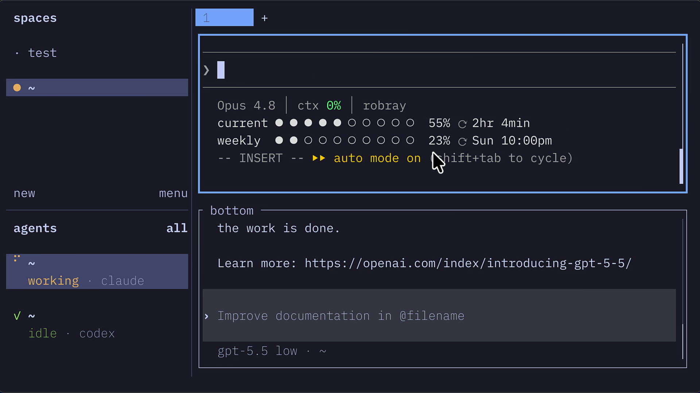
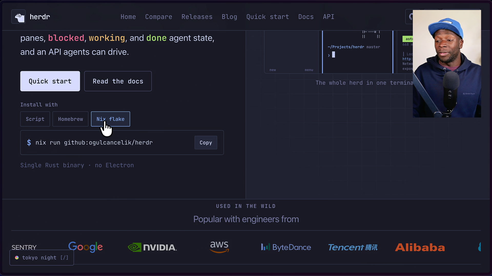
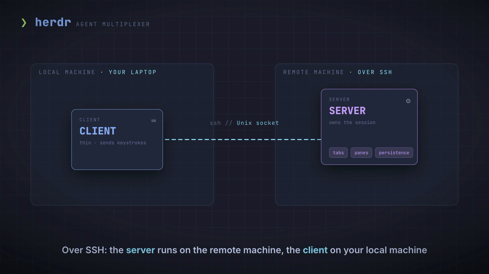
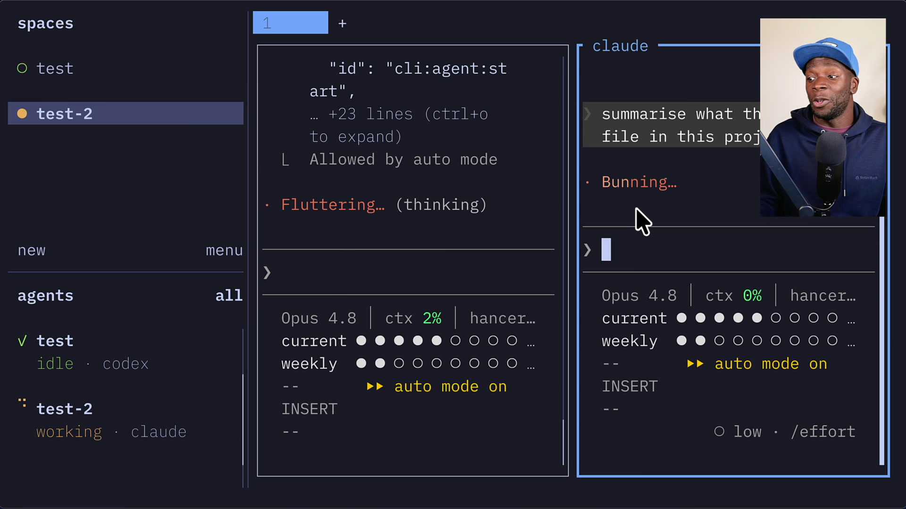
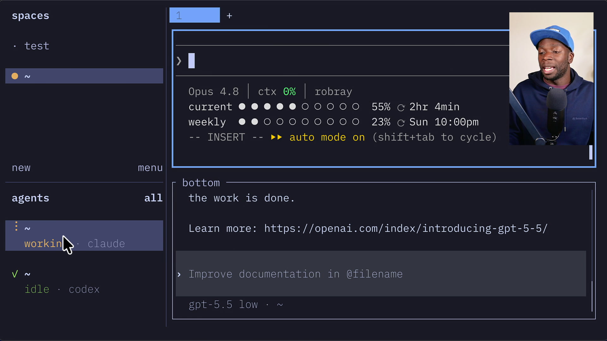
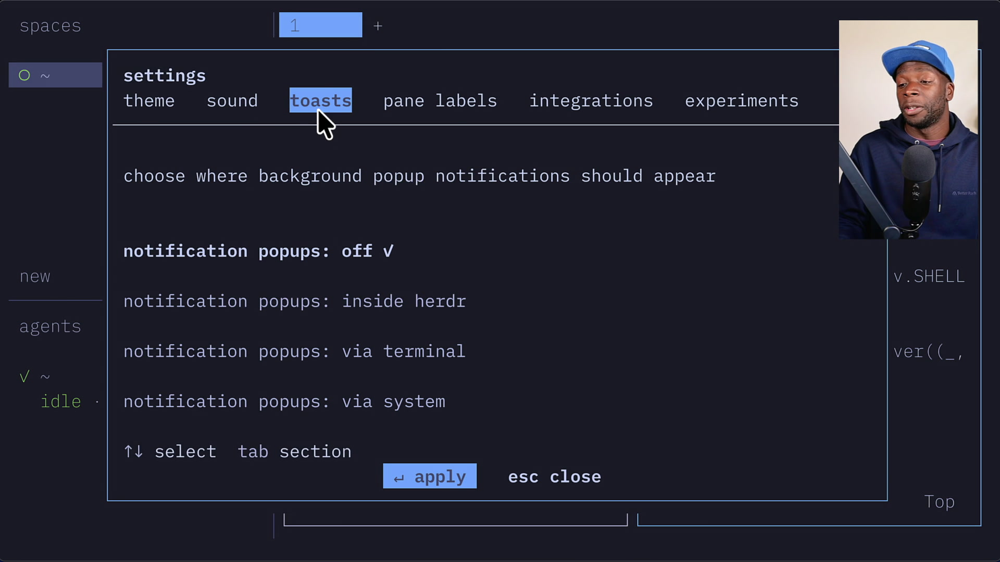
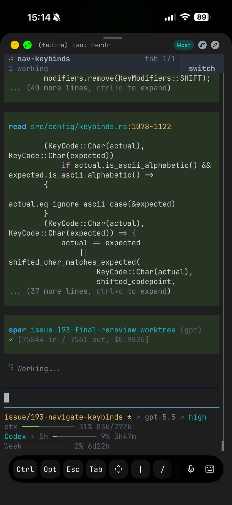
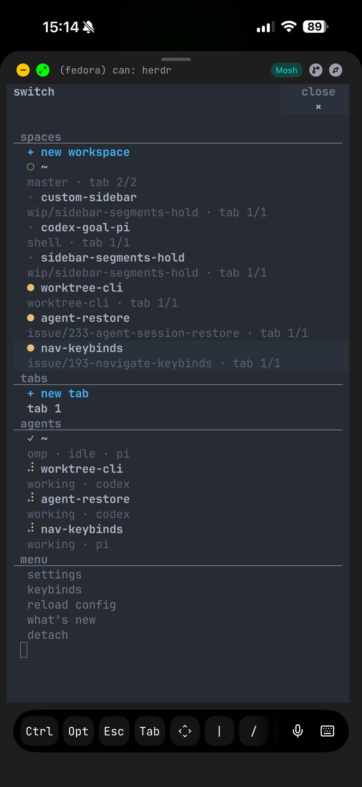

# herdr 使用手册（Windows / Arch Linux / macOS）

> - **版本**：tmux 3.7c（2026-08，3.8 开发中）｜ herdr 0.9.0
> - **平台**：Windows 11、Arch Linux、macOS
> - **整理日期**：2026-09-14
> - **来源**：tmux 官方 Wiki / man page、herdr 官方文档（herdr.dev/docs）、Better Stack 指南等，见文末链接。
> - **阅读提示**：先看第 0 章的**平台可用性总表**——tmux 在 Windows 上**没有原生版本**，而 herdr 有原生 Windows 版（GA）但有若干限制，这两点决定了你的选型。

---

## 目录

0. [平台可用性总表](#0-平台可用性总表)
13. [herdr 是什么](#13-herdr-是什么)
14. [herdr 安装（分平台）](#14-herdr-安装分平台)
15. [herdr 核心概念](#15-herdr-核心概念)
16. [herdr 快速上手](#16-herdr-快速上手)
17. [herdr 的 Agent 状态感知](#17-herdr-的-agent-状态感知)
18. [herdr 键位](#18-herdr-键位)
19. [herdr 配置 config.toml](#19-herdr-配置-configtoml)
20. [herdr 远程与多机器](#20-herdr-远程与多机器)
21. [herdr CLI 与 Socket API](#21-herdr-cli-与-socket-api)
22. [herdr 在 Windows 上的支持与限制](#22-herdr-在-windows-上的支持与限制)
23. [速查表](#23-速查表)
24. [参考链接与视频](#24-参考链接与视频)

---

## 0. 平台可用性总表

| 能力 | Windows 11 | Arch Linux | macOS |
|---|---|---|---|
| **tmux** 原生运行 | ❌ 无原生版 | ✅ `pacman -S tmux` | ✅ `brew install tmux` |
| tmux 可用途径 | WSL2（推荐）/ MSYS2 / Cygwin | 原生 | 原生 |
| tmux 在原生 cmd/PowerShell 控制台 | ❌（Cygwin/MSYS2 版只能在 mintty 里跑） | — | — |
| **herdr** 原生运行 | ✅ GA（有已知限制） | ✅ install.sh / AUR | ✅ `brew install herdr` |
| herdr 安装方式 | `install.ps1` / `install.cmd` / 手动 zip | 脚本 / AUR / Nix / mise | Homebrew / 脚本 / Nix / mise |
| herdr 作为 `--remote` 目标机 | ❌ 不支持 | ✅ 支持 | ✅ 支持 |
| herdr 客户端连接远程 | ✅（连 Linux/macOS） | ✅ | ✅ |

> **一句话选型**：
> - **Windows**：要原生体验选 **herdr**；想用 tmux 必须进 **WSL2**。
> - **Arch / macOS**：两者都原生，tmux 更轻更成熟，herdr 多了 Agent 状态感知。

### 三者定位对比（含 Zellij）

| 特性 | tmux | herdr | Zellij |
|---|---|---|---|
| 语言 / 许可 | C / ISC | Rust / Apache-2.0 | Rust / MIT |
| 出现时间 | 2007（最成熟） | 2026（新） | 2021 |
| 默认 prefix | `Ctrl b` | `Ctrl b` | 模式键（`Ctrl p/t/n/s/o`） |
| 会话持久化 | ✅ | ✅（server 常驻，可复活） | ✅（可复活） |
| 浮动窗格 | 3.8+ | ✅ | ✅ |
| Agent 状态感知 | ❌ | ✅ **核心卖点** | ❌ |
| 鼠标优先 | 部分 | ✅ | 部分 |
| Windows 原生 | ❌ | ✅（GA） | ✅ |
| 上手难度 | 需背键位 | 可纯鼠标 | 状态栏提示，最友好 |

---

## 13. herdr 是什么


**herdr** 是一个用 Rust 写的**面向 AI Agent 的终端复用器 / 运行时**（herdr.dev，Apache-2.0）。它采用 tmux 的 pane / tab / session 持久化模型，并**扩展了 Agent 感知能力**：

- 跑在 pane 里的 AI Agent（Claude Code、Codex、opencode、Cursor、Grok、Copilot 等 **22 种**）会被自动识别。
- 侧边栏实时显示每个 Agent 的状态：**`working` / `blocked` / `done` / `idle` / `unknown`**。
- **鼠标优先**：点窗格、拖边框、右键菜单即可完成大部分操作，键位可选。
- **常驻 server**：合上笔记本、断网、重启机器后，Agent 继续运行，重新 attach 即恢复。



它**不替换你的终端**（在 WezTerm / iTerm2 / Kitty / Windows Terminal 里运行），保留你的字体、配色、shell 配置。

---

## 14. herdr 安装（分平台）



### 14.1 Arch Linux

```bash
# 官方脚本
curl -fsSL https://herdr.dev/install.sh | sh

# AUR（社区维护，推荐给 Arch 用户）
yay -S herdr-bin          # 或 paru -S herdr-bin（0.9.0）

# Nix
nix run github:herdrdev/herdr/v0.x.y

# mise
mise use -g herdr
```

### 14.2 macOS

```bash
brew install herdr                     # Homebrew（推荐）
curl -fsSL https://herdr.dev/install.sh | sh   # 官方脚本
mise use -g herdr                      # mise
sudo port install herdr                # MacPorts（如提供）
```

### 14.3 Windows（原生，GA）

PowerShell：

```powershell
powershell -ExecutionPolicy Bypass -c "irm https://herdr.dev/install.ps1 | iex"
```

若被终端安全软件拦截 fileless 命令，改用 CMD：

```cmd
curl.exe -fsSLo install.cmd https://herdr.dev/install.cmd && install.cmd && del install.cmd
```

也可手动下载 `herdr-windows-x86_64.zip`（含 `herdr.exe` 和**同目录的 ConPTY 运行时**，**必须整目录保留，不能只拷 exe**）。

- 安装位置：`%USERPROFILE%\.herdr\packages\standalone\releases`，PATH 指向当前版本目录。
- Windows ARM64：跑 x86_64 版本（Windows 模拟）。

### 14.4 验证 / 更新

```bash
herdr --version
herdr update                       # 仅限官方脚本安装
herdr channel set stable|preview   # 切换稳定/预览通道
```

> Homebrew / mise / Nix 安装请用对应包管理器更新，不要用 `herdr update`。

---

## 15. herdr 核心概念



| 术语 | 含义 |
|---|---|
| **Workspace（工作区）** | 顶层项目容器，一个 repo / 任务一个。侧边栏状态由其内 Agent 汇总 |
| **Tab** | 工作区内的布局页，如 `agents`、`logs`、`server` |
| **Pane** | 真正的终端进程，可左右/上下分割，跨 client detach 后保留 |
| **Agent** | Herdr 在 pane 里识别出的 AI Agent 进程，带状态 |
| **Session** | 持久化的 server 命名空间（默认 `herdr`），命名 session 相互隔离 |
| **Client / Server** | server 常驻后台管理 pane 与进程；client 是终端 UI，可多个 |

**三种模式**：

- **Terminal mode**：按键直接发给当前 pane。
- **Prefix mode**：按 prefix（默认 `Ctrl b`）后等一个 Herdr 动作键。
- **Navigate mode**：常驻的工作区导航界面。

---

## 16. herdr 快速上手

```bash
cd ~/Projects/my-repo
herdr                 # 启动或 attach 到默认后台 session
```

1. **创建 Workspace**：session 无 workspace 时自动创建。每个项目一个 workspace。
2. **鼠标操作**：点 pane/tab/workspace/agent 聚焦；拖边框调大小；右键出菜单（含分割、建 tab）；拖动选文本即复制（无需 `Ctrl+C`）。
3. **跑一个 Agent**：在 pane 里执行 `claude` / `codex` / `opencode` 等，Herdr 自动识别并在侧边栏显示状态。
4. **键盘（可选）**：`Ctrl b` 进 prefix，然后按动作键。
5. **Detach / 回来**：`prefix+q` 或直接关终端窗口；server 与所有 Agent 继续跑，再执行 `herdr` 即重连。
6. **结束**：`herdr server stop`。

常用动作：

| 动作 | 键 |
|---|---|
| 向右分割 | `prefix+v` |
| 向下分割 | `prefix+minus` |
| 新建 tab | `prefix+c` |
| 下一个 / 上一个 tab | `prefix+n` / `prefix+p` |
| 工作区导航 | `prefix+w` |
| 新建工作区 | `prefix+shift+n` |
| Detach | `prefix+q` |



---

## 17. herdr 的 Agent 状态感知

这是 herdr 相对 tmux 的**核心差异**。



| 状态 | 含义 |
|---|---|
| `blocked` | Agent 在等你输入 / 授权 / 决策 |
| `working` | Agent 正在干活 |
| `done` | Agent 完成，但你还没看过 |
| `idle` | 已完成或等待，且已被你查看 |
| `unknown` | 无法确定 |

要点：

- 侧边栏**一眼看到**哪个项目需要你，不用逐个 pane 去翻。
- 支持 **22 种 Agent CLI** 自动检测；官方集成（Pi、Claude Code、Codex、GitHub Copilot CLI、Devin CLI、OpenCode、Kilo Code CLI、Droid、Kimi Code CLI、Qoder CLI、Antigravity CLI 等）能让状态更准。
- 后台 Agent 状态变化时，可触发**声音 / 系统通知**（见配置章）。



### 17.1 安装官方集成（integration install）

Herdr 靠**进程检测**识别 Agent，但**官方集成**能让状态更准（拿到会话标识、精确区分 working / blocked）。手动安装：

```bash
herdr integration install claude      # Claude Code
herdr integration install codex       # Codex
herdr integration install opencode    # OpenCode
herdr integration install cursor      # Cursor
```

官方集成清单（0.9.0）：

```text
pi  omp  claude  codex  copilot  devin  droid  kimi  opencode
kilo  hermes  qodercli  qwen  cursor  mastracode  antigravity-cli  grok
```

> **Windows 可用性更窄**：官方 Windows 文档明确当前支持 Pi、OMP、Claude Code、Codex、GitHub Copilot CLI、Devin CLI、OpenCode、Kilo Code CLI、Droid、Kimi Code CLI、Qoder CLI、Antigravity CLI；Herdr 会**隐藏或拒绝**在 Windows 上格式不支持的集成。

装好后在任意 pane 里启动该 Agent，侧边栏即显示其状态。

---

## 18. herdr 键位

> 默认 prefix = **`Ctrl b`**（与 tmux 相同）。`prefix+?` 查看全部；`prefix+s` 打开设置。

### 18.1 最常用的五个

| 动作 | 键 |
|---|---|
| 新建 tab | `prefix+c` |
| 向右 / 向下分割 | `prefix+v` / `prefix+minus` |
| 在 pane 间移动 | `prefix+h/j/k/l` |
| 工作区导航 | `prefix+w` |
| Detach | `prefix+q` |

### 18.2 窗格（Pane）

| 动作 | 键 |
|---|---|
| 缩放当前 pane | `prefix+z` |
| 关闭 pane | `prefix+x` |
| 交换 pane | `prefix+shift+h/j/k/l` |
| 调整大小模式 | `prefix+r` |
| 复制模式 | `prefix+[` |

### 18.3 Tab

| 动作 | 键 |
|---|---|
| 下一个 / 上一个 tab | `prefix+n` / `prefix+p` |
| 跳到 tab 1–9 | `prefix+1..9` |
| 重命名 tab | `prefix+shift+t` |
| 关闭 tab | `prefix+shift+x` |

### 18.4 工作区 / 会话

| 动作 | 键 |
|---|---|
| 新建工作区 | `prefix+shift+n` |
| 重命名工作区 | `prefix+shift+w` |
| 关闭工作区 | `prefix+shift+d` |
| Goto 选择器 | `prefix+g` |
| 显示/隐藏侧边栏 | `prefix+b` |

### 18.5 复制模式（Copy mode）

`prefix+[` 进入。**不会暂停 pane 进程**，输出继续在底部刷新。

- 移动：`h/j/k/l`、`w/b/e`、`W/B/E`、`{`/`}`、`PageUp/PageDown`、`ctrl+b/ctrl+f`、`ctrl+u/ctrl+d`
- 搜索：`/` 前向、`?` 后向，`n`/`N` 重复
- 选择：`v` 或 Space 开始，`y` 或 Enter 复制，`q`/Esc 退出
- 鼠标拖动选择即复制，无需进 copy mode

### 18.6 免 prefix（prefix-free）

可以把动作绑到直接组合键上。官方推荐最安全的一族是 **`ctrl+alt`**（终端几乎都空着，且不受 macOS Option 组合字符影响）：

```toml
[keys]
focus_pane_left  = ["prefix+h", "ctrl+alt+h"]
focus_pane_down  = ["prefix+j", "ctrl+alt+j"]
focus_pane_up    = ["prefix+k", "ctrl+alt+k"]
focus_pane_right = ["prefix+l", "ctrl+alt+l"]
new_tab          = ["prefix+c", "ctrl+alt+c"]
split_vertical   = ["prefix+v", "ctrl+alt+d"]
zoom             = ["prefix+z", "ctrl+alt+z"]
```

避开的组合：`ctrl+alt+arrows`（GNOME/Ghostty/Konsole）、`ctrl+alt+t`（Ubuntu 启动终端）、`ctrl+alt+l`/`ctrl+alt+a`（KDE）、`ctrl+alt+f1..f12`（Linux 虚拟控制台）。

---

## 19. herdr 配置 config.toml

### 19.1 位置

| 平台 | 路径 |
|---|---|
| Windows | `%APPDATA%\herdr\config.toml` |
| Arch Linux | `~/.config/herdr/config.toml` |
| macOS | `~/.config/herdr/config.toml` |

```bash
herdr --help                          # 查看本机实际解析到的路径
herdr --default-config                # 打印完整默认配置
herdr --default-config > ~/.config/herdr/config.toml   # 作为起点
herdr server reload-config            # 重载（也可在应用内 global menu → reload config）
```

### 19.2 常用配置

**改 prefix**：

```toml
[keys]
prefix = "ctrl+space"
```

**默认 shell**（三平台示例）：

```toml
[terminal]
# Windows
default_shell = "pwsh.exe"
# Arch Linux
# default_shell = "zsh"
# macOS
# default_shell = "/bin/zsh"

shell_mode = "auto"     # macOS 上会用 login shell，确保 Homebrew PATH 生效
new_cwd    = "follow"   # follow | home | current | 固定路径
```

**主题**（内建：Catppuccin、Gruvbox、Nord、Dracula、Tokyo Night 等，`terminal` 表示跟随宿主终端配色）：

```toml
[theme]
name = "catppuccin"
```

**通知与声音**：

```toml
[ui.toast]
delivery = "herdr"        # herdr | terminal | system | off
[ui.toast.herdr]
position = "bottom-right"

[ui.sound]
done_path    = "sounds/done.mp3"      # 必须是 mp3，相对路径基于 config 所在目录
request_path = "sounds/request.mp3"
```

**侧边栏状态用符号区分（不只看颜色）**：

```toml
[ui]
status_indicators = "symbols"
```

**Git worktree 根目录**：

```toml
[worktrees]
directory = "~/.herdr/worktrees"
```

**自定义命令快捷键**（`popup` 弹窗 / `pane` 临时窗格 / `shell` 后台 / `plugin_action`）：

```toml
[[keys.command]]
key = "prefix+alt+g"
type = "popup"
command = "lazygit"
description = "run lazygit"
width = "80%"
height = "80%"
```

> Windows 上自定义命令用 `cmd.exe /d /c` 执行，环境变量用 `%HERDR_BIN_PATH%` 语法；要跑 PowerShell 就显式写 `powershell.exe -NoProfile -Command "..."`。

### 19.3 环境变量

| 变量 | 用途 |
|---|---|
| `HERDR_CONFIG_PATH` | 覆盖配置文件路径 |
| `HERDR_SESSION` | 为 CLI 指定命名 session |
| `HERDR_SOCKET_PATH` | 覆盖底层 socket 路径 |
| `HERDR_LOG` | 日志过滤，如 `HERDR_LOG=herdr=debug` |
| `HERDR_DISABLE_SOUND` | 禁用声音 |

日志：`~/.config/herdr/herdr.log`、`herdr-client.log`、`herdr-server.log`（自动轮转）。

### 19.4 辅助命令

```bash
herdr --help                 # 显示本机解析到的配置路径
herdr --default-config       # 打印完整默认配置（可作为起点）
herdr config reset-keys      # 重置键位：备份 config.toml，删除 [keys]/[[keys.command]]，恢复内置 v2 默认
herdr server reload-config   # 重载配置
herdr channel set stable     # 切换更新通道（stable | preview）
```

### 19.5 高级配置

**无客户端时的虚拟终端尺寸**（headless 编排用）：

```toml
[server]
headless_cols = 160
headless_rows = 50
```

**侧边栏行布局**（`rows` 是「数组的数组」，每个内层数组渲染成一行）：

```toml
[ui.sidebar.agents]
rows = [
  ["state_icon", "agent", "state_text"],
  ["workspace", "tab"],
]

[ui.sidebar.agents.rows_by_agent]
claude = [
  ["state_icon", "agent", "state_text"],
  ["terminal_title_stripped"],
  ["workspace", "tab"],
]

[ui.sidebar.spaces]
rows = [
  ["state_icon", "workspace"],
  ["branch", "git_status"],
]
```

常用 token：`state_icon` / `state_text` / `machine` / `workspace` / `tab` / `pane` / `agent` / `terminal_title` / `branch` / `git_status`；自定义 `$name` token 用 `herdr pane report-metadata` / `herdr workspace report-metadata` 上报。

**终端默认与 Kitty 图形**：

```toml
[terminal]
default_shell  = "pwsh.exe"    # 或 zsh / /bin/zsh
shell_mode     = "auto"        # macOS 上会用 login shell
new_cwd        = "follow"      # follow | home | current | 固定路径
kitty_graphics = true          # 外层终端不支持时设为 false
```

**Agent 会话恢复**：

```toml
[session]
resume_agents_on_restore = true   # 重启 server 后按官方集成恢复 Agent 对话
```

> 完整字段见官方 [Config reference](https://herdr.dev/docs/config-reference/)。

### 19.6 插件与 Marketplace

Herdr 插件是**可执行的工作流包**：一个目录 + `herdr-plugin.toml` 清单 + 可执行命令。语言任意（Bash / JS / Lua / Rust / Python…），**整个 Herdr CLI 就是插件 API**。

```bash
herdr plugin install owner/repo/subdir   # 从 GitHub 安装（仅支持 owner/repo 简写）
herdr plugin link /path/to/plugin        # 本地开发时链接目录
herdr plugin list
herdr plugin config-dir <id>
herdr plugin action list --plugin <id>
herdr plugin action invoke <plugin.action>
herdr plugin pane open --plugin <id> --entrypoint <pane-id>
herdr plugin log list --plugin <id>
herdr plugin uninstall <id-or-source>
```

清单示例：

```toml
id = "example.layout"
name = "Layout"
version = "0.1.0"
min_herdr_version = "0.7.0"
platforms = ["linux", "macos", "windows"]

[[actions]]
id = "apply"
title = "Apply layout"
contexts = ["workspace"]
command = ["node", "dist/apply.js"]

[[events]]
on = "worktree.created"
command = ["herdr", "workspace", "list"]
```

- 插件用 `HERDR_BIN_PATH` 回调 Herdr（跨 Unix socket / **Windows 命名管道**都可用）。
- 运行环境变量：`HERDR_PLUGIN_ID`、`HERDR_PLUGIN_ROOT`、`HERDR_PLUGIN_CONFIG_DIR`、`HERDR_PLUGIN_STATE_DIR`、`HERDR_PLUGIN_CONTEXT_JSON` 等。
- **安全**：插件就是本机代码；`plugin install` 会在交互终端显示预览再确认。只装可信来源，`--yes` 跳过确认、`--ref` 固定版本。
- **Marketplace**：给 GitHub 仓库打 `herdr-plugin` topic 即可被收录（索引每 30 分钟刷新）。

> 文档：[Plugins](https://herdr.dev/docs/plugins/) · [Marketplace](https://herdr.dev/docs/marketplace/)

---

## 20. herdr 远程与多机器



Herdr 是 **client-server** 架构，天然适合远程：

```bash
herdr --remote ssh://user@your-remote-server
herdr --remote workbox          # 用 SSH config 里的别名
```

- **server 跑在远端**（能访问远端文件与算力），**client 跑在本地**，用本地 `~/.config/herdr/config.toml` 的键位/主题/设置。
- 本地/远端机器可并存于同一个窗口，`herdr machine add workbox` 添加机器，侧边栏统一显示各机器的 workspace 与 agent。
- 断线后远端 Agent 继续运行。

> **Windows 限制**：Windows 可**作为客户端**连 Linux/macOS；但 **Windows 不能作为 `--remote` 的目标主机**（见下章）。



---

## 21. herdr CLI 与 Socket API

CLI 在 TUI 运行时也可用；外部进程（包括 Agent 自己）可以用它来编排。

```bash
herdr                          # 启动/attach 默认 session
herdr session list             # 列出命名 session
herdr session attach work      # attach 到命名 session
herdr server stop              # 停止 server（结束 pane）
herdr server reload-config     # 重载配置
herdr pane split-right         # 向右分割
herdr agent read               # 读取 pane 输出
herdr pane close               # 关闭 pane
herdr pane report-metadata ... # 上报自定义侧边栏元数据
herdr update                   # 更新（官方脚本安装）
herdr channel set preview      # 切到预览通道
```

**Socket API**：本地通过 socket（Unix socket；Windows 走对应实现）暴露同样的能力，供脚本 / Agent 驱动。典型玩法：给 Agent 一个高层任务，它自己开 pane、跑工具、读输出、汇总、关 pane。

---

## 22. herdr 在 Windows 上的支持与限制

herdr 官方 Windows 支持为 **GA（generally available）**，但有明确的限制清单。

### 22.1 ✅ 支持

| 能力 | 状态 |
|---|---|
| 本地持久化 session | 支持 |
| ConPTY 原生窗格 | 支持 |
| Windows Terminal / PowerShell attach | 支持 |
| `herdr --remote` 连 Linux/macOS 主机 | 支持 |
| `cmd.exe` 窗格 | 支持 |
| 原生键鼠输入 | 支持 |
| Agent 进程树检测、集成安装（部分 Agent） | 支持 |
| 系统通知与 MP3 声音 | 支持 |
| 插件 | 预览（best-effort） |
| 窗格屏幕历史 | 支持 |

### 22.2 ⚠️ 部分支持

| 能力 | 状态 |
|---|---|
| shell `cd` 后的实时 cwd | 部分（PowerShell 逻辑 cd 跟踪不可靠，建议用 shell 集成/OSC7） |
| 本地 pane 内粘贴剪贴板图片给 Agent | 取决于终端/Agent |
| CJK 输入法候选框定位 | 部分（可用 `[ui] host_cursor = "native"` 改善） |
| Kitty graphics 图片渲染 | 取决于外层终端（Windows Terminal 不支持该路径） |
| 宿主光标渲染 | 部分（默认绘制光标，稳定但不闪烁/不变形） |

### 22.3 ❌ 不支持

| 能力 | 状态 |
|---|---|
| 直接终端 attach（`herdr terminal attach`） | 不支持 |
| Windows 作为 `herdr --remote` 目标主机 | 不支持 |
| Live server handoff（热升级） | 不支持 |
| Unix fd handoff | 不支持 |
| Unix 前台进程组检测 | 不支持 |
| 本地原生 pane 的剪贴板图片桥接 | 不支持 |
| 签名二进制 / 规避 SmartScreen | 不支持 |

### 22.4 Windows 使用要点

- **复制**：在 pane 内拖动选择即复制（Herdr 管理）。
- **粘贴**：Windows Terminal 里用 **`Ctrl+Shift+V`**；多行粘贴会被括号包裹，作为一次粘贴处理。
- **外层终端粘贴**：按住 `Shift` 再右键。
- **ConPTY**：Windows 包内置微软当前版 app-local ConPTY（旧版 Win10 系统 ConPTY 会丢 Kitty 键盘协议序列）。诊断兼容问题时才设 `HERDR_WINDOWS_CONPTY=system`。
- **光标闪烁/跳位**：原生 Windows 终端在重绘时可能暴露中间位置，这是 ConPTY 的已知现象；默认 `host_cursor = "auto"` 在 Windows 上绘制光标以稳定画面。
- **IME**：绘制光标不参与 IME 定位，中日韩候选框可能位置不对；需要时 `[ui] host_cursor = "native"`。

---

## 23. 速查表

### 23.2 herdr（prefix = `Ctrl b`）

| 目的 | 操作 |
|---|---|
| 启动/重连 | `herdr` |
| 新 tab | `prefix+c` |
| 右分割 / 下分割 | `prefix+v` / `prefix+minus` |
| 切窗格 | `prefix+h/j/k/l` |
| 工作区导航 | `prefix+w` |
| 新工作区 | `prefix+shift+n` |
| 复制模式 | `prefix+[` |
| 键位帮助 | `prefix+?` |
| Detach | `prefix+q` |
| 停止 server | `herdr server stop` |
| 远程 | `herdr --remote ssh://user@host` |

### 23.3 平台可用性（再强调一次）

```text
                Windows            Arch Linux        macOS
tmux            ✗ 原生             ✓ pacman          ✓ brew
                → WSL2 / MSYS2 / Cygwin
herdr           ✓ 原生（有限制）    ✓ 脚本/AUR        ✓ brew
```

---

## 24. 参考链接与视频

### herdr

- 官网：<https://herdr.dev/>
- 文档首页：<https://herdr.dev/docs/>
- 安装：<https://herdr.dev/docs/install/>
- 快速上手：<https://herdr.dev/docs/quick-start/>
- 概念：<https://herdr.dev/docs/concepts/>
- 键盘：<https://herdr.dev/docs/keyboard/>
- 配置：<https://herdr.dev/docs/configuration/>
- **Windows 支持与限制**：<https://herdr.dev/docs/windows-beta/>
- Socket API：<https://herdr.dev/docs/socket-api/>
- GitHub：<https://github.com/herdrdev/herdr>
- Better Stack 指南：<https://betterstack.com/community/guides/ai/herdr-ai-agent/>

### 相关文件位置

| 内容 | Windows | Arch Linux | macOS |
|---|---|---|---|
| tmux 配置 | WSL/MSYS2 内的 `~/.tmux.conf` 或 `~/.config/tmux/tmux.conf` | `~/.tmux.conf` / `~/.config/tmux/tmux.conf` | 同左 |
| herdr 配置 | `%APPDATA%\herdr\config.toml` | `~/.config/herdr/config.toml` | `~/.config/herdr/config.toml` |
| herdr 日志 | `~/.config/herdr/herdr*.log`（Windows 同目录） | 同左 | 同左 |
| 本手册配图 | `./images/` | `./images/` | `./images/` |

---

> 图片版权归 tmux 项目（Wiki）与 herdr 项目所有，来源分别为 <https://github.com/tmux/tmux/wiki> 与 <https://herdr.dev>、Better Stack。本手册仅供个人学习使用。
