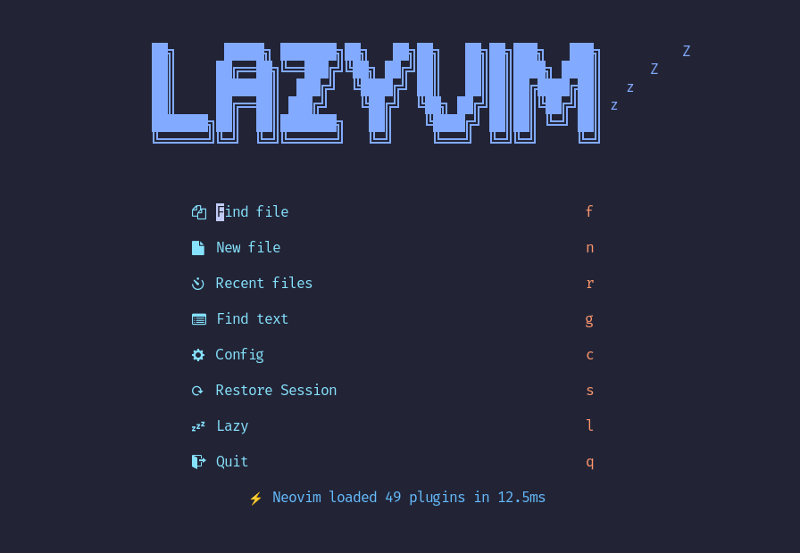
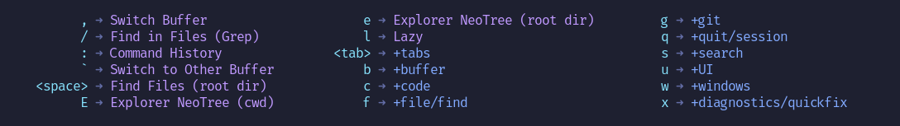
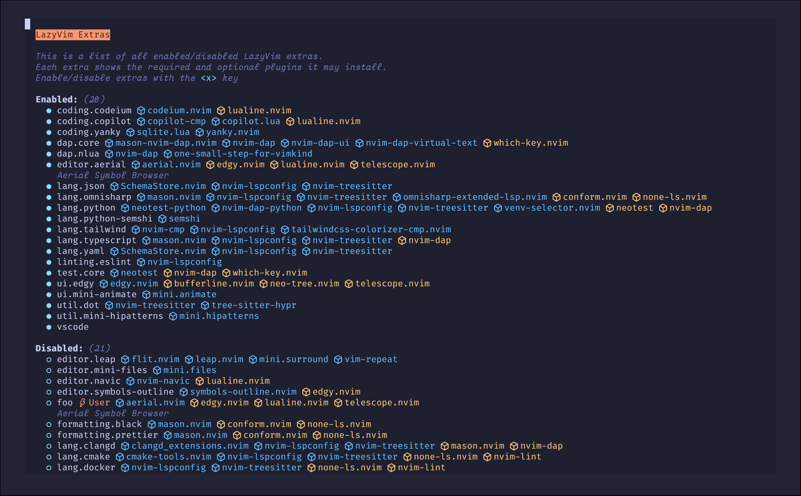

# LazyVim 使用手册（Windows / Arch Linux / macOS）

> - **版本**：LazyVim **v16.0.1** ｜ 运行于 Neovim **0.12.x**（官方要求 ≥ 0.11.2，需带 LuaJIT）
> - **官方文档**：<https://www.lazyvim.org/> ｜ GitHub：<https://github.com/LazyVim/LazyVim> ｜ Starter：<https://github.com/LazyVim/starter>
> - **整理日期**：2026-09-14
> - **说明**：本手册以**官方文档（安装 / 键位 / Extras / 配置）**为准，并参考听风 347 的《LazyVim 使用教程与快捷键指南》（同为 LazyVim 16.x）。
> - **先记住四件事**：
>   1. **`<leader>` 就是空格键**。`<leader>ff` = 按「空格、f、f」。`\` 是 `<localleader>`。
>   2. 不必背完：普通模式按一下 `Space`，which-key 会弹出可继续按的菜单；`Space ?` 只看当前缓冲区可用的键。
>   3. `:Tutor` 是练 Vim 基础的最佳交互教程。
>   4. `<Esc>` 还会**清除搜索高亮**；`<C-s>` 在普通/插入/可视模式都能保存。

---

## 目录

0. [平台可用性总表](#0-平台可用性总表)
1. [LazyVim 是什么](#1-lazyvim-是什么)
2. [前置条件](#2-前置条件)
3. [安装（分平台）](#3-安装分平台)
4. [目录结构与配置文件](#4-目录结构与配置文件)
5. [界面与核心概念](#5-界面与核心概念)
6. [Vim 基础：操作符 + 范围](#6-vim-基础操作符--范围)
7. [键位大全（官方默认）](#7-键位大全官方默认)
8. [Snacks Picker 小抄](#8-snacks-picker-小抄)
9. [Extras 与语言支持](#9-extras-与语言支持)
10. [与 Vim 原生键的冲突](#10-与-vim-原生键的冲突)
11. [自定义配置](#11-自定义配置)
12. [平台注意事项](#12-平台注意事项)
13. [速查表](#13-速查表)
14. [参考链接](#14-参考链接)

---

## 0. 平台可用性总表

| 项 | Windows | Arch Linux | macOS |
|---|---|---|---|
| Neovim 安装 | `winget install Neovim.Neovim` / scoop | `sudo pacman -S neovim` | `brew install neovim` |
| 配置目录 | `%LOCALAPPDATA%\nvim` | `~/.config/nvim` | `~/.config/nvim` |
| 数据目录 | `%LOCALAPPDATA%\nvim-data` | `~/.local/share/nvim` | `~/.local/share/nvim` |
| LazyVim 支持 | ✅（官方 Starter 有 PowerShell 版） | ✅ | ✅ |
| 推荐终端（true color + undercurl） | WezTerm / Alacritty / Ghostty | kitty / WezTerm / Alacritty / Ghostty | kitty / iTerm2 / WezTerm / Alacritty / Ghostty |
| lazygit（可选） | `winget install JesseDuffield.lazygit` | `sudo pacman -S lazygit` | `brew install lazygit` |
| Nerd Font（可选，图标） | ✅ | ✅ | ✅ |

> **关键点**：LazyVim 的配置**三平台写法一致**（都是 `lua/config` + `lua/plugins`），只有**路径不同**——Unix 是 `~/.config/nvim`，Windows 是 `%LOCALAPPDATA%\nvim`。

---

## 1. LazyVim 是什么


**LazyVim** 是一套基于 [lazy.nvim](https://github.com/folke/lazy.nvim) 插件管理器的 **Neovim 配置框架**（不是 Neovim 分支，也不是插件）。它把 Neovim 变成开箱可用的 IDE，同时保留「用 lazy.nvim 轻松扩展/覆盖」的能力。


**特性**：

- 🔥 把 Neovim 变成完整 IDE
- 💤 用 lazy.nvim 定制与扩展
- 🚀 启动快
- 🧹 options / autocmds / keymaps 都有合理默认
- 📦 预配置大量插件

**核心工作流组件**（LazyVim 16.x）：

| 组件 | 作用 |
|---|---|
| **Snacks** | 文件检索（Picker）、文件浏览器（Explorer）、终端、通知、Dashboard |
| **blink.cmp** | 代码补全引擎（已取代 nvim-cmp） |
| **LSP / Mason** | 语言服务器管理与智能提示 |
| **Conform** | 代码格式化 |
| **gitsigns** | 行内 Git 变更标记与 hunk 操作 |
| **Trouble** | 诊断与问题集中面板 |
| **Flash** | 快速跳转 |
| **which-key** | 按键提示菜单 |
| **noice** | 命令行 / 消息 UI |
| **persistence** | 会话保存与恢复 |

> ⚠️ 注意：**LazyVim 16.x 用 Snacks 取代了 Telescope**，用 **blink.cmp 取代了 nvim-cmp**。网上老教程里的 `Telescope` 键位已不再适用。

---

## 2. 前置条件

官方 Requirements：

- **Neovim ≥ 0.11.2**（必须带 **LuaJIT**）
- **Git ≥ 2.19.0**（partial clone）
- **curl**（blink.cmp 需要）
- **tree-sitter-cli** + **C 编译器**（nvim-treesitter）
- **Nerd Font v3.0+**（可选，但图标需要）
- **lazygit**（可选）
- 可选（fzf-lua）：`fzf` ≥ 0.25.1、`ripgrep`、`fd`
- 支持 **true color + undercurl** 的终端：kitty、WezTerm、Alacritty、iTerm2、Ghostty

---

## 3. 安装（分平台）

LazyVim 通过 **Starter 模板**安装。

### 3.1 Linux / macOS

```bash
# 1) 备份现有配置（required）
mv ~/.config/nvim{,.bak}
# 可选但推荐
mv ~/.local/share/nvim{,.bak}
mv ~/.local/state/nvim{,.bak}
mv ~/.cache/nvim{,.bak}

# 2) 克隆 starter
git clone https://github.com/LazyVim/starter ~/.config/nvim

# 3) 删掉 .git（方便以后纳入自己的仓库）
rm -rf ~/.config/nvim/.git

# 4) 启动
nvim
```

### 3.2 Windows（PowerShell）

```powershell
# 1) 备份
Move-Item $env:LOCALAPPDATA\nvim $env:LOCALAPPDATA\nvim.bak
Move-Item $env:LOCALAPPDATA\nvim-data $env:LOCALAPPDATA\nvim-data.bak

# 2) 克隆 starter
git clone https://github.com/LazyVim/starter $env:LOCALAPPDATA\nvim

# 3) 删除 .git
Remove-Item $env:LOCALAPPDATA\nvim\.git -Recurse -Force

# 4) 启动
nvim
```

### 3.3 用 Docker 试用

```bash
docker run -w /root -it --rm fedora:latest sh -uelic '
  dnf copr enable -y dejan/lazygit
  dnf install -y git lazygit fd-find curl ripgrep tree-sitter-cli neovim
  git clone https://github.com/LazyVim/starter ~/.config/nvim
  cd ~/.config/nvim && nvim'
```

### 3.4 装完先体检

```vim
:LazyHealth
```

它会加载所有插件并检查是否一切正常。

---

## 4. 目录结构与配置文件

Starter 的结构：

```text
~/.config/nvim/                 （Windows: %LOCALAPPDATA%\nvim\）
├── init.lua                    # 入口：require("config.lazy")
├── lazyvim.json                # 已启用的 Extras 记录（:LazyExtras 写入）
├── stylua.toml                 # Lua 格式化风格
└── lua/
    ├── config/
    │   ├── lazy.lua            # 引导 lazy.nvim + 载入 LazyVim
    │   ├── options.lua         # vim.opt.* 选项
    │   ├── keymaps.lua         # 自定义键位
    │   └── autocmds.lua        # 自动命令
    └── plugins/                # 你的插件覆盖（*.lua，每个返回一个 spec）
        └── example.lua
```

关键点：

- `lua/config/lazy.lua` 里 `{ "LazyVim/LazyVim", import = "lazyvim.plugins" }` 载入 LazyVim 全部默认插件。
- `lua/plugins/*.lua` 用来**覆盖或追加**插件（同名 spec 会合并）。
- **`lazyvim.json`** 记录启用的 Extras，`nvim` 启动时按它加载。

---

## 5. 界面与核心概念



| 概念 | 说明 |
|---|---|
| **`<leader>`** | 默认 **`Space`**；`<localleader>` 默认 `\` |
| **which-key** | 按前缀（如 `Space`）弹出可继续按的菜单，**不用背键位** |
| **Snacks Picker** | 统一的检索 UI（文件、grep、缓冲区、命令…） |
| **buffer（缓冲区）** | 已打开的文件，≠ 操作系统窗口；关缓冲区通常不破坏分屏布局 |
| **LSP 附着** | 部分键位（`gd`/`gr`/`K`…）**只在当前缓冲区有语言服务器时**生效 |
| **Extras** | 按需启用的语言/工具支持，用 `:LazyExtras` 管理 |




---

## 6. Vim 基础：操作符 + 范围

Vim 的高效不在记很多快捷键，而在把命令当**短语**组合：

```text
[次数] + 操作符 + 移动范围 / 文本对象
```

- **操作符**：`d` 删除、`c` 修改、`y` 复制
- **范围**：`w` 下个词、`$` 行尾、`iw` 当前词内部
- 例：`dw` 删到下一个词、`3dw` 连删三个词、`d$`（=`D`）删到行尾、`ciw` 改写当前词、`ci"` 改双引号内、`yap` 复制整段
- 操作符**重复一次**通常表示「整行」：`dd` `cc` `yy` `>>` `<<` `==`

### 6.1 进入插入与基础修改

| 键 | 含义 |
|---|---|
| `i` / `a` | 光标前 / 后插入 |
| `I` / `A` | 行首非空处 / 行尾插入 |
| `o` / `O` | 下方 / 上方新建一行并插入 |
| `x` / `X` | 删除光标下 / 前一个字符 |
| `r{字符}` | 替换光标下字符 |
| `R` | 连续替换模式 |
| `J` | 把下一行接到当前行 |
| `~` | 切换字符大小写 |
| `u` / `<C-r>` | 撤销 / 重做 |
| `.` | 重复上一次修改 |

### 6.2 移动范围

| 键 | 作用 |
|---|---|
| `w`/`W`、`b`/`B`、`e`/`E`/`ge` | 词 / 大词的 前进、后退、词尾 |
| `0` / `^` / `$` | 第 0 列 / 首个非空 / 行尾 |
| `gg` / `G` / `{数字}G` | 文件首 / 尾 / 指定行 |
| `{` / `}` | 上一 / 下一段落 |
| `(` / `)` | 上一 / 下一句子 |
| `%` | 在配对括号间跳转 |
| `<C-d>`/`<C-u>`、`<C-f>`/`<C-b>` | 滚半屏 / 滚一屏 |
| `zz` / `zt` / `zb` | 当前行置中 / 顶 / 底 |
| `;` / `,` | 重复 / 反向重复 `f`、`t` 查找 |

### 6.3 文本对象（`i` 内 / `a` 含边界）

| 对象 | 范围 |
|---|---|
| `iw` / `aw` | 词 |
| `iW` / `aW` | 大词（路径、URL 友好） |
| `i"` `i'` `` i` `` | 引号内 |
| `i)` `i]` `i}` | 括号内 |
| `it` / `at` | HTML/XML 标签 |
| `ip` / `ap` | 段落 |
| `is` / `as` | 句子 |

### 6.4 复制粘贴与寄存器

| 键 | 作用 |
|---|---|
| `yy` / `y{范围}` | 复制行 / 范围（LazyVim 里 `Y` = `y$`） |
| `p` / `P` | 光标后 / 前粘贴 |
| `gp` / `gP` | 粘贴并把光标留在新文本后 |
| `"0p` | 粘贴最近一次**复制**（不受删除污染） |
| `"_d{范围}` | 删除到黑洞寄存器（不覆盖待粘贴内容） |
| `"+y` / `"+p` | 与**系统剪贴板**交互 |
| `:reg` 或 `Space s"` | 查看寄存器 |

### 6.5 可视选择、搜索、宏

| 键 | 作用 |
|---|---|
| `v` / `V` / `<C-v>` | 字符 / 行 / 矩形块选择 |
| `o` / `gv` | 切换选择端点 / 重选上次区域 |
| `>` / `<` / `=` | 缩进 / 反缩进 / 自动缩进 |
| `gU` / `gu` / `~` | 大写 / 小写 / 反转大小写 |
| `/文本` `?文本` | 向下 / 向上搜索（`n`/`N` 继续） |
| `*` / `#` | 搜索光标下完整单词 |
| `:%s/旧/新/gc` | 全文件逐项确认替换 |
| `m{a}` / `` `{a} `` | 设置标记 / 精确跳回 |
| `<C-o>` / `<C-i>` | 跳转列表后退 / 前进 |
| `qa` … `q` / `@a` / `@@` | 录制 / 执行宏 / 重复宏 |

---

## 7. 键位大全（官方默认）

> 完整索引见 <https://www.lazyvim.org/keymaps>。下表为 **LazyVim 核心默认**（不含需要 Extra 的项）。

### 7.1 通用 / 窗口 / 缓冲区

| 键 | 作用 | 模式 |
|---|---|---|
| `j` / `k` | 下 / 上（**按屏幕行**，长行换行也逐行） | n,x |
| `gj` / `gk` | 明确按屏幕行移动 | n |
| `<C-h/j/k/l>` | 切到 左/下/上/右 窗口 | n |
| `<C-Up/Down>` | 增 / 减窗口高度 | n |
| `<C-Left/Right>` | 减 / 增窗口宽度 | n |
| `<A-j>` / `<A-k>` | 当前行或选中块 下移 / 上移 | n,i,v |
| `<leader>-` / `<leader>\|` | 下方水平分屏 / 右侧垂直分屏 | n |
| `<leader>wd` | 删除窗口 | n |
| `<leader>wm` / `<leader>uZ` | 窗口缩放开关 | n |
| `<leader>uz` | Zen 专注模式 | n |
| `<S-h>` / `<S-l>`、`[b` / `]b` | 上 / 下一个缓冲区 | n |
| `<leader>bb` / `` <leader>` `` | 切到另一个缓冲区 | n |
| `<leader>bd` | 关闭缓冲区 | n |
| `<leader>bo` / `<leader>bi` | 关闭其他 / 不可见缓冲区 | n |
| `<leader>bD` | 关闭缓冲区和窗口 | n |
| `<leader>bj` / `<leader>bp` | 选择缓冲区 / 固定切换 | n |
| `<Esc>` | 退出模式并**清除搜索高亮** | i,n,s |
| `<C-s>` | **保存文件** | i,n,v,s |
| `n` / `N` | 下一 / 上一搜索结果 | n,x,o |
| `<leader>ur` | 重绘 / 清高亮 / 更新 diff | n |
| `gco` / `gcO` | 在下方 / 上方新增注释行 | n |
| `<leader>qq` | 退出全部 | n |
| `<leader>fn` | 新建文件 | n |
| `<leader>K` | 对光标词运行 `keywordprg` | n |

### 7.2 标签页

| 键 | 作用 |
|---|---|
| `<leader><tab><tab>` | 新建标签页 |
| `<leader><tab>]` / `[` | 下一个 / 上一个 |
| `<leader><tab>d` / `o` | 关闭 / 仅保留当前 |
| `<leader><tab>f` / `l` | 第一个 / 最后一个 |

### 7.3 LSP（需语言服务器附着）

| 键 | 作用 |
|---|---|
| `gd` | 跳到定义 |
| `gD` | 跳到声明 |
| `gr` | 查找引用 |
| `gI` | 跳到实现 |
| `gy` | 跳到类型定义 |
| `K` | 悬浮文档（hover） |
| `gK` / 插入模式 `<C-k>` | 函数签名帮助 |
| `<leader>ca` | 代码操作（修复/导入/重构） |
| `<leader>cr` | 重命名符号 |
| `<leader>cR` | 重命名文件 |
| `<leader>co` | 整理 import |
| `<leader>cA` | Source 类代码操作 |
| `<leader>cl` | 查看 LSP 信息 |
| `<leader>cc` / `<leader>cC` | 运行 / 刷新 Codelens |
| `]]` / `[[`、`<A-n>` / `<A-p>` | 下 / 上一个引用 |
| `gai` / `gao` | 查看 入 / 出 调用 |
| `<leader>ss` / `<leader>sS` | LSP 符号 / 工作区符号 |

### 7.4 诊断 / 格式化 / Trouble

| 键 | 作用 |
|---|---|
| `]d` / `[d` | 下 / 上一条诊断 |
| `]e` / `[e` | 下 / 上一条错误 |
| `]w` / `[w` | 下 / 上一条警告 |
| `<leader>cd` | 显示光标处诊断 |
| `<leader>cf` / `<leader>cF` | 格式化当前文件 / 注入语言 |
| `<leader>xx` / `<leader>xX` | Trouble：全部 / 当前缓冲区诊断 |
| `<leader>cs` / `<leader>cS` | Trouble：符号 / LSP 位置列表 |
| `<leader>xL` / `<leader>xQ` | Trouble：位置列表 / quickfix |
| `]q` / `[q` | 下 / 上一个 quickfix 项 |
| `<leader>xl` / `<leader>xq` | 位置列表 / quickfix 列表 |

### 7.5 文件与检索（Snacks）

| 键 | 作用 |
|---|---|
| `<leader>ff` | 在**项目根**找文件 |
| `<leader>fF` | 在**当前目录（cwd）**找文件 |
| `<leader>fg` | 按 git 跟踪文件找 |
| `<leader>fr` / `<leader>fR` | 最近文件（根 / cwd） |
| `<leader>fp` | 切换项目 |
| `<leader>fc` | 找 LazyVim 配置文件 |
| `<leader>fn` | 新建文件 |
| `<leader>e` / `<leader>E` | Snacks Explorer（根 / cwd） |
| `<leader>fe` / `<leader>fE` | 同上（别名） |
| `<leader><space>` | 找文件（根） |
| `<leader>,` | 缓冲区列表 |
| `<leader>/` | 在根目录全文 Grep |
| `<leader>sg` / `<leader>sG` | 全文 Grep（根 / cwd） |
| `<leader>sw` / `<leader>sW` | 搜索光标词或可视选区（根 / cwd） |
| `<leader>sb` / `<leader>sB` | 当前缓冲区 / 已开缓冲区搜索 |
| `<leader>sR` | 恢复最近一次 Picker 搜索 |
| `<leader>sr` | 多文件搜索与替换（grug-far） |
| `<leader>sd` / `<leader>sD` | Picker：全部 / 缓冲区诊断 |
| `<leader>sh` | 帮助页 |
| `<leader>sk` | **搜索所有快捷键**（忘了就按它） |
| `<leader>sc` / `<leader>sC` | 命令历史 / 所有命令 |
| `<leader>sj` | 跳转列表 |
| `<leader>sm` / `<leader>s"` | 标记 / 寄存器 |
| `<leader>su` | 撤销树 |
| `<leader>s/` | 搜索历史 |
| `<leader>sa` / `<leader>si` / `<leader>sH` | autocmd / 图标 / 高亮组 |

### 7.6 Git（gitsigns 与 Snacks）

| 键 | 作用 |
|---|---|
| `]h` / `[h` | 下 / 上一个 hunk |
| `]H` / `[H` | 最后 / 第一个 hunk |
| `<leader>ghs` | 暂存 hunk（n,x） |
| `<leader>ghr` | 重置 hunk（n,x） |
| `<leader>ghS` | 暂存整个缓冲区 |
| `<leader>ghu` | 撤销暂存 hunk |
| `<leader>ghR` | 重置整个缓冲区 |
| `<leader>ghp` | 行内预览 hunk |
| `<leader>ghb` / `<leader>ghB` | Blame 当前行 / 整个缓冲区 |
| `<leader>ghd` / `<leader>ghD` | Diff This / 与 `~` 对比 |
| `ih` | 选择 hunk（o,x） |
| `<leader>uG` | 开关 Git Signs |
| `<leader>gg` / `<leader>gG` | Lazygit（根 / cwd，需装 lazygit） |
| `<leader>gs` / `<leader>gS` | Git 状态 / Stash |
| `<leader>gl` / `<leader>gL` | Git Log（根 / cwd） |
| `<leader>gf` | 当前文件 Git 历史 |
| `<leader>gd` / `<leader>gD` | Git Diff（hunks / origin） |
| `<leader>gb` | 当前行 Blame |
| `<leader>gB` / `<leader>gY` | 浏览 Git URL / 复制 URL |

### 7.7 UI 开关（`<leader>u`）

| 键 | 作用 |
|---|---|
| `<leader>us` | 拼写检查 |
| `<leader>uw` | 自动换行 |
| `<leader>uL` / `<leader>ul` | 相对行号 / 行号 |
| `<leader>ud` | 诊断显示 |
| `<leader>uT` | Treesitter 高亮 |
| `<leader>ug` | 缩进线 |
| `<leader>ub` | 深色背景 |
| `<leader>uA` | 缓冲区标签栏 |
| `<leader>uD` / `<leader>ua` / `<leader>uS` | 调暗 / 动画 / 平滑滚动 |
| `<leader>uc` | Conceal 级别 |
| `<leader>uC` | 选择配色主题 |
| `<leader>uh` | LSP Inlay Hints |
| `<leader>uf` / `<leader>uF` | 全局 / 缓冲区自动格式化 |
| `<leader>ui` / `<leader>uI` | 检查光标处语法 / Treesitter 树 |

### 7.8 会话 / 终端 / 其它

| 键 | 作用 |
|---|---|
| `<leader>qs` / `<leader>qS` / `<leader>ql` | 恢复会话 / 选择会话 / 恢复最近会话 |
| `<leader>qd` | 不保存当前会话 |
| `<leader>ft` / `<leader>fT` | 浮动终端（根 / cwd） |
| `<C-/>` | 聚焦或切换根目录浮动终端（n,t） |
| `<leader>.` / `<leader>S` | 切换 / 选择 Scratch Buffer |
| `<leader>n` / `<leader>un` | 通知历史 / 清除所有通知 |
| `<leader>l` | 打开 lazy.nvim 插件管理界面 |
| `<leader>cm` | 打开 Mason（装 LSP/formatter/linter） |
| `<leader>L` | 查看 LazyVim 更新日志 |
| `<leader>?` | 当前缓冲区的键位（which-key） |
| `<c-w><space>` | 窗口 Hydra 模式 |
| `[t` / `]t` | 上 / 下一个 TODO/FIX 注释 |
| `<leader>st` / `<leader>sT` | 搜索 TODO / TODO+FIX+FIXME |
| `<leader>xt` / `<leader>xT` | Trouble 显示 TODO / 全部标记 |
| `s` / `S` | Flash 跳转 / Treesitter 结构选择 |
| `<c-space>` | Treesitter 增量选择 |
| `gsa` / `gsd` / `gsr` | 添加 / 删除 / 替换包围（mini.surround，需 Extra） |

---

## 8. Snacks Picker 小抄

多数 `<leader>f*` / `<leader>s*` 会打开 **Snacks Picker**。输入是模糊匹配（`abc` 可匹配中间有间隔的候选；含大写则大小写敏感）。

| 键 | 作用 |
|---|---|
| 直接输入 | 过滤；Grep 中实时搜内容 |
| `<Down>` / `<Up>` | 下一 / 上一条 |
| `<CR>` | 打开当前项 |
| `<S-CR>` | 选窗口后跳转打开 |
| `<Tab>` / `<S-Tab>` | 多选下 / 上一项 |
| `<Esc>` / `<C-c>` | 取消并关闭 |
| `<C-d>` | 结果列表下滚一屏 |
| `<C-b>` / `<C-f>` | 预览上滚 / 下滚 |
| `<A-p>` | 开关预览 |
| `<A-m>` | 最大化 / 还原 |
| `<A-h>` / `<A-i>` | 显示隐藏文件 / 忽略文件 |
| `<A-r>` | 正则过滤开关 |
| `<A-w>` | 在输入/结果/预览窗口间循环 |
| `/` | 在输入框与列表间切换焦点 |

---

## 9. Extras 与语言支持



Extras 是 LazyVim 的**按需扩展机制**——用 `:LazyExtras` 打开管理界面，选择后写入 `lazyvim.json` 的 `extras` 数组，重启 Neovim 生效。

分类：

| 分类 | 例子 |
|---|---|
| `ai` | avante、claudecode、copilot、copilot-chat、sidekick |
| `coding` | blink、mini-surround、neogen、yanky |
| `dap` | 调试（nvim-dap） |
| `editor` | aerial、mini-diff、mini-files、outline、overseer、refactoring |
| `formatting` / `linting` | black、prettier、eslint… |
| `lang` | python、rust、go、markdown、json、typescript… |
| `lsp` | neoconf 等 |
| `test` | neotest |
| `ui` | alpha、edgy 等 |
| `util` | chezmoi、octo、gh |
| `vscode` | VS Code 风格键位 |

示例（启用 Copilot）：

```jsonc
// lazyvim.json
{
  "extras": [
    "lazyvim.plugins.extras.ai.copilot"
  ]
}
```

> **只启用你真正需要的 Extra**：不同 AI Extra 之间键位可能重叠；以 `Space sk` 和 `:verbose nmap` 看运行时结果为准。

### 9.1 补全（blink.cmp）

| 键 | 作用 |
|---|---|
| `<C-n>` / `<C-p>`、方向键 | 选择候选 |
| `<C-y>` | 接受当前候选（未选时接受第一项） |
| `<CR>` | 接受已选中的候选，否则正常换行 |
| `<C-e>` | 取消补全菜单 |
| `<C-Space>` | 手动打开补全 / 切换文档 |
| `<Tab>` / `<S-Tab>` | 在 snippet 中前进 / 后退，否则回退原按键 |

> ⚠️ 不要在不了解影响时覆盖 `<C-y>`、`<Tab>`、`<CR>`、`<C-n>`、`<C-p>`——它们影响整个补全菜单。

### 9.2 Markdown（`lang.markdown` Extra）

| 键 | 作用 |
|---|---|
| `<leader>cp` | Markdown 浏览器预览（markdown-preview.nvim） |
| `<leader>um` | 开关编辑器内渲染（render-markdown） |
| `<leader>cf` | 格式化（含 markdown-toc，配合文件里的 `<!-- toc -->`） |

---

## 10. 与 Vim 原生键的冲突

LazyVim 给部分 Vim 原生键**换了动作**。官方键位页是「核心 + 所有 Extra」的**总索引**，不代表你环境里全部启用。

| 键 | Vim 原生 | LazyVim | 想用原生怎么办 |
|---|---|---|---|
| `j` / `k` | 按实际行上下 | **按屏幕行**（长行换行也逐行） | `1j` / `1k` 走实际行 |
| `H` / `L` | 跳到屏幕顶 / 底 | **上 / 下一个缓冲区** | `:normal! H` / `zt` `zb` |
| `s` | 删字符并插入（=`cl`） | **Flash 跳转** | 用 `cl` |
| `S` | 改整行（=`cc`） | **Flash Treesitter** | 用 `cc` |
| `<C-h/j/k/l>` | 左移 / 下移 / 重绘 | **切窗口** | 移动用 `h/j/k/l`，重绘用 `Space ur` |
| `<C-s>` | 无常用动作（终端可能流控） | **保存** | `:w` |
| `<C-Space>` | 常被编码为 `<C-@>` | **Treesitter 增量选择** | — |
| 可视模式 `R` | 替换选区 | **Flash Treesitter Search** | 选中后按 `c` |
| `K`（LSP 附着时） | `keywordprg` | **LSP hover** | `Space K` |
| `gd`/`gD`（LSP） | 查找声明 | **LSP 定义 / 声明** | `:verbose nmap gd` |
| 插入模式 `<C-k>` | 输入 digraph | **LSP 签名帮助** | `:digraphs` |

**诊断冲突的通用方法**：

```vim
:verbose nmap <按键>     " 看最后是谁定义了映射
```

---

## 11. 自定义配置

### 11.1 选项

```lua
-- lua/config/options.lua
vim.opt.relativenumber = true
vim.opt.scrolloff = 8
```

### 11.2 自定义键位

```lua
-- lua/config/keymaps.lua
vim.keymap.set("n", "<leader>pv", vim.cmd.Ex, { desc = "打开文件管理器" })
```

### 11.3 覆盖 / 追加插件

```lua
-- lua/plugins/example.lua
return {
  -- 覆盖已有插件的 opts
  {
    "folke/tokyonight.nvim",
    opts = { transparent = true },
  },
  -- 追加新插件
  {
    "stevearc/dressing.nvim",
    event = "VeryLazy",
  },
}
```

### 11.4 常用入口

| 命令 | 作用 |
|---|---|
| `:Lazy` | 插件管理（安装/更新/清理/性能） |
| `:LazyExtras` | Extras 管理 |
| `:LazyHealth` | 加载全部插件并体检 |
| `:Mason` | 装 LSP / formatter / linter |
| `:checkhealth` / `:checkhealth lazyvim` | 总检查 / 只查 LazyVim |
| `:LspInfo` 或 `Space cl` | 当前缓冲区 LSP 状态 |
| `:Tutor` | Vim 基础交互教程 |

---

## 12. 平台注意事项

### 12.1 Windows

1. **配置路径是 `%LOCALAPPDATA%\nvim`**（不是 `~/.config/nvim`），数据在 `%LOCALAPPDATA%\nvim-data`。
2. 用官方 Starter 的 **PowerShell** 步骤安装。
3. 需要 **true color + undercurl**：推荐 **WezTerm / Alacritty / Ghostty**。
4. `curl` 是 blink.cmp 的依赖，Windows 10+ 自带 `curl.exe`。
5. tree-sitter 需要 **C 编译器**（可装 MSVC 或 mingw）。
6. `lazygit`：`winget install JesseDuffield.lazygit`。

### 12.2 Arch Linux

```bash
sudo pacman -S neovim git lazygit fd ripgrep fzf tree-sitter-cli
# Nerd Font（可选）
sudo pacman -S ttf-nerd-fonts-symbols
```

### 12.3 macOS

```bash
brew install neovim git lazygit fd ripgrep fzf tree-sitter-cli
brew install --cask font-fira-code-nerd-font   # 可选
```

### 12.4 三平台通用

- 用**带 Nerd Font 的终端**，否则图标显示为方块。
- 首次启动 `nvim` 会同步下载全部插件，耐心等待（`:Lazy` 可看进度）。
- 升级 LazyVim 本体：`:Lazy` → `S`（Sync），或 `:Lazy update`。
- 按键没反应时的检查顺序：① 先 `<Esc>` 回普通模式 → ② 按 `Space` 看 which-key → ③ `Space sk` 搜按键 → ④ `:verbose nmap <键>` → ⑤ `:checkhealth lazyvim`。

---

## 13. 速查表

**最该形成肌肉记忆的一组**

| 目的 | 键 |
|---|---|
| 找文件（项目根） | `Space` `f` `f` |
| 全文搜索 | `Space` `s` `g` |
| 搜光标下的词 | `Space` `s` `w` |
| 文件浏览器 | `Space` `e` |
| 切缓冲区 | `Shift`+`h` / `Shift`+`l` |
| 保存 | `Ctrl`+`s` |
| 跳定义 / 引用 | `gd` / `gr` |
| 悬浮文档 | `K` |
| 代码操作 / 重命名 | `Space` `c` `a` / `Space` `c` `r` |
| 格式化 | `Space` `c` `f` |
| 下 / 上一条诊断 | `]d` / `[d` |
| 问题面板 | `Space` `x` `x` |
| Git 状态 / Lazygit | `Space` `g` `s` / `Space` `g` `g` |
| 浮动终端 | `Space` `f` `t` |
| 窗口间切换 | `Ctrl`+`h/j/k/l` |
| 退出全部 | `Space` `q` `q` |
| 忘了键位 | `Space` `s` `k` |

**每天都会用到的 Vim 组合**

```text
ciw   改当前词          ci"   改双引号内
d$    删到行尾          yap   复制整段
gg / G 文件首 / 尾      <C-o>/<C-i> 跳转后退/前进
.     重复上次修改      <C-r> 重做
```

**命令入口**

```vim
:Lazy        " 插件管理
:LazyExtras  " Extras
:Mason       " LSP/formatter/linter
:LazyHealth  " 体检
:Tutor       " Vim 教程
```

---

## 14. 参考链接

**官方**

- 官网 / Getting Started：<https://www.lazyvim.org/>
- 安装：<https://www.lazyvim.org/installation>
- 键位总表：<https://www.lazyvim.org/keymaps>
- 配置：<https://www.lazyvim.org/configuration>
- Extras：<https://www.lazyvim.org/extras>
- 插件：<https://www.lazyvim.org/plugins>
- What's new：<https://www.lazyvim.org/news>
- GitHub：<https://github.com/LazyVim/LazyVim>
- Starter 模板：<https://github.com/LazyVim/starter>

**学习资料**

- 听风 347《LazyVim 使用教程与快捷键指南》：<https://tingfeng347.github.io/2026/07/31/LazyVim%20%E4%BD%BF%E7%94%A8%E6%95%99%E7%A8%8B%E4%B8%8E%E5%BF%AB%E6%8D%B7%E9%94%AE%E6%8C%87%E5%8D%97/>
- 视频入门（elijahmanor）：<https://www.youtube.com/watch?v=N93cTbtLCIM>
- 在线书《LazyVim for Ambitious Developers》：<https://lazyvim-ambitious-devs.phillips.codes>
- Neovim 用户手册：<https://neovim.io/doc/user/usr_02.html>、<https://neovim.io/doc/user/usr_04.html>

**相关文件位置**

| 内容 | Unix | Windows |
|---|---|---|
| 配置目录 | `~/.config/nvim/` | `%LOCALAPPDATA%\nvim\` |
| 选项 / 键位 / 自动命令 | `lua/config/options.lua`、`keymaps.lua`、`autocmds.lua` | 同结构 |
| 插件覆盖 | `lua/plugins/*.lua` | 同结构 |
| 已启用 Extras | `lazyvim.json` | 同结构 |
| 数据目录（插件） | `~/.local/share/nvim/` | `%LOCALAPPDATA%\nvim-data\` |
| 本手册配图 | `./images/` | `./images/` |

---

> 截图来自 LazyVim 官方文档与仓库 <https://www.lazyvim.org>、<https://github.com/LazyVim/LazyVim>。版权归 LazyVim 项目所有，本手册仅供个人学习使用。
