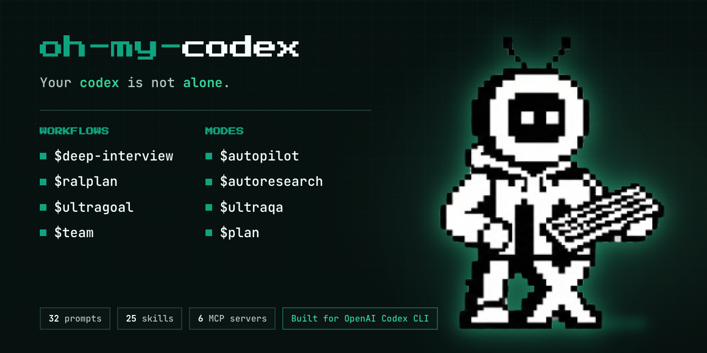
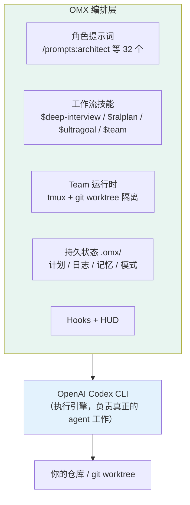
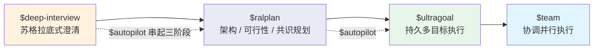
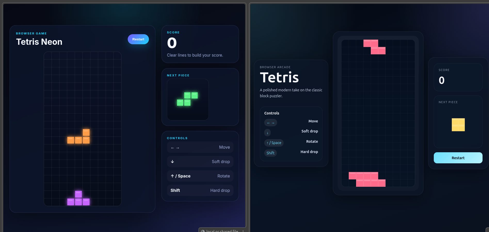
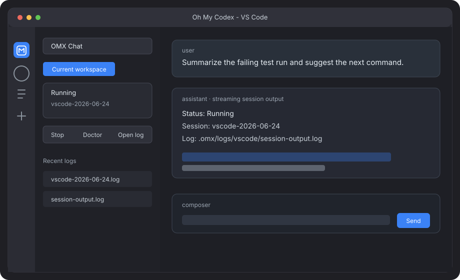

# Oh My Codex（OMX）使用手册（Windows / macOS / Linux）

> - **版本**：oh-my-codex（OMX）**0.21.5**（npm / GitHub Release，2026-09-11）
> - **官方仓库**：<https://github.com/Yeachan-Heo/oh-my-codex>（MIT，约 3.3 万 stars）
> - **官网**：<https://oh-my-codex.dev> ｜ 文档站：<https://yeachan-heo.github.io/oh-my-codex-website/>
> - **前置**：Node.js ≥ 20 ｜ OpenAI Codex CLI（已安装并登录）
> - **整理日期**：2026-09-14
> - **阅读提示**：**先看第 0 章的平台可用性总表**。OMX 官方明确说明它**主要为 macOS / Linux + tmux 调优**，**原生 Windows 是次要路径**（可跑但不保证稳定），Windows 上**更推荐 WSL2**。

---

## 目录

0. [平台可用性总表](#0-平台可用性总表)
1. [OMX 是什么](#1-omx-是什么)
2. [OMX 与 Codex 的关系](#2-omx-与-codex-的关系)
3. [安装（分平台）](#3-安装分平台)
4. [首次设置与冒烟测试](#4-首次设置与冒烟测试)
5. [核心概念](#5-核心概念)
6. [启动与会话管理](#6-启动与会话管理)
7. [工作流技能（Workflow Skills）](#7-工作流技能workflow-skills)
8. [角色与技能清单](#8-角色与技能清单)
9. [Team 并行运行时](#9-team-并行运行时)
10. [Mission 队列运行器](#10-mission-队列运行器)
11. [HUD 监控](#11-hud-监控)
12. [MCP 服务器与持久状态](#12-mcp-服务器与持久状态)
13. [配置文件与目录结构](#13-配置文件与目录结构)
14. [环境变量](#14-环境变量)
15. [Windows 支持与限制](#15-windows-支持与限制)
16. [故障排查](#16-故障排查)
17. [速查表](#17-速查表)
18. [参考链接](#18-参考链接)

---

## 0. 平台可用性总表

> 依据官方 README 的醒目警告框：**「RECOMMENDED DEFAULT ONLY: macOS or Linux with Codex CLI. Native Windows and Codex App are not the default experience, may break or behave inconsistently, and currently receive less support.」**

| 能力 | Windows（原生） | Windows（WSL2） | macOS | Linux |
|---|---|---|---|---|
| OMX 本体运行 | ⚠️ 次要路径 | ✅ 推荐 | ✅ **主要路径** | ✅ **主要路径** |
| 前置 tmux 替代 | `psmux`（`winget install psmux`） | `sudo apt install tmux` | `brew install tmux` | `sudo apt/dnf/pacman install tmux` |
| Team 并行运行时 | ⚠️ 体验受限 | ✅ 好 | ✅ 最佳 | ✅ 最佳 |
| HUD / tmux 分屏监控 | ⚠️ 受限 | ✅ | ✅ | ✅ |
| `--direct`（无 tmux 托管） | ✅ 可用 | ✅ | ✅ | ✅ |
| 官方支持力度 | 较低 | 中 | **高** | **高** |

**结论**：
- **Windows 用户**：想认真用，**优先装 WSL2**，在 WSL 里 `apt install tmux` 跑 OMX；坚持原生则装 `psmux`，但接受「次要路径」的定位。
- **macOS / Linux**：装 `tmux` 即可，这是官方调优的主线。
- **Codex App**：也**不是** OMX 的默认体验，官方建议从 shell 里跑 `omx`。

---

## 1. OMX 是什么


**Oh My Codex（OMX）** 是一个**多 agent 编排层（orchestration layer）**，套在 **OpenAI Codex CLI** 之上。它的自我定位是「**Like oh-my-zsh but for Codex**」——不改模型、不换引擎，只把 Codex 变成**有角色、有流程、有团队、有记忆**的工程化运行时。



它解决的问题是：**裸 Codex 会话在「多步骤 / 并行 / 长任务」下会迅速失控**——没有结构化规划、没有跨会话持久状态、没有多 agent 协调、没有工作树隔离。OMX 补的正是这四块。

**一句话**：OMX = Codex 引擎 + 角色提示词 + 工作流技能 + 团队并行 + 持久状态。

---

## 2. OMX 与 Codex 的关系

OMX **不替换** Codex，而是包一层：



官方给的心智模型：

- **Codex** 做真正的 agent 工作；
- **OMX 角色关键字**让有用的角色可复用；
- **OMX 技能**让常见工作流可复用；
- **`.omx/`** 存计划、日志、记忆与运行时状态。

> 大多数用户应把 OMX 理解成「**更好的任务路由 + 更好的工作流 + 更好的运行时**」，而不是一个需要手动敲一整天的命令面。

---

## 3. 安装（分平台）

### 3.1 前置条件

- **Node.js ≥ 20**
- **Codex CLI** 已安装、`codex --version` 可用、且**已登录**（`codex login status`）
- **tmux**（macOS/Linux，用于推荐的持久 team 运行时）；Windows 原生用 `psmux`

### 3.2 安装 OMX

**已有 Codex CLI**（Homebrew / npm 均可）：

```bash
codex --version
npm install -g oh-my-codex
```

**还没有 Codex CLI**，想让 npm 一并管理：

```bash
npm install -g @openai/codex
npm install -g oh-my-codex
```

> ⚠️ **不要**在 Homebrew 已拥有 `codex`（如 `/opt/homebrew/bin/codex`）时执行 `npm install -g @openai/codex oh-my-codex` 合并安装——`@openai/codex` 会因 `EEXIST` 失败。OMX 只需要 PATH 上一个可用且已认证的 `codex`，**不要求** Codex 由 npm 安装。

**从源码**：

```bash
git clone https://github.com/Yeachan-Heo/oh-my-codex.git
cd oh-my-codex
npm install && npm run build && npm link
```

### 3.3 安装 tmux / psmux（分平台）

| 平台 | 命令 |
|---|---|
| macOS | `brew install tmux` |
| Ubuntu / Debian | `sudo apt install tmux` |
| Fedora | `sudo dnf install tmux` |
| Arch | `sudo pacman -S tmux` |
| **Windows（原生）** | `winget install psmux` |
| **Windows（WSL2）** | `sudo apt install tmux` |

---

## 4. 首次设置与冒烟测试

安装后，**两个边界都要查**：

```bash
omx doctor
codex login status
omx exec --skip-git-repo-check -C . "Reply with exactly OMX-EXEC-OK"
```

- `omx doctor`：查**安装形态**（缺文件、hooks、运行时前置）。
- `omx exec ...`：查**真实执行**（认证、profile、provider / base-URL）——`doctor` 绿了也不代表能真正发起模型调用（官方称之为「**false-green readiness**」）。

### 4.1 设置作用域（scope）

```bash
omx setup --scope project --merge-agents   # 从目标 git 项目运行：该项目拥有 AGENTS.md 指南
omx setup --scope user                     # 用户级 Codex 设置（不把当前目录当 OMX 项目）
```

> **不要**在宽泛的家目录 / 工作枢纽里跑 project 作用域设置——家目录的 `AGENTS.md` 常含全局安全与路由规则。

### 4.2 AGENTS.md 合并策略

只有三个策略选择器（用裸形式，不要写 `=value`）：

```bash
omx setup --merge-agents             # 保留既有 AGENTS.md，在标记之间插入/刷新 OMX 段落
omx setup --no-merge-agents          # 记录显式「不合并」选择
omx setup --clear-merge-agents-policy
```

- 合并使用标记：`<!-- OMX:AGENTS:START -->` / `<!-- OMX:AGENTS:END -->`
- 显式选择会记录到当前工作根的 `./.omx/setup-scope.json`（即使 scope 是 `user`），**不会**变成全局偏好。
- `--force` 是独立且临时的，不记录、不重放。

### 4.3 更新

```bash
omx update     # 检查 npm、安装最新全局构建，再重跑同一套交互式 setup 刷新
```

- 启动时会**限流**检查更新，默认弹窗询问；`OMX_AUTO_UPDATE=0` 关闭，`OMX_AUTO_UPDATE=defer` 改为延迟不提示。
- Homebrew / mise / Nix 安装的 **Codex** 用各自包管理器更新；`omx update` 只管 OMX 自身。

---

## 5. 核心概念


| 概念 | 说明 |
|---|---|
| **Codex（执行引擎）** | 真正干活的 agent，OMX 只是它的工作层 |
| **Role Prompts（角色提示词）** | `/prompts:<name>`，32 个专用角色（架构师、执行者、安全审查…） |
| **Workflow Skills（工作流技能）** | `$<name>`，25 个工作流技能（澄清、规划、执行、团队…） |
| **Team 运行时** | 基于 tmux + **git worktree 隔离**的并行 worker |
| **`.omx/` 状态目录** | 计划、日志、记忆、模式跟踪、ultragoal 台账 |
| **Hooks** | Codex 原生生命周期钩子（`PreToolUse` / `PostToolUse`） |
| **HUD** | 监控面板（`omx hud --watch`），非主工作流 |
| **Mission** | 顺序批跑一串提示词/清单（`omx mission`） |

---

## 6. 启动与会话管理

### 6.1 推荐启动方式

```bash
# 在你想让 Codex 编辑的 git 项目里，选一个任务名
omx --worktree=feat/task --madmax --xhigh
```

- `--madmax` = Codex 的 `--dangerously-bypass-approvals-and-sandbox`（**移除审批与沙箱护栏，只在可信仓库用**）
- `--high` / `--xhigh` = `-c model_reasoning_effort="high|xhigh"`
- 普通强会话：`omx --madmax --xhigh`
- 在 macOS/Linux 交互终端且有 tmux 时，默认会**在 OMX 托管的 detached tmux 里启动 leader**，以便创建/恢复 HUD 与运行时窗格。

### 6.2 `--worktree`（工作树隔离）

```bash
omx --worktree=feature/auth --madmax --xhigh
omx --worktree=fix/flaky-tests --madmax --xhigh
```

- `--worktree` / `-w` 不带名字 → 在 `../<repo>.omx-worktrees/launch-detached` 创建/复用**游离**工作树。
- `--worktree=<name>` → 在 `../<repo>.omx-worktrees/` 下创建/复用**命名**工作树并检出该分支名。
- OMX 在启动 Codex **之前**消费该参数，**不会**转发给 Codex。
- **并发 `--madmax` 会话务必用不同命名工作树**，不要都在同一目录。
- 目标工作树若已 dirty，OMX 会**警告后照常启动**——先 clean / commit / stash。

### 6.3 `--direct`：不要 tmux/HUD 托管

```bash
omx --direct --yolo
OMX_LAUNCH_POLICY=direct omx --yolo        # 持久化到环境策略
unset OMX_LAUNCH_POLICY                    # 回到默认
```

`OMX_LAUNCH_POLICY` 取值：`direct | tmux | detached-tmux | auto`。CLI 策略标志优先于环境变量，`--` 前最后一个策略标志生效。

### 6.4 并发标准会话（OMX_ROOT）

一个标准启动只拥有一个可写会话指针。**同目录第二次 `omx` 会 fail-closed**。给每个额外会话显式指定不同 root：

```bash
omx
OMX_ROOT="$HOME/.omx/instances/second-conversation" omx
```

PowerShell / CMD：

```powershell
$env:OMX_ROOT = "$HOME\.omx\instances\second-conversation"; omx
```

```bat
set "OMX_ROOT=%USERPROFILE%\.omx\instances\second-conversation" && omx
```

> 用户指定的 root 是**字面量**：用同一显式 `OMX_ROOT` 启动两次仍是致命的 owner 冲突。

---

## 7. 工作流技能（Workflow Skills）

在 Codex 会话内用 `$` 关键字触发。**每个阶段可独立调用，不强制串成固定链**。



| 技能 | 用途 |
|---|---|
| `$deep-interview` | 迭代式澄清歧义、可恢复状态、产出「可执行需求」工件。**只做需求，不实现** |
| `$ralplan` | 在 deep-interview 工件之上做架构、可行性、共识规划 |
| `$ultragoal` | **默认的持久多目标完成路径**，用 `.omx/ultragoal` 台账打检查点 |
| `$team` | 一个 story 需要协调并行时才用 |
| `$autopilot` | 一等的规范编排器，默认串起 `$deep-interview → $ralplan → $ultragoal` |
| `$plan` | 可选规划与澄清（`--interview` 模式） |
| `$code-review` / `$ultraqa` | 代码审查 / 质量循环 |
| `$best-practice-research` | 规划前的官方/上游证据调研 |
| `$autoresearch` / `$autoresearch-goal` | 有界、验证器把关的研究工件 / 目标模式研究 |

**已退役的关键字**（0.21 用 sunset-stub 解析，会指向替代而非静默失败）：

| 旧 | 新 |
|---|---|
| `$ralph` | `$ultragoal` |
| `$ultrawork` | `$team` |
| `$pipeline` | `$plan` + `$team` |
| `$autoresearch-goal` | `$autoresearch` |

**会话内其它入口**：

| 入口 | 用途 |
|---|---|
| `/skills` | 浏览已安装技能与辅助 |
| `/goal ...` | 给必须跨轮对账的任务建**持久目标/检查点**结构 |
| `/prompts:<name>` | 调用某个角色提示词 |

> **反模式**：`omx --madmax --xhigh` 后立刻「以防万一」加载 20 个技能。默认只加 **2–5 个相关技能**；大量加载是上下文预算与注意力质量问题。

---

## 8. 角色与技能清单



### 8.1 角色提示词（32 个，`/prompts:<name>`）

| 类别 | 角色 |
|---|---|
| 规划 / 分析 | `architect`、`planner`、`analyst`、`researcher`、`product-manager`、`product-analyst`、`ux-researcher`、`information-architect` |
| 实现 | `executor`、`debugger`、`code-simplifier`、`build-fixer`、`designer`、`writer` |
| 审查 | `code-reviewer`、`style-reviewer`、`quality-reviewer`、`api-reviewer`、`security-reviewer`、`performance-reviewer`、`critic`、`quality-strategist`、`dependency-expert` |
| 验证 / 测试 | `verifier`、`test-engineer`、`qa-tester` |
| 探索 | `explore`、`explore-harness`、`vision` |
| 工程辅助 | `git-master` |
| 团队 | `team-orchestrator`、`team-executor` |

### 8.2 工作流技能（25 个，`$<name>`）

上表已列主要技能；官方技能参考：<https://yeachan-heo.github.io/oh-my-codex-website/docs.html>（Skills reference）。

---

## 9. Team 并行运行时



**Team 是 OMX 的核心技能**。自 v0.13.1 起，**每个 worker 默认跑在独立的 git worktree 里**——不用加 flag，没有合并冲突，自动集成。

- worker 工作树位置：`.omx/team/<name>/worktrees/worker-N`
- worker 写到**隔离的游离分支**，leader 工作区保持干净
- leader 持续把 worker 的提交**增量合并**（merge / cherry-pick / 跨 worker rebase），冲突早发现并写入 `integration-report.md`；自动 commit 保证不丢工作

```text
# 在 Codex 里用（推荐）
$team 3:executor "refactor auth module"
Team started: refactor-auth-module
workers: 3 (worktrees: automatic, detached)

# 高级：CLI 操作面
omx team 3:executor "refactor auth module"
omx team status <team-name>
omx team resume <team-name>
omx team shutdown <team-name>

# 混合 provider（Codex + Claude + Gemini），各自独立工作树
OMX_TEAM_WORKER_CLI_MAP=codex,claude,gemini omx team 3:executor "full-stack implementation"
```

**团队状态**（HUD 每行实时刷新）：`working`、`idle`、`blocked`、`done`、`failed`、`draining`、`unknown`。`working`/`done` 绿色，`blocked`/`failed` 黄色。

**与 Ultragoal 的关系**：Team 跑在 Ultragoal story 内时，Ultragoal 仍是 **leader 所有**的状态——worker 只上报检查点就绪的证据，不直接改 `.omx/ultragoal`。Team 启动会写 `.omx/state/team/<team-name>/preflight-context.json`，便于压缩后恢复。

> 极小任务时 Team 可能把隐式 fanout 限制为 1 个 worker 并提示「过度编排」；只有确实需要协调成本时才显式指定 worker 数。

---

## 10. Mission 队列运行器

`omx mission` 用于**顺序批跑**一串 OmX/Codex 提示词，而不是为每条提示开一个新 shell。

```bash
omx mission plan ./mission.md                # 校验解析、查看摘要
omx mission ./mission.md --dry-run           # 干跑
omx mission run ./mission.md -- --model gpt-5
omx mission status ./mission.md
omx mission resume ./mission.md              # 中断后续跑
omx mission mark ./mission.md --task task-002 --status blocked
omx mission rerun ./mission.md --task task-002
```

产物：`.omx/missions/<slug>/summary.json` 与 `ledger.jsonl`。格式与状态输出见 `docs/mission.md`。

---

## 11. HUD 监控

```bash
omx hud --watch
```

- HUD 是**监控/状态面**，不是主工作流。
- 活跃的 team 会在 OMX 版本号旁显示名称与 worker 数，例如 `[OMX#0.21.4] team:checkout (3 workers) | repo/branch`。
- 每个 team agent 一行：名称、最后上报状态、当前 task ID、角色、tmux pane ID、更新年龄。
- 被监控的 GitGuardex 进度是**可选**的：在项目级 `.omx/hud-config.json` 里加 `"guardex": { "enabled": true }` 才显示。
- tmux roster 高度受窗口与 leader/HUD 几何约束，**至少留一半行给 leader**；放不下的 worker 用 `+N workers` 溢出行表示。

---

## 12. MCP 服务器与持久状态

OMX 提供 **6 个 MCP 服务器**，为 Codex 提供持久上下文与跨会话学习：

| MCP 服务器 | 用途 |
|---|---|
| `omx_state` | 模式生命周期状态（**只读**：`state_write` / `state_clear` 已在 0.21 移除，持久写入走 CLI） |
| `omx_memory` | 长期会话的记忆 + 记事本 |
| `omx_code_intel` | 代码智能与上下文 |
| `omx_trace` | 执行追踪与调试 |
| `omx_wiki` | 仓库项目知识（markdown-first、search-first，非向量优先） |
| Hermes | 兼容服务器 |

`omx wiki` 是 CLI 优先的 JSON 面：

```bash
omx wiki list --json
omx wiki query --input '{"query":"session-start lifecycle"}' --json
omx wiki lint --json
omx wiki refresh --json
```

---

## 13. 配置文件与目录结构

```text
你的项目/
├── AGENTS.md                      # 持久编排指南（OMX 段在标记之间）
├── .omx/                          # OMX 状态目录
│   ├── ultragoal/                 # $ultragoal 台账与检查点
│   ├── state/team/<name>/         # team 运行时状态（preflight-context.json 等）
│   ├── missions/<slug>/           # mission 产物（summary.json / ledger.jsonl）
│   ├── hooks/*.mjs                # OMX 插件钩子
│   ├── hud-config.json            # HUD 配置（可选 guardex）
│   └── setup-scope.json           # 记录 mergeAgents 策略
├── .omx-config.json               # 模型 / env 路由（只改你版本支持的键）
├── .codex/
│   ├── config.toml                # Codex 配置（scoped setup 会写）
│   └── hooks.json                 # Codex 原生钩子注册（legacy / fallback）
└── ../<repo>.omx-worktrees/       # --worktree 与 team worker 的工作树
```

要点：

- `omx setup` 会安装 **prompts、skills、AGENTS 脚手架、`.codex/config.toml`**，以及（legacy 安装或旧 Codex）`.codex/hooks.json` 里的 OMX 托管钩子。
- setup 刷新会**保留** `.codex/hooks.json` 中非 OMX 的条目，只重写 OMX 托管的包装器。
- `omx uninstall` 移除 `.codex/hooks.json` 中的 OMX 托管包装器，但保留文件（若还有用户钩子）。
- 新装 OMX 默认模型为 `gpt-6-astra`（frontier / standard / spark 各档），既有用户模型配置与显式覆盖会保留。
- 模型/env 路由见 `docs/reference/omx-config-schema-routing.md`。

---

## 14. 环境变量

| 变量 | 用途 |
|---|---|
| `OMX_ROOT` | 指定会话 root（并发会话隔离） |
| `OMX_AUTO_UPDATE` | `0` 关闭启动时更新检查；`defer` 延迟不提示 |
| `OMX_LAUNCH_POLICY` | `direct` / `tmux` / `detached-tmux` / `auto` |
| `OMX_TEAM_WORKER_CLI_MAP` | 混合 provider，如 `codex,claude,gemini` |
| `OMX_REPO_ROOT` / `OMX_WORKTREE_ROOT` / `OMX_GIT_COMMON_DIR` / `OMX_WORKTREE_SCOPE` | 传给 repo-aware 工具的标准上下文 |
| `OMX_CODEGRAPH_MODE` | `auto` / `shared` / `local` / `off` |
| `OMX_CODEGRAPH_PROJECT_PATH` | CodeGraph 项目路径 |
| `OMX_SPARKSHELL_BIN` / `OMX_SPARKSHELL_MODEL` / `OMX_SPARKSHELL_FALLBACK_MODEL` / `OMX_SPARKSHELL_MODEL_INSTRUCTIONS_FILE` / `OMX_SPARKSHELL_SUMMARY_TIMEOUT_MS` | Sparkshell 相关覆盖 |
| `CODEX_HOME` | Codex 配置目录（插件缓存位于 `${CODEX_HOME:-~/.codex}/plugins/cache/...`） |

---

## 15. Windows 支持与限制

> **官方原话**：OMX 主要为 **macOS / Linux + Codex CLI** 设计与调优；**原生 Windows 与 Codex App 不是默认体验，可能出问题或行为不一致，目前支持较少。**

### 15.1 ✅ 可行路径

| 路径 | 说明 |
|---|---|
| **WSL2（推荐）** | 在 WSL 里装 Node、Codex CLI、`sudo apt install tmux`，然后正常用 OMX。这是「Windows 托管」的推荐方式 |
| **原生 Windows + psmux** | `winget install psmux`，OMX 接受 `psmux` 作为 tmux 兼容二进制，用于其既有的 tmux-backed 路径 |
| **`--direct`** | 不要 tmux/HUD 托管，直接在终端里跑（`omx --direct --yolo`） |

### 15.2 ⚠️ 限制与注意

1. **Team 运行时**：`omx team` **在 macOS/Linux + tmux 上最好**；原生 Windows 是**次要路径**，体验受限。
2. **Codex App**：官方明确**不是**默认体验；Team 在 Codex App 或纯 tmux 之外的会话里，应视为「tmux 运行时外壳」，而非应用内直接可用。
3. **psmux 兼容面**：仅覆盖 OMX 既有的 tmux-backed 路径，不等同完整 tmux。
4. **并发会话**：同一 root 第二次启动会 fail-closed；Windows 上用 `set OMX_ROOT=...`（CMD）或 `$env:OMX_ROOT=...`（PowerShell）区分。
5. **Intel Mac 已知问题**（顺带）：某些 Intel Mac 上 `--madmax --high` 会让 `syspolicyd` / `trustd` CPU 飙高（Gatekeeper 校验大量并发进程）。缓解：`xattr -dr com.apple.quarantine $(which omx)`、把终端加入 Developer Tools 白名单、降低并发。

### 15.3 一句话建议

**Windows 上想稳定用 OMX，就走 WSL2；只用原生 Windows 的话，优先 `--direct`，Team/HUD 功能按「可用但不保证」对待。**

---

## 16. 故障排查

**「绿了但跑不起来」（false-green readiness）**：`omx doctor` 绿只代表安装与本地接线看起来正常。真实执行仍失败时：

- 在**同一个 shell/profile** 里跑 `codex login status` 与 `omx exec --skip-git-repo-check -C . "Reply with exactly OMX-EXEC-OK"`。
- 自定义 HOME / profile / 容器 / service shell 里，确认活动的 `~/.codex`（或 `CODEX_HOME`）就是你期望的认证与配置。
- 用本地 OpenAI 兼容代理时，确认 `~/.codex/config.toml` 含正确的 `openai_base_url`；否则代理签发的 key 会被发到默认端点，报 `401` / `Missing bearer` / `Incorrect API key`。

**stale team / 缺 tmux 会话**：

```bash
omx team shutdown <team-name> --force --confirm-issues
omx cancel
omx doctor --team
```

> 强制 shutdown 只用于**已确认死亡或有意放弃**的 team。

**tmux 里 `Shift+Enter` 仍提交而非换行**：当前 OMX 已在自己的 Codex 启动路径周围启用 tmux extended-key 转发；持续失败通常是 tmux 终端能力/发现性问题，见 `docs/troubleshooting.md`。

---

## 17. 速查表

**安装与体检**

```bash
npm install -g oh-my-codex
omx setup --scope project --merge-agents
omx doctor
omx exec --skip-git-repo-check -C . "Reply with exactly OMX-EXEC-OK"
```

**启动**

```bash
omx --madmax --xhigh                       # 普通强会话
omx --worktree=feat/task --madmax --xhigh  # 命名工作树（推荐）
omx --direct --yolo                        # 不要 tmux/HUD 托管
```

**会话内技能**

```text
$deep-interview "澄清需求"
$ralplan "批准计划并评审权衡"
$ultragoal "把计划执行到完成"
$team 3:executor "协调并行"
```

**CLI 操作面**

| 命令 | 用途 |
|---|---|
| `omx team N:executor "..."` | 启动 N 个 worker 的团队 |
| `omx team status/resume/shutdown <name>` | 团队管理 |
| `omx mission run ./mission.md` | 顺序批跑提示词 |
| `omx hud --watch` | 监控面板 |
| `omx sparkshell <cmd>` | shell 原生检查与有界验证 |
| `omx wiki list/query/lint/refresh --json` | 项目知识 wiki |
| `omx update` | 更新 OMX 并刷新 setup |
| `omx cancel` | 取消 |
| `omx uninstall` | 卸载（保留非 OMX 钩子） |

---

## 18. 参考链接

**官方**

- 官网：<https://oh-my-codex.dev>
- 文档站：<https://yeachan-heo.github.io/oh-my-codex-website/>
- GitHub：<https://github.com/Yeachan-Heo/oh-my-codex>
- npm：<https://www.npmjs.com/package/oh-my-codex>
- Getting Started：<https://yeachan-heo.github.io/oh-my-codex-website/docs.html>
- Discord：<https://discord.gg/wSyUQYfhAw>
- OpenClaw 集成指南：`docs/openclaw-integration.md`
- Codex 原生钩子映射：`docs/codex-native-hooks.md`
- Mission 参考：`docs/mission.md`
- 故障排查：`docs/troubleshooting.md`

**相关**

- OpenAI Codex CLI：<https://github.com/openai/codex>
- 更轻的替代（作者同源）：`gajae-code` — <https://github.com/Yeachan-Heo/gajae-code>

**相关文件位置**

| 内容 | 路径 |
|---|---|
| 项目状态目录 | `<项目>/.omx/` |
| 模型 / env 路由 | `<项目>/.omx-config.json` |
| Codex 配置 | `<项目>/.codex/config.toml` |
| Codex 原生钩子 | `<项目>/.codex/hooks.json` |
| 持久编排指南 | `<项目>/AGENTS.md`（或 user scope 的 `~/.codex/AGENTS.md`） |
| 工作树 | `../<repo>.omx-worktrees/` |
| 插件缓存 | `${CODEX_HOME:-~/.codex}/plugins/cache/<marketplace>/oh-my-codex/<version>/` |
| 本手册配图 | `./images/` |

---

> 图片版权归 oh-my-codex 项目所有，来源 <https://github.com/Yeachan-Heo/oh-my-codex> 与 <https://yeachan-heo.github.io/oh-my-codex-website/>。本手册仅供个人学习使用。
