# tmux 使用手册（Windows / Arch Linux / macOS）

> - **版本**：tmux 3.7c（2026-08，3.8 开发中）｜ herdr 0.9.0
> - **平台**：Windows 11、Arch Linux、macOS
> - **整理日期**：2026-09-14
> - **来源**：tmux 官方 Wiki / man page、herdr 官方文档（herdr.dev/docs）、Better Stack 指南等，见文末链接。
> - **阅读提示**：先看第 0 章的**平台可用性总表**——tmux 在 Windows 上**没有原生版本**，而 herdr 有原生 Windows 版（GA）但有若干限制，这两点决定了你的选型。

---

## 目录

0. [平台可用性总表](#0-平台可用性总表)
1. [tmux 是什么](#1-tmux-是什么)
2. [tmux 安装（分平台）](#2-tmux-安装分平台)
3. [tmux 核心概念](#3-tmux-核心概念)
4. [tmux 快速上手](#4-tmux-快速上手)
5. [tmux 状态栏与 prefix](#5-tmux-状态栏与-prefix)
6. [tmux 键位大全](#6-tmux-键位大全)
7. [tmux 命令与命令提示符](#7-tmux-命令与命令提示符)
8. [tmux 复制粘贴与系统剪贴板（分平台）](#8-tmux-复制粘贴与系统剪贴板分平台)
9. [tmux 鼠标操作](#9-tmux-鼠标操作)
10. [tmux 配置文件 .tmux.conf](#10-tmux-配置文件-tmuxconf)
11. [tmux 窗口布局与浮动窗格](#11-tmux-窗口布局与浮动窗格)
12. [tmux 在 Windows 上的方案与限制](#12-tmux-在-windows-上的方案与限制)
13. [tmux 进阶：control mode / formats / tmuxp](#13-tmux-进阶control-mode--formats--tmuxp)
23. [速查表](#23-速查表)
24. [参考链接与视频](#24-参考链接与视频)

---

## 0. 平台可用性总表

| 能力 | Windows 11 | Arch Linux | macOS |
|---|---|---|---|
| **tmux** 原生运行 | ❌ 无原生版 | ✅ `pacman -S tmux` | ✅ `brew install tmux` |
| tmux 可用途径 | WSL2（推荐）/ MSYS2 / Cygwin | 原生 | 原生 |
| tmux 在原生 cmd/PowerShell 控制台 | ❌（Cygwin/MSYS2 版只能在 mintty 里跑） | — | — |
| **herdr** 原生运行 | ✅ GA（有已知限制） | ✅ install.sh / AUR | ✅ `brew install herdr` |
| herdr 安装方式 | `install.ps1` / `install.cmd` / 手动 zip | 脚本 / AUR / Nix / mise | Homebrew / 脚本 / Nix / mise |
| herdr 作为 `--remote` 目标机 | ❌ 不支持 | ✅ 支持 | ✅ 支持 |
| herdr 客户端连接远程 | ✅（连 Linux/macOS） | ✅ | ✅ |

> **一句话选型**：
> - **Windows**：要原生体验选 **herdr**；想用 tmux 必须进 **WSL2**。
> - **Arch / macOS**：两者都原生，tmux 更轻更成熟，herdr 多了 Agent 状态感知。

### 三者定位对比（含 Zellij）

| 特性 | tmux | herdr | Zellij |
|---|---|---|---|
| 语言 / 许可 | C / ISC | Rust / Apache-2.0 | Rust / MIT |
| 出现时间 | 2007（最成熟） | 2026（新） | 2021 |
| 默认 prefix | `Ctrl b` | `Ctrl b` | 模式键（`Ctrl p/t/n/s/o`） |
| 会话持久化 | ✅ | ✅（server 常驻，可复活） | ✅（可复活） |
| 浮动窗格 | 3.8+ | ✅ | ✅ |
| Agent 状态感知 | ❌ | ✅ **核心卖点** | ❌ |
| 鼠标优先 | 部分 | ✅ | 部分 |
| Windows 原生 | ❌ | ✅（GA） | ✅ |
| 上手难度 | 需背键位 | 可纯鼠标 | 状态栏提示，最友好 |

---

## 1. tmux 是什么

**tmux** 是一个**终端复用器（terminal multiplexer）**：在一个终端窗口里运行多个终端程序，并允许你**脱离（detach）**再**重新连接（attach）**——程序在后台继续跑。

主要用途：

- 在远程服务器上跑长任务，防止 SSH 断线中断程序。
- 同一台机器上的程序，从多台电脑访问同一会话。
- 在一个终端里同时管理编辑器、编译、多个 shell，像窗口管理器一样。

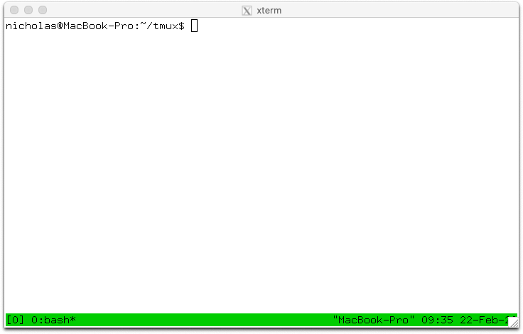

**核心优势**：极其成熟稳定、几乎所有 Unix 系统都有包、脚本化能力强（control mode / 命令行控制）。**主要门槛**：默认 `Ctrl b` prefix + 大量组合键需要记忆。

---

## 2. tmux 安装（分平台）

### 2.1 Arch Linux

```bash
sudo pacman -S tmux        # 官方 extra 仓库，当前 3.7_c
```

> 想要更新版本 / 开发版，可用 AUR：`yay -S tmux-git`。

### 2.2 macOS

```bash
brew install tmux          # Homebrew（推荐）
sudo port install tmux     # MacPorts
```

### 2.3 Windows

**tmux 没有原生 Windows 版本**（它依赖 Unix 的 pty）。三条路：

1. **WSL2（最推荐）**：在 WSL 发行版里 `sudo apt install tmux`，然后在 Windows Terminal 里 `wsl` 进去用。完整功能。
2. **MSYS2**：在 MSYS2 的 MINGW/MSYS 环境里 `pacman -S tmux`。注意：**只能在 mintty 终端里运行**，无法在原生 cmd.exe / PowerShell 控制台正常使用。
3. **Cygwin**：Cygwin 安装器里勾选 `tmux`，同样在 mintty 里运行。

> 参考：tmux 官方 issue #1954 明确说明——Cygwin/MSYS2 的 tmux 无法在原生 Windows 控制台使用。
> 详见第 12 章。

### 2.4 源码编译（通用）

```bash
# 依赖：libevent + ncurses（+ C 编译器、make、yacc/bison、pkg-config）
tar -zxf tmux-*.tar.gz && cd tmux-*/
./configure            # macOS 建议加 --enable-utf8proc
make && sudo make install
```

---

## 3. tmux 核心概念

tmux 的层级是 **server → session → window → pane**。

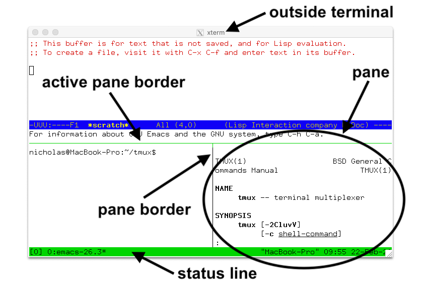

| 术语 | 含义 |
|---|---|
| **Server** | 后台主进程，保存所有状态，管理所有程序。首个 tmux 命令自动启动，无程序时退出 |
| **Client** | 附着到 server 的一个终端进程（如 xterm 窗口），通过 `/tmp` 下的 socket 通信 |
| **Session** | 把多个 window 分组，有唯一名字（默认 `0`、`1`…） |
| **Window** | 把多个 pane 分组，有名字和索引（index），可被多个 session 链接 |
| **Pane** | 一块矩形区域，包含一个终端和运行的程序；每个 pane 属于一个 window |
| **Active pane** | 当前接收键盘输入的 pane（每 window 一个） |
| **Current window** | 当前显示的 window（每 session 一个） |
| **Floating pane** | 浮在其他 pane 之上的窗格（tmux 3.8+） |

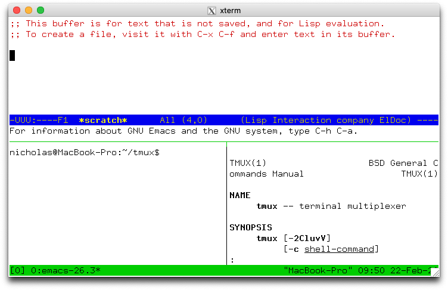

**关键点**：

- 程序跑在 **pane** 里 → pane 属于 **window** → window 链接到 **session**。
- 一个 session 可以有多个 window；一个 window 可以有多个 pane。
- **detach 不会杀掉程序**，只是 client 断开；server 和程序继续运行。

---

## 4. tmux 快速上手

### 4.1 创建 / 命名会话

```bash
tmux                       # 新建会话并 attach
tmux new -s mysession      # 新建名为 mysession 的会话
tmux new -s mytop -n topwin top   # 新建会话，首个 window 叫 topwin 并运行 top
tmux new -- emacs ~/.tmux.conf    # 新建会话并直接运行命令
```

### 4.2 查看 / 连接 / 断开

```bash
tmux ls                    # 列出所有会话
tmux attach                # attach 到最近使用的会话
tmux attach -t mysession   # attach 到指定会话
tmux attach -dt mysession  # attach 并踢掉其他已连接的 client
tmux new -As mysession     # 存在则 attach，不存在则新建
```

在会话内：

- **Detach**：`Ctrl b` 然后 `d`（回到 shell，程序继续跑）
- **Kill server**：`Ctrl b` 然后 `:`，输入 `kill-server`

### 4.3 生命周期示意

```text
tmux new -s work   ──►  [session: work]
                          ├─ window 0
                          │   ├─ pane 0 (bash)
                          │   └─ pane 1 (vim)
                          └─ window 1
                              └─ pane 0 (top)

Ctrl b d  ──►  detached（后台继续跑）
tmux a -t work  ──►  回到原样
```

---

## 5. tmux 状态栏与 prefix

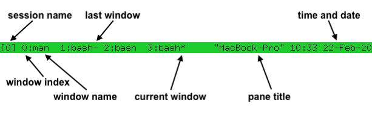

底部状态栏默认显示：

- **左**：session 名 `[0]`
- **中**：window 列表 `0:ksh 1:vim`（当前 window 后带 `*`，上一个 window 带 `-`）
- **右**：pane 标题、时间、日期

### prefix 键

默认 **`Ctrl b`**。按下后松开，再按下一个键，tmux 才执行对应命令。

- `C-b` 表示 `Ctrl+b`；`M-` 表示 Meta（现代键盘通常是 **Alt**）；`S-` 表示 Shift。
- `C-b c` = 先按 `Ctrl+b`，**松开**，再按 `c`。
- **连按两次 `Ctrl b`** = 把 `Ctrl b` 本身发给窗格内程序。

**查看所有键位**：`Ctrl b` 然后 `?`。

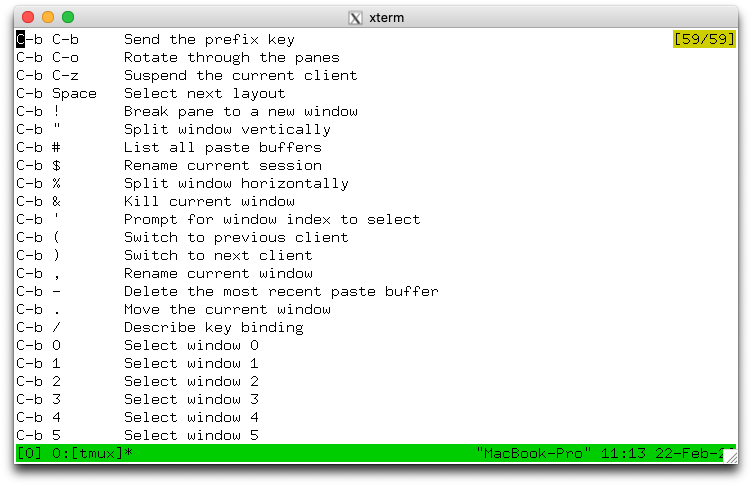

单键说明：`Ctrl b` 然后 `/`，再按任意键，会在底部显示其说明。

---

## 6. tmux 键位大全

> 格式：`C-b` = `Ctrl+b`；`M-` = Alt；`S-` = Shift。所有键位前都要先按 prefix（默认 `Ctrl b`）。

### 6.1 会话（Session）

| 键 | 作用 |
|---|---|
| `C-b d` | **Detach（断开但保留）** |
| `C-b s` | 树形选择会话（choose-tree） |
| `C-b $` | 重命名当前会话 |
| `C-b (` / `C-b )` | 上一个 / 下一个会话 |
| `C-b L` | 切换到上一个（last）会话 |
| `C-b D` | 客户端列表（可 detach 其他 client） |


### 6.2 窗口（Window）

| 键 | 作用 |
|---|---|
| `C-b c` | 新建窗口 |
| `C-b ,` | 重命名窗口 |
| `C-b &` | 关闭当前窗口（需确认） |
| `C-b n` / `C-b p` | 下一个 / 上一个窗口 |
| `C-b 0`…`C-b 9` | 跳到第 N 个窗口 |
| `C-b '` | 输入窗口索引跳转 |
| `C-b l` | 上一个（last）窗口 |
| `C-b w` | 树形选择窗口（choose-tree） |
| `C-b f` | 按内容查找窗口/窗格 |
| `C-b .` | 移动窗口到指定索引 |
| `C-b Tab` | switch mode：模糊筛选窗口（3.8+） |

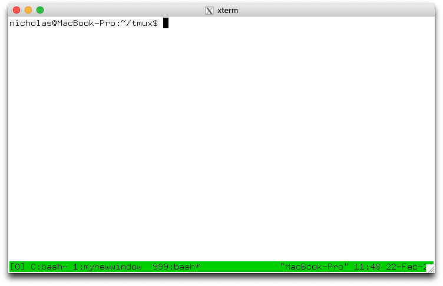


### 6.3 窗格（Pane）

| 键 | 作用 |
|---|---|
| `C-b %` | **水平分割**（左右两个 pane） |
| `C-b "` | **垂直分割**（上下两个 pane） |
| `C-b ↑↓←→` | 切换到上/下/左/右的 pane（可环绕） |
| `C-b o` | 下一个 pane |
| `C-b C-o` | 旋转 pane |
| `C-b q` | 显示 pane 编号，按数字快速跳转 |
| `C-b x` | 关闭当前 pane |
| `C-b z` | 缩放/还原当前 pane（占满窗口） |
| `C-b {` / `C-b }` | 与上/下 pane 交换 |
| `C-b !` | 把当前 pane 拆成新窗口（break-pane） |
| `C-b m` / `C-b M` | 标记 / 清除标记 pane（用于 swap） |
| `C-b C-←→↑↓` | 小幅调整 pane 大小 |
| `C-b M-←→↑↓` | 大幅调整 pane 大小 |
| `C-b Space` | 轮换预定义布局 |

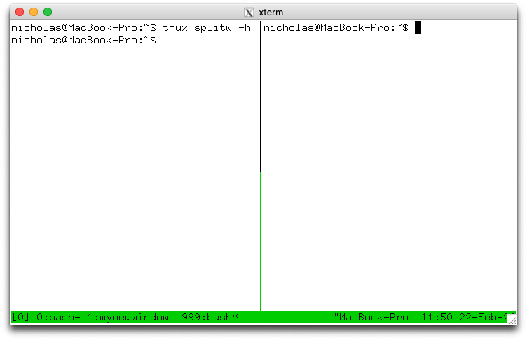

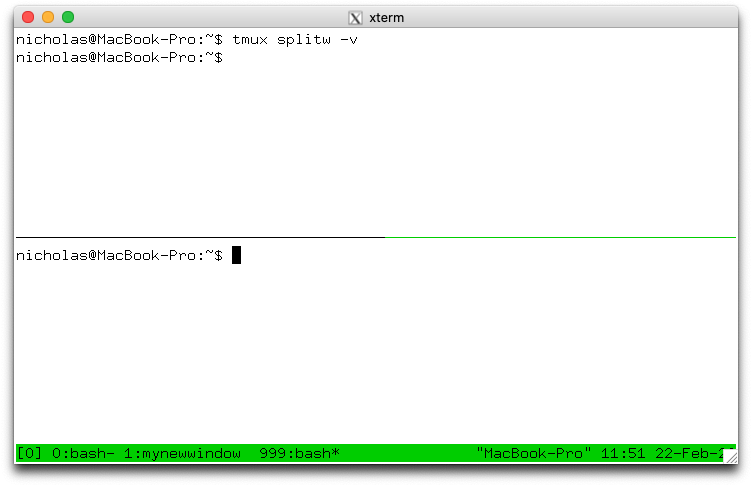

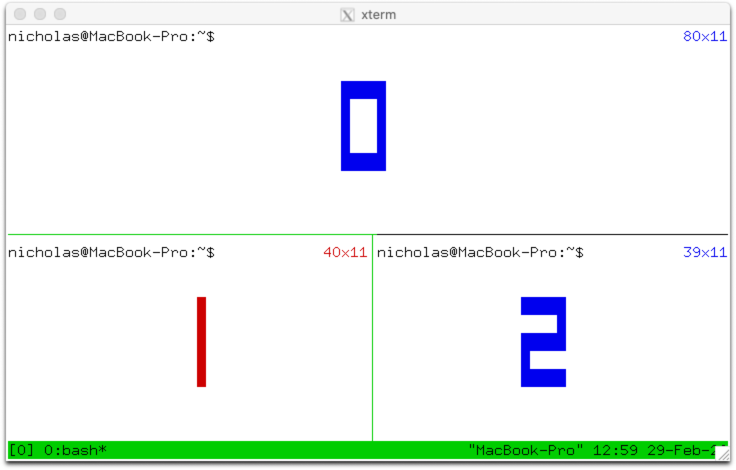

### 6.4 复制 / 粘贴（copy mode）

| 键 | 作用 |
|---|---|
| `C-b [` | 进入 copy mode |
| `C-b ]` | 粘贴最近一次复制的内容 |
| `C-b =` | 打开 buffer 列表选择粘贴 |
| `C-b #` | 列出所有 buffer |

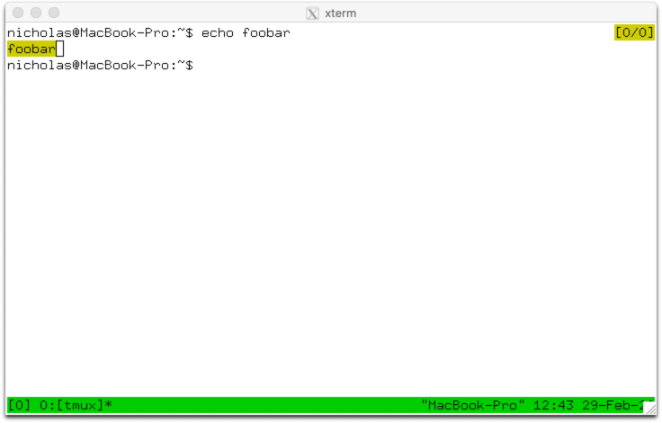

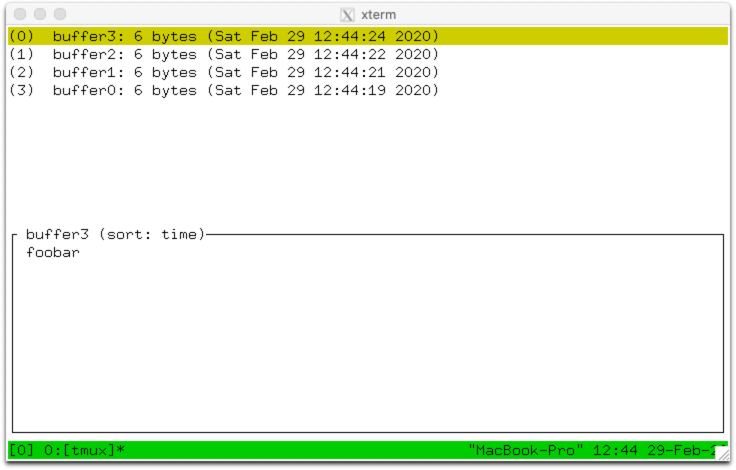

### 6.5 其它

| 键 | 作用 |
|---|---|
| `C-b :` | 打开命令提示符 |
| `C-b ?` | 列出所有键位 |
| `C-b /` | 查询某个键的说明 |
| `C-b ~` | 显示消息历史 |
| `C-b t` | 显示大时钟（老版本） |
| `C-b *` | 新建浮动窗格（3.8+） |
| `C-b @` | 平铺 / 浮动切换（3.8+） |

### 6.6 树形选择（tree mode）

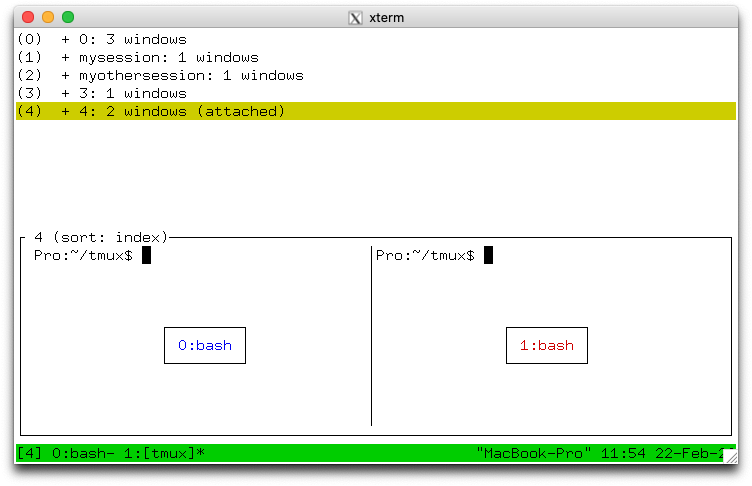

`C-b s`（只显示 session）或 `C-b w`（展开 window）。进入后**不需要 prefix**：

| 键 | 作用 |
|---|---|
| `Enter` | 切换到选中项 |
| `↑` / `↓` | 选择上一项 / 下一项 |
| `→` / `←` | 展开 / 折叠 |
| `x` / `X` | 关闭选中项 / 关闭所有标记项 |
| `t` / `T` | 标记 / 取消标记（`C-t` 全标记） |
| `C-s` | 按名字搜索，`n` 重复搜索 |
| `:` | 对选中项执行命令 |
| `O` / `r` | 改变排序 / 反向排序 |
| `q` | 退出 tree mode |

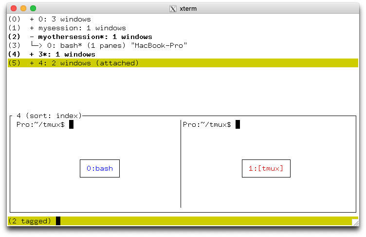

---

## 7. tmux 命令与命令提示符

每个键位背后都是一条 tmux 命令，命令也可以在 shell 里直接用。

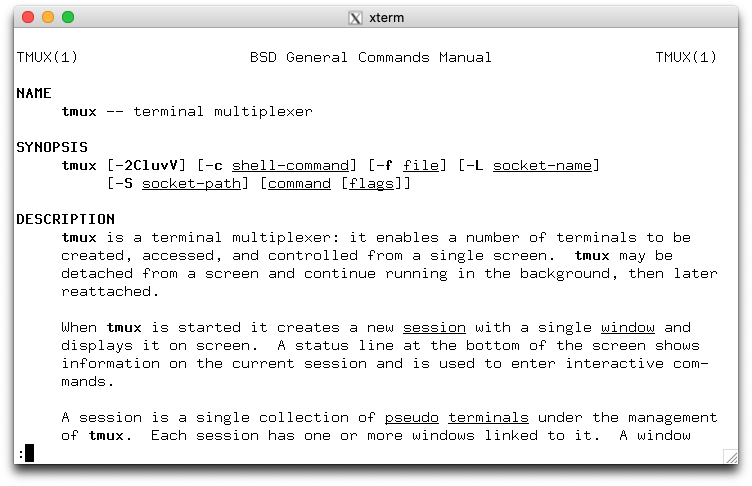

> tmux 的权威参考是 **man page**：`man 1 tmux`（含每条命令、每个选项、每个 flag 的完整说明）。官方在线版：<https://man.openbsd.org/tmux>

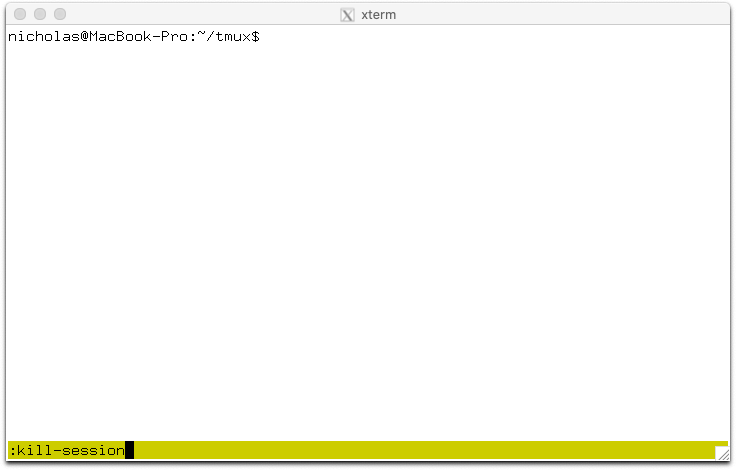

常用命令与别名：

| 命令 | 别名 | 作用 |
|---|---|---|
| `new-session` | `new` | 新建会话 |
| `attach-session` | `attach` | 连接会话 |
| `list-sessions` | `ls` | 列出会话 |
| `kill-session` | | 关闭会话 |
| `kill-server` | | 关闭整个 server |
| `new-window` | `neww` | 新建窗口 |
| `split-window` | `splitw` | 分割窗格（`-h` 水平 / `-v` 垂直） |
| `select-pane` | `selectp` | 选择窗格 |
| `select-window` | `selectw` | 选择窗口 |
| `resize-pane` | `resizep` | 调整窗格 |
| `list-keys` | `lsk` | 列出键位（`-N` 显示说明，`-T` 指定表） |
| `source-file` | `source` | 重新加载配置文件 |
| `show-options` | `show` | 查看选项 |
| `set-option` | `set` | 设置选项 |

**命令提示符**：`C-b :`，可输入任意命令。多个命令用 `;` 分隔（command sequence）。

```bash
:set -g mouse on
:source ~/.tmux.conf
:kill-server
```

**在 shell 里查键位说明**：

```bash
tmux lsk -N | more        # 列出所有键位及说明
tmux lsk -Tprefix         # 只看 prefix 表的原始绑定
```

---

## 8. tmux 复制粘贴与系统剪贴板（分平台）

tmux 有自己的 buffer 系统（最多保留 50 个自动 buffer），默认**不**进系统剪贴板。要让 `C-b [` 复制的内容进入系统剪贴板，需要按平台配置。

### 8.1 macOS（pbcopy）

```bash
bind -T copy-mode-vi y send-keys -X copy-pipe-and-cancel "pbcopy"
```

### 8.2 Arch Linux

X11：

```bash
# 需要 xclip
bind -T copy-mode-vi y send-keys -X copy-pipe-and-cancel "xclip -selection clipboard -i"
```

Wayland：

```bash
# 需要 wl-clipboard
bind -T copy-mode-vi y send-keys -X copy-pipe-and-cancel "wl-copy"
```

### 8.3 Windows（在 WSL 内）

WSL 里可以调用 Windows 的 `clip.exe`：

```bash
bind -T copy-mode-vi y send-keys -X copy-pipe-and-cancel "clip.exe"
```

> 若设置了 `set -g mouse on`，鼠标拖动选择在 tmux 里进行；按住 `Shift` 拖动可用终端原生选择。

---

## 9. tmux 鼠标操作

开启鼠标：

```bash
set -g mouse on
```

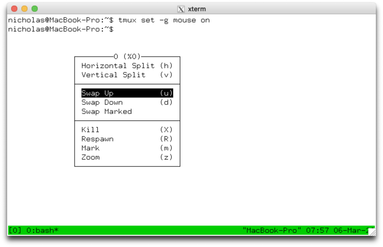

开启后：

- 左键点 pane → 设为 active pane；点状态栏窗口名 → 切换窗口。
- 拖动 pane 边框 → 调整大小。
- 在 pane 内拖动 → 选中文本，松开即复制。
- 右键 pane / 窗口 / 会话 → 弹出命令菜单（每项都标注了快捷键）。
- 拖动浮动窗格边框 → 移动/缩放；按住 `Ctrl` 拖动 → 新建浮动窗格。

---

## 10. tmux 配置文件 .tmux.conf

### 10.1 位置

tmux 按以下顺序查找（依据 `man 1 tmux` 的 FILES 段）：

1. `~/.tmux.conf`（经典，最常用）
2. `$XDG_CONFIG_HOME/tmux/tmux.conf`，即 `~/.config/tmux/tmux.conf`（tmux 3.2a+）
3. `/etc/tmux.conf`（系统级，即 `@SYSCONFDIR@/tmux.conf`）

> **重要**：`.tmux.conf` **只在 server 启动时读取一次**，不是每次新建会话都读。改完要让运行中的 server 重新加载：
> ```bash
> :source ~/.tmux.conf      # 或在 shell 里：tmux source ~/.tmux.conf
> ```

Windows 上：配置文件在**你用的那套环境**里——WSL 的 `~/.tmux.conf`，或 MSYS2/Cygwin 的 home 目录。

### 10.2 语法

- 每行一条命令，`#` 开头是注释。
- 参数可用 `'` 或 `"` 包裹，或转义空格。
- `~` 会展开；环境变量会展开（但 `'` 内不展开）。
- **不是 shell 脚本**，不能用 `$()` 等 shell 构造。

### 10.3 常用配置片段

```bash
# 更友好的 prefix（很多人改成 Ctrl+a）
set -g prefix C-a
unbind C-b
bind C-a send-prefix

# 开启鼠标
set -g mouse on

# 从 1 开始编号窗口/pane
set -g base-index 1
setw -g pane-base-index 1
set -g renumber-windows on

# 更快的前缀响应
set -sg escape-time 10

# 允许 256 色
set -g default-terminal "tmux-256color"
set -as terminal-features ",xterm*:RGB"

# 用 | 和 - 分割（更直观）
bind | split-window -h
bind - split-window -v
unbind '"'
unbind %

# 不用 prefix 直接切换 pane（配合 Alt）
bind -n M-h select-pane -L
bind -n M-l select-pane -R
bind -n M-k select-pane -U
bind -n M-j select-pane -D

# 复制到 macOS 剪贴板
bind -T copy-mode-vi y send-keys -X copy-pipe-and-cancel "pbcopy"

# 状态栏
set -g status-interval 5
set -g status-left "[#S] "
set -g status-right "%H:%M %d-%b"
```

### 10.4 插件（TPM）

社区常用插件管理器 **TPM**：

```bash
git clone https://github.com/tmux-plugins/tpm ~/.tmux/plugins/tpm
```

```bash
set -g @plugin 'tmux-plugins/tpm'
set -g @plugin 'tmux-plugins/tmux-sensible'
set -g @plugin 'tmux-plugins/tmux-resurrect'   # 保存/恢复会话
set -g @plugin 'tmux-plugins/tmux-continuum'   # 自动保存
run '~/.tmux/plugins/tpm/tpm'
```

安装插件：`C-b I`；更新：`C-b U`。

---

## 11. tmux 窗口布局与浮动窗格

### 11.1 预定义布局

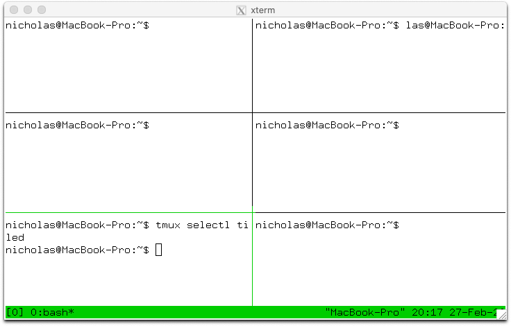

| 布局 | 键 | 说明 |
|---|---|---|
| even-horizontal | `C-b M-1` | 横向均分 |
| even-vertical | `C-b M-2` | 纵向均分 |
| main-horizontal | `C-b M-3` | 顶部一个大窗格，其余横排 |
| main-vertical | `C-b M-4` | 左侧一个大窗格，其余纵排 |
| tiled | `C-b M-5` | 按行列铺满 |

`C-b Space` 在这些布局间轮换。

### 11.2 浮动窗格（tmux 3.8+）

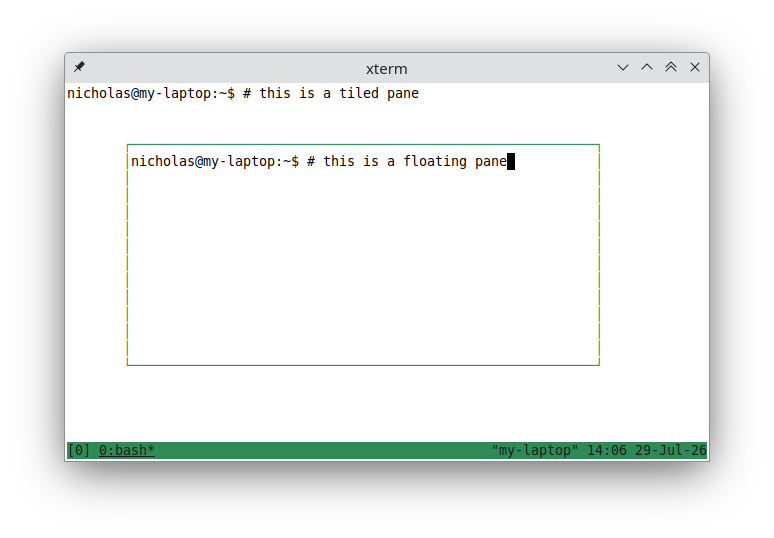

| 键 | 作用 |
|---|---|
| `C-b *` | 新建浮动窗格 |
| `C-b @` | 平铺 ↔ 浮动切换 |
| `C-b g 0` | 浮动窗格占满窗口 |
| `C-b g 1/2/3/4` | 移到左上/右上/左下/右下 |
| `C-b g ←↓↑→` | 移到上/下/左/右边缘居中 |
| `C-b g ,` | 打开移动菜单 |
| `C-b g .` | 打开移动+缩放菜单 |

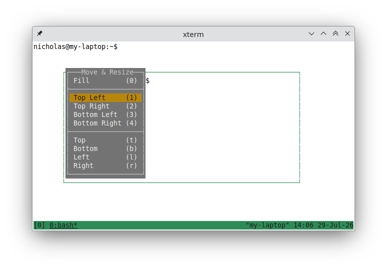

> 3.8 目前处于 **rc** 阶段；稳定版是 3.7c，**浮动窗格在 3.7c 里不可用**。安装 3.8-rc 或用开发版才能体验。

### 11.3 标记与交换

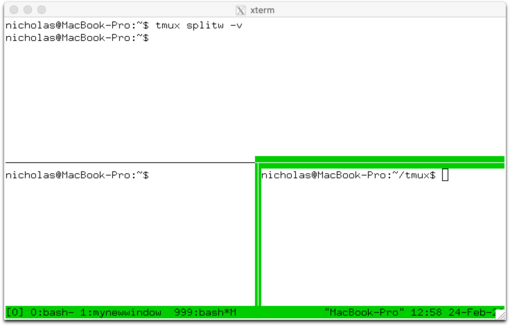

`C-b m` 标记一个 pane（全局唯一），`C-b M` 清除。之后可用 `swap-pane` / `swap-window` 与当前项交换。

### 11.4 重命名

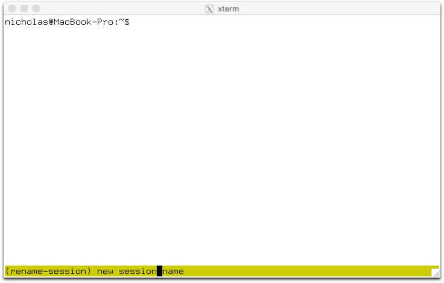

`C-b $` 重命名会话，`C-b ,` 重命名窗口。

---

## 12. tmux 在 Windows 上的方案与限制

> **结论：Windows 上没有原生 tmux。** tmux 依赖 Unix 的 pty 与 fork/exec 模型，官方不支持 Windows 控制台。

### 12.1 方案对比

| 方案 | 安装 | 体验 | 限制 |
|---|---|---|---|
| **WSL2**（推荐） | 在 WSL 里 `sudo apt install tmux` | 完整、原生 | 文件在 WSL 侧；跨 Windows/WSL 剪贴板要配 `clip.exe` |
| **MSYS2** | MSYS2 里 `pacman -S tmux` | 较完整 | **只能在 mintty 终端里跑**，原生 cmd/PowerShell 控制台不可用 |
| **Cygwin** | Cygwin 安装器选 `tmux` | 较完整 | 同上，mintty 限定；与 Windows 路径/程序互操作有坑 |

### 12.2 为什么原生不行

- tmux 通过 `forkpty(3)` 创建伪终端（pty）并运行程序，Windows 控制台模型不同（ConPTY 是另一套）。
- 官方 issue **#1954「running natively on Windows 10」** 的答复即：Cygwin/MSYS2 有 tmux，但**无法在原生控制台使用**。

### 12.3 WSL2 落地建议

1. 安装 WSL2 + 一个发行版（Ubuntu 等）。
2. 在发行版内 `sudo apt update && sudo apt install tmux`。
3. 用 **Windows Terminal** 新建 WSL profile，设为默认，直接进入 tmux。
4. 剪贴板：`copy-pipe-and-cancel "clip.exe"`；粘贴用终端原生 `Ctrl+Shift+V`。
5. 想开机即进 tmux：在 WSL 的 `~/.bashrc` 末尾加
   ```bash
   [ -z "$TMUX" ] && tmux new -As main
   ```

> 如果你想要**原生 Windows 的 tmux 式体验**，直接用 **herdr**（见另一本《herdr 使用手册》）或 **Zellij**。

---

## 13. tmux 进阶：control mode / formats / tmuxp

> 前面是日常操作；本章是 tmux 真正「强于」多数复用器的三块进阶能力：**脚本化控制、格式串、声明式会话管理**。

### 13.1 Control mode（`-C` / `-CC`）：用文本协议控制 tmux

Control mode 让 tmux **不画终端**，改用纯文本协议通信——因此极易解析，也能跨 `ssh` 使用。它最初是为 **iTerm2** 原生集成设计的（iTerm2 用它的 UI 显示 tmux 窗格）。

```bash
tmux -C attach            # 单 -C：保留终端规范模式（调试用）
tmux -CC attach           # 双 -CC：禁用规范模式，供应用使用
tmux -CC new -s work      # 新建并以 control mode 附着
```

- **发送**：直接写 tmux 命令（`new-window`、`list-panes`、`show-options` …），每行一条。
- **接收**：命令输出包在 `%begin` / `%end`（成功）或 `%begin` / `%error`（失败）之间；异步通知以 `%` 开头，如 `%output %1 ...`、`%window-add @1`、`%session-changed $1 name`。
- **空行** = detach。

```text
$ tmux -Ltest -C new
%begin 1578920019 258 0
%end 1578920019 258 0
%window-add @1
%sessions-changed
%session-changed $1 1
%output %1 nicholas@yelena:~$
```

**取信息**优先用 `-F` 指定格式，配合 `q` 修饰符转义：

```bash
tmux ls -F '#{session_id} "#{q:session_name}"'
```

**实用场景**：iTerm2 的 tmux 集成、把 tmux 嵌进 GUI/编辑器、写自动化脚本（比反复 `send-keys` 更可靠）。iTerm2 用户直接 `tmux -CC` 就能获得原生分屏体验。

> 完整通知表、flow control、format subscriptions 见官方 Wiki：[Control Mode](https://github.com/tmux/tmux/wiki/Control-Mode)。

### 13.2 Formats（`#{}`）：状态栏与脚本的通用取值语法

Format 用 `#{}` 展开会话/窗口/窗格/服务器属性，可用于 `status-left`、`status-right`、`list-*` 的 `-F`、`display-message -p`、`if-shell` 等。

常用字段：

| 格式 | 含义 |
|---|---|
| `#{session_name}` | 会话名 |
| `#{window_index}` / `#{window_name}` | 窗口索引 / 名 |
| `#{pane_index}` / `#{pane_title}` | 窗格索引 / 标题 |
| `#{pane_current_path}` | 窗格当前目录（**很有用**） |
| `#{pane_current_command}` | 窗格当前命令 |
| `#{client_width}` / `#{client_height}` | 终端尺寸 |

常用技巧：

```bash
# 条件表达式
set -g status-right "#{?window_zoomed_flag,ZOOM,}"
# 三元嵌套 + 比较
set -g status-right "#{?#{==:#{pane_current_command},ssh},SSH,} %H:%M"
# 路径修饰符：b=basename，d=dirname
set -g status-left "#{b:pane_current_path}"

# 命令行查看某 format 的展开结果
tmux display-message -p '#{session_name} #{window_index}'
```

**在新窗格/分屏里沿用当前目录**（高频需求）：

```bash
bind c   new-window   -c "#{pane_current_path}"
bind '"' split-window -c "#{pane_current_path}"
bind %   split-window -h -c "#{pane_current_path}"
```

> 完整字段表见官方 Wiki：[Formats](https://github.com/tmux/tmux/wiki/Formats)。

### 13.3 tmuxp / tmuxinator：用 YAML 声明会话

手写一长串 `new-window` / `split-window` 很痛苦，用声明式会话管理器更省事。

**tmuxp**（Python）：

```bash
pip install tmuxp
tmuxp load my-session.yaml           # 加载 YAML 会话
tmuxp freeze -s work -f work.yaml    # 把当前会话「冻结」成 YAML
```

```yaml
session_name: myproject
windows:
  - window_name: editor
    layout: main-vertical
    panes:
      - vim
      - shell_command: git status
  - window_name: logs
    panes:
      - shell_command: tail -f app.log
```

**tmuxinator**（Ruby）类似：`gem install tmuxinator`，配置放 `~/.config/tmuxinator/*.yml`，用 `mux start myproject`。

> 二者都是「把常用工作区变成一条命令」。若想用 tmux 原生能力，也可 `.tmux.conf` + `source-file`；或直接参考 Zellij / herdr 的 layout 思路。

### 13.4 其它进阶点

```bash
# 条件执行
if-shell "test -f ~/.tmux.local.conf" "source-file ~/.tmux.local.conf"

# 执行 shell 命令并显示结果
run-shell "tmux display-message 'hi'"

# 钩子（事件驱动）
set-hook -g pane-focus-in 'display-message "focused"'

# copy mode 使用 vi 键位
setw -g mode-keys vi
```

---

## 23. 速查表

### 23.1 tmux（prefix = `Ctrl b`）

| 目的 | 操作 |
|---|---|
| 新建会话 | `tmux new -s 名字` |
| 列出会话 | `tmux ls` |
| 连接会话 | `tmux a -t 名字` |
| Detach | `C-b d` |
| 新窗口 | `C-b c` |
| 左右分割 | `C-b %` |
| 上下分割 | `C-b "` |
| 切换窗格 | `C-b 方向键` |
| 缩放窗格 | `C-b z` |
| 关闭窗格 | `C-b x` |
| 复制模式 | `C-b [` |
| 粘贴 | `C-b ]` |
| 命令提示符 | `C-b :` |
| 键位帮助 | `C-b ?` |
| 重新加载配置 | `C-b :` → `source ~/.tmux.conf` |

### 23.3 平台可用性（再强调一次）

```text
                Windows            Arch Linux        macOS
tmux            ✗ 原生             ✓ pacman          ✓ brew
                → WSL2 / MSYS2 / Cygwin
herdr           ✓ 原生（有限制）    ✓ 脚本/AUR        ✓ brew
```

---

## 24. 参考链接与视频

### tmux

- 官方 Wiki（Getting Started）：<https://github.com/tmux/tmux/wiki/Getting-Started>
- 安装文档：<https://github.com/tmux/tmux/wiki/Installing>
- 剪贴板配置：<https://github.com/tmux/tmux/wiki/Clipboard>
- man page：<https://man.openbsd.org/tmux>
- GitHub：<https://github.com/tmux/tmux>
- 预编译静态二进制：<https://github.com/tmux/tmux-builds>
- Windows 原生 issue #1954：<https://github.com/tmux/tmux/issues/1954>
- 插件管理器 TPM：<https://github.com/tmux-plugins/tpm>

### 相关文件位置

| 内容 | Windows | Arch Linux | macOS |
|---|---|---|---|
| tmux 配置 | WSL/MSYS2 内的 `~/.tmux.conf` 或 `~/.config/tmux/tmux.conf` | `~/.tmux.conf` / `~/.config/tmux/tmux.conf` | 同左 |
| herdr 配置 | `%APPDATA%\herdr\config.toml` | `~/.config/herdr/config.toml` | `~/.config/herdr/config.toml` |
| herdr 日志 | `~/.config/herdr/herdr*.log`（Windows 同目录） | 同左 | 同左 |
| 本手册配图 | `./images/` | `./images/` | `./images/` |

---

> 图片版权归 tmux 项目（Wiki）与 herdr 项目所有，来源分别为 <https://github.com/tmux/tmux/wiki> 与 <https://herdr.dev>、Better Stack。本手册仅供个人学习使用。
