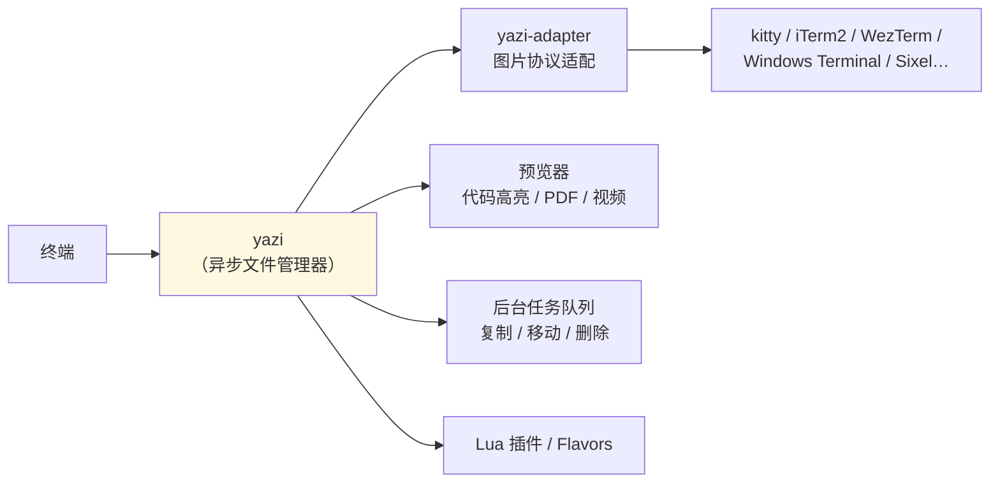
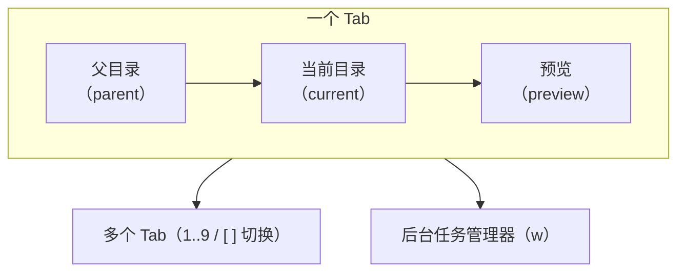
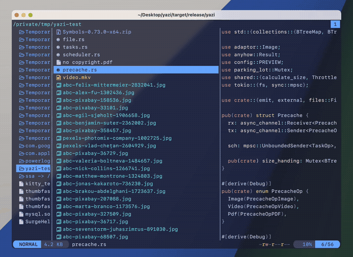
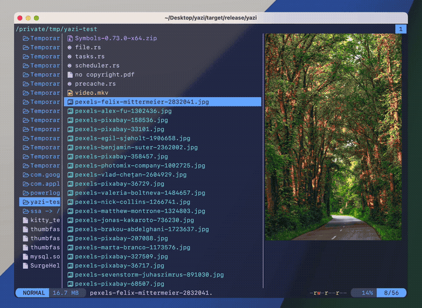
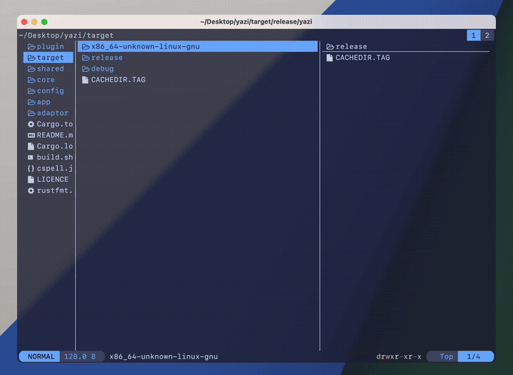
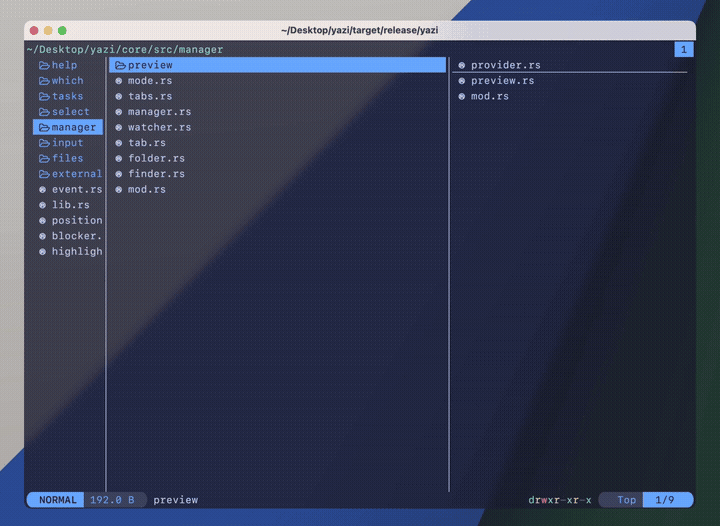
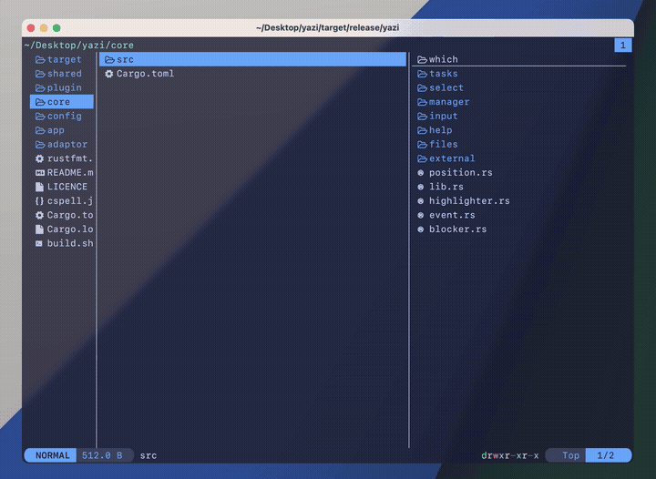
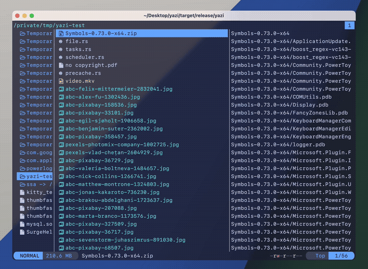
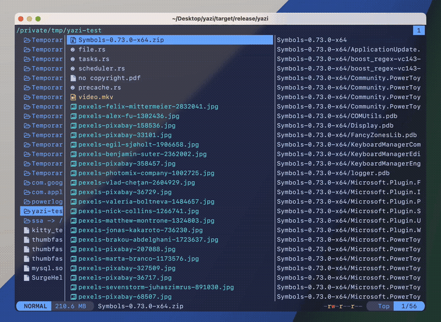

# yazi 使用手册（Windows / Arch Linux / macOS）

> - **版本**：Yazi **26.9.1**（2026 年 9 月，采用日历版本号）
> - **官方文档**：<https://yazi-rs.github.io/docs/installation> ｜ GitHub：<https://github.com/sxyazi/yazi>
> - **定位**：Rust 写的**极速异步终端文件管理器**，vim 键位、内建图片预览、Lua 插件系统
> - **整理日期**：2026-09-14
> - **说明**：本手册的键位表**逐条来自官方 `keymap-default.toml`**，配图/动图来自官方文档站。

---

## 目录

0. [平台可用性总表](#0-平台可用性总表)
1. [yazi 是什么](#1-yazi-是什么)
2. [安装（分平台）](#2-安装分平台)
3. [依赖：必装与可选](#3-依赖必装与可选)
4. [快速上手与 shell wrapper](#4-快速上手与-shell-wrapper)
5. [界面与核心概念](#5-界面与核心概念)
6. [键位大全](#6-键位大全)
7. [文件操作](#7-文件操作)
8. [选择与可视模式](#8-选择与可视模式)
9. [搜索与跳转](#9-搜索与跳转)
10. [预览（图片 / 视频 / PDF / 代码）](#10-预览图片--视频--pdf--代码)
11. [标签页与任务管理](#11-标签页与任务管理)
12. [排序 / 过滤 / 行模式](#12-排序--过滤--行模式)
13. [配置文件](#13-配置文件)
14. [插件与 Flavors](#14-插件与-flavors)
15. [命令行工具 ya](#15-命令行工具-ya)
16. [平台注意事项](#16-平台注意事项)
17. [速查表](#17-速查表)
18. [参考链接](#18-参考链接)

---

## 0. 平台可用性总表

| 能力 | Windows（原生） | Windows（WSL） | Arch Linux | macOS |
|---|---|---|---|---|
| yazi 本体 | ✅ scoop / winget | ✅ | ✅ `pacman -S yazi` | ✅ brew / MacPorts |
| 必需的 `file(1)` | ⚠️ 需 Git for Windows 的 `file.exe` + 设 `YAZI_FILE_ONE` | ✅ 自带 | ✅ 自带 | ✅ 自带 |
| 图片预览 | ⚠️ 仅 WezTerm(nightly) / Windows Terminal ≥1.22.10352.0 / Bobcat | ⚠️ 受限（ConPTY），推荐 `wezterm ssh` | ✅ 多数终端 | ✅ 多数终端 |
| 剪贴板（复制路径） | ✅ | ✅ | ⚠️ 需 `xclip`/`wl-clipboard`/`xsel` | ✅ |
| 配置文件位置 | `%AppData%\yazi\config\` | `~/.config/yazi/` | `~/.config/yazi/` | `~/.config/yazi/` |

**一句话**：
- **Linux / macOS** 是 yazi 的主场，图片预览基本开箱即用。
- **Windows 原生** 可用，但**必须**按官方唯一推荐的方式解决 `file(1)`（见 §3.1），且**图片预览终端有限**。
- **在 WSL 里跑** 体验更好，想拿到完美图片预览可走 `wezterm ssh 127.0.0.1`（见 §10.4）。

---

## 1. yazi 是什么


**Yazi（鸭子）** 是一个用 **Rust** 写的**终端文件管理器**，基于**非阻塞异步 I/O**，把 CPU 任务分发到多线程。相比 ranger 一类，它的卖点是：

- **极快**：异步 I/O + 任务调度 + 预加载（preloading）
- **内建预览**：图片、视频缩略图、PDF、代码高亮，多种图片协议原生支持
- **vim 键位**：`hjkl` 导航，`v` 可视模式，`d/y/p` 等
- **可扩展**：Lua 插件系统 + Flavors（主题）+ `ya` 包管理器
- **后台任务**：复制/移动/删除是带进度、可取消的后台任务



---

## 2. 安装（分平台）

### 2.1 Arch Linux（官方仓库）

```bash
sudo pacman -S yazi ffmpeg 7zip jq poppler fd ripgrep fzf zoxide resvg imagemagick
```

- 最新 Git 版：`paru -S yazi-git ...`（AUR / Arch Linux CN）
- 官方 nightly（6 小时内构建）：`paru -S yazi-nightly-bin ...`

### 2.2 macOS

**Homebrew**：

```bash
brew update
brew install yazi ffmpeg-full sevenzip jq poppler fd ripgrep fzf zoxide resvg imagemagick-full font-symbols-only-nerd-font
brew link ffmpeg-full imagemagick-full -f --overwrite
```

- 最新代码：`brew install yazi --HEAD`

**MacPorts**：

```bash
sudo port install yazi ffmpeg 7zip jq poppler fd ripgrep fzf zoxide ImageMagick
```

### 2.3 Windows（原生）

> ⚠️ 官方说明：Windows 上 yazi 依赖 `file(1)` 检测 mime-type，**唯一推荐**的做法是用 **Git for Windows 自带的 `file.exe`**。官方**不推荐**用 Scoop/Chocolatey 装 `file`（无法正确处理 Unicode 文件名、缺参数）。

1. 安装 **Git for Windows**（官方安装器或包管理器）。
2. 设置环境变量 `YAZI_FILE_ONE` 指向 `file.exe`：
   - 官方安装器：`C:\Program Files\Git\usr\bin\file.exe`
   - Scoop 装的 Git：`C:\Users\<用户名>\scoop\apps\git\current\usr\bin\file.exe`
3. 重启终端。

然后任选其一安装：

```powershell
# Scoop（推荐，依赖一并装）
scoop install yazi
scoop install ffmpeg 7zip jq poppler fd ripgrep fzf zoxide resvg imagemagick

# WinGet
winget install sxyazi.yazi
winget install Gyan.FFmpeg 7zip.7zip jqlang.jq oschwartz10612.Poppler sharkdp.fd BurntSushi.ripgrep.MSVC junegunn.fzf ajeetdsouza.zoxide ImageMagick.ImageMagick
```

> `resvg` 暂不在 WinGet，用 Scoop 或手动下载。

### 2.4 其它

| 方式 | 命令 |
|---|---|
| Debian/Ubuntu 官方 APT 源 | 见官方文档 `yazi-rs/builds`（stable / nightly） |
| Snap | `sudo snap install yazi --classic` |
| Flatpak | ⚠️ 沙箱限制多，官方建议进阶用户改用其它方式 |
| Nix | `nix-env -iA nixpkgs.yazi` / home-manager `programs.yazi.enable = true` |
| crates.io | `cargo install --force yazi-build`（需 Rust 工具链） |
| cargo-binstall | `cargo binstall yazi-fm` |
| 官方二进制 | <https://github.com/sxyazi/yazi/releases>（GNU / Musl，含 nightly） |

---

## 3. 依赖：必装与可选

### 3.1 必装

| 依赖 | 用途 |
|---|---|
| **`file`** | **文件类型（mime）检测**，yazi 强依赖 |

Windows 上见 §2.3（用 Git 的 `file.exe` + `YAZI_FILE_ONE`）。若实在不想装，可用 `mime-ext.yazi` 插件（用扩展名数据库替代）。

### 3.2 可选（按需，缺失只是少对应功能）

| 依赖 | 启用的功能 |
|---|---|
| **nerd-fonts** | 图标（**强烈建议**） |
| `ffmpeg` | 视频缩略图 |
| 7-Zip（**非 standalone 版**） | 压缩包解压与预览 |
| `jq` | JSON 预览 |
| `poppler` | PDF 预览 |
| `fd` | 按文件名搜索（`s`） |
| `rg`（ripgrep） | 按文件内容搜索（`S`） |
| `fzf`（≥ 0.53.0） | 快速子树跳转（`z`） |
| `zoxide`（需 fzf） | 历史目录跳转（`Z`） |
| `resvg` | SVG 预览 |
| ImageMagick（≥ 7.1.1） | 字体 / HEIC / JPEG XL 预览 |
| `xclip` / `wl-clipboard` / `xsel` | **Linux** 剪贴板支持 |

> 功能异常时，先把这些依赖升到最新版。

---

## 4. 快速上手与 shell wrapper

启动：

```bash
yazi
```

- `q` 退出，`F1` 或 `~` 打开帮助菜单。

### 4.1 shell wrapper `y`（**强烈推荐**）

原生 `yazi` 退出后**不会**改变你所在 shell 的目录。用官方 `y` 包装函数可以「退出时 cd 到 yazi 最后所在目录」：

**Bash / Zsh**：

```bash
function y() {
	local tmp cwd; tmp="$(mktemp -t "yazi-cwd.XXXXXX")"
	command yazi "$@" --cwd-file="$tmp"
	IFS= read -r -d '' cwd < "$tmp"
	[ "$cwd" != "$PWD" ] && [ -d "$cwd" ] && builtin cd -- "$cwd" || builtin true
	command rm -f -- "$tmp"
}
```

**Fish**：

```fish
function y
	set tmp (mktemp -t "yazi-cwd.XXXXXX")
	command yazi $argv --cwd-file="$tmp"
	if read -z cwd < "$tmp"; and [ "$cwd" != "$PWD" ]; and test -d "$cwd"
		builtin cd -- "$cwd"
	end
	command rm -f -- "$tmp"
end
```

**PowerShell**（Windows）：

```powershell
function y {
    $tmp = [System.IO.Path]::GetTempFileName()
    yazi $args --cwd-file="$tmp"
    $cwd = Get-Content -Path $tmp -Encoding UTF8
    if (-not [String]::IsNullOrEmpty($cwd) -and $cwd -ne $PWD.Path) {
        Set-Location -LiteralPath ([System.IO.Path]::GetFullPath($cwd))
    }
    Remove-Item -Path $tmp
}
```

之后用 `y` 启动，按 `q` 退出时 CWD 会跟着变；不想变目录就按 **`Q`**（`quit --no-cwd-file`）。

---

## 5. 界面与核心概念



| 概念 | 说明 |
|---|---|
| **Tab** | 一个独立的目录浏览会话，可多个；每个 Tab 有自己的 CWD |
| **三栏** | 父目录 / 当前目录 / 预览，宽度可配 |
| **hovered file** | 光标所在文件 |
| **selected files** | 用 `<Space>` 勾选的文件（可跨目录） |
| **visual mode** | `v` 进入，像 vim 的可视线选 |
| **yank** | 类似 vim 的 yank：`y` 复制、`x` 剪切、`p` 粘贴 |
| **任务管理器** | 复制/移动/删除等后台任务，`w` 打开 |
| **Spot** | `<Tab>` 把当前预览「钉」在一个浮层里（spot） |
| **DDS** | Data Distribution Service，插件间/外部程序与 yazi 通信的机制 |

---

## 6. 键位大全

> 以下为官方 `keymap-default.toml` 的 **`[mgr]`（主浏览）层**默认键位。yazi 共有 8 个键位层：`mgr`、`tasks`、`spot`、`pick`、`input`、`confirm`、`cmp`、`help`。

### 6.1 退出 / 关闭

| 键 | 作用 |
|---|---|
| `q` | 退出进程 |
| `Q` | 退出且**不**输出 cwd-file |
| `<Esc>` / `<C-[>` | 退出可视模式 / 清空选择 / 退出 view |
| `<C-c>` | 关闭当前 Tab（若是最后一个则退出） |
| `<C-z>` | 挂起进程（suspend） |

### 6.2 移动光标

| 键 | 作用 |
|---|---|
| `k` / `↑` | 上一个文件 |
| `j` / `↓` | 下一个文件 |
| `gg` / `<Home>` | 到顶部 |
| `G` / `<End>` | 到底部 |
| `<C-u>` / `<S-PageUp>` | 上移半页 |
| `<C-d>` / `<S-PageDown>` | 下移半页 |
| `<C-b>` / `<PageUp>` | 上移一页 |
| `<C-f>` / `<PageDown>` | 下移一页 |

### 6.3 目录导航

| 键 | 作用 |
|---|---|
| `h` / `←` | 回到父目录 |
| `l` / `→` | 进入子目录 |
| `H` | 后退（历史） |
| `L` | 前进（历史） |
| `K` | 预览向上 seek 5 单位 |
| `J` | 预览向下 seek 5 单位 |

### 6.4 打开 / 操作

| 键 | 作用 |
|---|---|
| `o` / `<Enter>` | 打开选中文件（按 `[open]` 规则） |
| `O` / `<S-Enter>` | 交互式打开 |
| `y` | 复制（yank） |
| `x` | 剪切（yank --cut） |
| `p` | 粘贴 |
| `P` | 粘贴（存在则覆盖） |
| `-` | 为 yank 的文件创建**绝对路径**符号链接 |
| `_` | 创建**相对路径**符号链接 |
| `<C-->` | 硬链接 |
| `Y` / `X` | 取消 yank 状态 |
| `d` | 移入回收站 |
| `D` | **永久删除** |
| `a` | 创建文件（以 `/` 结尾则建目录） |
| `A` | 批量创建 |
| `r` | 重命名（光标默认落在扩展名前） |
| `;` | 运行 shell 命令 |
| `:` | 运行 shell 命令（**阻塞**直到结束） |
| `.` | 切换隐藏文件显示 |

### 6.5 选择 / 可视模式

| 键 | 作用 |
|---|---|
| `<Space>` | 切换当前文件的选中状态并下移一行 |
| `<C-a>` | 全选 |
| `<C-r>` | 反选 |
| `v` | 进入可视模式（选择模式） |
| `V` | 进入可视模式（取消模式） |
| `<Tab>` | Spot（把当前预览钉住） |

### 6.6 搜索 / 跳转 / 过滤

| 键 | 作用 |
|---|---|
| `s` | 用 **fd** 按文件名搜索 |
| `S` | 用 **ripgrep** 按内容搜索 |
| `z` | 用 **fzf** 跳转文件/目录 |
| `Z` | 用 **zoxide** 跳转历史目录 |
| `/` | 在当前目录内查找下一个（smart） |
| `?` | 查找上一个 |
| `n` / `N` | 下一个 / 上一个匹配 |
| `<C-s>` | 取消正在进行的搜索 |
| `f` | 过滤文件（smart） |

### 6.7 复制路径（`c` 前缀）

| 键 | 作用 |
|---|---|
| `cc` | 复制文件路径 |
| `cC` | 复制文件 URL |
| `cd` | 复制目录路径 |
| `cD` | 复制目录 URL |
| `cf` | 复制文件名 |
| `cn` | 复制不含扩展名的文件名 |

### 6.8 排序（`,` 前缀）

| 键 | 作用 | 键 | 作用 |
|---|---|---|---|
| `,m` / `,M` | 按修改时间 / 反向 | `,b` / `,B` | 按创建时间 / 反向 |
| `,e` / `,E` | 按扩展名 / 反向 | `,a` / `,A` | 按字母 / 反向 |
| `,n` / `,N` | 自然排序 / 反向 | `,s` / `,S` | 按大小 / 反向 |
| `,r` | 随机排序 | | |

### 6.9 跳转目录（`g` 前缀）

| 键 | 作用 |
|---|---|
| `gh` | 回家目录 `~` |
| `gc` | 到 `~/.config` |
| `gd` | 到 `~/Downloads` |
| `gt` | 到回收站 |
| `g<Space>` | 交互式输入路径跳转 |
| `gf` | 跟随光标下的符号链接 |

### 6.10 行模式（`m` 前缀）

| 键 | 作用 |
|---|---|
| `ms` / `mp` / `mb` / `mm` / `mo` / `mn` | 显示 大小 / 权限 / 创建时间 / 修改时间 / 属主 / 无 |

### 6.11 标签页

| 键 | 作用 |
|---|---|
| `tt` | 在当前目录新建 Tab |
| `tr` | 重命名当前 Tab |
| `1`–`9` | 跳到第 N 个 Tab |
| `[` / `]` | 上一个 / 下一个 Tab |
| `{` / `}` | 与前一个 / 后一个 Tab 交换位置 |

### 6.12 其它

| 键 | 作用 |
|---|---|
| `w` | 打开**任务管理器** |
| `~` / `<F1>` | 打开帮助 |



> **输入框层（`[input]`）**支持 vim 风格编辑：`i`/`a` 插入、`h`/`l` 移动、`0`/`$` 行首尾、`w`/`b`/`e` 词移动、`d`/`y`/`p` 剪切复制粘贴、`<C-u>`/`<C-k>` 删到行首/行尾、`<C-r>` 重做、`k`/`j` 调历史。
> **确认框层（`[confirm]`）**：`y` 确认、`n` 取消、`<Enter>` 提交。

---

## 7. 文件操作

### 7.1 复制 / 剪切 / 粘贴

```text
y  →  选中文件（可多选）→  到目标目录  →  p
x  →  选中文件（剪切）  →  到目标目录  →  p
```

- `P` 粘贴时若目标已存在则**覆盖**。
- 粘贴是**后台任务**，进度可在 `w` 任务管理器里看。

### 7.2 删除

- `d`：移入**回收站**（可恢复，`gt` 进回收站）
- `D`：**永久删除**（谨慎）

### 7.3 重命名 / 新建

- `r`：重命名（光标默认停在扩展名前，方便只改主名）
- `a`：新建文件；**以 `/` 结尾则新建目录**（如 `src/`）
- `A`：批量创建

### 7.4 链接

- `-`：为 yank 的文件建**绝对路径**符号链接
- `_`：建**相对路径**符号链接
- `<C-->`：硬链接

### 7.5 运行 shell 命令

- `;`：交互式运行（不阻塞 yazi）
- `:`：阻塞式运行直到命令结束

---

## 8. 选择与可视模式



- `<Space>` 逐个勾选/取消；`<C-a>` 全选；`<C-r>` 反选。
- **选择可跨目录**：在 A 目录选几个，切到 B 目录再选几个。
- 清空所有选择：`<Esc>`（`escape --select` 可只清选择）。
- `v` 进入**可视模式**，用 `j`/`k` 连续选中一段，再执行 `y`/`x`/`d` 等。



---

## 9. 搜索与跳转



| 键 | 工具 | 说明 |
|---|---|---|
| `s` | **fd** | 按**文件名**搜索 |
| `S` | **ripgrep** | 按**内容**搜索 |
| `z` | **fzf** | 模糊跳转文件/目录（子树） |
| `Z` | **zoxide** | 跳到常去的**历史目录** |
| `/` `?` | 内建 | 当前目录内查找 |
| `f` | 内建 | 过滤当前列表 |





> 这些键都绑定到**插件**（`plugin fd` / `plugin rg` / `plugin fzf` / `plugin zoxide`），需要对应二进制在 PATH 上。

---

## 10. 预览（图片 / 视频 / PDF / 代码）



- **图片**：yazi 自动按终端能力选择协议（见下）。
- **视频缩略图**：需要 `ffmpeg`。
- **PDF**：需要 `poppler`。
- **JSON**：需要 `jq`；**SVG** 需要 `resvg`；**字体/HEIC/JPEG XL** 需要 ImageMagick。
- **代码高亮**：内建（在 `theme.toml` 里配语法高亮主题）。
- `J` / `K`：在预览里向下/向上滚动。

### 10.1 终端图片协议支持（官方表）

| 终端 | 协议 | 支持 |
|---|---|---|
| kitty（≥ 0.28.0） | Kitty unicode placeholders | ✅ 内建 |
| iTerm2 | Inline images | ✅ 内建 |
| WezTerm | Inline images | ✅ 内建 |
| Konsole | Kitty old | ✅ 内建 |
| foot | Sixel | ✅ 内建 |
| Ghostty | Kitty unicode placeholders | ✅ 内建 |
| **Windows Terminal（≥ v1.22.10352.0）** | Sixel | ✅ 内建 |
| st（Sixel patch） | Sixel | ✅ 内建 |
| Warp（macOS/Linux） | Inline images | ✅ 内建 |
| Tabby / VSCode / Bobcat | Inline images | ✅ 内建 |
| Rio | Inline images | ❌ 尺寸错误 |
| X11 / Wayland | Window system protocol | ☑️ 需 **Überzug++** |
| 兜底 | ASCII art | ☑️ 需 **Chafa**（≥ 1.16.0） |

> 选择依据 `$TERM`、`$TERM_PROGRAM`、`$XDG_SESSION_TYPE`，**不要误覆盖**这三个变量。
> 用 **`ya env`** 查看实际用的协议：输出里的 `Adapter Drivers.matches: Kgp / Iip / Sixel / X11 / Chafa …`。

### 10.2 在 tmux 里用（和本机 tmux 手册呼应）

在 `tmux.conf` 里加：

```bash
set -g allow-passthrough on
set -ga update-environment TERM
set -ga update-environment TERM_PROGRAM
```

然后**必须重启 tmux**：

```bash
tmux kill-server && tmux || tmux
```

> 若协议是 **Sixel**，确认 tmux 编译时带了 `--enable-sixel`（默认关闭）。

### 10.3 在 Zellij 里用（限制较多）

Zellij 目前只支持 **Kitty old** 和 **Sixel**，且：
- KGP 实现有 bug，图片预览可能不工作；
- Sixel 实现 buggy 且性能差，快速切图会卡顿、撕裂甚至不显示。

**结论**：图片预览是硬需求的话，**别在 Zellij 里跑 yazi**。

### 10.4 Windows / WSL 的图片预览

- **Windows 原生**：只有 3 个终端能显示图片——**WezTerm（最新 nightly）**、**Windows Terminal ≥ v1.22.10352.0**、**Bobcat v0.9.0**。
- **WSL**：受 ConPTY 限制，可走 **WezTerm 的 SSH** 绕过：
  ```bash
  # 在 WSL 内
  sudo apt install openssh-server && sudo service ssh restart
  # 在宿主机上
  wezterm ssh 127.0.0.1
  ```
  这是目前唯一能拿到「完美图片预览」的 WSL 方案。

---

## 11. 标签页与任务管理

- **多标签**：`tt` 新建、`tr` 重命名、`1`–`9` 切换、`[`/`]` 前后、`{`/`}` 交换位置。
- **任务管理器**：`w` 打开；里面 `j`/`k` 选择、`<Enter>` 查看详情（inspect）、`x` 取消任务、`<Esc>`/`w` 关闭。

---

## 12. 排序 / 过滤 / 行模式

- **排序**：`,` 前缀（见 §6.8）。排序时可同时切换行模式显示对应信息。
- **过滤**：`f` 按当前目录名过滤列表。
- **行模式**：`m` 前缀，在文件名后显示 大小/权限/时间/属主。

---

## 13. 配置文件

### 13.1 位置

| 平台 | 配置目录 |
|---|---|
| Unix（Linux / macOS） | `~/.config/yazi/` |
| **Windows** | `%AppData%\yazi\config\` |

可用环境变量 `YAZI_CONFIG_HOME` 指定自定义目录：

```bash
YAZI_CONFIG_HOME=~/.config/yazi-alt yazi
```

### 13.2 四个文件

| 文件 | 作用 |
|---|---|
| `yazi.toml` | 通用配置（显示、预览、打开规则、图标…） |
| `keymap.toml` | 键位 |
| `theme.toml` | 配色 / 语法高亮 |
| `init.lua` | 启动脚本（注册插件等） |
| `package.toml` | `ya pkg` 管理的插件/Flavor 锁版本 |
| `plugins/` `flavors/` | 插件与主题目录 |

默认配置在 `shipped` tag：<https://github.com/sxyazi/yazi/tree/shipped/yazi-config/preset>

### 13.3 覆盖 vs 追加（关键）

- **直接覆盖默认**：写 `[mgr] keymap = [ ... ]` 会**替换**该层默认键位。
- **在默认之上增删**（推荐）：用 `prepend_keymap` / `append_keymap`：

```toml
# keymap.toml
[mgr]
prepend_keymap = [
  { on = "<C-a>", run = "act1", desc = "示例：Ctrl+a" },
]
append_keymap = [
  # ...
]
```

> `prepend_` 优先级高于默认，`append_` 低于默认。yazi 取**第一个匹配**的键。
> 这套 `prepend_`/`append_` 同样适用于 `open`、`icon`、`previewer`、`preloader` 规则。

### 13.4 按操作系统绑定（`for`）

```toml
[mgr]
prepend_keymap = [
  { on = [ "g", "d" ], run = "cd ~/dev",   desc = "Go dev",   for = "unix" },
  { on = [ "g", "d" ], run = 'cd C:\dev',  desc = "Go C:\\dev", for = "windows" },
]
```

`for` 可选值：`"linux"`、`"macos"`、`"windows"`、`"android"`、`"unix"`。

### 13.5 修饰键写法

| 写法 | 含义 |
|---|---|
| `<S-…>` | Shift |
| `<C-…>` | Ctrl |
| `<A-…>` | Alt / Meta |
| `<D-…>` | Command / Windows / Super |

> 注意 `<Tab>` = `<C-i>`、`<Enter>` = `<C-m>`；`<D-…>` / `<A-…>` 是否可用取决于终端。

### 13.6 常用示例

```toml
# yazi.toml
[mgr]
show_hidden = true          # 默认显示隐藏文件

[preview]
max_width  = 1000           # 预览图片最大宽（像素）
max_height = 1000           # 预览图片最大高（像素）
```

---

## 14. 插件与 Flavors

- **Flavors**：预制的主题配色，仓库 <https://github.com/yazi-rs/flavors>。
- **官方插件**：<https://github.com/yazi-rs/plugins>（约 18 个，如 `git.yazi`、`chmod.yazi`、`full-border.yazi`、`toggle-pane.yazi`）。
- **社区资源**：`awesome-yazi`（150+ 插件与资源）。
- **集成**：`yazi.nvim`（Neovim）、`lazygit.yazi`、`starship.yazi`。

用 `ya pkg` 安装（见下章）。

---

## 15. 命令行工具 ya

`ya` 是 yazi 的配套 CLI（大多数发行版随 yazi 一起装；版本**必须**与 yazi 完全一致）。

### 15.1 包管理器 `ya pkg`

```bash
ya pkg add owner/my-plugin            # 从 GitHub 安装插件
ya pkg add yazi-rs/plugins:git        # 安装 monorepo 的子目录
ya pkg delete yazi-rs/plugins:git
ya pkg list
ya pkg install                        # 按 package.toml 锁定版本安装全部
ya pkg upgrade                        # 升级全部
```

锁版本示例（`~/.config/yazi/package.toml`）：

```toml
[[plugin.deps]]
use  = "owner/my-plugin"
rev  = "0573024"
hash = "d81b64a39432fcd6224cd75d296e7510"

[[plugin.deps]]
use  = "yazi-rs/plugins:git"
rev  = "9a1129c"
hash = "a8e15d3c21c02a5af41d46ed04778a02"
```

> 在 `rev` 的 hash 前加 `=` 可**固定版本**，`ya pkg upgrade` 时跳过。

### 15.2 其它

```bash
ya env        # 查看环境信息（终端、图片适配器、是否 SSH 等）
```

`ya` 也用于 **DDS**（Data Distribution Service）消息的发布/订阅——插件与外部程序跟 yazi 通信的机制。

---

## 16. 平台注意事项

### 16.1 Windows

1. **`file(1)` 是硬依赖**：用 Git for Windows 的 `file.exe` + `YAZI_FILE_ONE`（见 §2.3）。这是官方**唯一推荐**方案。
2. **图片预览终端有限**：仅 WezTerm(nightly) / Windows Terminal ≥1.22.10352.0 / Bobcat v0.9.0。
3. **终端像素尺寸**：部分终端（VSCode、Tabby、所有 Windows 终端）未实现 `ioctl`，无法获取真实像素宽高，此时只用 `max_width` / `max_height`。
4. **PowerShell wrapper**：见 §4.1 的 `y` 函数。

### 16.2 Arch Linux

1. 一条命令装齐：`sudo pacman -S yazi ffmpeg 7zip jq poppler fd ripgrep fzf zoxide resvg imagemagick`
2. **剪贴板**：复制路径需要 `xclip`（X11）或 `wl-clipboard`（Wayland）或 `xsel`。
3. 想要最新：AUR `yazi-git` / `yazi-nightly-bin`。

### 16.3 macOS

1. Homebrew 装 `ffmpeg-full` / `imagemagick-full` 后需 `brew link ... -f --overwrite`。
2. 图标字体：`font-symbols-only-nerd-font`。
3. iTerm2 / WezTerm / kitty / Ghostty 图片预览开箱即用。

### 16.4 三平台通用

- **Nerd Font** 强烈建议（图标）；不用也可（见 FAQ `don't-like-nerd-fonts`）。
- **配置热重载**：yazi 支持在运行中按需重载配置。
- **`YAZI_LOG=debug`** 可开调试日志，排查预览问题。

---

## 17. 速查表

**最常用 15 个键**

| 目的 | 键 |
|---|---|
| 上下移动 | `j` / `k` |
| 进目录 / 回父目录 | `l` / `h` |
| 打开文件 | `o` 或 `<Enter>` |
| 复制 / 剪切 | `y` / `x` |
| 粘贴 | `p` |
| 删除（回收站 / 永久） | `d` / `D` |
| 重命名 | `r` |
| 新建 | `a` |
| 多选 | `<Space>` |
| 可视模式 | `v` |
| 切换隐藏文件 | `.` |
| 按名搜索（fd） | `s` |
| 按内容搜索（rg） | `S` |
| 模糊跳转（fzf）/ 历史目录（zoxide） | `z` / `Z` |
| 任务管理器 | `w` |
| 帮助 | `~` 或 `F1` |

**安装一句话**

```bash
# Arch
sudo pacman -S yazi ffmpeg 7zip jq poppler fd ripgrep fzf zoxide resvg imagemagick
# macOS
brew install yazi ffmpeg-full sevenzip jq poppler fd ripgrep fzf zoxide resvg imagemagick-full font-symbols-only-nerd-font
# Windows
scoop install yazi ffmpeg 7zip jq poppler fd ripgrep fzf zoxide resvg imagemagick
```

**Windows 必设**

```
YAZI_FILE_ONE = C:\Program Files\Git\usr\bin\file.exe
```

---

## 18. 参考链接

**官方**

- 文档首页：<https://yazi-rs.github.io/docs/installation>
- 快速上手：<https://yazi-rs.github.io/docs/quick-start>
- 配置总览：<https://yazi-rs.github.io/docs/configuration/overview>
- 键位 `keymap.toml`：<https://yazi-rs.github.io/docs/configuration/keymap>
- 图片预览：<https://yazi-rs.github.io/docs/image-preview>
- CLI：<https://yazi-rs.github.io/docs/cli>
- 插件：<https://yazi-rs.github.io/docs/plugins/overview>
- Flavors：<https://yazi-rs.github.io/docs/flavors/overview>
- FAQ：<https://yazi-rs.github.io/docs/faq>
- GitHub：<https://github.com/sxyazi/yazi>
- 默认配置（shipped）：<https://github.com/sxyazi/yazi/tree/shipped/yazi-config/preset>

**生态**

- 官方插件仓库：<https://github.com/yazi-rs/plugins>
- 官方 Flavor 仓库：<https://github.com/yazi-rs/flavors>
- awesome-yazi：社区插件与资源合集
- yazi.nvim：<https://github.com/mikavilpas/yazi.nvim>

**相关文件位置**

| 内容 | Unix | Windows |
|---|---|---|
| 配置目录 | `~/.config/yazi/` | `%AppData%\yazi\config\` |
| 通用配置 | `~/.config/yazi/yazi.toml` | `%AppData%\yazi\config\yazi.toml` |
| 键位 | `~/.config/yazi/keymap.toml` | 同目录 |
| 主题 | `~/.config/yazi/theme.toml` | 同目录 |
| 插件 | `~/.config/yazi/plugins/` | 同目录 |
| 主题包 | `~/.config/yazi/flavors/` | 同目录 |
| 包锁文件 | `~/.config/yazi/package.toml` | 同目录 |
| 本手册配图 | `./images/` | `./images/` |

---

> 演示动图来自 Yazi 官方文档站 <https://yazi-rs.github.io>（原为官方 mp4，本地转为 GIF）。版权归 Yazi 项目所有，本手册仅供个人学习使用。
