# Zellij 使用手册（Windows / Arch Linux / macOS）

> - **版本**：Zellij 0.45.1
> - **平台**：Windows 11（zh-CN）、Arch Linux、macOS
> - **整理日期**：2026-09-14
> - **说明**：本手册结合**本机 Windows 实际配置**（默认 shell 已设为 `pwsh 7`）与 Zellij 官方文档、官方教程整理，并补充 Arch Linux 与 macOS 的安装、配置路径及平台差异。截图来自 <https://zellij.dev>。
> - **阅读提示**：与平台无关的操作（键位、会话、窗格、布局等）三平台完全通用；凡涉及**安装、配置路径、默认 shell、剪贴板、终端与字体**处，均按 **Windows / Arch Linux / macOS** 分别列出。

---

## 目录

1. [Zellij 是什么](#1-zellij-是什么)
2. [安装与验证（分平台）](#2-安装与验证分平台)
3. [配置位置与默认 Shell（分平台）](#3-配置位置与默认-shell分平台)
4. [界面构成](#4-界面构成)
5. [核心概念：Session / Tab / Pane](#5-核心概念session--tab--pane)
6. [会话管理（Session）](#6-会话管理session)
7. [窗格（Pane）操作](#7-窗格pane操作)
8. [浮动窗格（Floating Pane）](#8-浮动窗格floating-pane)
9. [键位总表](#9-键位总表)
10. [滚动与回滚编辑](#10-滚动与回滚编辑)
11. [布局（Layouts）](#11-布局layouts)
12. [堆叠与 Pinned（stacked resize）](#12-堆叠与-pinnedstacked-resize)
13. [文件选择器 Filepicker（Strider）](#13-文件选择器-filepickerstrider)
14. [插件（Plugins）](#14-插件plugins)
15. [Web Client（浏览器共享会话）](#15-web-client浏览器共享会话)
16. [命令行驱动（run / edit / action / pipe）](#16-命令行驱动run--edit--action--pipe)
17. [配置文件与常用自定义](#17-配置文件与常用自定义)
18. [跨平台注意事项](#18-跨平台注意事项)
19. [速查表](#19-速查表)
20. [官方视频与参考链接](#20-官方视频与参考链接)

---

## 1. Zellij 是什么

Zellij 是一个用 Rust 写的**终端工作区 / 终端复用器**，可以理解为「更现代、更友好的 tmux」。它把终端窗口组织成：

- **Session（会话）**：一个独立的工作上下文，可后台常驻、可 `detach/attach`、可复活。
- **Tab（标签页）**：会话内的分页。
- **Pane（窗格）**：分屏的终端。
- **Floating Pane（浮动窗格）**：悬浮在最上层的窗格。
- **Plugin（插件）**：状态栏、标签栏、会话管理器、文件选择器等内建 UI。

与 tmux 相比，Zellij 的主要差异：

| 特性 | Zellij | tmux |
|---|---|---|
| 学习曲线 | 底部状态栏实时提示按键，几乎不用背 | 需要记 prefix + 组合键 |
| 布局 | KDL 声明式布局文件，可保存/复用 | 需要手写脚本 |
| 浮动窗格 | 一等公民，支持固定置顶 | 需要插件 |
| 会话复活 | 退出后保留布局与命令，可重建 | 需要插件（resurrect 等） |
| 跨平台 | Linux / macOS / Windows 原生 | 依赖 Unix pty，Windows 需 WSL |
| 多人协作 | 内建（含浏览器 Web Client） | 部分支持 |

> **跨平台意义**：Zellij 在 Linux、macOS 上使用原生 pty，在 Windows 上基于 ConPTY——三平台均为**原生支持**，Windows 无需 WSL。这也是它比 tmux（Windows 需 WSL）更省事的地方。

---

## 2. 安装与验证（分平台）

三平台安装后用同一命令验证：

```bash
zellij --version     # 期望输出：zellij 0.45.1
```

### 2.1 Windows

本机通过 **scoop** 安装在用户目录，无需管理员权限：

```bash
scoop install zellij
```

其他方式：

```bash
winget install Zellij.Zellij          # winget
cargo install --locked zellij         # 从源码（Rust）
```

卸载：`scoop uninstall zellij`

### 2.2 Arch Linux

官方仓库（推荐）：

```bash
sudo pacman -S zellij
```

AUR（开发版 / 最新）：

```bash
yay -S zellij-git          # 或 paru -S zellij-git
```

源码安装：

```bash
cargo install --locked zellij
```

卸载：`sudo pacman -Rns zellij`

### 2.3 macOS

Homebrew（推荐）：

```bash
brew install zellij
```

MacPorts：

```bash
sudo port install zellij
```

源码安装：

```bash
cargo install --locked zellij
```

卸载：`brew uninstall zellij`

> 也可直接从 GitHub Releases 下载对应平台二进制：
> Windows `x86_64-pc-windows-msvc`、Linux `x86_64-unknown-linux-musl`、macOS `x86_64-apple-darwin`（Intel）/ `aarch64-apple-darwin`（Apple Silicon）。
> <https://github.com/zellij-org/zellij/releases>

---

## 3. 配置位置与默认 Shell（分平台）

### 3.1 配置文件位置

Zellij 按以下顺序查找配置（`zellij setup --check` 可查看实际读取路径）：

1. `--config-dir` 参数
2. 环境变量 `ZELLIJ_CONFIG_DIR`
3. `$HOME/.config/zellij`
4. 各平台默认位置（见下表）
5. 系统位置（Linux：`/etc/zellij`）

| 平台 | 默认配置目录 | 完整配置文件路径 |
|---|---|---|
| Windows | `%APPDATA%\Zellij\config` | `C:\Users\<用户>\AppData\Roaming\Zellij\config\config.kdl` |
| Arch Linux | `~/.config/zellij` | `~/.config/zellij/config.kdl` |
| macOS | `~/Library/Application Support/org.Zellij-Contributors.Zellij`（亦支持 `~/.config/zellij`） | `~/Library/Application Support/org.Zellij-Contributors.Zellij/config.kdl` |

> **建议**：macOS 上直接用 `~/.config/zellij/config.kdl`（XDG 风格，三平台写法统一，也方便同步 dotfiles）。

### 3.2 默认 Shell

配置项 `default_shell`；**不设置时**默认使用环境变量 `$SHELL`（Windows 上即默认终端）。

**Windows（本机已设）：**

```kdl
default_shell "C:/Program Files/PowerShell/7/pwsh.exe"
```

**Arch Linux：**

```kdl
default_shell "zsh"            // 或 "/bin/bash"、"fish"
```

**macOS：**

```kdl
default_shell "/bin/zsh"       // 或 "/opt/homebrew/bin/fish" 等
```

含义：以后每个新开的 pane / tab 都直接进入该 shell。

### 3.3 验证配置

```bash
zellij setup --check        # 关注 [CONFIG FILE]: Well defined.
```

---

## 4. 界面构成

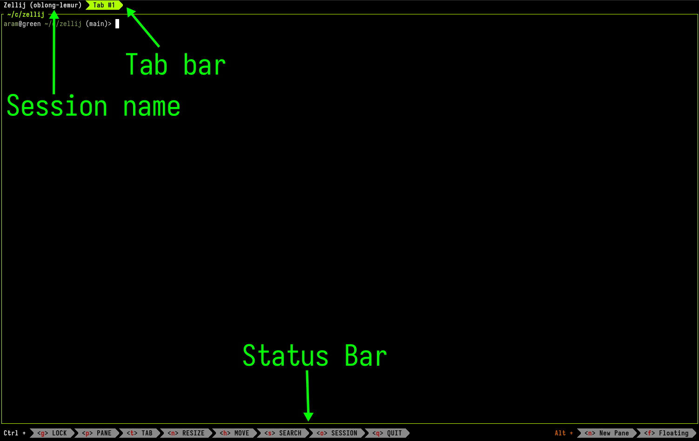

- **顶部 `tab-bar`**：显示会话名（默认是随机生成的易读名字，如 `pretentious-cat`）和当前会话里的各个 tab。
- **底部 `status-bar`**：
  - 左侧：进入各种**模式**的快捷键（`Ctrl p` pane、`Ctrl t` tab、`Ctrl n` resize、`Ctrl s` scroll、`Ctrl o` session）。
  - 右侧：当前上下文下的**即时操作**提示（例如新开窗格）。
- **中间**：你的窗格（pane）。

> 关键设计：Zellij 用「**模式（mode）**」而不是「prefix」。按 `Ctrl p` 进入 pane 模式后，底部会列出该模式所有可用的单键操作，**不用背**。

---

## 5. 核心概念：Session / Tab / Pane

```
Session（会话，可后台常驻）
├── Tab 1
│   ├── Pane A
│   └── Pane B
├── Tab 2
│   └── Floating Pane（悬浮）
└── ...
```

- **Session**：进程级容器。detach 后仍在后台运行；终端窗口关掉也不影响。
- **Tab**：会话内的分页，`Ctrl t` 模式管理。
- **Pane**：真正的终端，`Ctrl p` 模式管理。
- **Floating Pane**：独立于平铺布局，浮在上层，`Alt f` 切换显示。
- **Plugin**：以 pane 的形式存在，例如 `zellij:status-bar`、`zellij:compact-bar`、`session-manager`、`filepicker`。

---

## 6. 会话管理（Session）

这是 Zellij 相比普通终端最核心的价值：**为不同任务建立独立上下文，随时切换、随时复活**。

### 6.1 命令行操作

| 命令 | 简写 | 作用 |
|---|---|---|
| `zellij` | | 新建会话（自动命名） |
| `zellij -s work` | `--session` | 新建名为 `work` 的会话 |
| `zellij ls` | `list-sessions` | 列出运行中的会话 |
| `zellij a work` | `attach` | 重新连接 `work` 会话 |
| `zellij a -c work` | `--create` | 有则连、无则建 |
| `zellij a -b work` | `--create-background` | 后台创建 |
| `zellij k work` | `kill-session` | 结束会话（进程终止） |
| `zellij ka` | `kill-all-sessions` | 结束全部（会二次确认） |
| `zellij d work` | `delete-session` | 删除已退出的会话记录 |
| `zellij da` | `delete-all-sessions` | 删除全部会话记录 |
| `zellij watch work` | | 只读观看某会话 |

带初始命令启动：

```bash
zellij attach -c my-session -- htop        # 新建会话并在首个 pane 跑 htop
zellij attach -c my-session --close-on-exit -- pwsh -c "Get-Date"   # 命令退出即关窗格
```

### 6.2 在会话内操作

- **detach（离开但保留）**：`Ctrl o` 进入 session 模式 → `d`。
  回到命令行后进程仍在跑，重新进入用 `zellij a`。
- **会话管理器**：`Ctrl o` → `w`，弹出 UI 可以 attach / 新建 / 重命名 / 复活。
- **退出 Zellij**：`Ctrl q`（会结束整个会话）。

### 6.3 欢迎屏 Welcome Screen

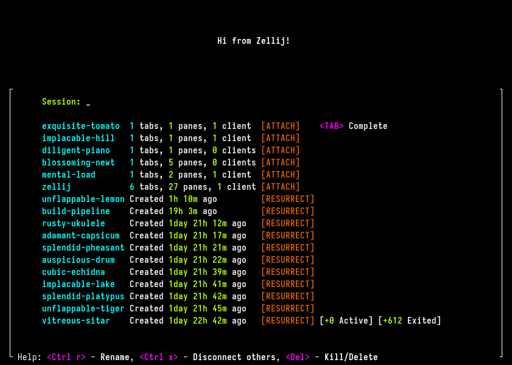

欢迎屏是启动菜单，可：

1. 新建会话（可指定**目录**和**布局**）。
2. attach 到运行中的会话。
3. **复活（resurrect）**已退出的会话。

启动方式：

```bash
zellij -l welcome          # 以 welcome 布局启动
```

让终端每次打开都进欢迎屏（示例）：

- **WezTerm**：设置 `config.default_prog = { 'zellij', '-l', 'welcome' }`
- **Windows Terminal**：在 profile 的 `commandline` 里写 `zellij -l welcome`
- **Alacritty**：`[shell] program = "zellij"`, `args = ["-l", "welcome"]`

### 6.4 会话切换与复活

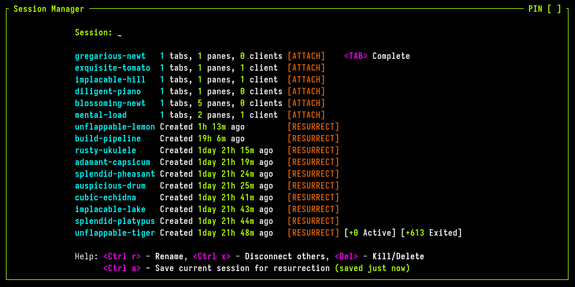

- 在会话内按 `Ctrl o` → `w` 打开会话管理器，选择列表中的会话即可切换。
- **复活**：会话退出后 Zellij 保留其布局与各 pane 曾运行的程序。在欢迎屏里输入/选中旧会话名回车，即可重建当时的上下文。
- 建议习惯：结束一个调试会话前，先在会话管理器里 `Ctrl r` 重命名为有意义的名字，之后再 `Ctrl q`，方便日后复活。

### 6.5 在指定目录 / 布局下新建会话

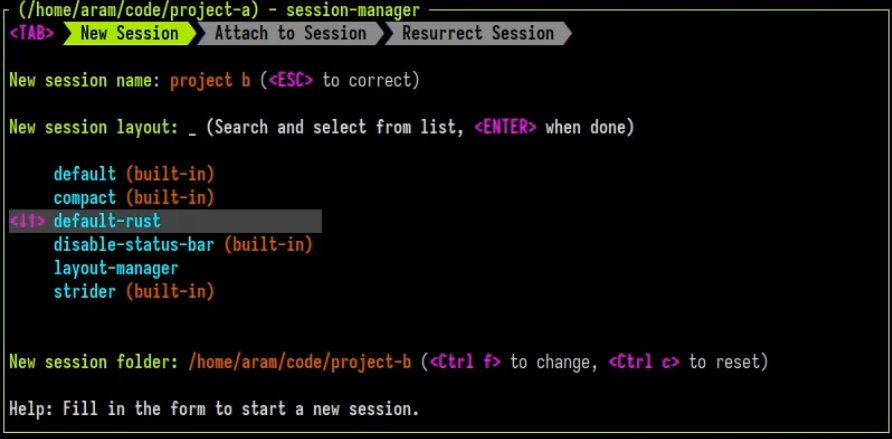

- 在欢迎屏输入会话名 → `Enter`。
- 在「New session」表单里按 `Ctrl f` 打开 **filepicker** 选择目录（`<TAB>` 进入子目录，`<ENTER>` 选中）。
- 选择布局（`default` 或自定义），`Enter` 开始。

---

## 7. 窗格（Pane）操作

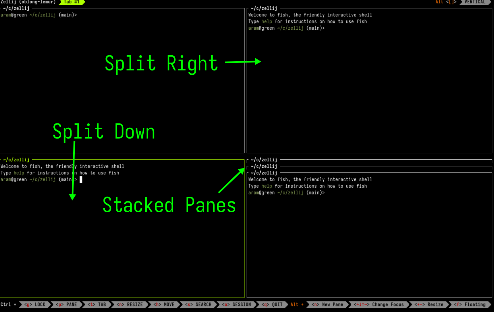

### 7.1 快速开窗格

- `Alt n`：开新窗格。Zellij 会**自动判断**放在哪里最合理。
- `Ctrl p` → `r`：向**右**分割。
- `Ctrl p` → `d`：向**下**分割。
- `Ctrl p` → `s`：以**堆叠（stacked）**方式开窗格。

### 7.2 焦点移动

- `Alt` + `←/↓/↑/→` 或 `Alt` + `h/j/k/l`：在窗格/标签间移动焦点。
- `Ctrl p` → `p`：切到下一个窗格。
- `Ctrl p` → `;`：回到上一个聚焦的窗格。

### 7.3 关闭 / 全屏 / 边框

- `Ctrl p` → `x`：关闭当前窗格。
- `Ctrl p` → `f`：当前窗格全屏切换。
- `Ctrl p` → `Shift f`：无 UI 全屏（隐藏 tab-bar / status-bar）。
- `Ctrl p` → `z`：显示/隐藏窗格边框。
- `Ctrl p` → `c`：重命名当前窗格。

### 7.4 调整大小

- `Ctrl n` 进入 resize 模式，然后用方向键 / `h/j/k/l`。
- 直接快捷键：`Alt +` 放大、`Alt -` 缩小（配合 stacked resize，见第 12 节）。

### 7.5 移动窗格位置

- `Ctrl h` 进入 move 模式，用 `h/j/k/l` 或方向键把**整个窗格**挪到别处。
- `Ctrl h` → `n` / `p`：循环移动。

### 7.6 批量选择窗格（Multiple Pane Select）

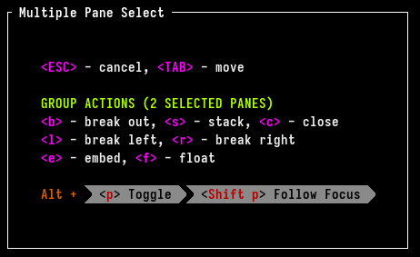

对多个窗格做批量操作（关闭、拆到新 tab、堆叠等）：

- `Alt` + 左键点击选择；按住拖动可多选。
- 或移动到某窗格按 `Alt p` 加入选择。
- 或 `Alt Shift p` 让选择跟随焦点。
- 选中后右下角弹出操作菜单。

---

## 8. 浮动窗格（Floating Pane）

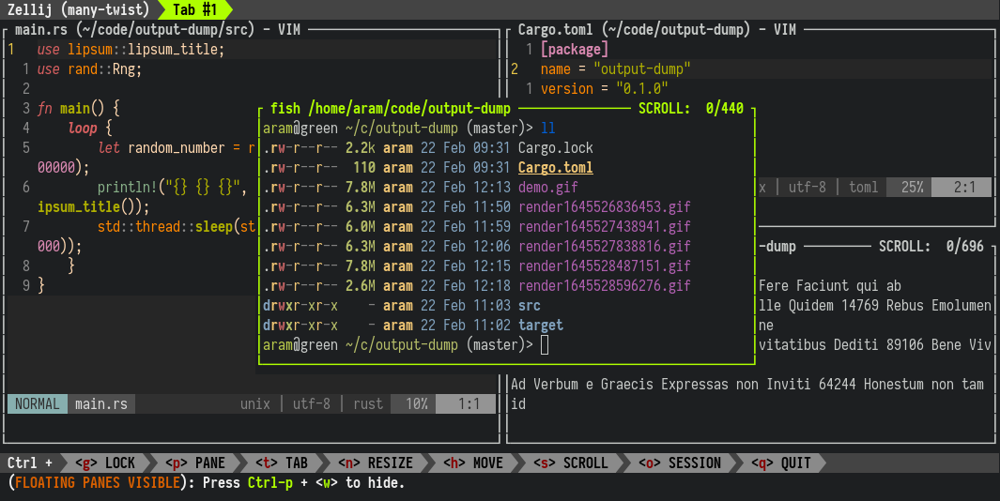

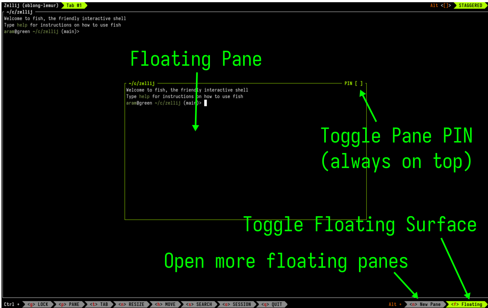

浮动窗格是 Zellij 的特色，且**持久**：在浮动窗格里跑的命令，隐藏后仍在后台运行，再次显示能看到最新状态。

- `Alt f`：切换浮动窗格显示（没有时会新建第一个）。
- 浮动状态下 `Alt n`：再开一个浮动窗格。
- `Alt` + 方向键 / `hjkl`：在浮动窗格间移动焦点。
- **鼠标拖动**：按住窗格边框拖动移动位置。
- **键盘移动**：`Ctrl h` 进入 move 模式后移动。
- **PIN（固定置顶）**：鼠标点窗格右上角的 `PIN`，或 `Ctrl p` → `i`。固定后即使焦点在下面的平铺窗格，它也始终显示在最上层。
- `Ctrl p` → `e`：在「嵌入(平铺)」与「浮动」之间切换当前窗格。

---

## 9. 键位总表

> 以下为**本机默认配置**（`config.kdl` 中 `keybinds clear-defaults=true` 的默认集）。
> 记忆口诀：`Ctrl + 字母` 进模式 → 松开 → 按单键操作 → 或按 `Esc` 回 normal。

### 9.1 Normal 模式（默认）

| 按键 | 作用 |
|---|---|
| `Ctrl p` | 进入 **Pane** 模式 |
| `Ctrl t` | 进入 **Tab** 模式 |
| `Ctrl n` | 进入 **Resize** 模式 |
| `Ctrl s` | 进入 **Scroll** 模式 |
| `Ctrl o` | 进入 **Session** 模式 |
| `Ctrl h` | 进入 **Move** 模式 |
| `Ctrl b` | 进入 **tmux** 兼容模式 |
| `Alt ←/↓/↑/→`、`Alt hjkl` | 移动焦点（跨窗格/标签） |
| `Alt n` | 新窗格 |
| `Alt f` | 切换浮动窗格 |
| `Alt +` / `Alt -` | 放大 / 缩小（stacked resize） |
| `Alt [` / `Alt ]` | 上一个 / 下一个 swap layout |
| `Ctrl q` | 退出 Zellij |
| `Esc` | 从任意模式回到 normal |

### 9.2 Pane 模式（`Ctrl p`）

| 键 | 作用 | 键 | 作用 |
|---|---|---|---|
| `n` | 新窗格 | `x` | 关闭窗格 |
| `d` | 向下分割 | `r` | 向右分割 |
| `s` | 堆叠分割 | `f` | 全屏切换 |
| `Shift f` | 无 UI 全屏 | `z` | 边框开关 |
| `w` | 浮动窗格开关 | `e` | 嵌入/浮动切换 |
| `i` | 固定置顶(PIN) | `c` | 重命名窗格 |
| `p` | 切到下一窗格 | `;` | 回到上一窗格 |
| `hjkl`/方向键 | 移动焦点 | `Ctrl p` | 回 normal |

### 9.3 Tab 模式（`Ctrl t`）

| 键 | 作用 | 键 | 作用 |
|---|---|---|---|
| `n` | 新建 tab | `x` | 关闭 tab |
| `r` | 重命名 tab | `s` | 同步输入到本 tab 所有窗格 |
| `1`–`9` | 跳到第 N 个 tab | `tab` | 切换上一个 tab |
| `h`/`k`、`←`/`↑` | 上一个 tab | `l`/`j`、`→`/`↓` | 下一个 tab |
| `b` | 把窗格拆成新 tab | `[` / `]` | 把窗格拆到左 / 右 |
| `Ctrl t` | 回 normal | | |

### 9.4 Resize 模式（`Ctrl n`）

| 键 | 作用 |
|---|---|
| `h/j/k/l`、方向键 | 调整当前窗格大小 |
| `+` / `=` | 放大 |
| `-` | 缩小 |
| `H/J/K/L` | 向对应方向缩小 |

### 9.5 Scroll 模式（`Ctrl s`）

| 键 | 作用 |
|---|---|
| `↑`/`k`、`↓`/`j` | 上/下滚一行 |
| `PageUp`/`h`、`PageDown`/`l` | 上/下翻一页 |
| `u` / `d` | 上/下半页 |
| `Ctrl b` / `Ctrl f` | 上/下翻页 |
| `s` | 进入搜索 |
| `e` | 用 `$EDITOR` 编辑当前窗格回滚内容 |
| `c` | 复制上一条命令的输出 |
| `Alt` + 方向键/`hjkl` | 滚动时移动焦点 |
| `Esc` | 回 normal |

**搜索模式**（进入后）：`c` 大小写敏感、`w` 全词匹配、`n` 下一个、`p` 上一个、`o` 循环。

### 9.6 Session 模式（`Ctrl o`）

| 键 | 作用 |
|---|---|
| `d` | **Detach（离开但保留会话）** |
| `w` | 打开会话管理器 |
| `c` | 配置界面 |
| `a` | 关于（about） |
| `l` | 布局管理器 |
| `p` | 插件管理器 |
| `s` | 分享（share） |
| `Ctrl o` / `Esc` | 回 normal |

### 9.7 Move 模式（`Ctrl h`）

| 键 | 作用 |
|---|---|
| `h/j/k/l`、方向键 | 移动整个窗格 |
| `n` / `p` / `tab` | 循环移动窗格 |

### 9.8 tmux 兼容模式（`Ctrl b`）

给习惯 tmux 的人准备的映射：

| 键 | 作用 |
|---|---|
| `%` | 向右分割 |
| `"` | 向下分割 |
| `方向键` | 移动焦点 |
| `space` | 下一个 swap layout |
| `d` | detach |

---

## 10. 滚动与回滚编辑


- 查看历史输出：`Ctrl s` 进入 scroll 模式，用方向键 / `PageUp` / `PageDown` 翻。
- **搜索**：`Ctrl s` → `s`，输入关键字，`n` / `p` 上下跳。
- **编辑回滚**：`Ctrl s` → `e`，用你的 `$EDITOR`（vim 等）打开当前窗格的历史输出，可编辑后另存为文件（例如把命令输出发给同事）。
- **复制上条输出**：`Ctrl s` → `c`。

---

## 11. 布局（Layouts）

布局用 **KDL** 声明式描述「一组窗格 + 标签 + 命令 + 插件」，可自动化固定工作流。

### 11.1 快速上手

```bash
zellij setup --dump-layout default > my-layout.kdl    # 导出默认布局作为模板
zellij --layout /path/to/my-layout.kdl                # 用布局启动新会话
zellij action new-tab -l /path/to/my-layout.kdl       # 在当前会话新 tab 应用布局
```

### 11.2 一个完整示例：Rust 项目工作区


```kdl
layout {
    pane split_direction="vertical" {
        pane edit="src/main.rs"                       // 左侧：编辑器打开 main.rs
        pane split_direction="horizontal" {           // 右侧：三个命令窗格上下排列
            cargo { args "check"; }
            cargo { args "run"; }
            cargo { args "test"; }
        }
    }
    pane size=1 borderless=true {                     // 底部：紧凑状态栏
        plugin location="zellij:compact-bar"
    }
    pane_template name="cargo" {                      // 模板：避免重复
        command "cargo"
        start_suspended true                          // 不自动运行，按 Enter 才跑
    }
}
```

对应官方教程的分步效果：

| 步骤 | 效果 |
|---|---|
| 空布局 | 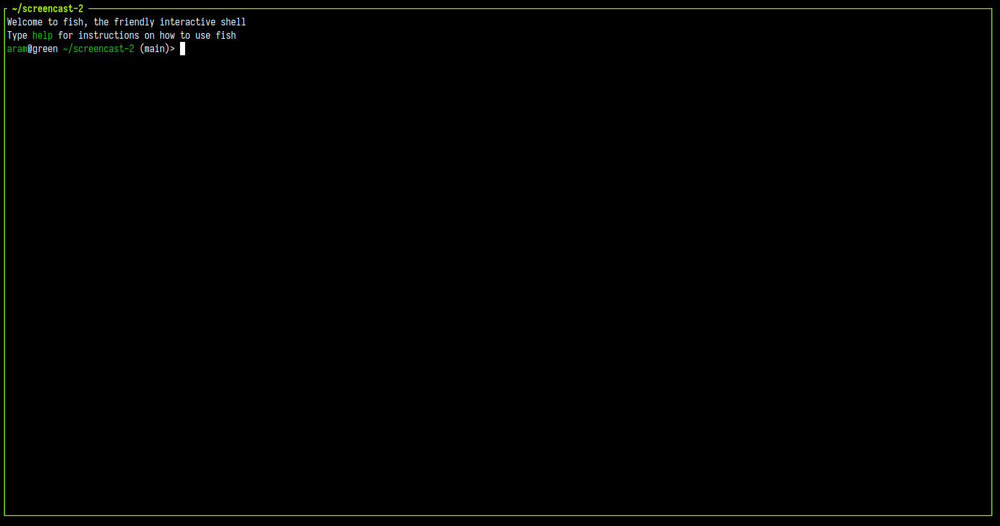 |
| 加 editor pane |  |
| 加三个 command pane | 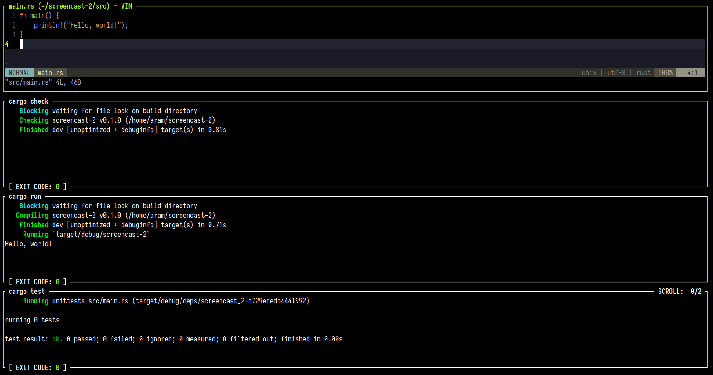 |
| 用容器改方向 |  |
| 加 start_suspended |  |

### 11.3 常用节点与属性

- `pane`：基本单元。属性：
  - `command="..."` + `args "..."`：在该窗格运行命令（**Command Pane**，显示 Exit Code，可 `Enter` 重跑）。
  - `edit="file"`：用 `$EDITOR` 打开文件。
  - `cwd="..."`：工作目录（相对路径会与容器 cwd 拼接）。
  - `name="..."`：窗格标题。
  - `size="50%"` 或 `size=5`：尺寸。
  - `borderless=true`：无边框。
  - `focus=true`：启动时聚焦。
  - `split_direction="vertical"|"horizontal"`：作为容器时子窗格排列方向。
  - `start_suspended=true`：命令不立即运行，等 `Enter`。
  - `close_on_exit=true`：命令退出即关闭窗格。
  - `stacked=true`：子窗格堆叠。
- `tab`：标签页，可含 `name`、`cwd`、`split_direction`、`focus`。
- `floating_panes { pane ... }`：浮动窗格，可设 `x`/`y`/`width`/`height`。
- `pane_template` / `tab_template`：模板，避免重复；用 `children` 占位。
- `default_tab_template`：对所有 tab 生效的模板（默认 UI 插件就定义在这里）。
- 全局 `cwd`：写在 `layout` 节点上，作为所有窗格的基础目录。

### 11.4 布局管理器（Layout Manager）

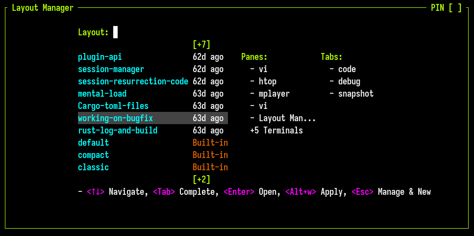

`Ctrl o` → `l` 打开。可以：

1. 把当前会话 / tab 保存为新布局（`Esc` → more options）。
2. 用已有布局开新 tab（选中布局按 `Enter`）。
3. 用布局覆盖当前会话 / tab（`Esc` → more options → 选布局按 `Alt w`）。

> 自定义布局放在配置目录下的 `layouts/` 子文件夹：
> `C:\Users\LENOVO\AppData\Roaming\Zellij\config\layouts\`

---

## 12. 堆叠与 Pinned（stacked resize）

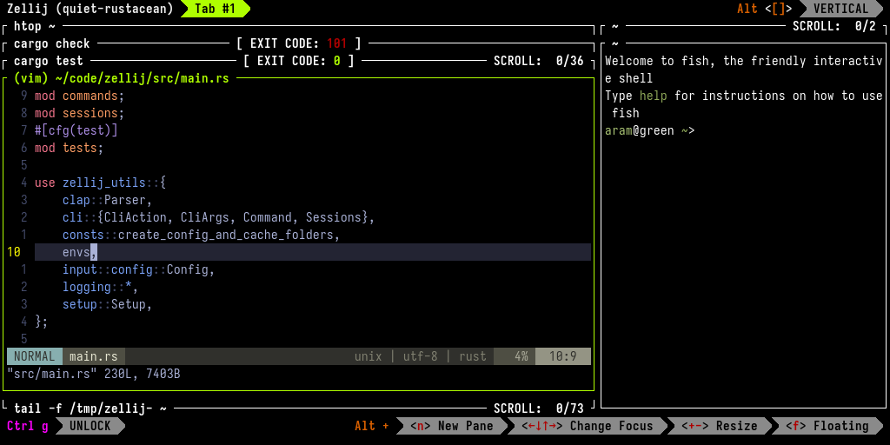

Zellij 的 `Alt +` / `Alt -` 不只是缩放，而是一套「**堆叠式缩放**」算法（默认开启，可用 `stacked_resize false` 关闭）：

- 按 `Alt +` 时，Zellij 尝试把当前窗格向某方向放大 30%。
- 如果任何方向都会完全遮住别的窗格，则改为**与相邻窗格堆叠**。
- 堆叠后只有聚焦窗格正常显示，其余窗格只留一行标题。
- 继续 `Alt +`，堆叠可扩到全屏；`Alt -` 则从堆叠中逐个拆出。
- **撤销链**：只要焦点没变、没新增窗格，`Alt +` 与 `Alt -` 可互相撤销。

一个完整的实操流程（以「终端开发」为例）：

| 步骤 | 效果 |
|---|---|
| 两个窗格并排 | 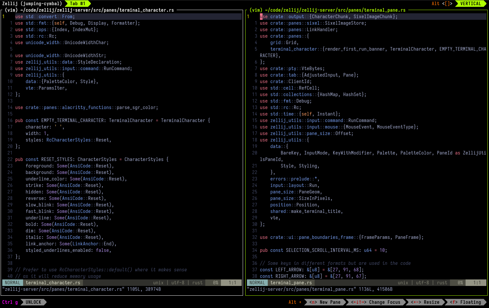 |
| 放大其中一个 |  |
| `Alt +` 两次 → 堆叠 |  |
| 堆叠内开新窗格 |  |
| 把整个堆叠向右分割 | 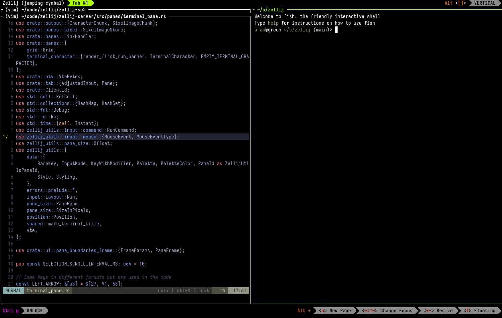 |
| 新窗格再向下分割 |  |
| 形成第二个堆叠 | 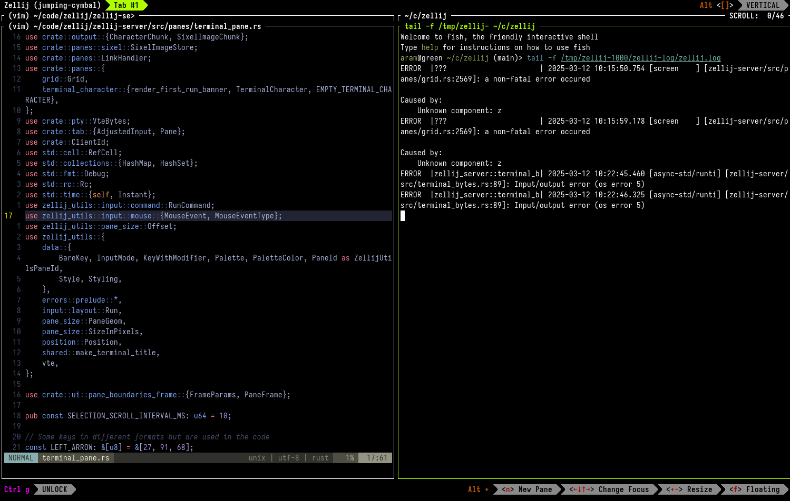 |
| 第二个堆叠加入新窗格 |  |
| 堆叠扩到全屏 | 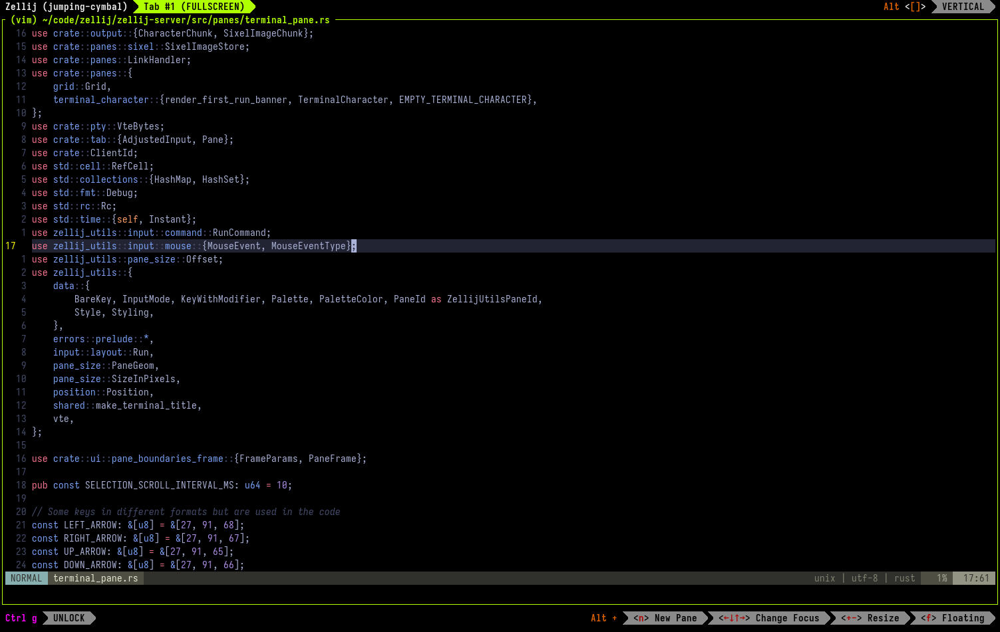 |
| 拆出窗格为浮动 |  |
| 浮动窗格设为 PIN 置顶 | 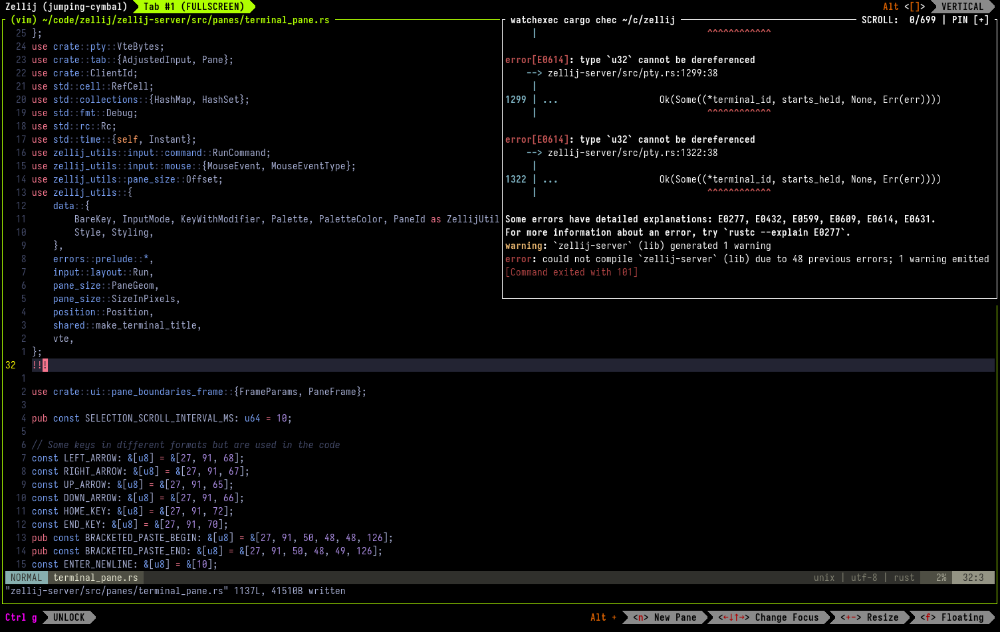 |
| 六个方向自由窗格 | 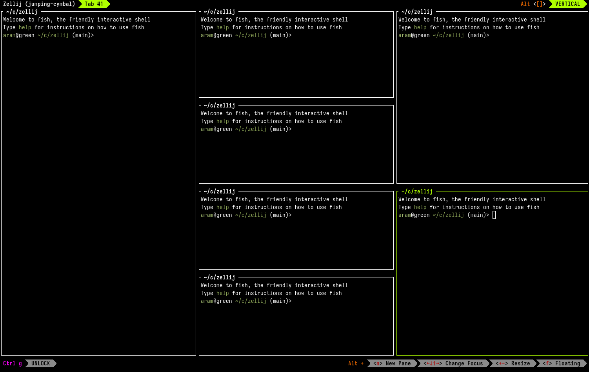 |
| 中间窗格堆叠 | 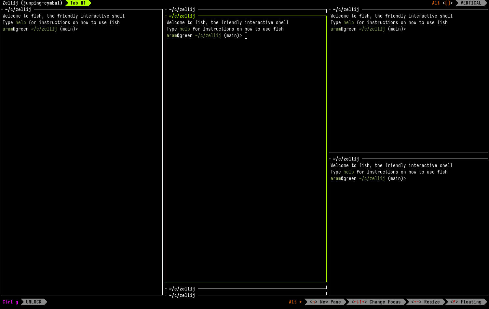 |
| 直到全屏 | 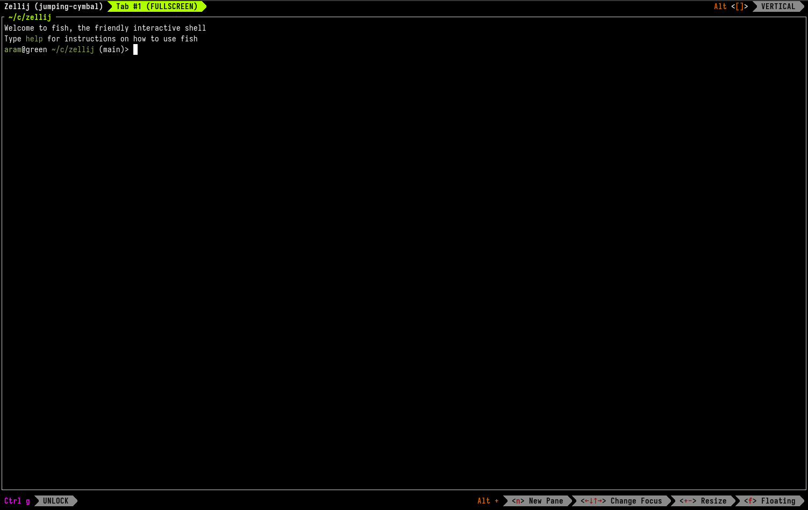 |
| 打断撤销链 |  |
| 堆叠向右分割 | 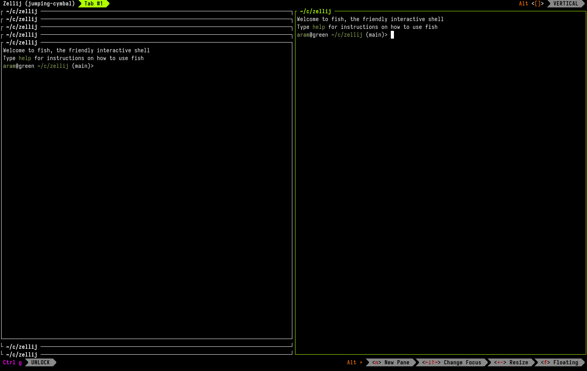 |
| 堆叠向下分割 |  |

要点：

- 在堆叠中用 `Alt` + 方向键 / `hjkl` 上下切换窗格。
- `Ctrl p` → `i` 把浮动窗格设为 **PIN（始终置顶）**，适合放实时日志 / 编译输出。
- 用 `Alt [` / `Alt ]` 切换 **swap layout**（平铺排布模板）。

---

## 13. 文件选择器 Filepicker（Strider）

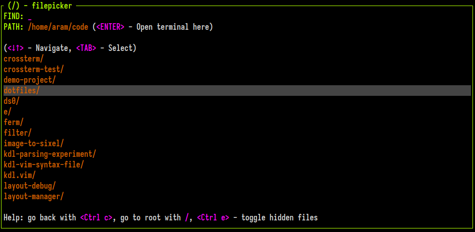

内建插件，用键盘快速浏览文件系统，支持模糊查找，比 `cd`/`ls` 循环快得多。

- 从当前聚焦窗格的工作目录开始。
- `←`/`→`、`Backspace`、`<TAB>` 导航；`<TAB>` 把条目加入 `PATH:`。
- `<ENTER>`：若是文件用默认编辑器打开，若是目录则开终端到该目录。
- `Ctrl e`：显示/隐藏隐藏文件。

### 13.1 启动方式

```bash
zellij plugin -- filepicker          # 直接启动
zellij -l strider                     # 以 strider 布局启动（左侧常驻文件树）
zellij action new-tab -l strider      # 在现有会话新 tab 打开
```

### 13.2 绑定快捷键

在 `config.kdl` 的 `shared_except "locked"` 区块里加：

```kdl
bind "Alt f" {
    LaunchPlugin "filepicker" {
        // floating true            // 取消注释则浮动打开
        close_on_selection true     // 选中后自动关闭
    }
}
```

### 13.3 类 IDE 体验


用 `zellij -l strider` 或新 tab 应用 `strider` 布局，左侧固定文件选择器。

### 13.4 管道用法

```bash
zpipe filepicker | xargs -i cp {} my-chosen-file
zellij pipe -p filepicker
```

选中路径会打印到 STDOUT，可接进传统 shell 管道。

---

## 14. 插件（Plugins）

Zellij 的 UI 本身就是插件，常见内建插件：

| 插件 | 用途 |
|---|---|
| `zellij:tab-bar` | 顶部标签栏 |
| `zellij:status-bar` | 底部状态栏 |
| `zellij:compact-bar` | 紧凑版状态栏（占用更少） |
| `session-manager` | 会话管理 UI（`Ctrl o` `w`） |
| `filepicker` | 文件选择器 |
| `configuration` | 配置界面（`Ctrl o` `c`） |
| `zellij:layout-manager` | 布局管理（`Ctrl o` `l`） |
| `plugin-manager` | 插件管理（`Ctrl o` `p`） |

命令行加载插件：

```bash
zellij plugin -- filepicker
zellij pipe -p filepicker
```

在布局中加载：

```kdl
pane size=1 borderless=true {
    plugin location="zellij:compact-bar"
}
```

---

## 15. Web Client（浏览器共享会话）

从 **0.43.0** 起，Zellij 内置了一个 Web 服务器，可以把会话「投射」到浏览器里——**无需终端模拟器**，支持**真正的多人协作**和**可书签的持久会话**。这是 Zellij 相对 tmux/herdr 的独有招牌功能。

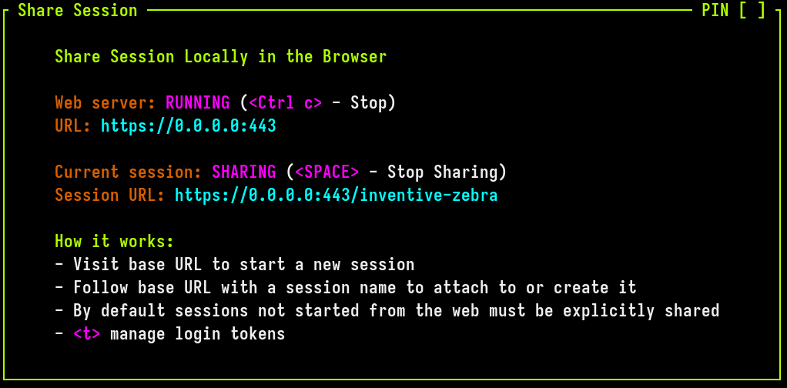

### 15.1 启动

三种方式（任选其一）：

1. 命令行：`zellij web`
2. 在会话内用 `share` 插件：`Ctrl o` → `s`（更好控制、有反馈）
3. 写进配置，随 Zellij 启动自动开启：

```kdl
web_server true
```

默认监听 **`http://127.0.0.1:8082`**。

### 15.2 URL 方案（可书签）

Web 端用 URL 路径指定会话名：

```
http://127.0.0.1:8082/<session-name>
```

访问时：不存在则**新建**、存在则**附着**、已退出则**复活**。因此把这个 URL 存为书签，就能随时回到同一会话，哪怕机器重启过。

### 15.3 认证令牌（必需）

出于安全，Web 端必须用 token 登录。创建方式：

```bash
zellij web --create-token              # 普通 token
zellij web --create-read-only-token    # 只读 token（只能观看，不能操作）
```

也可用 `share` 插件创建/管理。

> **注意**：token **只显示一次**，务必立即保存到安全位置；丢失后只能用其名字/索引吊销重建。

只读 token 适合**演示、录屏、教学**——对方能看不能动。

### 15.4 HTTPS（对外共享时强烈建议）

只在本机测试可用 http；若要**共享到本机之外**（如监听 `0.0.0.0`），必须上 TLS。用免费的 `mkcert`：

```bash
mkcert -install localhost 127.0.0.1 0.0.0.0 192.168.1.105
```

然后在配置里指向证书与私钥：

```kdl
web_server_cert "/home/you/.certs/localhost+3.pem"
web_server_key  "/home/you/.certs/localhost+3-key.pem"
```

### 15.5 与浏览器键位冲突

在浏览器里操作 Zellij 时，建议启用 **unlock-first** 键位预设（`zellij options --keybinding-preset unlock-first`，或配置 `keybinding_preset "unlock-first"`），避免与浏览器自身的快捷键打架。

> 不想自己管证书和网络暴露，可用官方托管的 **zellij.online**（beta）；自托管依旧完整支持。

---

## 16. 命令行驱动（run / edit / action / pipe）

Zellij 的 CLI 不只是启动器，可以**在会话内外驱动窗格、标签、动作**，是脚本化/自动化的入口。

### 16.1 `zellij run`：在新窗格里跑命令

```bash
zellij run -- git diff                    # 在新窗格运行 git diff
zellij run --floating -- htop             # 浮动窗格里跑 htop
zellij run --in-place -- make             # 占用当前窗格（原窗格挂起）
zellij run --name logs -- tail -f app.log # 给窗格命名
```

常用选项：

| 选项 | 作用 |
|---|---|
| `-f, --floating` | 新窗格浮动 |
| `-i, --in-place` | 在当前窗格就地打开，原窗格临时挂起 |
| `-n, --name <NAME>` | 窗格命名 |
| `--cwd <DIR>` | 指定工作目录 |
| `-d, --direction <DIR>` | 打开方向 |
| `-s, --start-suspended` | 不立即运行，按 `Enter` 才跑 |
| `-c, --close-on-exit` | 命令退出即关闭窗格 |
| `--blocking` / `--block-until-exit[-success\|-failure]` | 阻塞直到命令结束（可用于脚本串行） |
| `--no-focus` | 后台开窗格，**不抢焦点**（适合脚本） |
| `--stacked` | 以堆叠方式打开 |
| `--width/--height/--x/--y` | 浮动窗格的尺寸与坐标 |
| `--pinned <bool>` | 浮动窗格是否置顶 |
| `--tab-id <ID>` | 在指定 tab 打开（id 可用 `zellij action list-tabs` 获取） |
| `-b, --borderless <bool>` | 无边框（注意：鼠标将无法移动它） |

> 默认**不**在命令退出时关窗格：窗格会显示**退出码**，按 `Enter` 可原地重跑，按 `Ctrl-c` 关闭。这就是 Zellij 的 **Command Pane**。

### 16.2 `zellij edit`：用 `$EDITOR` 打开文件

```bash
zellij edit ./main.rs                    # 新窗格打开 main.rs
zellij edit --floating ./main.rs         # 浮动窗格打开
zellij edit ./main.rs --line-number 10   # 定位到第 10 行
```

编辑器取自 `$EDITOR` / `$VISUAL`，也可用配置项 `scrollback_editor` 指定。

### 16.3 `zellij action`：向会话发送动作

```bash
zellij action new-pane
zellij action new-tab -l strider
zellij action list-tabs
zellij action query-tab-names
zellij --session work action new-pane   # 指定目标会话
```

### 16.4 `zellij pipe` / `zpipe`：把数据送进插件

```bash
zellij pipe -p filepicker
zpipe filepicker | xargs -i cp {} my-chosen-file
```

### 16.5 其它 CLI

| 命令 | 作用 |
|---|---|
| `zellij watch <session>` | 只读观看某会话 |
| `zellij setup --generate-completion bash\|zsh\|fish` | 生成补全，附带 `zr` / `zrf` / `ze` / `zpipe` 等别名 |
| `zellij plugin -- <name>` | 直接加载插件 |
| `zellij options --show-config` | 查看当前生效配置 |

> 完整动作列表见官方文档：[CLI Actions](https://zellij.dev/documentation/cli-actions.html)。

---

## 17. 配置文件与常用自定义

### 17.1 文件位置

| 平台 | 配置文件路径 |
|---|---|
| Windows | `C:\Users\<用户>\AppData\Roaming\Zellij\config\config.kdl` |
| Arch Linux | `~/.config/zellij/config.kdl` |
| macOS | `~/Library/Application Support/org.Zellij-Contributors.Zellij/config.kdl`（或 `~/.config/zellij/config.kdl`） |

Zellij 会**热加载**该文件，大部分改动无需重启。

### 17.2 生成 / 重置

```bash
zellij setup --dump-config > config.kdl   # 导出默认配置
zellij setup --clean                       # 忽略配置以默认启动
zellij --config <path/to/config.kdl>       # 指定配置文件启动（路径按平台）
```

### 17.3 常用自定义片段

**改默认 shell（按平台三选一）：**

```kdl
default_shell "C:/Program Files/PowerShell/7/pwsh.exe"   // Windows（本机已设）
// default_shell "zsh"                                    // Arch Linux
// default_shell "/bin/zsh"                               // macOS
```

**改默认工作目录：**

```kdl
default_cwd "D:/archlinux"
```

**关闭堆叠式缩放（回到传统 resize）：**

```kdl
stacked_resize false
```

**简化 UI（状态栏箭头字体显示异常时）：**

```kdl
simplified_ui true
```

**关闭鼠标处理：**

```kdl
mouse_mode false
```

**加自定义快捷键（在 `keybinds { shared_except "locked" { ... } }` 内）：**

```kdl
keybinds {
    shared_except "locked" {
        bind "Alt f" {
            LaunchPlugin "filepicker" { close_on_selection true }
        }
    }
}
```

**复制模式（`copy_command`）**：让 `Ctrl s` `c` 能复制到系统剪贴板，按平台设置：

```kdl
copy_command "clip.exe"                       // Windows
// copy_command "pbcopy"                      // macOS
// copy_command "wl-copy"                     // Arch Linux（Wayland）
// copy_command "xclip -selection clipboard"  // Arch Linux（X11）
```

> 注意：本机默认配置使用了 `keybinds clear-defaults=true`，意味着**所有键位都显式定义**。要新增键位，往对应模式区块里加 `bind` 即可，不会与默认冲突。

### 17.4 命令行选项（覆盖配置）

```bash
zellij options --simplified-ui true
zellij options --disable-mouse-mode
zellij options --show-config          # 查看当前生效配置
```

---

## 18. 跨平台注意事项

### 18.1 Windows

1. **默认 shell**：已设为 `pwsh 7` 全路径。若移动了 PowerShell 安装位置，需同步改 `config.kdl`。
2. **终端建议**：推荐在 **Windows Terminal** 或 **WezTerm** 中使用，字体请选带 Nerd Font 图标的等宽字体，否则底部状态栏的箭头分隔符会显示为乱码。
   - 若字体不便更换：`zellij options --simplified-ui true`。
3. **ConPTY**：Zellij 在 Windows 上通过 ConPTY 工作，绝大多数程序正常；个别依赖 Unix pty 的 TUI 可能有差异。
4. **没有原生 tmux 的 detach 依赖**：Zellij 自带 detach，无需 tmux。
5. **鼠标**：默认开启鼠标交互；按住 `Shift` 可临时禁用（方便选中文本）。也可在配置里 `mouse_mode false`。
6. **路径写法**：`config.kdl` 里建议用**正斜杠**（`C:/...`）或转义反斜杠（`C:\\...`）。
7. **中文乱码**：Zellij 显示的是程序输出。Git Bash 里跑 Windows 原生命令（`ipconfig` 等）仍可能 GBK 乱码，属于代码页问题，与 Zellij 无关。
8. **官方文档表述滞后（重要）**：Zellij 官方**安装页**明确提供 Windows 原生二进制（`zellij-x86_64-pc-windows-msvc.zip`，并有 Windows 安装段落），但官方 **FAQ** 仍写「Windows: Via WSL」。**实测原生 Windows 可用**（本机即 scoop 原生安装并运行 0.45.1），FAQ 属未更新。若遇到个别 Windows 独有问题，WSL 仍是保底方案。

### 18.2 Arch Linux

1. **默认 shell**：不设 `default_shell` 时使用 `$SHELL`；填 `zsh` / `fish` 时可用可执行名或绝对路径。
2. **终端建议**：`alacritty`、`kitty`、`wezterm`、`foot`（Wayland）均可。建议安装 Nerd Font：
   ```bash
   sudo pacman -S ttf-nerd-fonts-symbols      # 或 ttf-firacode-nerd
   ```
3. **剪贴板**：`Ctrl s` `c` 复制到系统剪贴板需装对应工具并设置 `copy_command`：
   - Wayland：`sudo pacman -S wl-clipboard` → `copy_command "wl-copy"`
   - X11：`sudo pacman -S xclip` → `copy_command "xclip -selection clipboard"`
4. **pty 原生**：Linux 下使用原生 pty，Zellij 可与 tmux / screen 共存（嵌套时注意按键冲突）。
5. **图标乱码**：与 Windows 同理，装 Nerd Font 或开 `simplified_ui`。

### 18.3 macOS

1. **默认 shell**：macOS 默认即 `zsh`，可不设；要显式指定用 `default_shell "/bin/zsh"`。
2. **终端建议**：`iTerm2`、`WezTerm`、`Alacritty`、`kitty`、Terminal.app 均可。建议安装 Nerd Font：
   ```bash
   brew install --cask font-fira-code-nerd-font
   ```
3. **剪贴板**：设 `copy_command "pbcopy"` 即可，无需额外安装。
4. **系统权限**：首次在 iTerm2 / Terminal 中运行可能弹出「完全磁盘访问」「输入监控」等权限请求，按需允许。
5. **Apple Silicon**：Homebrew 默认装在 `/opt/homebrew`，自定义 shell 路径注意区分（如 `/opt/homebrew/bin/fish`）。
6. **tmux 共存**：原生支持 pty，Zellij 可与 tmux 共存。

### 18.4 三平台通用

- **Nerd Font**：三平台都建议安装，否则状态栏图标 / 箭头可能乱码。
- **`Esc` 行为**：从任意模式回 normal 均为 `Esc`，三平台一致。
- **配置热加载**：三平台均支持，改完即时生效。

---

## 19. 速查表

**最高频 12 个操作：**

| 目的 | 操作 |
|---|---|
| 新建会话 | `zellij -s 名字` |
| 离开但保留 | `Ctrl o` → `d` |
| 回到会话 | `zellij a 名字` |
| 列出会话 | `zellij ls` |
| 新窗格 | `Alt n` |
| 向右 / 向下分割 | `Ctrl p` → `r` / `d` |
| 关闭窗格 | `Ctrl p` → `x` |
| 窗格间移动 | `Alt` + 方向键 |
| 全屏 | `Ctrl p` → `f` |
| 浮动窗格 | `Alt f` |
| 翻历史 / 搜索 | `Ctrl s`，再 `s` 搜索 |
| 退出 | `Ctrl q` |

**模式入口一览：**

```
Ctrl p  Pane     Ctrl t  Tab      Ctrl n  Resize
Ctrl s  Scroll   Ctrl o  Session  Ctrl h  Move
Ctrl b  tmux 兼容                  Esc     回 normal
```

---

## 20. 官方视频与参考链接

### 官方视频教程（在线观看）

| 主题 | 链接 |
|---|---|
| 基础功能（浮动窗格 / 命令窗格 / 回滚编辑） | <https://zellij.dev/tutorials/basic-functionality/> |
| 会话管理 | <https://zellij.dev/tutorials/session-management/> |
| 布局自动化 | <https://zellij.dev/tutorials/layouts/> |
| 堆叠缩放与 Pinned | <https://zellij.dev/tutorials/stacked-resize/> |
| Filepicker | <https://zellij.dev/tutorials/filepicker/> |
| 视频列表 | <https://zellij.dev/screencasts/> |

### 官方文档

- 文档首页：<https://zellij.dev/documentation/>
- 命令行：<https://zellij.dev/documentation/commands.html>
- 配置：<https://zellij.dev/documentation/configuration.html>
- 键位：<https://zellij.dev/documentation/keybindings.html>
- 布局：<https://zellij.dev/documentation/creating-a-layout.html>
- 通过 CLI 控制：<https://zellij.dev/documentation/controlling-zellij-through-cli.html>
- GitHub 仓库：<https://github.com/zellij-org/zellij>

### 相关文件位置（分平台）

| 内容 | Windows | Arch Linux | macOS |
|---|---|---|---|
| 配置文件 | `C:\Users\<用户>\AppData\Roaming\Zellij\config\config.kdl` | `~/.config/zellij/config.kdl` | `~/Library/Application Support/org.Zellij-Contributors.Zellij/config.kdl` |
| 自定义布局目录 | `…\Zellij\config\layouts\` | `~/.config/zellij/layouts/` | `<配置目录>/layouts/` |
| 插件目录 | `…\Zellij\data\plugins\` | `~/.local/share/zellij/plugins/` | `<配置目录>/plugins/` |
| 缓存目录 | `%LOCALAPPDATA%\Zellij\cache` | `~/.cache/zellij/` | `~/Library/Caches/org.Zellij-Contributors.Zellij/` |
| 本手册配图 | `./images/` | `./images/` | `./images/` |

---

> 截图版权归 Zellij 项目所有，来源 <https://zellij.dev>。本手册仅供个人学习使用。
