# Vibe Coding

---

# 第一章：什么是 Vibe Coding

## 1.1 Vibe Coding 的定义

Vibe Coding 是一种以自然语言、迭代反馈和 AI 工具为核心的软件开发方式。

传统开发中，我们通常这样工作：

1. 人写需求
2. 人设计架构
3. 人写代码
4. 人调试
5. 人部署上线

而在 Vibe Coding 中，流程变成：

1. 人描述目标
2. AI 帮助拆解任务
3. AI 生成代码或方案
4. 人审查、测试、反馈
5. AI 继续修改
6. 人做最终判断与交付

这里的关键不是“AI 替代人”，而是“人和 AI 形成开发搭档”。

## 1.2 一个生活化例子

假设你想做一个“个人记账小程序”。

传统写法可能是：

```text
我需要先想数据库表怎么设计，再写前端页面，再写后端接口，再调登录，再处理图表，再部署。
```

Vibe Coding 的做法可能是：

```text
我想做一个个人记账应用，支持记录收入支出、按月份统计、分类饼图、导出 CSV。
请先帮我拆解基础功能，并给出前后端技术方案。
```

AI 可以先输出：

- 用户角色
- 页面清单
- 数据表设计
- API 设计
- 开发步骤
- 风险点
- 测试用例

然后你再逐步让它实现。  

## 1.3 Vibe Coding 的核心能力

Vibe Coding 不是只会写 Prompt。它至少包括以下几种能力：

- **表达能力**：能把需求说清楚
- **拆解能力**：能把大目标拆成小任务
- **判断能力**：能判断 AI 方案是否靠谱
- **调试能力**：能定位问题并持续修正
- **承担责任的能力**: 能保证项目可运行、可维护、可上线
- **对外沟通的能力**: 能够对外阐述、沟通、协商当前项目的相关情况

## 1.4 常见误区

### 误区一：Vibe Coding 等于不会代码也能做一切

不完全是。AI 可以降低入门门槛，但如果完全不理解代码，很容易出现：

- 项目跑不起来
- Bug 不知道从哪里来
- AI 改坏已有功能
- 部署失败
- 安全漏洞

### 误区二：Prompt 写得越长越好

不是越长越好，而是越清楚越好。

坏例子：

```text
帮我做一个牛x的网站。
```

好例子：

```text
帮我做一个课程报名网站，目标用户是想学习 AI 编程的大学生。
需要包含首页、课程列表、课程详情、报名表单、后台报名记录页。
技术栈使用 Next.js + Tailwind CSS，先实现前端静态页面，不接数据库。
```

### 误区三：AI 生成的代码可以直接相信

AI 很强，但它会犯错。人类必须负责：

- 验证功能
- 审查代码
- 检查安全
- 控制范围
- 做最终决策

---

# 第二章：AI 编程工具全景

| 工具                          | 形态                      | 适合场景                                                     | 核心特点                                                     |
| ----------------------------- | ------------------------- | ------------------------------------------------------------ | ------------------------------------------------------------ |
| **Codex（OpenAI）**           | 终端 CLI                  | 终端开发、代码库批量修改、自动化任务、批量 PR、脚本流水线    | 像工程搭档；可以读整个项目、修改多文件、运行 shell 命令；自主性高，适合批量异步任务；海外网络环境要求高 |
| **Cursor**                    | 基于 VSCode 的 AI‑IDE     | IDE 内编码、代码补全、重构、聊天；新手友好；边看代码边对话   | 编辑器原生体验；inline 补全很强；Composer 多文件修改；适合日常迭代；**没有官方 PyCharm 版本** |
| **Claude Code**               | 终端 CLI                  | 长上下文项目分析、Agent 工作流；大型存量项目重构、代码审计   | 超大上下文，深度理解复杂项目架构；推理能力强；终端优先；海外网络要求高 |
| **Qoder（阿里）**             | JetBrains 插件 + CLI      | Java/Python 后端项目、微服务、老旧项目改造；vibe‑coding      | **插件社区版：Agent 不能直接落盘，只能输出代码块；Qoder‑CLI 可以静默写磁盘**；对 Spring、数据库、中间件适配强；Quest 长任务模式；国产直连可用Qoder |
| **Trae（字节，原 MarsCode）** | JetBrains 插件 + 独立 IDE | 快速生成完整项目原型、前后端 demo、前端；vibe‑coding Builder 模式 | **Builder 模式可以 Agent 创建 / 修改多文件，但是必须手动点【全部采纳】确认变更，不会静默写磁盘**；中文友好，生成脚手架快；适合做登录 Demo 这类从零搭建项目Trae |


# 第三章：Cursor 的配置与应用

## 3.1 Cursor 的优势

Cursor 是面向开发者的 AI IDE，适合边写代码边和 AI 交流。

它的优势是：

- 学习成本低
- 对代码上下文理解较好
- 适合局部修改
- 适合解释代码
- 适合生成页面、组件、函数

## 3.2 Cursor 的安装配置

### 3.2.1 安装

直接访问 Cursor 官方网站（https://cursor.com/cn/），点击页面上的 “Download for Windows”。 

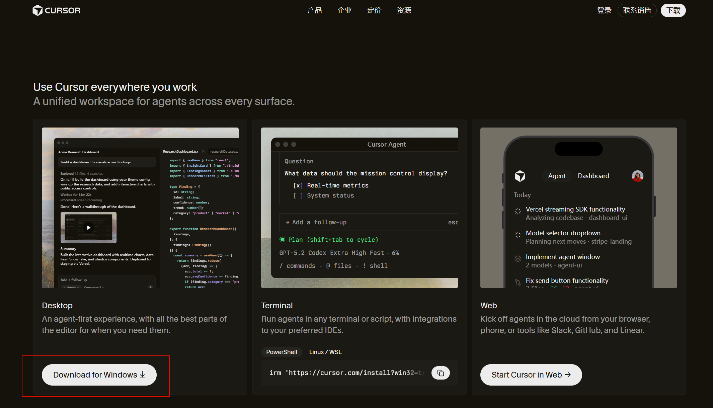

然后双击安装，和一般的软件安装没有太大区别。

### 3.2.2注册账号

需要去官网注册账号（科学）

略

### 3.2.3 网络配置（必须）

修改网络适配模式为http/1.1

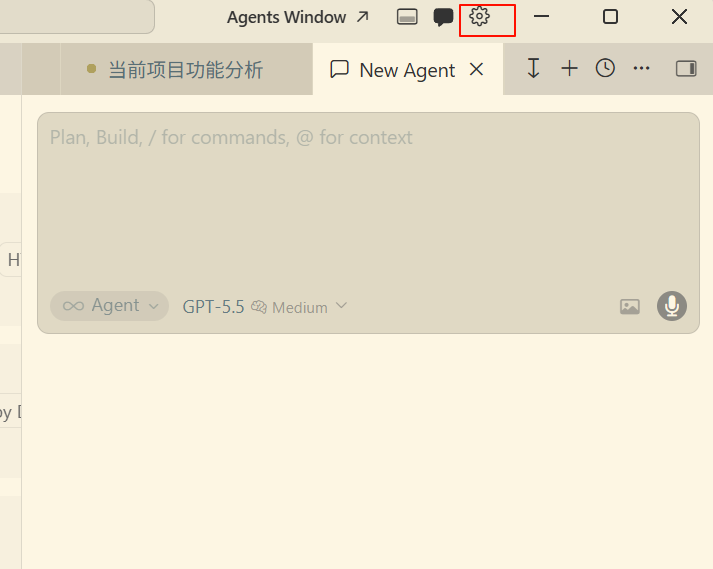

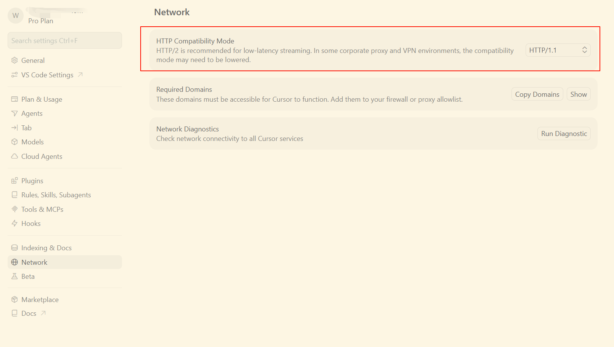

### 3.2.4 CodingPlan的购买

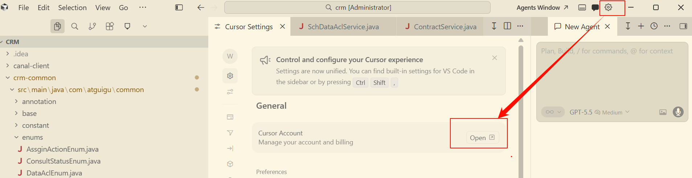

可以选择需要的套餐进行购买。

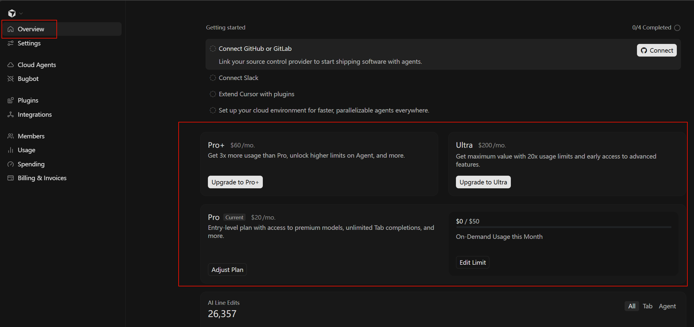

在国内可以使用支付宝付款，**注意会自动按月扣款**。

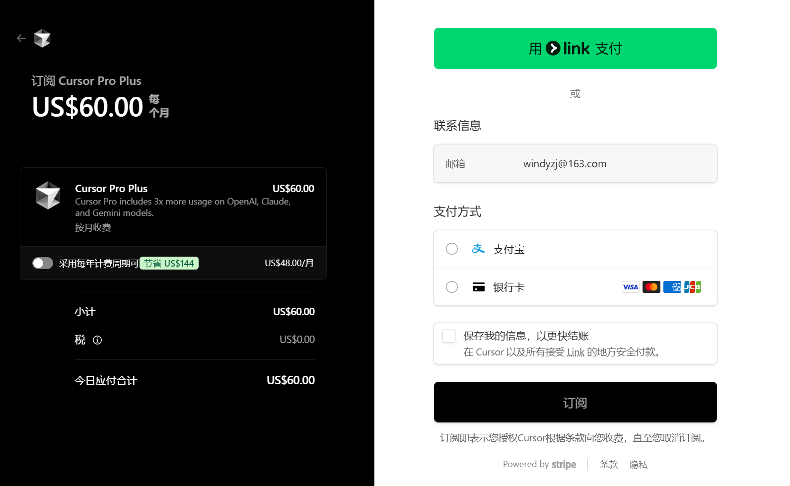

### 3.2.5 查看使用情况

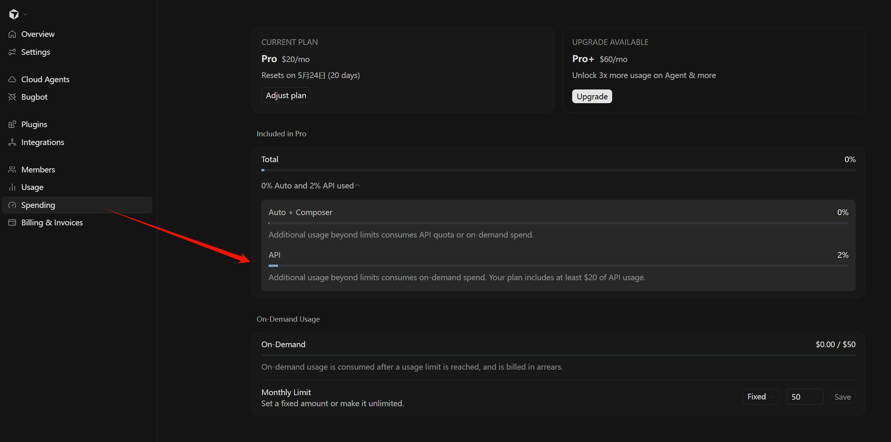

## 3.3 cursor的使用

### 3.3.1 对话模式

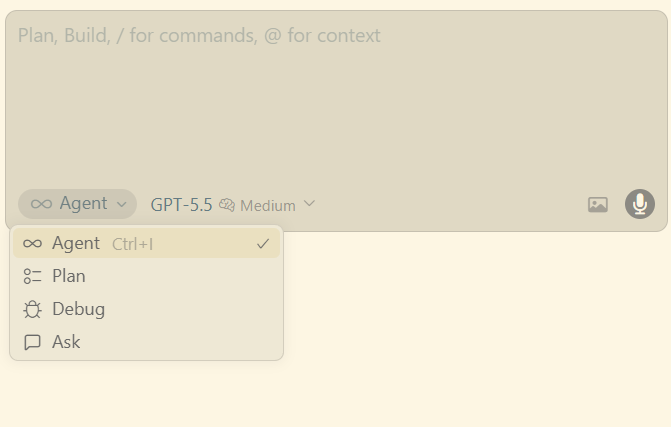

Cursor 这几个模式可以理解为“同一个 AI，用不同工作权限和思考方式”。

`Agent`：执行模式。适合让 AI 直接改代码、运行命令、修 bug、补测试、提交实现。它可以读写文件、调用工具，适合“帮我实现/修复/跑一下”。

`Plan`：规划模式。适合需求还不清楚、改动比较大、需要先讨论方案的时候。它通常先阅读代码、分析影响、给出实施计划，不急着动手改文件。

`Debug`：调试模式。适合定位问题，比如报错、测试失败、页面异常、接口不通。它会更偏向收集运行证据、看日志、复现问题，再判断根因。

`Ask`：问答模式。适合只想了解代码、解释概念、查找位置、做只读分析。一般不会改文件，适合“这段代码干什么”“这个功能在哪实现”。

简单选法：

- 想让它直接干活：选 `Agent`
- 想先商量方案：选 `Plan`
- 有 bug/报错要查：选 `Debug`
- 只想问问题不改代码：选 `Ask`

### 3.3.2 选中代码片段或文件


选中代码片段，可以缩小检索范围，提高效率准确性节省token。

### 3.3.3 提交图片内容

可以把截图内容，直接ctrl+c到对话窗口。


如果有大/长图片，尤其是包含了大量文字的图片，建议先保存称文件，然后用引用文件的方式加载到对话。


### 3.3.4 生成文件可以回滚

cursor自带轻量的版本管理，可以对生成的文件进行回滚。

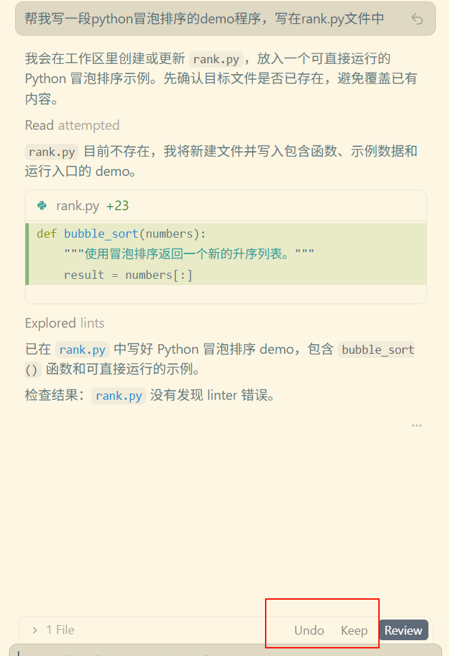

可以在文件中按段落回滚或保持。

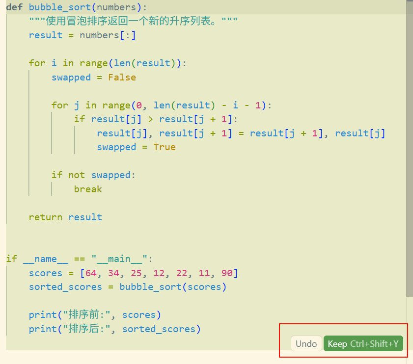

### 3.3.5 卡死现象


遇到一些长难复杂的问题时，偶尔会出现卡死。只要出现图中这句话就是没救了不用再等，重新提交或者改写问题。

## 3.4 总结：

cursor的优势：

- 一份CodingPlan可以选不同种类的模型基座

- 有严谨的读写模式控制 

- 自带版本工具

- 窗口交互性好，可选择代码文件

- 充值续费方便

缺点：

- 最低费用也是20美元每月

- 偶尔会出现卡死

# 第四章：Codex 的配置与应用

## 4.1 Codex 是什么

    Codex 是OpenAI出品的Vibe Coding CLI 工具。

## 4.2 Codex 的CLI的安装配置

### 4.2.1 安装git

    并且确保在cmd中可以识别git命令

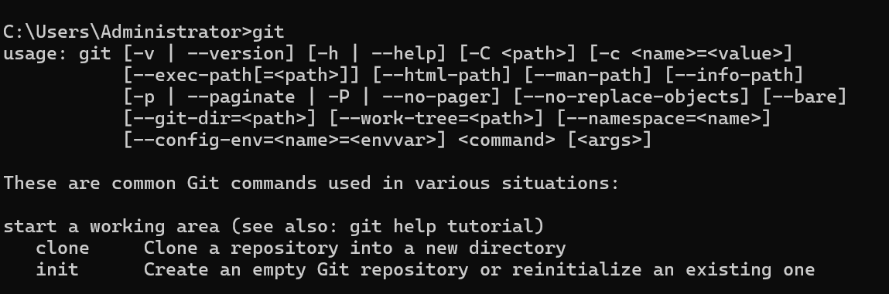

   否则则在环境变量中PATH路径增加git的路径

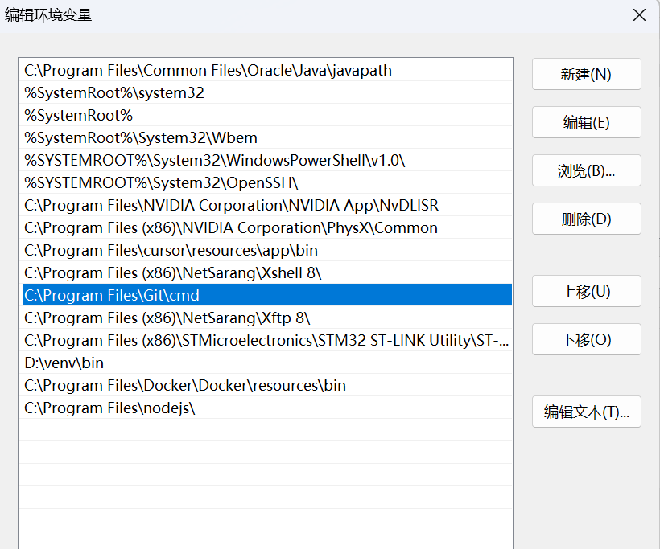

### 4.2.2 安装node.js

同一般软件安装，主要是为了使用npm 作为包管理器。

### 4.2.3  安装Codex 

```bash
#终端输入
npm install -g @openai/codex

#如果无法下载，网络有问题可以用以下命令（关闭魔法）
npm install -g @openai/codex --registry https://registry.npmmirror.com

#验证安装命令
codex --version
```

### 4.2.4  修改配置文件（中转站渠道）

如果从商家获得**api_key**和**base_url**

修改C:\Users\用户名\\.codex\config.toml文件：

```toml
model_provider = "codex"
model = "gpt-5.5"
model_reasoning_effort = "high"
disable_response_storage = true

[model_providers.codex]
name = "codex"
base_url = "https://code.ppchat.vip/v1"
wire_api = "responses"
requires_openai_auth = true
```

修改C:\Users\用户名\.codex\auth.json文件：

```toml
{    
    "OPENAI_API_KEY": "sk-xxx"
}
```

### 4.2.5  登录（官方渠道）

如果是从官方渠道订阅则，在命令行执行登录，然后通过弹出的网页进行登录来实现客户端登录。

```bash
 codex login
```


### 4.2.6 验证

在cmd窗口中输入codex 会显示如下内容（首次可能会询问以下当前路径是否信息）：

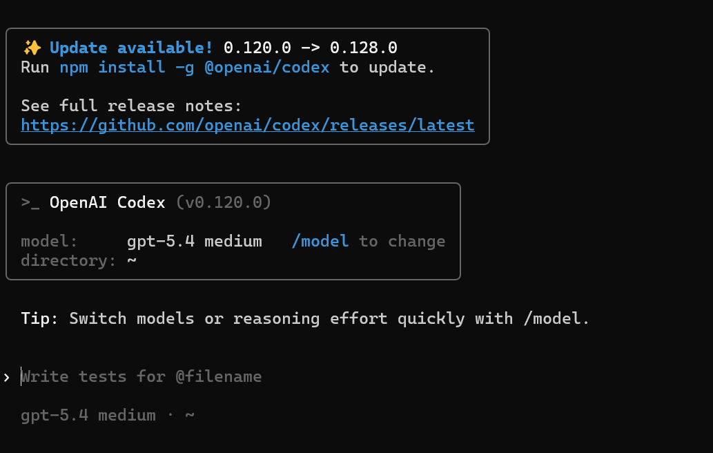

## 4.3 Codex 的VScode 插件配置

在插件中搜索

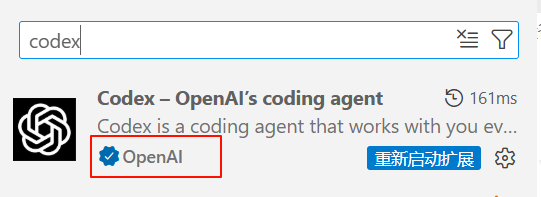

装好后vscode的右侧会出现一个codex对话窗口

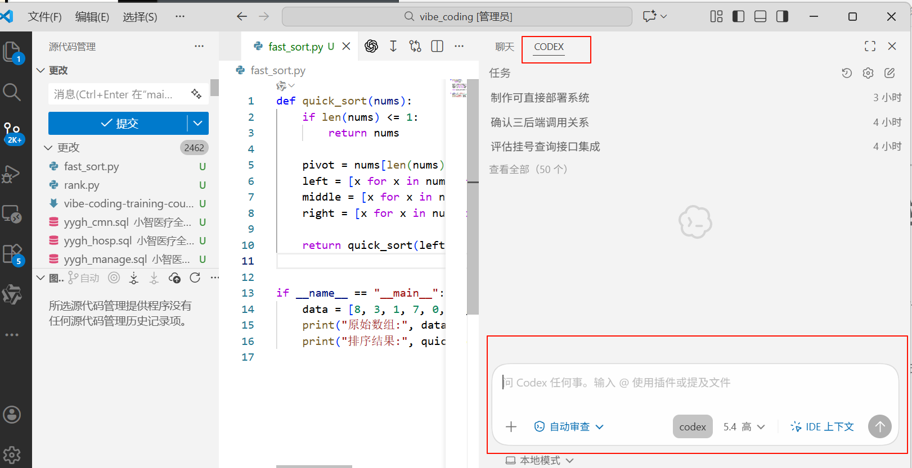

## 4.4 codingPlan

查询

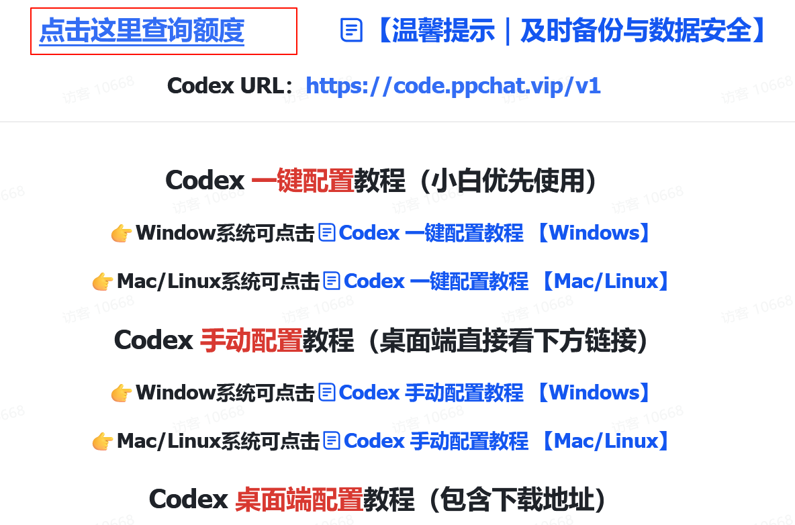

计费标准

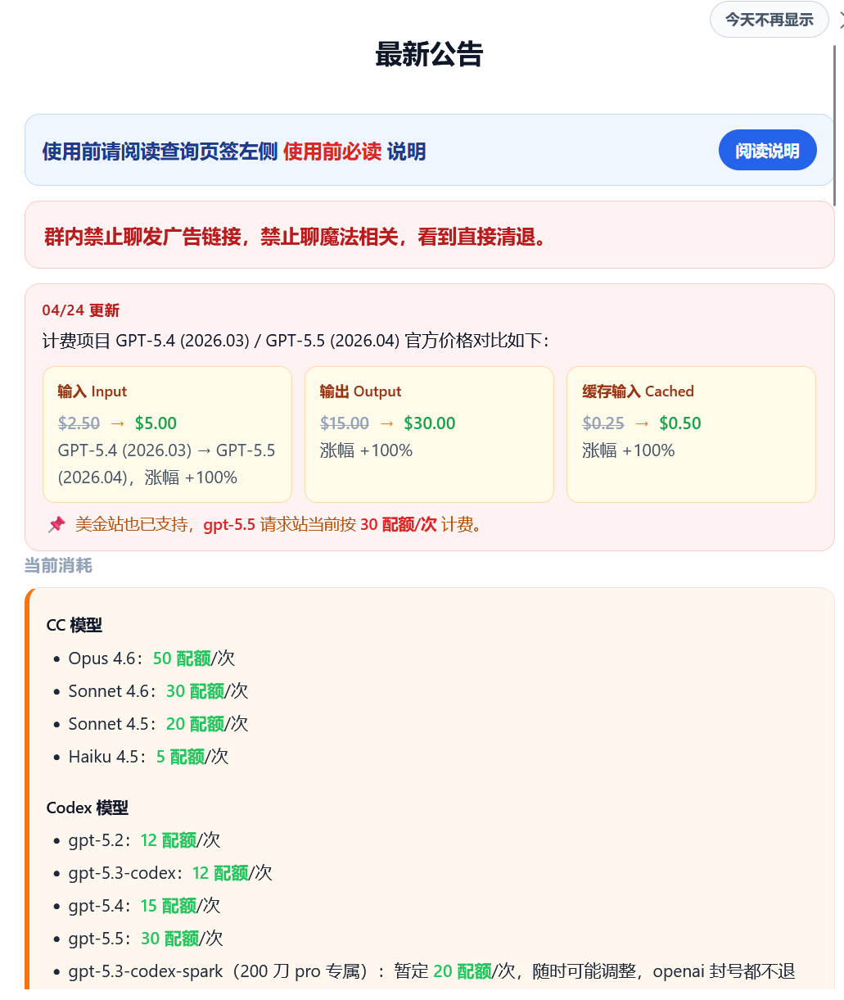

当日剩余额度，当日使用额度 = 模型使用次数*模型配额，但是注意模型使用次数不等于提问次数，codex会自己把一个问题切分成多个子问题进行交互。

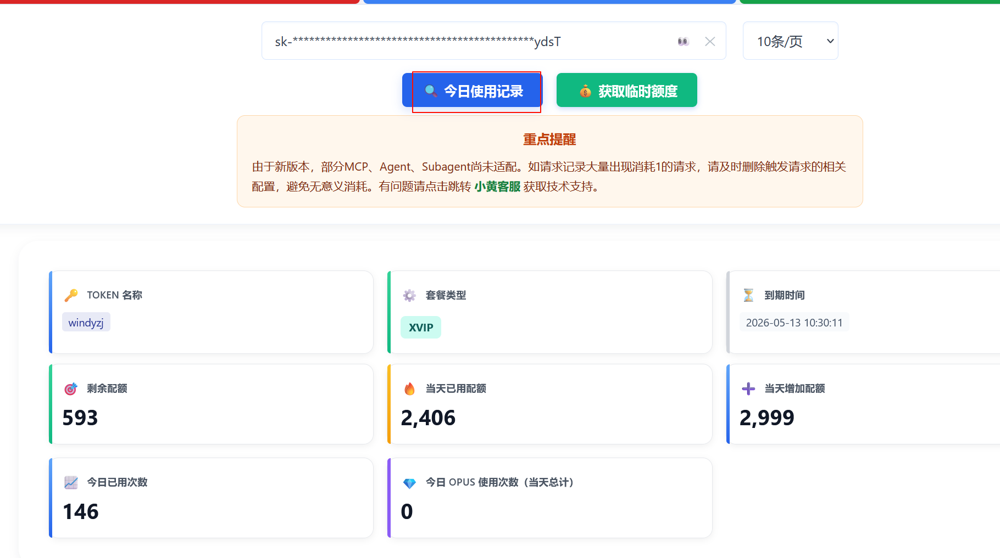

## 4.5 codex的使用

### 4.5.1 权限

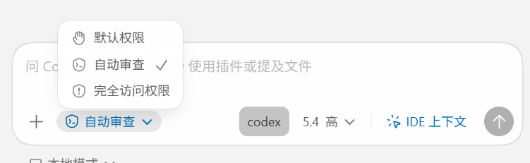

这三种权限可以这样理解：

1. 默认权限  
   Codex 只在沙箱里工作。  
   通常可以读项目文件、改工作区内允许修改的文件、运行一部分安全命令。  
   但一旦要做更敏感的事，比如访问受限目录、联网、启动外部程序、执行可能有风险的命令，就需要你手动确认。

2. 自动审查  
   是有安全边界，但比“默认权限”更顺一点。  
   当 Codex 需要更高权限时，会先交给系统自动审核；审核通过就直接执行，不一定每次都打断你手动点确认。  
   如果自动审核不通过，Codex 还是得换更安全的办法，或者再请你明确授权。
   
   **以上两者基本上无法对工作区外的文件做插删改**。  

3. 完全访问权限  
   基本相当于把沙箱限制拿掉很多，Codex 可以更自由地访问文件、运行命令，处理事情最快。  
   但风险也最高，因为它可能修改更多目录、执行更强的操作。  

### 4.5.2 读写模式

  在codex中无法通过明确的选项来约束操作是读还是写，因此在提示语中就要更加明确的表明是否要生成为文件。

    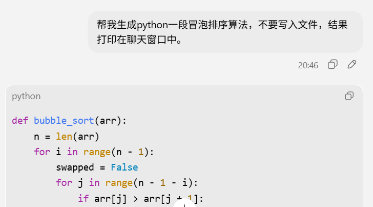

### 4.5.3 确定文件

在codex窗口中无法选择具体涉及的文件，如果你不明确说明涉及的文件codex会自动去根据语义在整个目录中寻找。虽然codex一般也能找到，但是会耽误时间浪费token，而且文件太过接近时也会产生歧义。

所以建议在对话中通过相对路径明确涉及的文件。


#### 4.5.4 窗口token剩余状态

目前的大模型对于上下文窗口都是有限的，一次持续对话越长窗口剩余量就越小。

当窗口已用量高的时候是非常耗费token和时间的，所以如果已经不需要之前的对话上下文时，尽快切换为新的对话。


### 4.6 总结

codex的优点：

- 费用上比较有弹性，第三方商家的提供了多种不同的套餐

- 几乎不会有任何卡死情况

缺点

- 一个codingplan只能选择一种模型

- 对话交互不如cursor的好（没有文件选择、读写选择）

- 续费麻烦一点

---

# 第五章：Claude Code

## 5.1 本章目标

本章主要完成一件事：让 Claude Code 这个终端 AI 编程工具，不只使用 Anthropic 官方模型，也可以切换到 DeepSeek V4 模型。

实现方式有两种：

- 直接配置 Claude Code 的环境变量
- 使用 CC Switch 管理多套大模型 API Key，并在不同模型之间快速切换

实际课堂中更推荐使用 CC Switch，因为以后如果要切换 DeepSeek、Claude、OpenRouter、Qwen 等不同模型，不需要反复手动修改配置文件。

## 5.2 Claude Code 是什么

Claude Code 是 Anthropic 提供的终端 AI 编程工具，可以在命令行中读取项目文件、分析代码、修改代码、执行命令，并和开发者进行多轮协作。

它和 Codex 类似，都是 CLI 形态的 Vibe Coding 工具。

区别在于：

- Claude Code 默认使用 Claude 系列模型
- Claude Code 对 Anthropic API 生态支持更直接
- 如果第三方模型提供 Anthropic 兼容接口，也可以接入 Claude Code

DeepSeek 官方提供了 Anthropic 格式的 API 地址，所以可以把 Claude Code 的请求转发到 DeepSeek V4。

## 5.3 安装 Claude Code

安装前需要保证电脑已经安装：

- Node.js 18 以上版本
- Git

在 cmd 或 PowerShell 中输入：

```bash
npm install -g @anthropic-ai/claude-code
```

如果 npm 下载速度慢，可以切换国内镜像：

```bash
npm install -g @anthropic-ai/claude-code --registry https://registry.npmmirror.com
```

如果在 PowerShell 中遇到 `npm.ps1 cannot be loaded`，可以改用：

```powershell
npm.cmd install -g @anthropic-ai/claude-code
```

安装完成后验证：

```bash
claude --version
```

如果能显示版本号，说明 Claude Code 安装成功。

## 5.4 使用 CC Switch 切换不同大模型 API Key

如果只配置一套 DeepSeek API Key，直接写环境变量就够了。

但在真实开发中，我们经常会遇到这些情况：

- 一个项目使用 DeepSeek
- 另一个项目使用 Claude 官方模型
- 有时使用中转平台或 OpenRouter
- 不同同学、不同账号、不同套餐的 API Key 需要切换

如果每次都手动改环境变量，很容易出错。

CC Switch 的作用就是统一管理这些 Provider 配置，并帮助 Claude Code 在不同 API Key、Base URL、模型之间快速切换。

### 5.4.1 安装 CC Switch

安装windows 版cc switch

### 5.4.2 添加 DeepSeek 配置


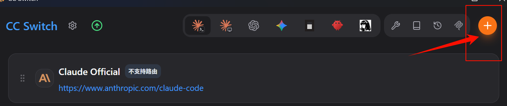

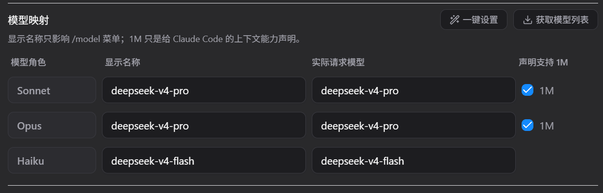

### 5.4.3 切换 DeepSeek

在如下位置点击启用即可切换

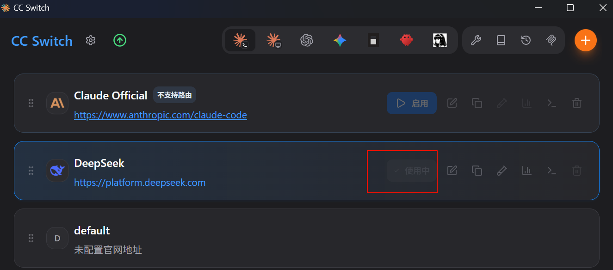


# 第六章：Spec Coding 开发模式

| 文档     | 全称                                      | 核心回答                                               | 主要读者             | 核心内容                                                     | 定位                                                         |
| -------- | ----------------------------------------- | ------------------------------------------------------ | -------------------- | ------------------------------------------------------------ | ------------------------------------------------------------ |
| **PRD**  | Product Requirements Document产品需求文档 | **要做什么功能？为了解决什么业务问题？**               | 产品、开发、测试、UI | 背景目标、用户角色、功能、业务规则、异常场景、不做范围       | **业务需求说明书**，讲用户价值，不讲技术细节                 |
| **Spec** | Specification技术规格文档                 | **具体怎么实现，接口 / 模型 / 字段是什么**             | 后端、AI Agent、测试 | 数据表结构、API 定义、入参出参、错误码、算法、返回格式、约束 | **AI 和开发之间的契约**，PRD 翻译成技术语言，Spec‑Coding 的输入源 |
| **SOP**  | Standard Operating Procedure标准操作流程  | **团队每个人按什么步骤干活，职责、先后顺序、验收标准** | 全体团队成员         | 步骤流程、角色分工、前置条件、DoD 完成定义、异常处理、禁止事项 | **团队作业手册**，不描述功能，描述人的工作流程               |

## 6.1 什么是 Spec Coding

Spec Coding （规格 / 说明文档）可以理解为：先把需求、原型、数据结构和技术方案整理成一份给 AI 看的详细说明书，再让 AI 按照说明书写代码。

它和直接说"帮我写一个系统"最大的区别是：  边界

- 不是让 AI 自由发挥
- 而是让 AI 按照 PRD、原型图、概要设计和 Spec 文档逐步实现

Spec 文档就是 AI 编码前的"施工图"。

## 6.2 Spec Coding 流程图

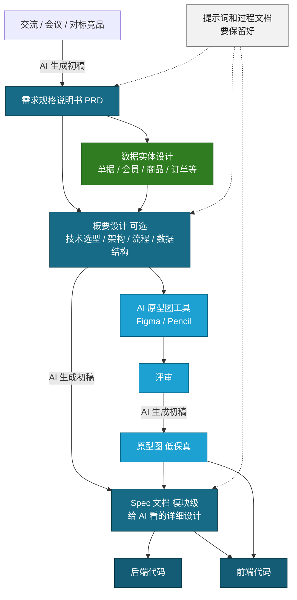
```mermaid
flowchart TD
    A[交流 / 会议 / 对标竞品] -->|AI 生成初稿| B[需求规格说明书 PRD]

    B --> C[数据实体设计<br/>单据 / 会员 / 商品 / 订单等]
    B --> D[概要设计 可选<br/>技术选型 / 架构 / 流程 / 数据结构]
    C --> D

    D -->|AI 生成初稿| E[Spec 文档 模块级<br/>给 AI 看的详细设计]
    D --> F[AI 原型图工具<br/>Figma / Pencil]
    F --> G[评审]
    G -->|AI 生成初稿| H[原型图 低保真]
    H --> E

    E --> I[后端代码]
    E --> J[前端代码]
    H --> J

    K[提示词和过程文档<br/>要保留好] -.-> B
    K -.-> D
    K -.-> E

    classDef doc fill:#176B87,stroke:#0B3D4A,color:#fff
    classDef design fill:#2F7D20,stroke:#1D4F14,color:#fff
    classDef proto fill:#1DA1D2,stroke:#0B6380,color:#fff
    classDef code fill:#145C75,stroke:#083A4A,color:#fff
    classDef note fill:#F2F2F2,stroke:#777,color:#222

    class B,D,E doc
    class C design
    class F,G,H proto
    class I,J code
    class K note
```

## 6.3 流程讲解

第一步：从交流、会议、竞品分析中整理 PRD。

这一阶段主要解决"要做什么"。可以让 AI 根据会议记录、口头需求或竞品截图生成 PRD 初稿，然后由人来确认业务范围。


第二步：补充数据实体设计。

如果是业务系统，必须先想清楚核心数据对象，例如单据、会员、商品、订单、学生、班级等。数据实体不清楚，后面的接口和页面都会乱。


第三步：生成概要设计。

概要设计可以是可选步骤，但复杂项目建议保留。它主要说明技术选型、系统架构、业务流程和数据结构。概要设计不用特别细，但要给后面的 Spec 文档定方向。


第四步：使用 Figma、Pencil 等工具生成低保真原型图。

原型图解决"页面长什么样"。生成后一定要评审，重点看页面是否完整、字段是否遗漏、按钮操作是否合理。


第五步：生成模块级 Spec 文档。

Spec 文档要比 PRD 更接近代码。它要写清楚某个模块的页面结构、接口字段、业务规则、异常处理、文件规划和验收标准。


第六步：让 AI 按 Spec 生成代码。

后端代码主要参考数据实体、接口规则和业务规则。前端代码主要参考原型图、页面结构和接口约定。

## 6.4 Spec 文档最少要写什么

不需要把 Spec 写得特别复杂，可以要包含下面几项：

| 内容     | 说明                             |
| -------- | -------------------------------- |
| 模块目标 | 这个模块解决什么问题             |
| 页面范围 | 包含哪些页面或弹窗               |
| 数据实体 | 主要表、字段、状态               |
| 接口约定 | 请求地址、请求方式、参数、返回值 |
| 业务规则 | 校验、状态流转、权限、异常处理   |
| 文件规划 | 前端、后端分别修改哪些文件       |
| 验收标准 | 怎么判断功能完成                 |

一句话总结：

```text
PRD 给人看，概要设计给人看，原型图给人和 AI 看，Spec 主要给 AI 写代码看。
```

## 6.5 结合 Skill 提升 Spec Coding 效率

在第七章中我们会详细讲解 Skill 的应用。Skill 是把经验和流程沉淀下来的"专业操作手册"，Spec Coding 和 Skill 天然就是一对好搭档。

可以把 Spec Coding 中反复出现的流程封装成 Skill：

- **PRD 生成 Skill**：按照固定模板输出需求规格说明书
- **数据实体设计 Skill**：根据业务描述自动梳理实体、字段、关系
- **Spec 文档生成 Skill**：输入模块名称和 PRD 内容，按标准格式输出 Spec 文档
- **原型图评审 Skill**：按检查清单逐项审查原型图的完整性和合理性

这样做的好处是：

- 每次开始新模块时，不需要重新解释 Spec 的格式和要求
- AI 输出更稳定，减少来回修正的次数
- 新人可以通过 Skill 快速上手 Spec Coding 流程
- 团队可以统一 Spec 文档的风格和粒度

实际使用时，建议先把最常用的流程（比如生成 Spec 文档）做成 Skill，跑通几次之后再逐步沉淀其他环节。

具体 Skill 的写法和示例，详见第七章。

## 6.6 注意事项

- 提示词要保留好，后面复盘和继续开发时还能用
- PRD 不清楚时，不要直接进入编码
- 原型图没有评审时，不要急着生成前端页面
- Spec 要按模块拆分，不要一个文档塞完整个大系统
- AI 每完成一个阶段，都要运行、检查、再继续下一阶段

## 6.7 总结

Spec Coding 的核心流程是：

```text
交流需求 -> PRD -> 数据实体设计 -> 概要设计 -> 原型图评审 -> Spec 文档 -> 前后端代码
```

越是复杂项目，越不能直接让 AI 写代码。

先把 PRD、原型图和 Spec 准备好，AI 写出来的代码才更稳定、更符合项目目标。


# 第七章：Skill 的应用

## 7.1 Skill 是什么

Skill 可以理解为给 AI 准备的一份“专业操作手册”。

普通 Prompt 是一次性的，而 Skill 是可复用的。

例如你经常需要 AI 生成 PRD（产品需求文档），就可以创建一个 PRD Skill，里面写清楚：

- PRD 的结构
- 需要问哪些问题
- 输出格式
- 验收标准
- 示例模板

之后每次需要写 PRD，不用重复解释规则。

## 7.2 Skill 的价值

Skill 的核心价值是把经验沉淀下来。

如果说 Prompt 是“临时沟通”，Skill 就是“团队 SOP（标准操作流程）”。

适合做成 Skill 的内容包括：

- PRD 生成流程
- 代码 Review 标准
- 前端页面设计规范
- API 文档生成规范
- 测试用例生成规范
- 面试题整理规范
- 周报生成规范

## 7.3 一个 Skill 示例：代码 Review Skill

假设我们希望 AI 每次 Review 代码时都按照固定标准检查：

```markdown
# Code Review Skill

## 检查重点

1. 是否有明显 Bug
2. 是否有安全风险
3. 是否破坏原有功能
4. 是否缺少测试
5. 是否有性能问题
6. 是否存在命名混乱或结构不清晰

## 输出格式

先输出高风险问题，再输出中低风险问题。
每个问题必须包含：

- 文件位置
- 问题说明
- 影响范围
- 修改建议
```

这样 AI 的输出会稳定很多。

## 7.4 Skill 课堂练习

练习目标：设计一个“生成面试题”的 Skill。

要求：

- 输入岗位名称
- 输入技术方向
- 输出 10 道基础题
- 输出 10 道项目题
- 输出 5 道开放题
- 每道题附参考答案
- 标注考察点

示例输入：

```text
岗位：前端开发实习生
技术方向：React + Vibe Coding
```


6.5 安装使用外部 skill

| 平台          | 地址                          | 类型 | 特色                                              |
| ------------- | ----------------------------- | ---- | ------------------------------------------------- |
| **skills.sh** | https://skills.sh             | 国外 | Vercel 官方推荐的发现平台                         |
| **SkillsMP**  | https://skillsmp.com/zh       | 国外 | 最大的 Skill 市场，支持中文界                     |
| **skillhub**  | https://skillhub.cn           | 国内 | 国内腾讯系平台，国内应用生态友好                  |
| **skill-cn**  | https://www.skill-cn.com/     | 国内 | 国内skill市场，注重分享使用心得                   |
| **lobehub**   | https://lobehub.com/zh/skills | 国外 | 虽然是国外平台，但是中文友好，分类齐全，skill众多 |


# 第八章：Prompt Engineering for Coding

## 8.1 好 Prompt 的四个要素

一个好的 Coding Prompt 通常包含：

- 背景：现在在做什么项目
- 目标：希望 AI 完成什么
- 约束：不能做什么，必须遵守什么
- 验证：完成后如何确认正确

模板：

```text
背景：我正在做一个【项目类型】，技术栈是【技术栈】。
目标：请帮我完成【具体任务】。
约束：不要修改【范围】，保持【要求】。
验证：完成后请运行【测试/构建】，并说明验证结果。
```

验证的原理？

## 8.2 常用 Prompt 模板

### 需求拆解 Prompt

```text
我想做一个【产品名称】，目标用户是【用户群体】。
核心目标是【目标】。
请帮我拆解：
1. 用户角色
2. 使用场景
3. MVP 功能
4. 页面清单
5. 数据对象
6. 开发优先级
7. 潜在风险
```

### 技术方案 Prompt

```text
请基于以下需求设计技术方案：
【粘贴需求】

请输出：
1. 推荐技术栈
2. 前端结构
3. 后端结构
4. 数据库表设计
5. API 列表
6. 开发里程碑
7. 风险与替代方案
```

### Debug Prompt

```text
我遇到了以下报错：
【粘贴报错】

触发步骤：
1. 【步骤一】
2. 【步骤二】

期望结果：【期望】
实际结果：【实际】

请帮我分析可能原因，并给出最小修改方案。
```

### 重构 Prompt

```text
请重构这部分代码，目标是提升可读性和可维护性。
要求：
1. 不改变现有行为
2. 不修改公开 API
3. 尽量减少改动范围
4. 重构后说明改动点和验证方式
```

## 8.3 坏 Prompt 改写练习

坏 Prompt：

```text
这个页面太丑了，帮我改好看点。
```

改写后：

```text
请优化当前课程首页的视觉设计。
目标用户是想学习 AI 编程的大学生和职场新人。
风格希望是现代、清爽、有科技感，但不要太花。
请保留现有内容结构，只调整布局、字体层级、颜色、间距和按钮样式。
完成后说明你做了哪些视觉优化。
```


# 第九章：Vibe Coding 面试题

### 问题 1：你怎么理解 Vibe Coding？

### 问题 2：AI 生成代码最大的问题是什么？

### 问题 3：你如何写一个好的 Coding Prompt？

### 问题 4：讲一个你用 AI 辅助完成项目的经历。

### 问题 5：如果 AI 把项目改坏了怎么办？

```python
# 问题 1：你怎么理解 Vibe Coding？
Vibe Coding 是一种以自然语言描述需求、由 AI 生成代码的开发方式。开发者的核心工作从"写代码"转变为"描述意图 + 审查结果"。
它的核心理念是：
意图驱动：你不需要精确到每一行怎么写，而是把需求、上下文、约束条件用自然语言描述清楚，AI 负责生成实现。
快速迭代：通过不断对话、反馈、修正，逐步逼近想要的结果，类似于"结对编程"但 AI 是执行者。
降低门槛：让非专业程序员也能参与开发，同时让专业程序员提高产出效率。
但 Vibe Coding 不意味着不需要技术能力——你仍然需要理解架构、能读懂代码、能判断 AI 生成的结果是否正确。它改变的是"谁敲键盘"，而不是"谁做决策"。
 
# 问题 2：AI 生成代码最大的问题是什么？
我认为最大的问题是"看起来对，但实际有隐蔽缺陷"，
具体表现在三个方面：
1 缺乏全局上下文理解：AI 通常基于局部代码片段或有限上下文生成代码，可能不了解项目的整体架构、业务约束、历史决策，导致生成的代码"局部正确但全局不协调"。
2 幻觉问题：AI 可能会调用不存在的 API、使用过时的语法、编造看似合理但实际错误的逻辑，而且生成的代码风格自信流畅，很难一眼看出问题。
3 安全和边界情况缺失：AI 生成的代码往往走的是"正常路径"，容易忽略异常处理、边界条件、安全校验（如 SQL 注入），这些在实际生产环境中是致命的。
所以使用 AI 生成代码，人的审查（Code Review）环节绝对不能省。
 
# 问题 3：你如何写一个好的 Coding Prompt？
我总结了一个框架叫 "CR-CES"：
Context（背景）
告诉 AI 项目环境、技术栈、当前状态
"这是一个 FastAPI 项目，使用 pymilvus 做向量检索"

Reference（参考）
给出参考代码、文件、已有约定
"参考 bge_client_util.py 的参数和返回值格式"

Constraint（约束）
明确限制条件、规范、不能做什么
"使用 fp16=False，启动命令必须用 uvicorn"

Example（示例）
给出输入输出的具体样例
"curl 请求格式如下…返回值格式如下…"

Step（步骤）
复杂任务拆解为分步指令
"第一步加载模型，第二步定义接口，第三步…"

关键原则：
越具体越好——模糊的 prompt 得到模糊的结果
给约束比给自由更重要——告诉 AI "不要做什么" 往往比 "要做什么" 更有效
迭代优化——第一次生成后，针对不满意的部分追加修正，比一次性写完美 prompt 更高效
 
# 问题 4：讲一个你用 AI 辅助完成项目的经历。
我之前做了一个 RAG 知识库问答系统，其中有一个环节需要在 GPU 服务器上部署 BGE-M3 Embedding 服务。
具体过程：
1 我先在本地项目中已经有一个 bge_client_util.py，封装了 BGE-M3 的调用逻辑（稠密向量 + 稀疏向量的生成）。
2 我需要把这个逻辑包装成一个远程 HTTP 服务，部署到 GPU 云服务器上。我写了一个 Prompt，包含了：核心目标（生成 Embedding 服务）、参考文件（bge_client_util.py 的参数和返回值）、接口格式（curl 示例）、返回值格式（dense + sparse 的 JSON 结构）、技术约束（FastAPI + uvicorn 启动）。
3 AI 一次性生成了完整的服务代码，包括模型加载、请求校验、推理锁、健康检查等，和我项目中已有的 Reranker 服务风格完全一致。
4 我只做了少量调整就部署成功了，整个过程大概 10 分钟，如果自己从零写 + 调试 CSR 稀疏向量的解析逻辑，至少需要 1-2 小时。
收获：AI 最擅长的是"有明确参考、有清晰规范的重复性工程工作"，把已有的模式快速复制到新场景。
 
# 问题 5：如果 AI 把项目改坏了怎么办？
这是使用 AI 辅助开发必须面对的问题，我的应对策略分事前预防、事中控制、事后恢复三个层面：
1 事前预防：
版本控制：每次让 AI 做较大改动前，先 commit 或开分支，确保有回退点。
明确约束：在 Prompt 中限定 AI 的修改范围，比如"只修改 query_router.py 中的搜索逻辑，不要动其他文件"。
事中控制：
小步迭代：不要让 AI 一次性改太多东西，每次只做一个小功能点，改完立刻验证。
Code Review：AI 生成的每一行代码都要看，重点关注异常处理、边界条件、是否有幻觉 API。
运行测试：改完后立刻跑已有的测试用例，确认没有破坏原有功能。
2 事后恢复：
如果已经改坏了，直接 git diff 查看改动，git checkout 回退到上一个正确版本。
分析改坏的原因，优化 Prompt 的约束条件，避免同样的问题再次发生。
核心观点：AI 改坏了不可怕，可怕的是没有版本控制、不做审查、不测试就上线。AI 是工具，质量把关的责任始终在人。
```
