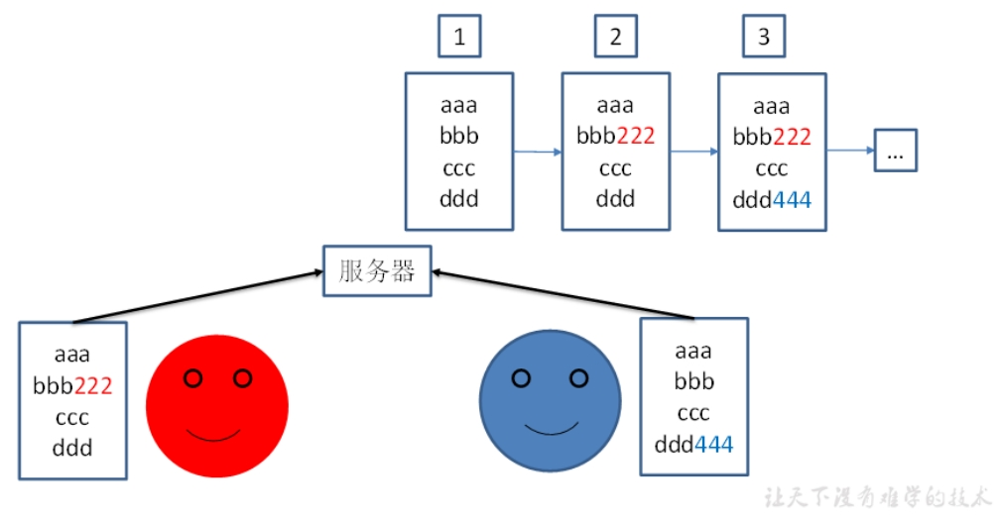
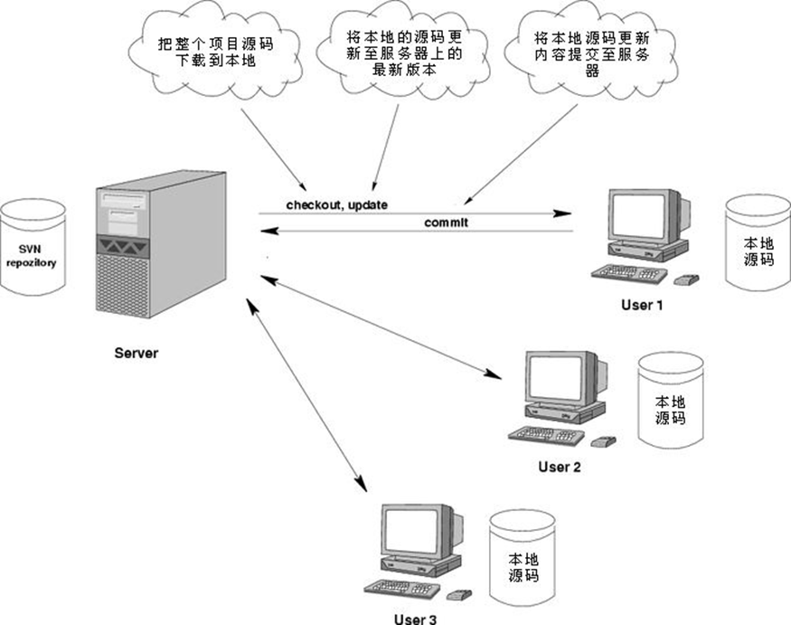
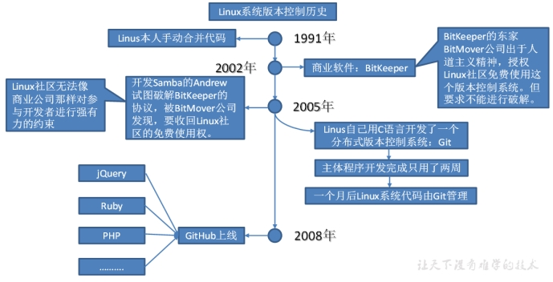

# 第1章 Git概述

Git是一个免费的、开源的分布式版本控制系统，可以快速高效地处理从小型到大型的各种项目。

Git易于学习，占地面积小，性能极快。[g] 它具有廉价的本地库，方便的暂存区域和多个工作流分支等特性。其性能优于Subversion(svn)、CVS、Perforce和ClearCase等版本控制工具。

## 1 何为版本控制

版本控制是一种记录文件内容变化，以便将来查阅特定版本修订情况的系统。

版本控制其实最重要的是可以记录文件修改历史记录，从而让用户能够查看历史版本，方便版本切换。

 

## 2 为什么需要版本控制

个人开发过渡到团队协作。

 

## 3 版本控制工具

* **集中式版本控制工具**

CVS、SVN(Subversion)、VSS……

集中化的版本控制系统诸如 CVS、SVN等，都有一个单一的集中管理的服务器，保存所有文件的修订版本，而协同工作的人们都通过客户端连到这台服务器，取出最新的文件或者提交更新。多年以来，这已成为版本控制系统的标准做法。

这种做法带来了许多好处，每个人都可以在一定程度上看到项目中的其他人正在做些什么。而管理员也可以轻松掌控每个开发者的权限，并且管理一个集中化的版本控制系统，要远比在各个客户端上维护本地数据库来得轻松容易。

事分两面，有好有坏。这么做显而易见的缺点是中央服务器的单点故障。如果服务器宕机一小时，那么在这一小时内，谁都无法提交更新，也就无法协同工作。

 把别人提交的代码，同步到自己的电脑上，这叫update。注意：只有第一次下载才叫check out。

* **分布式版本控制工具**

Git、Mercurial、Bazaar、Darcs……

像 Git这种分布式版本控制工具，客户端提取的不是最新版本的文件快照，而是把代码仓库完整地镜像下来（本地库）。这样任何一处协同工作用的文件发生故障，事后都可以用其他客户端的本地仓库进行恢复。因为每个客户端的每一次文件提取操作，实际上都是一次对整个文件仓库的完整备份。

分布式的版本控制系统出现之后,解决了集中式版本控制系统的缺陷:

1. 服务器断网的情况下也可以进行开发（因为版本控制是在本地进行的）

2. 每个客户端保存的也都是整个完整的项目（包含历史记录，更加安全）

 

## 4 Git简史

 

2018年10月，微软以75亿美元收购GitHub交易已完成。（对比：2009年，Oracle收购 SUN花了74亿）

## 5 Git工作机制

 

## 6 Git和代码托管中心

代码托管中心是基于网络服务器的远程代码仓库，一般我们简单称为远程库。

* **局域网**

  GitLab（地址： https://about.gitlab.com/ ）

  是一个用于仓库管理系统的开源项目，使用Git作为代码管理工具，并在此基础上搭建起来的web服务。与GitHub的使用类似，有特殊需求不能使用外网的代码托管中心，可以在局域网内搭建自己的代码托管中心服务器。

* **互联网**

  - GitHub（ 地址：https://github.com/ ）

  是一个面向开源及私有软件项目的托管平台，因为只支持Git 作为唯一的版本库格式进行托管，故名gitHub。国外网站，有非常多优秀的开源项目托管代码，但是从国内访问很慢。

  - Gitee / 码云（地址： https://gitee.com/ ）

  是国内的一个代码托管平台，由于服务器在国内，所以相比于GitHub，码云速度会更快。
