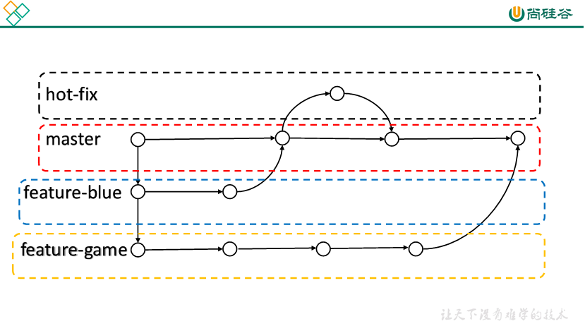
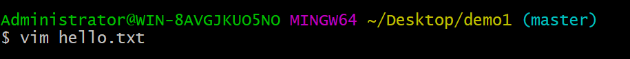
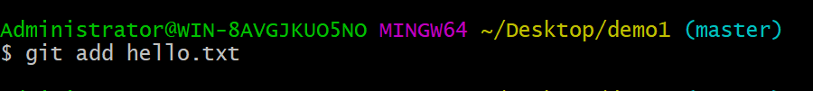
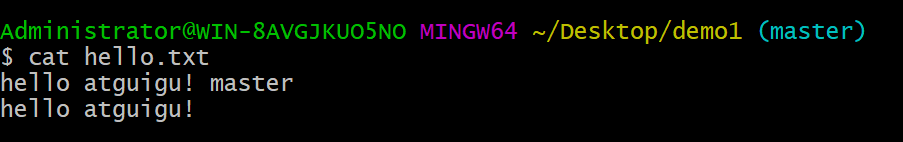
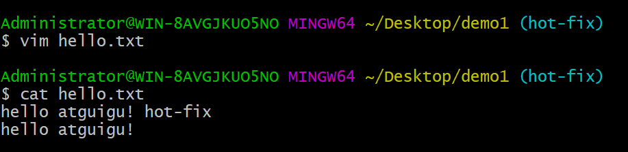

# 第4章 Git分支操作

## **1** **什么是分支**

在版本控制过程中，同时推进多个任务，为每个任务，我们就可以创建每个任务的单独分支。使用分支意味着程序员可以把自己的工作从开发主线上分离开来，开发自己分支的时候，不会影响主线分支的运行。对于初学者而言，分支可以简单理解为副本，一个分支就是一个单独的副本。（分支底层其实也是指针的引用）

## **2** **分支的好处**

同时并行推进多个功能开发，提高开发效率。

各个分支在开发过程中，如果某一个分支开发失败，不会对其他分支有任何影响。失败的分支删除重新开始即可。

## **3** **分支的操作**

| **命令名称**        | **作用**                     |
| ------------------- | ---------------------------- |
| git branch 分支名   | 创建分支                     |
| git branch -v       | 查看分支                     |
| git checkout 分支名 | 切换分支                     |
| git merge 分支名    | 把指定的分支合并到当前分支上 |

### 3.1 查看分支

#### （1）基本语法

**git branch -v**

#### （2）案例实操

### 3.2 创建分支

#### （1）基本语法

**git branch** **分支名**

#### （2）案例实操

### 3.3 修改分支

--在maste分支上做修改

--添加暂存区

--提交本地库

--查看分支

 --查看master分支上的文件内容

### 3.4 切换分支

#### （1）基本语法

**git checkout** **分支名**

#### （2）案例实操

--分支由master改为hot-fix

--查看hot-fix分支上的文件内容发现与master分支上的内容不同

--在hot-fix分支上做修改

--添加暂存区

--提交本地库

### 3.5 合并分支

#### （1）基本语法

**git merge** **分支名**

#### （2）案例实操

-- 切换回到master分支

 -- 在master分支上合并hot-fix分支

### 3.6 产生冲突

#### （1）冲突产生的表现

后面状态为MERGING

#### （2）冲突产生的原因

合并分支时，两个分支在**同一个文件的同一个位置**有两套完全不同的修改。Git无法替我们决定使用哪一个。必须**人为决定**新代码内容。

查看状态（检测到有文件有两处修改）

### 3.7 解决冲突

#### （1）编辑有冲突的文件

删除特殊符号，决定要使用的内容

特殊符号：<<<<<<< HEAD 当前分支的代码 =======  合并过来的代码 >>>>>>> hot-fix

#### （2）添加到暂存区

#### （3）执行提交

注意：此时使用git commit命令时**不能带文件名**

--发现后面MERGING消失，变为正常

## 4 创建分支和切换分支图解

 

master、hot-fix其实都是指向具体版本记录的指针。当前所在的分支，其实是由HEAD决定的。所以创建分支的本质就是多创建一个指针。

HEAD如果指向master，那么我们现在就在master分支上，HEAD如果执行hotfix，那么我们现在就在hotfix分支上。

所以切换分支的本质就是移动HEAD指针。
