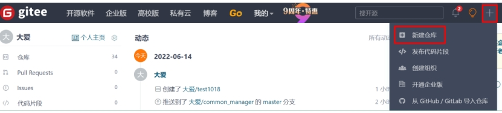
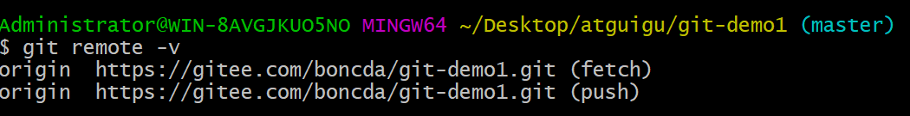
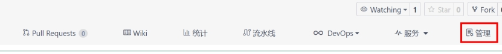
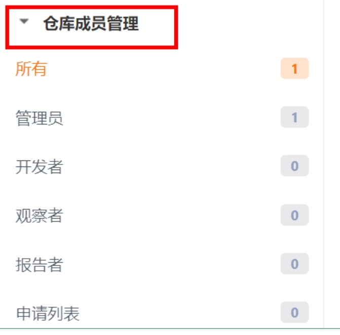
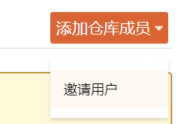
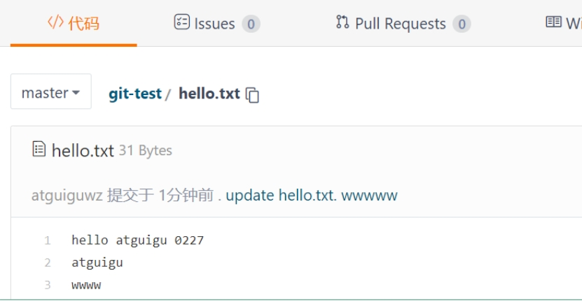
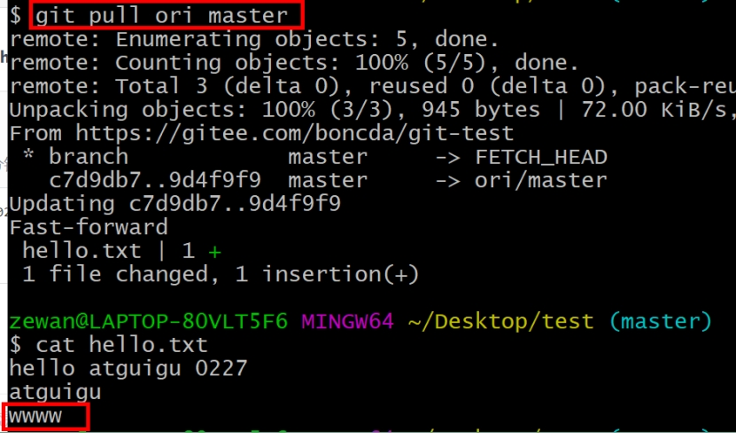
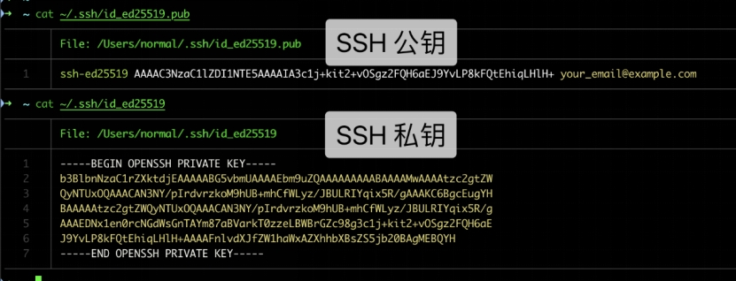

# 第5章 Gitee（码云）操作

## **1 Git 代码托管服务**

前面我们已经知道了Git中存在两种类型的仓库，即**本地仓库**和**远程仓库**。那么我们如何搭建Git远程仓库呢？我们可以借助互联网上提供的一些代码托管服务来实现，其中比较常用的有GitHub、码云、GitLab等。

l gitHub（ 地址：https://github.com/ ）

是一个面向开源及私有软件项目的托管平台，因为只支持Git 作为唯一的版本库格式进行托管，故名gitHub

l 码云（地址： https://gitee.com/ ）

是**国内**的一个代码托管平台，由于服务器在国内，所以相比于GitHub，码云速度会更快

l GitLab （地址： https://about.gitlab.com/ ）

是一个用于仓库管理系统的开源项目，使用Git作为代码管理工具，并在此基础上搭建起来的web服务

## **2 Gitee简介**

1.是什么： gitee是一个git项目托管网站，主要提供基于git的版本托管服务

2.能干嘛： gitee是一个基于git的代码托管平台， Git 并不像 SVN 那样有个中心服务器。目前我们使用到的 Git 命令都是在本地执行，如果你想通过 Git 分享你的代码或者与其他开发人员合作。 你就需要将数据放到一台其他开发人员能够连接的服务器上。

 

3.去哪下： https://gitee.com/ 

4.怎么玩：见课堂演示

前面执行的命令操作都是针对的本地仓库，本章节我们会学习关于远程仓库的一些操作，具体包括：

l 查看远程仓库

l 添加远程仓库

l 从远程仓库克隆

l 从远程仓库中抓取与拉取

l 推送到远程仓库

 

## **3** 码云帐号注册和登录

进入码云官网地址：https://gitee.com/，点击注册Gitee

 

​	输入个人信息，进行注册即可。

 

​	帐号注册成功以后，直接登录。

	登录以后，就可以看到码云官网首页了。

 

 

## 4 创建远程仓库

 

 

 

 

 

 

## 5 远程仓库操作

| **命令名称***                      | **作用**                                                 |
| ---------------------------------- | -------------------------------------------------------- |
| git remote -v                      | 查看当前所有远程地址别名                                 |
| git remote add 别名 远程地址       | 起别名                                                   |
| git push 别名 分支(本地分支名)     | 推送本地分支上的内容到远程仓库                           |
| git clone 远程地址                 | 将远程仓库的内容克隆到本地                               |
| git pull 远程库地址别名 远程分支名 | 将远程仓库对于分支最新内容拉下来后与当前本地分支直接合并 |

###  5.1 创建远程仓库别名

#### （1）基本语法

**git remote -v** **查看当前所有远程地址别名**

**git remote add** **别名** **远程地址**

#### （2）案例实操

**https://gitee.com/boncda/git-demo1.git**

***\*这个地址在创建完远程仓库后生成的连接，如图所示红框中\****

 

### 5.2 推送本地分支到远程仓库 

#### （1）基本语法

**git push** **别名** **分支**

#### （2）案例实操

第一次需要输入**码云的用户名和密码**

此时发现已将我们master分支上的内容推送到Gitee创建的远程仓库。

 

### 5.3 克隆远程仓库到本地

#### （1）基本语法

**git clone** **远程地址**

#### （2）案例实操

**创建新文件夹，执行**

 这个地址为远程仓库地址，克隆结果：初始化本地仓库

 

进入git-demo1执行

 

小结：clone会做如下操作。1、拉取代码。2、初始化本地仓库。3、创建别名

### 5.4 邀请加入团队

#### **（1）点击管理**

 

#### （2）选择仓库成员管理

 

#### （3）选择邀请用户

 

#### （4）有多种方式可以添加

下面演示直接添加

 

直接输入用户名称添加

 

指定权限，提交

 

 

 

#### （5）测试功能

第一，使用atguiguwz登录码云，修改文件

 

第二 atguiguwz提交文件

第三 使用另外用户登录，发现文件已经更新

 

### 5.5 拉取远程库内容

#### （1）基本语法

**git pull** **远程库地址别名** **远程分支名**

#### （2）案例实操

## 6 SSH免密登录（了解）

我们可以看到远程仓库中还有一个SSH的地址，因此我们也可以使用SSH进行访问。

你可以按如下命令来生成 sshkey:

ssh-keygen -t ed25519 -C "18431034318@163.com" 

\# Generating public/private ed25519 key pair...

注意：

`-t` 表示 "type"       **ed25519**：当前推荐的现代椭圆曲线算法，安全性高且性能优越。

`-C` 表示 "comment"，即为密钥添加注释信息。通常用于标识密钥的用途或所有者身份。

按照提示完成三次回车，即可生成 ssh key。通过查看 ~/.ssh/id_ed25519.pub 文件内容，获取到你的 public key

cat ~/.ssh/id_ed25519.pub

\# ssh-ed25519 AAAAB3NzaC1yc2EAAAADAQABAAABAQC6eNtGpNGwstc....

 

 

复制生成后的 ssh key，通过仓库主页 **「管理」->「部署公钥管理」->「添加部署公钥」** ，添加生成的 public key 添加到仓库中。

 

验证是否可用：添加后，在终端（Terminal）中输入

ssh -T git@gitee.com

首次使用需要确认并添加主机到本机SSH可信列表。若返回 Hi XXX! You've successfully authenticated, but Gitee.com does not provide shell access. 内容，则证明添加成功。

 

添加成功后，就可以使用SSH协议对仓库进行操作了。
