# 第6章 PyCharm集成Git（本地库）

说明：前面命令行的方式，需要了解。真正开发的时候，都是在IDE中操作。

前提：创建PyCharm中的一个Python Project：

## 1 定位Git程序

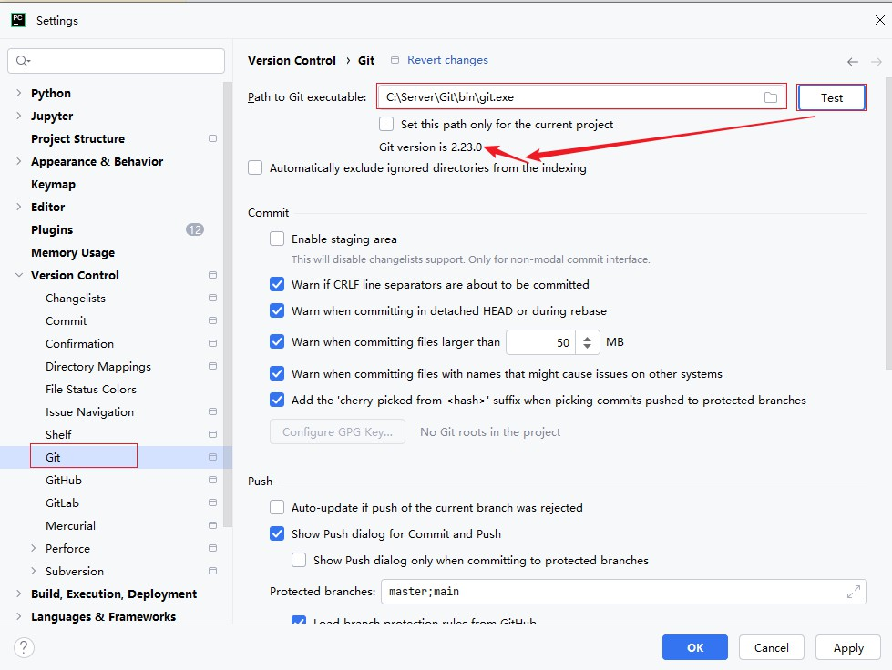

## 2 初始化本地库

选择要创建Git本地仓库的工程（选中项目的根目录）

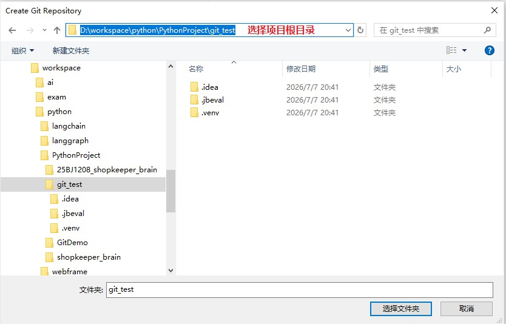

此时的项目就被初始化了。在物理磁盘当前项目的目录下，会生成.git的文件目录。

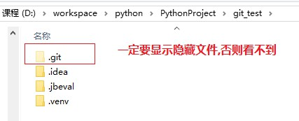

## 3 配置Git忽略文件

**什么是忽略文件？**与项目的实际功能无关，不参与服务器上部署运行的文件。避免管理不必要的文件。

忽略配置文件名称为：**.gitignore**

PyCharm创建的项目中，.idea和.venv目录下就已经定义好了忽略配置文件

注意：

我们需要在工作区根目录下创建.gitignore，并配置项目中需要忽略的其文件或目录，

比如：/.env来忽略项目中的环境配置文件

 

## 4 添加到暂存区

新建文件

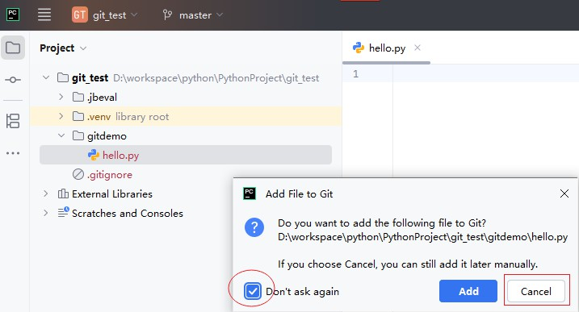

右键点击项目选择Git -> Add将项目添加到暂存区。

此前红色的代码，此时就变成了绿色。

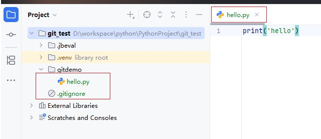

## 5 提交到本地库

此时，勾选的即为要提交的代码。

我们可以选择commit的粒度，可以是整个项目、一个module或者一个文件，都可以。

此外，在PyCharm中不需要每次commit之前进行add操作，因为PyCharm会在commit之前自动给我们add。

可以多修改几次文件，多提交几个版本，接下来练习版本穿梭。

## 6 切换版本（版本穿梭）

1）查看历史版本

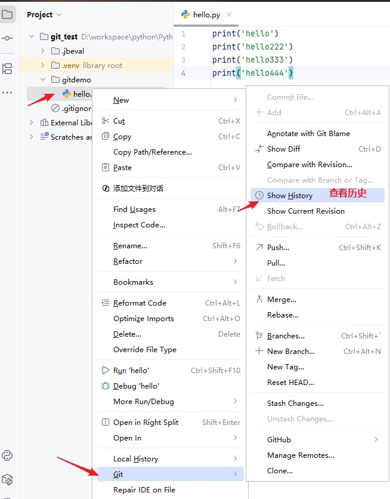

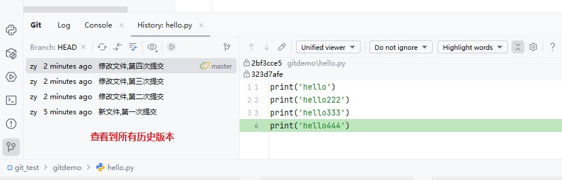

2）右键选择要切换的版本，然后在菜单里点击Checkout Revision。

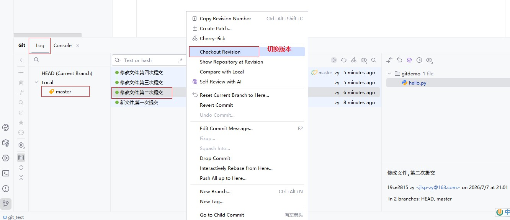

## 7 创建分支

1）选择Git，在Repository里面，点击Branches按钮。

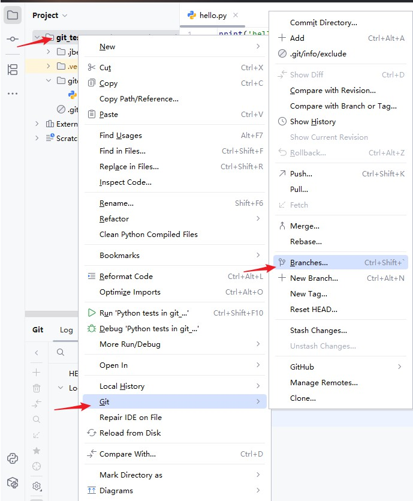

2）在弹出的Git Branches框里，点击New Branch按钮。

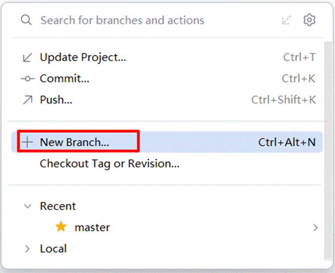

3）填写分支名称，创建dev01分支。

说明：如果创建完，就立即切换到分支上去，那就勾选。

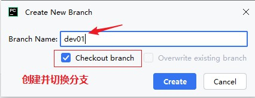

4）然后看到dev01，说明分支创建成功，并且当前已经切换成dev01分支

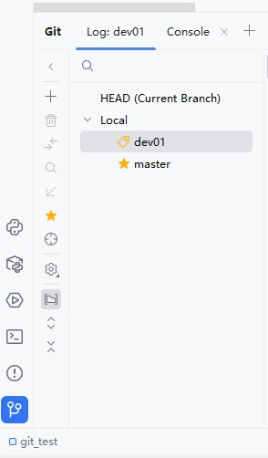

此时dev01分支和master分支上的代码都是相同的。

修改dev01分支代码并提交。

## 8 切换分支

1）切换到master分支

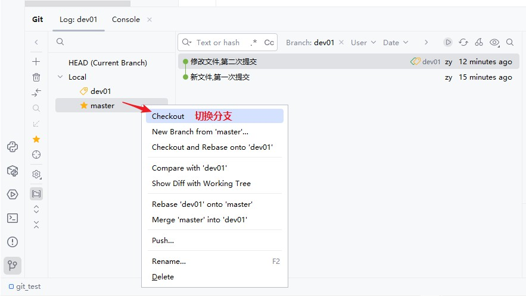

## 9 合并分支

1）使用dev01分支，修改或添加文件，然后commit。（操作略）

2）接着切换到master分支，将dev01分支合并到当前master分支。

如果代码没有冲突，分支直接合并成功，分支合并成功以后，代码自动提交，无需手动提交本地库。

## 10 解决冲突

如果master分支和dev01分支都修改了同一块代码，在合并分支的时候就会发生冲突。如图所示

1）master分支：

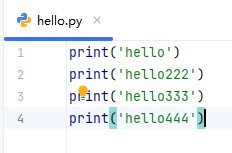

2）dev01分支：

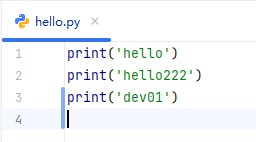

3）我们现在站在master分支上合并dev01分支，就会发生代码冲突。解决方案：

Ø 方案1：Accept Yours

Ø 方案2：Accept Theirs

Ø 方案3：Merge （下图的选择）

4）点击Conflicts框里的Merge按钮，进行手动合并代码。

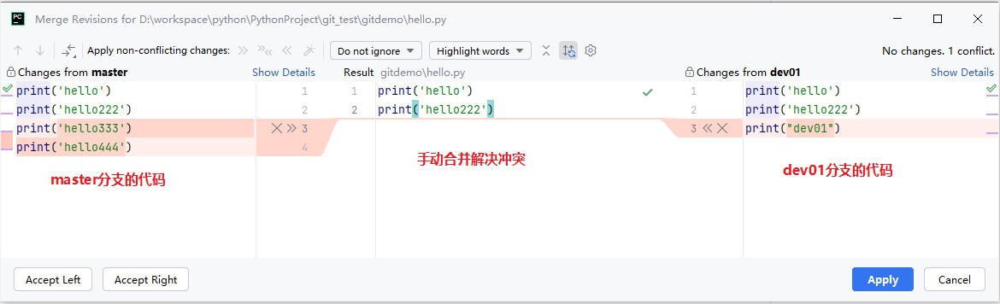

5）手动合并完代码以后，点击右下角的Apply按钮。

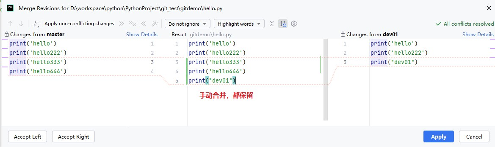

6）代码冲突解决，自动提交本地库，无须再次提交。

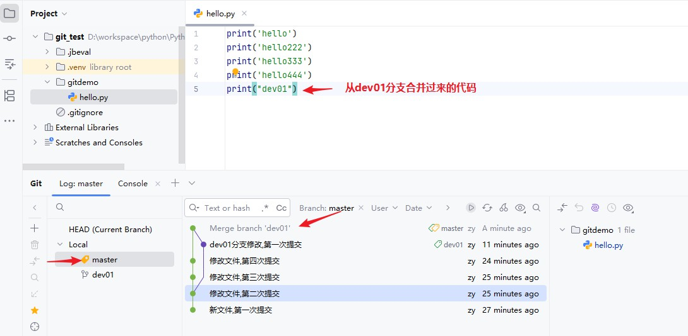
