# 第7章 PyCharm集成Gitee（码云）

## 1 PyCharm安装码云插件并关联账号

### 1.1 在Pycharm中安装Gitee插件

PyCharm默认不带码云插件，我们需要手动安装Gitee插件

1）如图所示，在PyCharm插件商店搜索Gitee，然后点击右侧的Install按钮。

2）安装成功后，若有提示重启，则重启PyCharm

3）PyCharm重启以后在Version Control设置里面看到Gitee，说明码云插件安装成功

4）然后在码云插件里面添加码云帐号，我们就可以用PyCharm连接码云了。

5）多种设置方式：

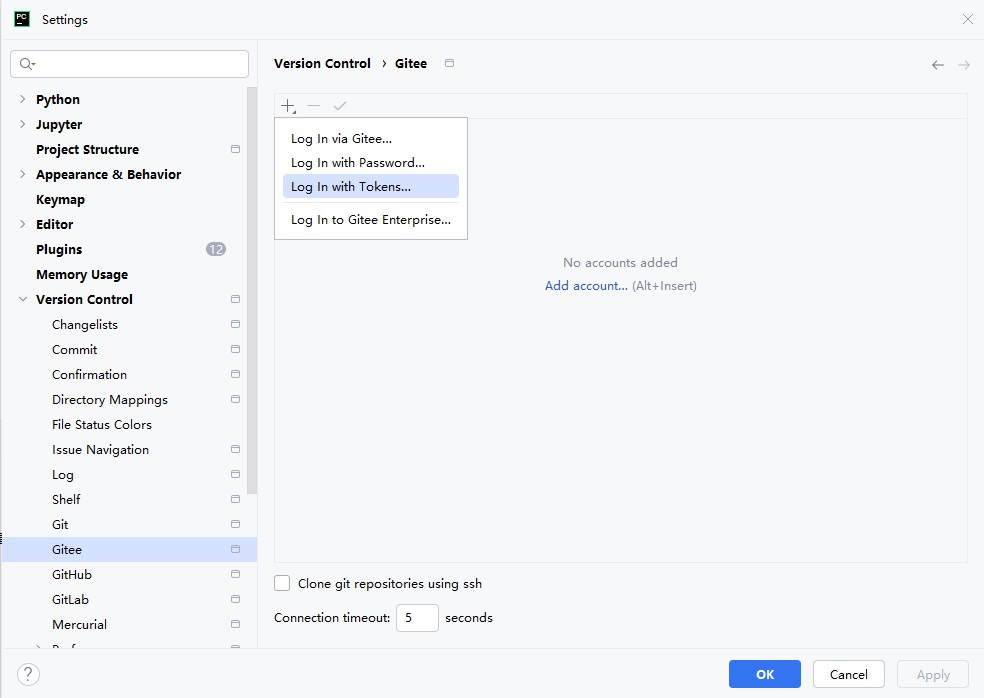

### 1.2 关联账号

1）演示Log In with Tokens：使用Token，这里需要私人令牌

Ø 在gitee的设置中申请。

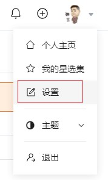

 

Ø 生成新令牌

Ø 这里还可以设置令牌的权限

Ø 提交后，需要填写账号密码，填上即可

Ø 务必复制，并保存好令牌

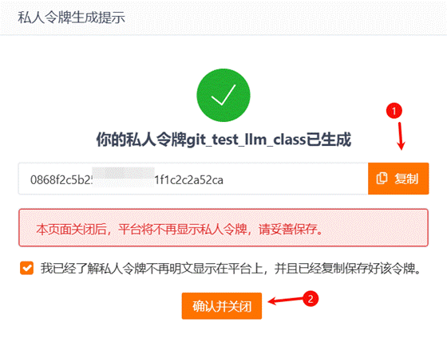

Ø 生成好的令牌在PyCharm中填写好即可

这里的is private token可以不用勾选。

2）演示Log In with password：使用用户名和密码的方式。此时的login必须使用邮箱。

说明：这里推荐使用方式Tokens，避免将用户名和密码交由PyCharm保管。而且，远程推送也推荐使用令牌的方式。

## 2 push：推送本地库到远程库

在PyCharm里面创建一个工程，初始化git工程，然后将代码添加到暂存区，提交到本地库，这些步骤上面已经讲过，此处不再赘述。

1）第1次push，需要将当前项目“共享”给Gitee，如下操作：

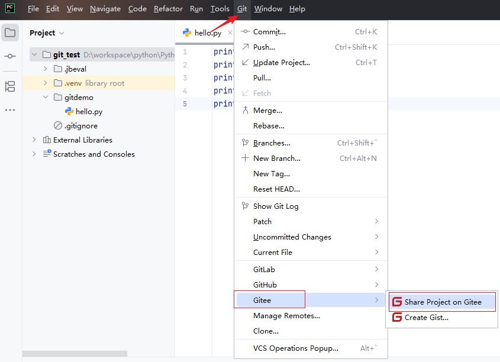

注意：此时不需要提前在Gitee上创建好一个远程库来接收。

2）填写提交到Gitee上的仓库的名称，url别名，以及必要的说明

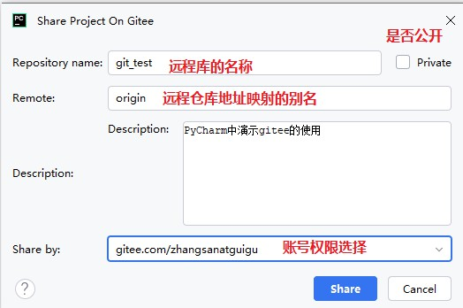

3）接着回到Gitee官网，即能看到push过来的项目

4）在当前仓库管理中，可以设置是否开源(默认是私有的)

5）后续在PyCharm中修改了代码，需要先commit提交

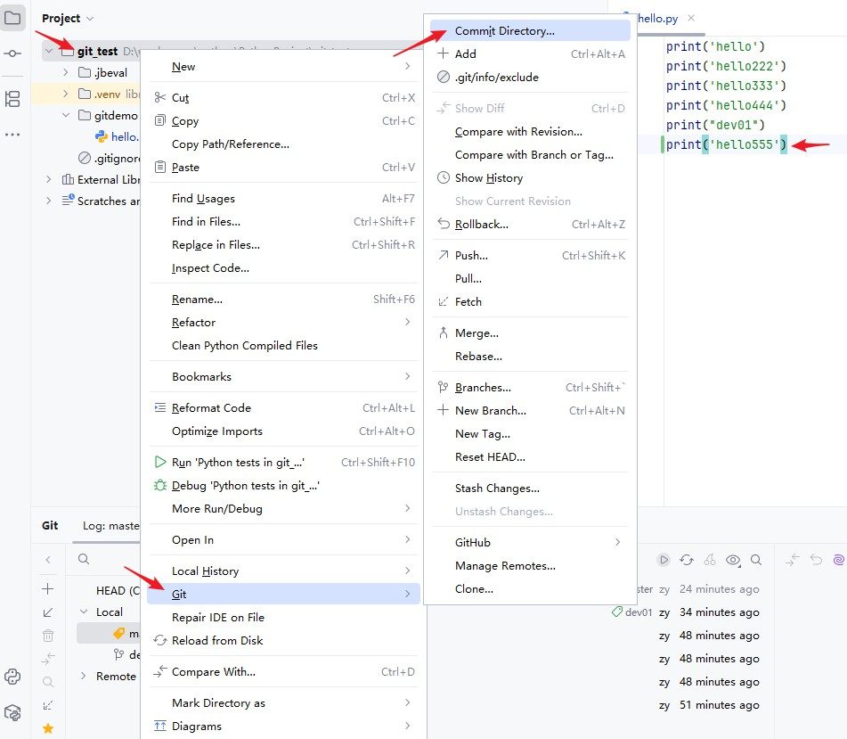

6）commit以后，还可以在如下的位置进行远程push

7）去码云远程库查看更新的代码

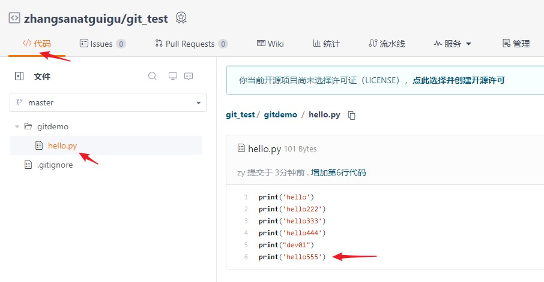

## 3 pull：拉取远程库到本地库

1）在码云上直接修改代码内容，之后提交，为了进行测试

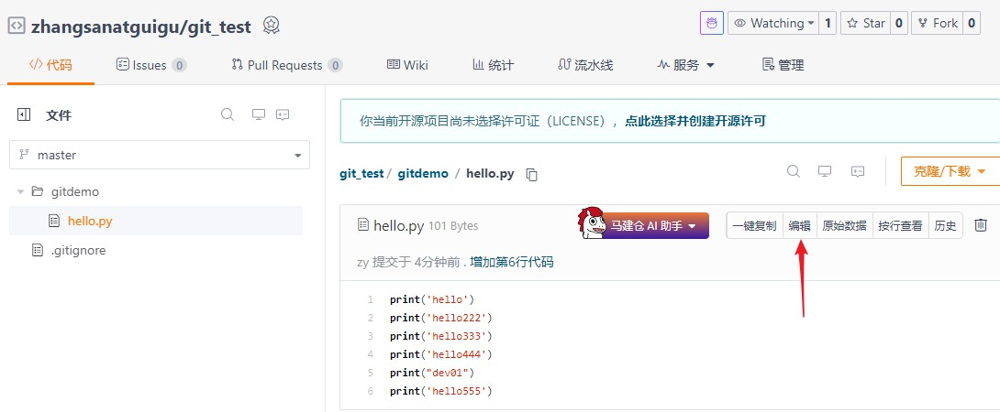

编写完以后，进行提交即可。

2）回到PyCharm，右键点击项目，可以将远程仓库的内容pull到本地仓库。

3）选择远程库

4）pull了远程库中最新内容

**注意：pull****是拉取远端仓库代码到本地，如果远程库代码和本地库代码不一致，会自动合并，如果自动合并失败，还会涉及到手动解决冲突的问题。**

## 4 clone：克隆远程库到本地

1）如果clone的是Gitee上其他人的开源项目，建议先fork。

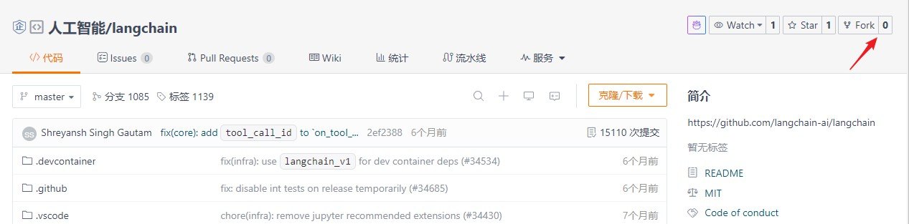

这里我们演示下载自己的开源项目

2）选择Clone

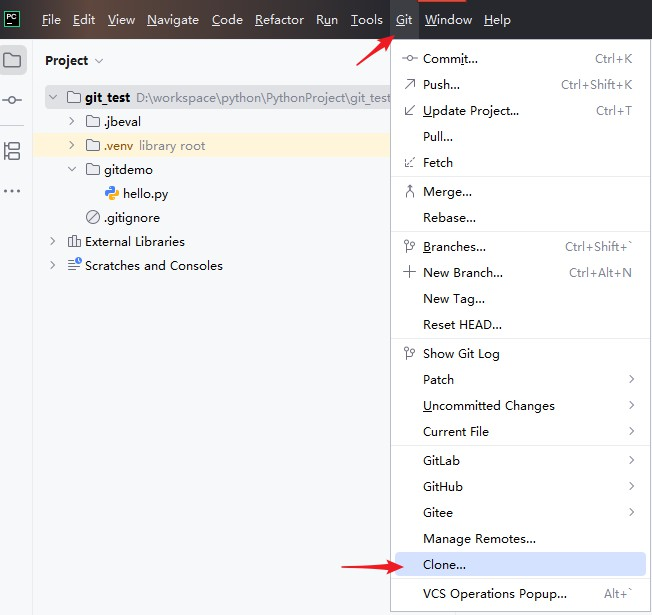

3）输入远程码云仓库地址

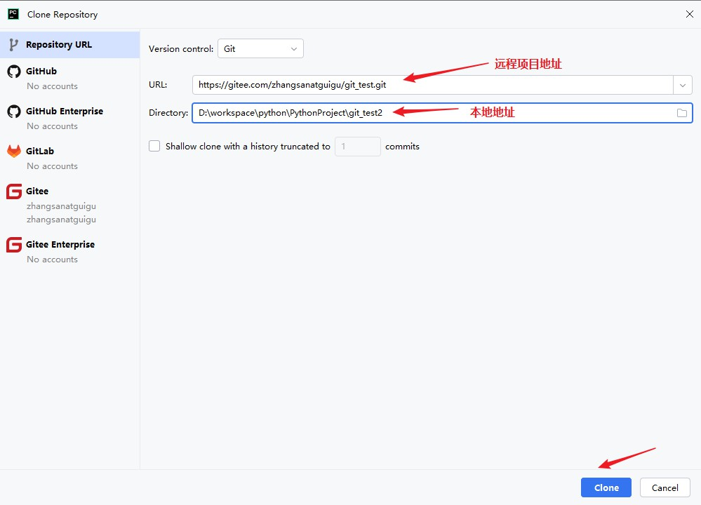

上面的地址来自于：

4）完成clone操作

## 5 小结

### 5.1 小结1：关于冲突

1）总结：容易冲突的操作方式

- 多个人同时操作了同一个文件
- 一个人一直写不提交
- 修改之前不更新最新代码
- 擅自修改同事代码

2）减少冲突的操作方式

- 养成良好的操作习惯，先pull，再修改，修改完立即commit和push
- 一定要确保自己正在修改的文件是最新版本的
- 各自开发各自的模块
- 如果要修改公共文件，一定要先确认有没有人正在修改
- 下班前一定要提交代码，上班第一件事拉取最新代码
- 一定不要擅自修改同事的代码

### 5.2 小结2：Git提交流程

