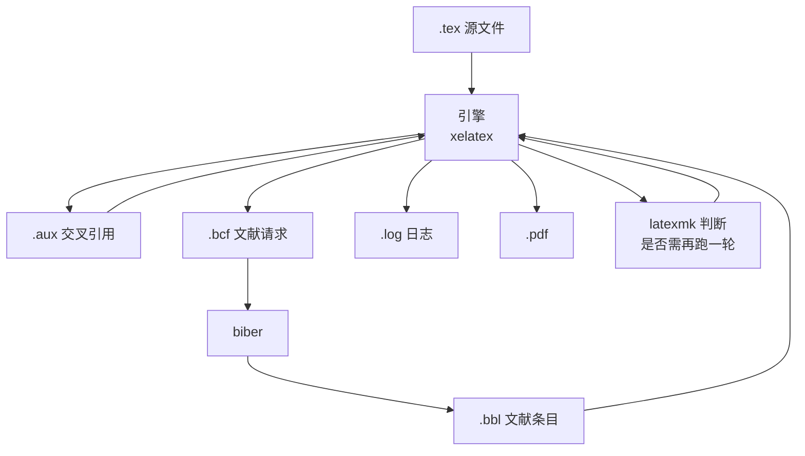
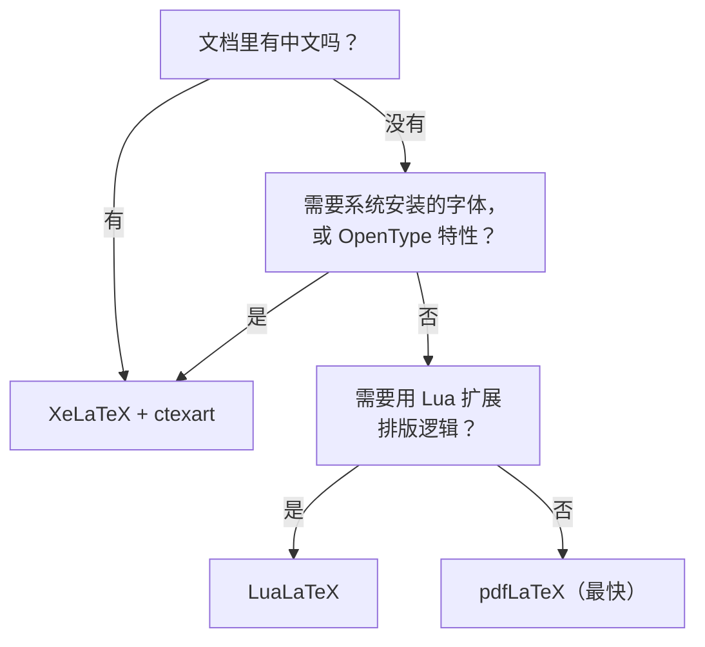
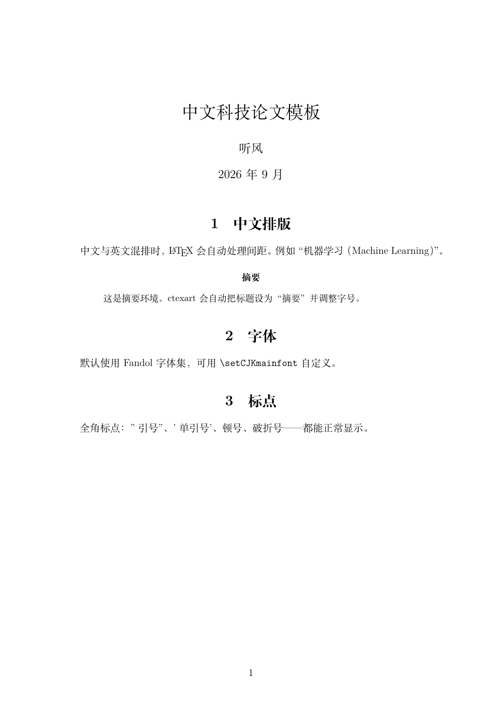
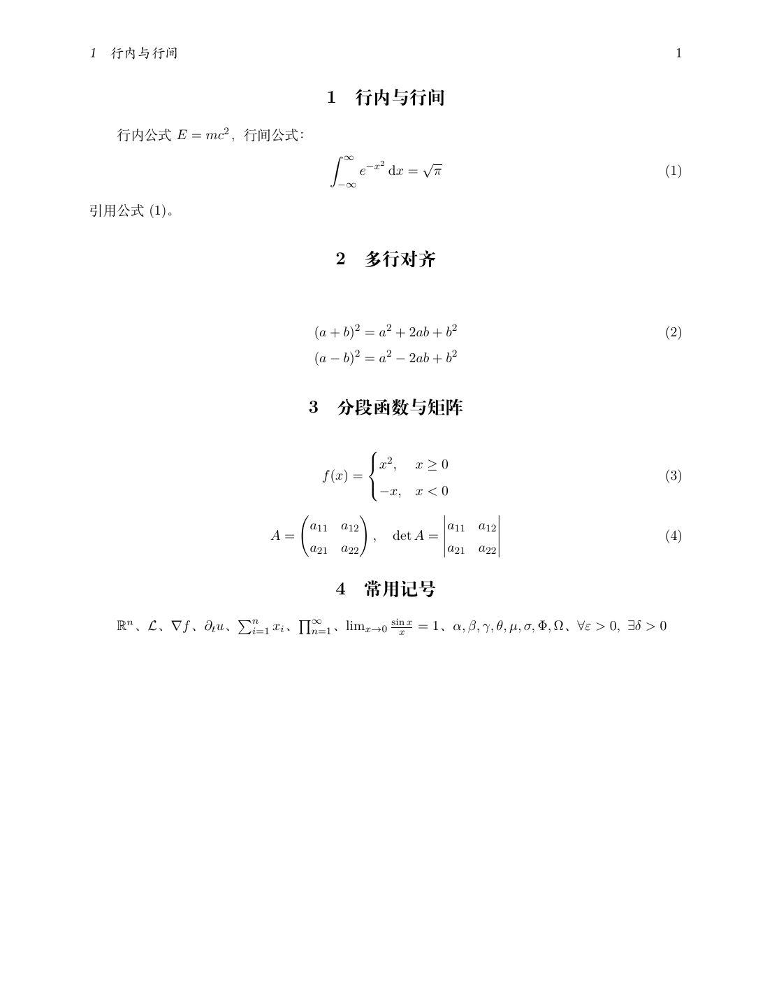
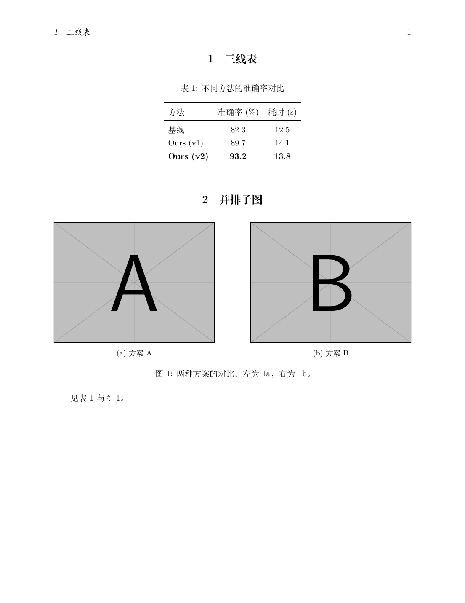
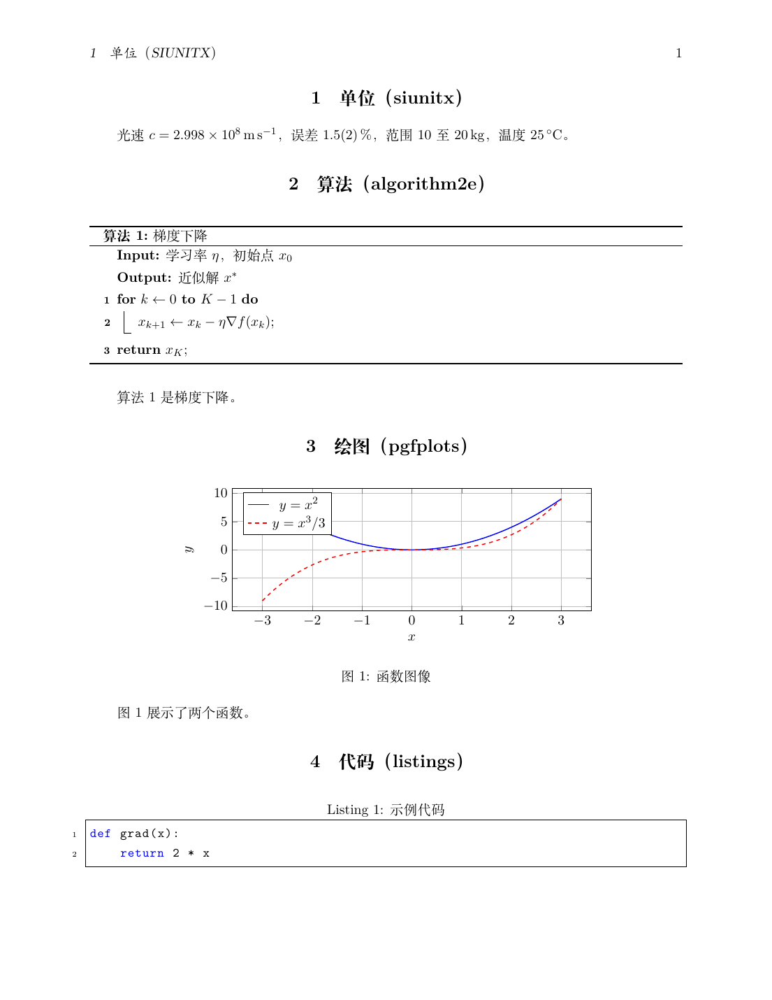
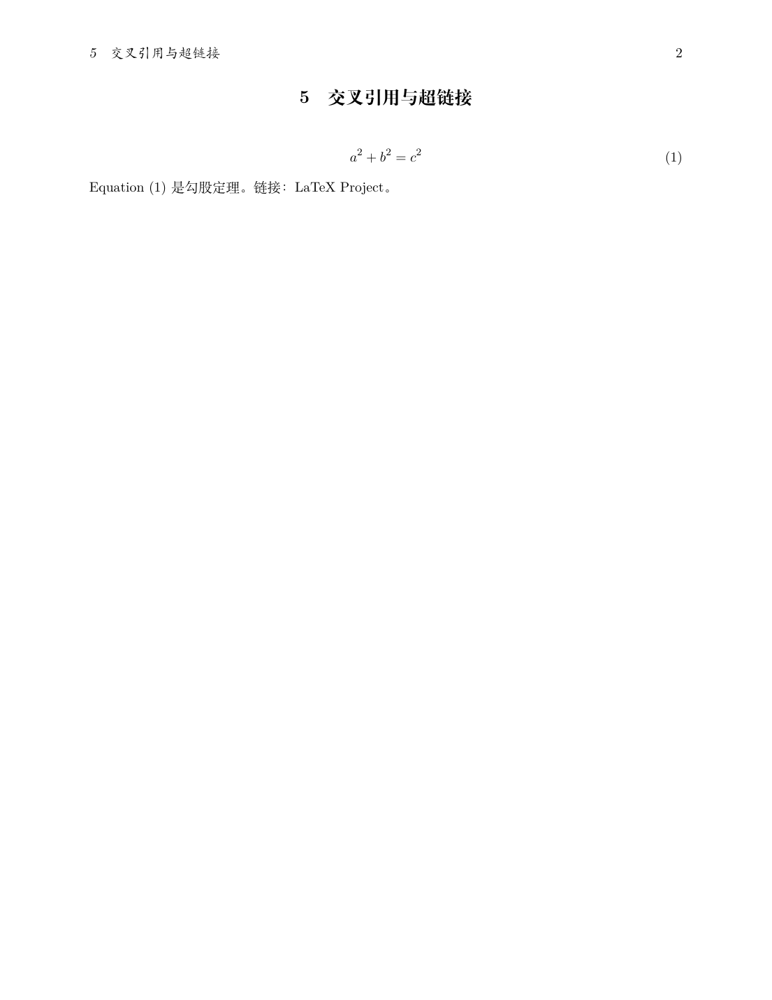
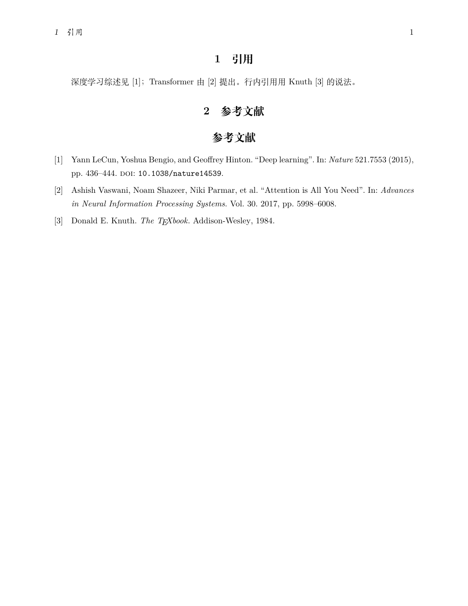
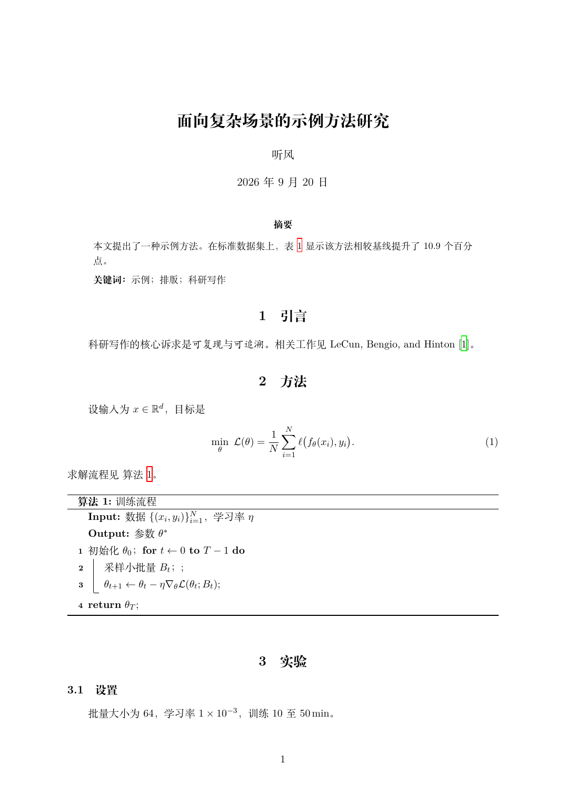

# LaTeX 科研写作手册（Arch Linux / Windows / macOS）

> - **版本**：TeX Live **2026**（Arch 包 `2026.1-1`）｜ LaTeX2e kernel **2025-11-01** ｜ ctexart 2022 ｜ biblatex 2025 ｜ biber **2.22** ｜ latexmk **4.87**
> - **官方文档**：[LaTeX Project](https://www.latex-project.org/) ｜ [CTAN](https://ctan.org/) ｜ [Overleaf 文档](https://www.overleaf.com/learn) ｜ [TeX Live](https://www.tug.org/texlive/)
> - **整理日期**：2026-09-20
> - **说明**：本手册以 **TUG / LaTeX Project / CTAN 的官方文档**为准，示例全部在 Arch Linux + TeX Live 2026（XeLaTeX）上**真实编译通过**后再收录；报错信息均为本机实测输出。图片来源见文末。
> - **先记住四件事**：
>   1. **中文文档一律用 `ctexart` + XeLaTeX**。用 pdfLaTeX 编中文会直接报错，这是新手第一大坑。
>   2. **编译只需要记一条命令：`latexmk -xelatex 文件.tex`**。它会自动决定要跑几遍、要不要跑 biber。
>   3. **忘了一个宏包怎么用，就 `texdoc 宏包名`**，会打开与本地版本完全一致的官方手册。
>   4. **报错先看输出里第一个以 `!` 开头的行**，紧跟着的 `l.42` 就是出问题的源码行号。

---

## 目录

0. [平台可用性总表](#0-平台可用性总表)
1. [LaTeX 是什么](#1-latex-是什么)
2. [安装与最小配置](#2-安装与最小配置)
3. [文档结构与编译流程](#3-文档结构与编译流程)
4. [引擎选择：pdfLaTeX / XeLaTeX / LuaLaTeX](#4-引擎选择pdflatex--xelatex--lualatex)
5. [中文排版](#5-中文排版)
6. [文本、结构与交叉引用](#6-文本结构与交叉引用)
7. [数学公式](#7-数学公式)
8. [图表](#8-图表)
9. [参考文献](#9-参考文献)
10. [科研写作工作流](#10-科研写作工作流)
11. [工程实践与排错](#11-工程实践与排错)
12. [速查表](#12-速查表)
13. [参考链接](#13-参考链接)

---

## 0. 平台可用性总表

| 项 | Arch Linux | Windows | macOS |
| --- | --- | --- | --- |
| 发行版 | `texlive-meta` + `texlive-lang` | TeX Live（官方 `install-tl-windows.exe`）或 MiKTeX | MacTeX（`brew install --cask mactex`） |
| 安装命令 | `sudo pacman -S texlive-meta texlive-lang biber` | 官方安装器图形界面 | `brew install --cask mactex-no-gui` |
| 二进制目录 | `/usr/bin`（`pdflatex` 等） | `C:\texlive\2026\bin\windows` | `/Library/TeX/texbin` |
| 更新方式 | **`pacman -Syu`**（随系统） | `tlmgr update --self --all` | `sudo tlmgr update --self --all` |
| 中文语言包 | `texlive-langchinese`（含在 `texlive-lang`） | TeX Live 全量自带 | MacTeX 全量自带 |
| biber | 独立包 `biber` | 自带 | 自带 |
| 推荐编辑器 | VS Code + LaTeX Workshop | 同左 / TeXstudio | 同左 / TeXstudio |
| 推荐预览器 | Zathura、Okular | SumatraPDF（支持 SyncTeX） | Skim、Preview |
| 免安装方案 | — | [Overleaf](https://www.overleaf.com/)（浏览器内，协作友好） | 同左 |

> **关键点**：三平台的**`.tex` 源文件写法完全一致**，差异只在安装方式、二进制路径和更新命令。
>
> ⚠️ **Arch 用户特别注意**：TeX Live 由 `pacman` 管理，**不要**运行 `tlmgr update`，否则会与包管理器冲突、产生"文件不属于任何包"的脏状态。更新一律用 `pacman -Syu`。

---

## 1. LaTeX 是什么


**LaTeX 是一套基于 TeX 的文档排版系统**：你写的是"这段文字是标题、这个是公式、这里引用了文献 X"，由排版引擎负责算出最终版面。你**不直接控制**字号和位置，而是描述结构。

### 1.1 名词先分清

| 名词 | 是什么 | 例子 |
| --- | --- | --- |
| **TeX** | 底层排版引擎（1978，Knuth） | — |
| **LaTeX** | 建立在 TeX 之上的宏包集合，提供 `\section` 这类高层命令 | LaTeX2e |
| **发行版（distribution）** | 把引擎 + 宏包 + 字体 + 文档打包在一起 | **TeX Live**、MiKTeX、MacTeX |
| **引擎（engine）** | 真正执行排版的程序 | `pdflatex`、`xelatex`、`lualatex` |
| **宏包（package）** | 扩展功能的代码库 | `amsmath`、`graphicx`、`ctex` |
| **文档类（class）** | 决定整篇文档的总体格式 | `article`、`ctexart`、`book` |

一句话：**TeX Live 是仓库，LaTeX 是语言，`xelatex` 是编译器，`ctexart` 是模板。**

### 1.2 科研为什么用它

| 需求 | LaTeX 的做法 | Word 的痛点 |
| --- | --- | --- |
| 数学公式 | `\begin{equation}...\end{equation}` | 公式编辑器，复杂公式难对齐 |
| 交叉引用 | `\ref{}` 自动编号 | 增删章节后编号错乱 |
| 参考文献 | `\cite{}` + `.bib` 数据库 | 手工维护，格式不统一 |
| 图表编号 | 自动编号，插入位置自动浮动 | 手动调整 |
| 版本管理 | 纯文本，`git diff` 可读 | 二进制，冲突无法合并 |
| 期刊模板 | 官方 `.cls` 直接套用 | 各刊模板质量参差 |
| 排版质量 | 专业级断行与字距算法 | 取决于手工调整 |

### 1.3 唯一需要接受的代价

LaTeX **不是所见即所得**。你需要一个"编译 → 看 PDF"的循环。好消息是：配好 `latexmk` 与编辑器后，保存即自动编译 + 预览刷新，这个循环几乎无感（见第 11 节）。

---

## 2. 安装与最小配置

### 2.1 Arch Linux

```bash
# 1) 先全量升级，避免部分升级
sudo pacman -Syu

# 2) 完整 TeX Live + 全部语言包（含中文）+ 文档
sudo pacman -Su --needed texlive-meta texlive-lang texlive-doc

# 3) biber 是独立包，texlive-meta 里没有，必须单独装
sudo pacman -S --needed biber
```

体积参考：下载约 4.8 GiB，装完约 7.5 GiB（其中 `texlive-doc` 离线手册占 4.4 GiB）。只想编译不查手册可去掉 `texlive-doc`。

### 2.2 Windows

从 [tug.org/texlive](https://www.tug.org/texlive/) 下载 `install-tl-windows.exe`，选择 **scheme-full**（完整）安装。或者用 MiKTeX（按需下载宏包，体积小，但生态兼容性略逊）。

### 2.3 macOS

```bash
brew install --cask mactex-no-gui     # 只要命令行，约 2 GB
# 或完整版（含 GUI 工具）
brew install --cask mactex
```

### 2.4 编辑器：VS Code + LaTeX Workshop

```bash
code --install-extension James-Yu.latex-workshop
```

关键配置（`settings.json`）：

```json
{
  "latex-workshop.latex.recipe.default": "latexmk (xelatex)",
  "latex-workshop.latex.autoBuild.run": "onSave",
  "latex-workshop.latex.autoClean.run": "onBuilt",
  "latex-workshop.view.pdf.viewer": "tab"
}
```

Windows 下 `latexmk` 已在 TeX Live 的 `bin` 目录里，装完即可用。

### 2.5 装完体检

```bash
pdflatex --version      # pdfTeX 3.141592653-2.6-1.40.29 (TeX Live 2026/Arch Linux)
xelatex  --version      # XeTeX 3.141592653-2.6-0.999998
lualatex --version      # LuaTeX 1.24.0
latexmk  --version      # Latexmk 4.87
biber    --version      # biber version: 2.22
texdoc   --version      # 能打开手册即正常
```

四个引擎 + `latexmk` + `biber` 都在，环境就算齐了。

---

## 3. 文档结构与编译流程

### 3.1 最小可编译文档

```latex
\documentclass[UTF8,11pt,a4paper]{ctexart}
\usepackage{geometry}
\geometry{margin=2.5cm}

\title{我的第一篇 \LaTeX{} 文档}
\author{听风}
\date{\today}

\begin{document}
\maketitle

\section{引言}\label{sec:intro}
这是一个段落。空行分段，连续多个空格会被折叠成一个。

\subsection{小标题}
用 \verb|\label| 和 \verb|\ref| 做交叉引用：见第~\ref{sec:intro}~节。

\begin{itemize}
  \item 无序列表第一项
  \item 第二项
\end{itemize}
\end{document}
```

编译：

```bash
latexmk -xelatex -interaction=nonstopmode 01-hello.tex
```

三个要点：

- `\documentclass` 到 `\begin{document}` 之间叫**导言区（preamble）**，放宏包与全局设置；
- `\begin{document}` 之后是**正文**；
- `~` 是**不断行空格**，`第~\ref{}~节` 保证编号不和"第/节"分到两行。

### 3.2 编译流程



`latexmk` 会解析 `.fls` / `.fdb_latexmk` 记录的文件依赖，自动决定迭代次数。**不要手工数编译遍数**。

### 3.3 中间文件一览

| 扩展名 | 作用 | 能删吗 |
| --- | --- | --- |
| `.aux` | 交叉引用、编号信息 | 能，会重新生成 |
| `.log` | 编译日志，**排错必看** | 能 |
| `.toc` / `.lof` / `.lot` | 目录 / 图表目录 | 能 |
| `.bcf` | biblatex 给 biber 的请求文件 | 能 |
| `.bbl` | biber 生成的文献条目 | 能 |
| `.out` | hyperref 的书签 | 能 |
| `.fls` / `.fdb_latexmk` | latexmk 的依赖记录 | 能 |
| `.synctex.gz` | 正反向搜索定位 | 删了就没跳转 |
| `.pdf` | **最终产物** | **不能** |

一键清理（保留 PDF）：

```bash
latexmk -c
```

### 3.4 报错怎么读

编译失败时，`latexmk -halt-on-error` 会停在第一处错误。日志里：

```
! Undefined control sequence.
l.3 \foo
        {bar}
```

- `!` 那一行是**错误类型**；
- `l.3` 是**源码行号**（这里是第 3 行）；
- 下一行显示该行内容，并用换行标出**出错位置**。

常见的 `!` 与含义见第 11.4 节。

---

## 4. 引擎选择：pdfLaTeX / XeLaTeX / LuaLaTeX

| 特性 | pdfLaTeX | XeLaTeX | LuaLaTeX |
| --- | --- | --- | --- |
| 输入编码 | UTF-8（但中文不行） | 原生 Unicode | 原生 Unicode |
| 系统字体 / OpenType | ❌（只能用 Type1/传统字体） | ✅ `fontspec` | ✅ `fontspec` |
| 中文支持 | ❌ 需 `CJK` 老方案 | ✅ `ctex` / `xeCJK` | ✅ `ctex` / `luatexja` |
| 速度 | 最快 | 中等 | 较慢（启动开销大） |
| 可编程 | ❌ | ❌ | ✅ 可内嵌 Lua |
| 微排版（microtype） | ✅ 完整 | 部分 | 部分 |
| 老宏包兼容 | ✅ 最好 | 多数可以 | 多数可以，个别不行 |
| 适用场景 | 纯英文、追求速度 | **中文 / 需要系统字体（默认首选）** | 需要 Lua 编程或 `luatexja` |

### 4.1 怎么选



**实践建议**：日常就固定用 `latexmk -xelatex`。它同样能编纯英文文档，省得在两套引擎间切换；只有在超长文档、编译时间成为瓶颈时才考虑换回 pdfLaTeX。

### 4.2 实测：同一份 ctexart 文档用 pdflatex 编

```
! Critical Class ctexart Error: CTeX fontset `fandol' is unavailable in
(ctexart)                       current mode.
!pdfTeX error: pdflatex (file unisong79): Font unisong79 at 720 not found
 ==> Fatal error occurred, no output PDF file produced!
```

而如果是普通 `article` 里写中文，报错更直白：

```
! LaTeX Error: Unicode character 你 (U+4F60)
               not set up for use with LaTeX.
```

**看到 `Unicode character ... not set up`，第一反应就是：引擎选错了，改用 XeLaTeX/LuaLaTeX。**

---

## 5. 中文排版

### 5.1 ctex：中文文档的标准方案

`ctex` 提供 `ctexart` / `ctexrep` / `ctexbook` 三个文档类，对应标准类，但自动处理中文字体、标点、行距与章节标题。

```latex
\documentclass[UTF8,12pt,a4paper]{ctexart}
\title{中文科技论文模板}
\author{听风}
\begin{document}
\maketitle

\section{中文排版}
中文与英文混排时，\LaTeX{} 会自动处理间距。例如"机器学习（Machine Learning）"。

\begin{abstract}
这是摘要环境。ctexart 会自动把标题设为"摘要"并调整字号。
\end{abstract}

\section{标点}
全角标点：引号、顿号、破折号——都能正常显示。
\end{document}
```

编译结果（本机 XeLaTeX 实际输出）：



### 5.2 字体集（fontset）

`ctex` 会自动探测引擎并选择字体集：

| fontset | 适用平台 | 字体 |
| --- | --- | --- |
| `fandol` | **全平台（默认）** | Fandol 系列（开源，随 TeX Live 分发） |
| `windows` | Windows | 中易宋体/黑体/楷体等系统字体 |
| `mac` / `macnew` / `macold` | macOS | 华文宋体/黑体等系统字体 |
| `ubuntu` | Ubuntu | Noto CJK |
| `none` | 任意 | 不加载字体，由你自己用 `\setCJKmainfont` 指定 |

强制指定：

```latex
\documentclass[UTF8,fontset=fandol]{ctexart}
```

自定义字体：

```latex
\usepackage{ctex}
\setCJKmainfont{FandolSong}      % 正文中文
\setCJKsansfont{FandolHei}       % 无衬线
\setCJKmonofont{FandolFang}      % 等宽
```

查看本机可用中文字体：`fc-list :lang=zh`。

### 5.3 xeCJK：精细控制

`ctex` 底层就是 `xeCJK`。需要单独控制中英文间距、标点压缩时可直接用：

```latex
\usepackage{xeCJK}
\xeCJKsetup{CJKmath=true}        % 数学环境里也允许中文
\setCJKmainfont{FandolSong}
```

`xeCJK` **只能在 XeLaTeX 下用**；LuaLaTeX 要用 `luatexja`。

### 5.4 中文相关的坑

| 现象 | 原因 | 解决 |
| --- | --- | --- |
| `Unicode character ... not set up` | 用了 pdfLaTeX | 换 `latexmk -xelatex` |
| `CTeX fontset 'fandol' is unavailable` | 同上 | 同上 |
| 中文显示为方块/豆腐 | 字体没嵌入或找不到 | `pdffonts out.pdf` 看是否有 Fandol；`fc-list :lang=zh` 查字体 |
| 标点后空格过大 | 全角标点 + 宏包冲突 | 检查是否重复加载 `xeCJK`/`ctex` |
| 中英文之间缺空格 | 引擎未启用 CJK 间距 | `ctex` 默认已处理；自定义时设 `\xeCJKsetup{CheckSingle=true}` |

验证字体是否嵌入（这一步能区分"真正常"和"看似正常"）：

```bash
pdffonts out.pdf
# 输出中出现 FandolSong-Regular / FandolHei 且 emb=yes 才算正常
```

---

## 6. 文本、结构与交叉引用

### 6.1 章节层级

```latex
\section{一级}\label{sec:a}
\subsection{二级}\label{sec:b}
\subsubsection{三级}
```

`article`/`ctexart` 最高是 `\section`；`book`/`ctexbook` 有 `\chapter`。加 `*` 号（如 `\section*{不编号}`）则不编号、不进目录。

### 6.2 列表

```latex
\begin{itemize}
  \item 无序项
  \item 可嵌套
\end{itemize}

\begin{enumerate}
  \item 有序项
  \item 第二项
\end{enumerate}

\begin{description}
  \item[术语] 解释文字
\end{description}
```

### 6.3 强调与文字样式

| 命令 | 效果 | 说明 |
| --- | --- | --- |
| `\emph{...}` | *倾斜* | **语义化**，嵌套时会自动交替 |
| `\textbf{...}` | **加粗** | 直接指定 |
| `\textit{...}` / `\texttt{...}` | 倾斜 / 等宽 | |
| `{\small ...}` `{\large ...}` | 字号 | 成对花括号限定作用域 |

### 6.4 交叉引用：label 与 ref

```latex
\section{方法}\label{sec:method}
\begin{equation}\label{eq:loss} L = \frac{1}{N}\sum_i \ell_i \end{equation}
\begin{figure}\caption{架构}\label{fig:arch}\end{figure}
\begin{table}\caption{结果}\label{tab:res}\end{table}

见第~\ref{sec:method}~节、式~\eqref{eq:loss}、图~\ref{fig:arch}、表~\ref{tab:res}。
```

| 命令 | 输出 | 用途 |
| --- | --- | --- |
| `\ref{x}` | `3` | 只出编号 |
| `\eqref{x}` | `(3)` | 带括号，给公式用 |
| `\pageref{x}` | `7` | 页码 |

**命名约定**：`sec:` / `eq:` / `fig:` / `tab:` / `alg:` / `lst:` 前缀，避免重名。

### 6.5 超链接：hyperref

```latex
\usepackage[hidelinks]{hyperref}     % hidelinks：去掉链接周围的彩色边框
```

⚠️ **坑**：`hyperref` 默认会给所有链接画彩色边框，打印和截图都很难看。**一定要加 `hidelinks`**，或者用 `colorlinks=true,linkcolor=blue` 改成彩色文字。

**加载顺序**：`hyperref` 必须放在**绝大多数宏包之后**（`cleveref` 之前），否则会导致链接失效或报错。

### 6.6 cleveref：智能引用（含中文化）

`cleveref` 能自动带上"图/表/式"等类型名：

```latex
\usepackage[hidelinks]{hyperref}     % 先 hyperref
\usepackage{cleveref}                % 后 cleveref

% —— 中文名称定制（必须写在 \usepackage{cleveref} 之后）
\crefname{equation}{式}{式}      \Crefname{equation}{式}{式}
\crefname{figure}{图}{图}        \Crefname{figure}{图}{图}
\crefname{table}{表}{表}         \Crefname{table}{表}{表}
\crefname{algorithm}{算法}{算法} \Crefname{algorithm}{算法}{算法}
```

```latex
见 \cref{eq:loss}、\cref{fig:arch} 与 \cref{tab:res}。
\Cref{eq:loss} 放在句首用大写形式。
```

实测输出：`见 式 (1)、图 1 与 表 1。`

> ⚠️ **实测坑（本机验证）**：算法环境的计数器名是 **`algorithm`**，不是 `algocf`。写成 `\crefname{algocf}{算法}{算法}` 不报错，但 `\cref` 会输出 `??`。用 `algorithm` 才生效。

---

## 7. 数学公式

### 7.1 宏包

```latex
\usepackage{amsmath,amssymb,mathtools,bm}
```

| 宏包 | 提供 |
| --- | --- |
| `amsmath` | `align`、`gather`、`cases`、`\eqref` 等核心环境 |
| `amssymb` | `\mathbb`、`\varnothing` 等符号（来自 AMSFonts） |
| `mathtools` | `amsmath` 的增强，`\coloneqq`、`dcases` 等 |
| `bm` | `\bm{x}` 粗体数学符号（比 `\boldsymbol` 更快） |

### 7.2 行内与行间

```latex
行内公式 $E=mc^2$，行间公式：
\begin{equation}
  \label{eq:gauss}
  \int_{-\infty}^{\infty} e^{-x^2}\,\mathrm{d}x = \sqrt{\pi}
\end{equation}
引用公式~\eqref{eq:gauss}。
```

- `$...$` 行内；`\[...\]` 不编号行间；`equation` 编号行间；
- `\,` 是细空格，`\mathrm{d}` 让微分算子直立（**科研写作规范**）；
- 不编号的行间公式可用 `\[...\]` 或 `equation*`。



### 7.3 多行公式

```latex
\begin{align}
  (a+b)^2 &= a^2 + 2ab + b^2 \label{eq:binomial}\\
  (a-b)^2 &= a^2 - 2ab + b^2 \nonumber
\end{align}
```

- `&` 对齐点，`\\` 换行；
- **`\nonumber`（或 `\notag`）抑制该行编号**——只给其中一行编号是论文里的常见需求；
- `align*` 全部不编号；`gather` 用于多行各自居中不对齐。

### 7.4 分段函数与矩阵

```latex
\begin{equation}
  f(x) = \begin{cases}
    x^2, & x \ge 0 \\
    -x,  & x < 0
  \end{cases}
\end{equation}

\begin{equation}
  A = \begin{pmatrix} a_{11} & a_{12} \\ a_{21} & a_{22} \end{pmatrix}, \quad
  \det A = \begin{vmatrix} a_{11} & a_{12} \\ a_{21} & a_{22} \end{vmatrix}
\end{equation}
```

矩阵族：`matrix`（无括号）、`pmatrix`（圆括号）、`bmatrix`（方括号）、`vmatrix`（行列式竖线）、`Vmatrix`（双竖线）。

### 7.5 常用符号

| 写法 | 输出 | 写法 | 输出 |
| --- | --- | --- | --- |
| `\mathbb{R}^n` | ℝⁿ | `\mathcal{L}` | ℒ |
| `\nabla f` | ∇f | `\partial_t u` | ∂ₜu |
| `\sum_{i=1}^{n}` | Σ | `\prod_{n=1}^{\infty}` | Π |
| `\lim_{x\to 0}` | lim | `\frac{a}{b}` | 分数 |
| `\sqrt{x}` / `\sqrt[3]{x}` | 根号 | `\left(\right)` | 自适应括号 |
| `\forall \varepsilon>0` | ∀ε>0 | `\exists \delta>0` | ∃δ>0 |
| `\approx \equiv \neq \leq \geq` | ≈ ≡ ≠ ≤ ≥ | `\in \subset \cup \cap` | ∈ ⊂ ∪ ∩ |
| `\alpha\beta\gamma\theta\mu\sigma\Phi\Omega` | 希腊字母 | `\to \mapsto \Rightarrow` | → ↦ ⇒ |

多字母上下标要用花括号：`x_{ij}`（不是 `x_ij`）。函数名用反斜杠：`\sin`、`\log`、`\max`、`\lim`，不要写 `sin`（会被当成 s·i·n）。

### 7.6 公式相关的坑

| 报错 | 原因 | 解决 |
| --- | --- | --- |
| `! Missing $ inserted.` | 在文本模式写了数学符号（如 `x_1`、`^`） | 用 `$...$` 包起来 |
| `! Double subscript.` | 写了 `x_i_j` | 改成 `x_{i_j}` 或 `x_{ij}` |
| `! LaTeX Error: \mathbb allowed only in math mode.` | 数学命令用在正文 | 加 `$...$` |
| 公式编号显示 `(0.1)` | 文档类/宏包导致的分节编号 | 正常现象；用 `\tag{}` 强制自定义 |

---

## 8. 图表

### 8.1 插图

```latex
\usepackage{graphicx}

\begin{figure}[htbp]
  \centering
  \includegraphics[width=0.7\linewidth]{figure.png}
  \caption{图像标题}\label{fig:demo}
\end{figure}
```

- `[htbp]` 是**浮动位置优先级**：`h`ere 当前位置 → `t`op 页顶 → `b`ottom 页底 → `p` 独立浮动页。LaTeX 自己决定，硬要"就放这里"用 `[H]`（需 `float` 宏包，但这会破坏排版弹性）；
- 图片建议用 **PDF/PNG**（矢量图用 PDF，截图用 PNG）；**JPEG 会引入块状伪影，不适合线条图**；
- 不写扩展名也行，`graphicx` 会自动找 `.pdf`/`.png`/`.jpg`。

> 💡 本机 TeX Live 自带 `example-image-a`、`example-image-b` 等占位图（来自 `mwe` 宏包），写模板示例时可以直接用，不必自备图片。

### 8.2 三线表：booktabs

**科研论文表格一律用三线表**，不要用竖线：

```latex
\usepackage{booktabs}

\begin{table}[htbp]
  \centering
  \caption{不同方法的准确率对比}
  \label{tab:acc}
  \begin{tabular}{lcc}
    \toprule
    方法 & 准确率 (\%) & 耗时 (s) \\
    \midrule
    基线              & 82.3 & 12.5 \\
    Ours (v1)         & 89.7 & 14.1 \\
    \textbf{Ours (v2)} & \textbf{93.2} & \textbf{13.8} \\
    \bottomrule
  \end{tabular}
\end{table}
```

- `\toprule` / `\midrule` / `\bottomrule` 粗细不同，比 `\hline` 专业；
- **不要用 `|` 竖线**，也不要在数据行之间加横线；
- 表头与数据之间的分隔必须是 `\midrule`。

### 8.3 并排子图：subcaption

```latex
\usepackage{subcaption}

\begin{figure}[htbp]
  \centering
  \begin{subfigure}[b]{0.45\textwidth}
    \centering
    \includegraphics[width=\linewidth]{a}
    \caption{方案 A}\label{fig:subA}
  \end{subfigure}
  \hfill
  \begin{subfigure}[b]{0.45\textwidth}
    \centering
    \includegraphics[width=\linewidth]{b}
    \caption{方案 B}\label{fig:subB}
  \end{subfigure}
  \caption{两种方案的对比。左为 \ref{fig:subA}，右为 \ref{fig:subB}。}
  \label{fig:both}
\end{figure}
```

两个子图宽度之和**要小于 1**（这里 `0.45 + 0.45`），留出间隔；`\hfill` 负责把两者推到两边。

实测输出：



> ⚠️ `subcaption` 与老宏包 `subfig`、`subfigure` **不能同时使用**，会重复定义计数器。新文档一律用 `subcaption`。

### 8.4 算法：algorithm2e

```latex
\usepackage[ruled,vlined,linesnumbered]{algorithm2e}
\SetAlgorithmName{算法}{算法}{算法列表}   % 中文化标题

\begin{algorithm}[htbp]
  \caption{梯度下降}\label{alg:gd}
  \KwIn{学习率 $\eta$，初始点 $x_0$}
  \KwOut{近似解 $x^\ast$}
  \For{$k \leftarrow 0$ \KwTo $K-1$}{
    $x_{k+1} \leftarrow x_k - \eta \nabla f(x_k)$\;
  }
  \Return $x_K$\;
\end{algorithm}
```

- `\KwIn` / `\KwOut` / `\For` / `\If` / `\While` / `\Return` 是关键字命令；
- **每条语句末尾的 `\;` 不能省**，它负责换行并加序号；
- 另一种选择是 `algorithmicx`（`algpseudocode`），语法不同，二者不要混用。

### 8.5 科研绘图：pgfplots

```latex
\usepackage{pgfplots}
\pgfplotsset{compat=1.18}     % 建议显式声明，否则会有版本警告

\begin{figure}[htbp]
  \centering
  \begin{tikzpicture}
    \begin{axis}[width=0.7\textwidth,height=5cm,
        xlabel={$x$}, ylabel={$y$}, grid=major, legend pos=north west]
      \addplot[domain=-3:3,samples=60,thick,blue]{x^2};
      \addlegendentry{$y=x^2$}
      \addplot[domain=-3:3,samples=60,thick,red,dashed]{x^3/3};
      \addlegendentry{$y=x^3/3$}
    \end{axis}
  \end{tikzpicture}
  \caption{函数图像}\label{fig:plot}
\end{figure}
```




> **工程建议**：数据图优先在 Python（matplotlib）里画好导出 **PDF 矢量图**再 `\includegraphics` 引入。`pgfplots` 的优势是字体与全文统一、可复现，但复杂图形编译很慢。

### 8.6 单位与数值：siunitx

```latex
\usepackage{siunitx}
\sisetup{range-phrase={\text{~至~}}, range-units=single}   % 中文范围词

光速 $c=\SI{2.998e8}{\metre\per\second}$，误差 \SI{1.5(2)}{\percent}，
范围 \SIrange{10}{20}{\kilo\gram}，温度 \SI{25}{\celsius}。
```

| 命令 | 输出 |
| --- | --- |
| `\SI{2.998e8}{\metre\per\second}` | 2.998×10⁸ m s⁻¹ |
| `\SI{1.5(2)}{\percent}` | 1.5(2) % |
| `\SIrange{10}{20}{\kilo\gram}` | 10 至 20 kg |
| `\SI{25}{\celsius}` | 25 °C |
| `\num{12345.6}` | 12 345.6（自动分组） |
| `S[table-format=2.1]` 列类型 | 表格里数字按小数点对齐 |

**论文里数字与单位之间不要手打空格**，一律交给 `siunitx`，能自动处理字体、间距和小数点对齐。

### 8.7 代码与伪代码：listings

```latex
\usepackage{listings}
\lstset{
  basicstyle=\ttfamily\small, breaklines=true, frame=single,
  numbers=left, numberstyle=\tiny,
  keywordstyle=\color{blue}, commentstyle=\color{gray}
}
\renewcommand{\lstlistingname}{代码}   % 中文化 "Listing"

\begin{lstlisting}[language=Python,caption={示例代码},label={lst:code}]
def grad(x):
    return 2 * x
\end{lstlisting}
```

### 8.8 图表相关的坑

| 报错 | 原因 | 解决 |
| --- | --- | --- |
| `! LaTeX Error: File 'xxx' not found.` | 图片路径/文件名不对 | 确认图片与 `.tex` 同目录，或写 `images/xxx` |
| `! Package pdftex.def Error: File 'xxx' not found` | 同上（引擎层） | 同上 |
| 图片跑到章节末尾 | 浮动体机制 | 用 `[htbp]`、缩小图片，或 `\usepackage{float}` + `[H]` |
| 子图编号变成 (a) (b) 之外的怪东西 | 同时加载了 `subcaption` 和 `subfig` | 只保留 `subcaption` |
| 表格列宽溢出页边 | 内容太宽 | 换 `tabularx`，或缩小字号 `{\small ...}` |

---

## 9. 参考文献

### 9.1 两条路线

| 维度 | **biblatex + biber**（推荐） | natbib + bibtex |
| --- | --- | --- |
| 数据格式 | `.bib`（同） | `.bib`（同） |
| 排序 | Unicode 感知，支持各语言规则 | 仅 ASCII/有限 8 位编码 |
| 引用命令 | `\cite` `\parencite` `\textcite` `\autocite` | `\cite` `\citet` `\citep` |
| 换样式 | 改一个 `style=` 选项即可 | 要换 `.bst` 文件 |
| 期刊 `.bst` 兼容 | 部分需要移植 | **原生兼容** |
| 工具链 | `latex → biber → latex → latex` | `latex → bibtex → latex → latex` |

**结论**：新项目用 **biblatex + biber**；只有期刊强制提供 `.bst` 时才退回 natbib + bibtex。

### 9.2 最小可用示例

`refs.bib`：

```bibtex
@article{lecun2015deep,
  author  = {LeCun, Yann and Bengio, Yoshua and Hinton, Geoffrey},
  title   = {Deep learning},
  journal = {Nature},
  volume  = {521},
  number  = {7553},
  pages   = {436--444},
  year    = {2015},
  doi     = {10.1038/nature14539}
}
@inproceedings{vaswani2017attention,
  author    = {Vaswani, Ashish and Shazeer, Noam and Parmar, Niki and others},
  title     = {Attention is All You Need},
  booktitle = {Advances in Neural Information Processing Systems},
  volume    = {30},
  pages     = {5998--6008},
  year      = {2017}
}
```

主文档：

```latex
\documentclass[UTF8,11pt]{ctexart}
\usepackage[backend=biber,style=numeric,sorting=none]{biblatex}
\addbibresource{refs.bib}

\begin{document}
深度学习综述见 \cite{lecun2015deep}；Transformer 由 \cite{vaswani2017attention} 提出。
行内引用用 \textcite{lecun2015deep} 的说法。

\printbibliography[title={参考文献}]
\end{document}
```

```bash
latexmk -xelatex 05-bib.tex     # 一条命令跑完 latex→biber→latex→latex
```

实测输出：



### 9.3 常用 style

| style | 效果 |
| --- | --- |
| `numeric` | `[1]` 数字上标/方括号 |
| `alphabetic` | `[LBB15]` |
| `authoryear` | `(LeCun et al. 2015)` |
| `nature` | Nature 期刊格式 |
| `ieee` | IEEE 格式 |

加 `natbib=true` 后仍可用 `\citet` / `\citep` 命令，便于从老文档迁移。

### 9.4 Zotero → Better BibTeX（强烈推荐）

手工维护 `.bib` 很痛苦。标准做法：

1. 安装 Zotero 插件 **Better BibTeX**（[retorque.re/zotero-better-bibtex](https://retorque.re/zotero-better-bibtex/)）；
2. 右键某个 collection → **Export Collection…**；
3. 格式选 **Better BibLaTeX**（配 biblatex）或 **Better BibTeX**（配 natbib）——**两者不可互换**，前者输出 `date`，后者输出 `year`/`month`；
4. 勾选 **Keep updated**，导出为 `.bib` 文件后由 Zotero 自动维护；
5. 在 `.tex` 里 `\addbibresource{refs.bib}` 指向该文件。

注意：`\addbibresource` 要写**完整文件名（含 `.bib`）**，而老式的 `\bibliography{refs}` 不写扩展名。

### 9.5 参考文献的坑

| 现象 | 原因 | 解决 |
| --- | --- | --- |
| 文献不出现，只显示 `[?]` | 没跑 biber | 用 `latexmk` 而非裸 `xelatex` |
| `Package biblatex Warning: Please (re)run Biber on the file: xxx` | 同上 | 同上，或手动 `biber xxx` 再编两遍 |
| `Empty bibliography` | `\addbibresource` 路径/扩展名错 | 检查路径，必须含 `.bib` |
| 中文文献排序乱 | 编码或 sortlocale | 用 biber（Unicode 感知）；设 `\usepackage[sortlocale=auto]{biblatex}` |
| `\cite` 未定义 | 加载了 biblatex 但用了 bibtex 的编译链 | 统一用 biber |

本机实测的错误提示（没跑 biber 时）：

```
Package biblatex Warning: Please (re)run Biber on the file:
(biblatex)                08-nobiber
(biblatex)                and rerun LaTeX afterwards.
```

---

## 10. 科研写作工作流

### 10.1 项目目录组织

推荐一个可长期维护的结构：

```text
paper/
├── main.tex                # 主文件，只管 \input 与全局设置
├── preamble.tex            # 导言区：宏包与自定义命令
├── sections/
│   ├── 01-intro.tex
│   ├── 02-method.tex
│   ├── 03-experiment.tex
│   └── 04-conclusion.tex
├── figures/                # 图片（建议 .pdf 矢量图）
├── refs.bib                # Zotero 自动导出
├── .gitignore              # 忽略编译中间文件
└── .latexmkrc              # latexmk 配置
```

`main.tex` 里用 `\input` 组装：

```latex
\input{preamble}
\begin{document}
\maketitle
\input{sections/01-intro}
\input{sections/02-method}
\input{sections/03-experiment}
\input{sections/04-conclusion}
\printbibliography
\end{document}
```

好处：单个文件不会长到卡编辑器，`git diff` 也更有意义。

### 10.2 git 版本管理论文

`.gitignore`：

```text
# 编译中间产物
*.aux
*.log
*.out
*.toc
*.lof
*.lot
*.bbl
*.blg
*.bcf
*.run.xml
*.fls
*.fdb_latexmk
*.synctex.gz
*.xdv

# 产物（视需要决定是否提交）
# *.pdf

# 编辑器
.vscode/
.idea/
```

> 建议**不要**提交 `.pdf`，让 CI 或本地每次重新生成；如果期刊需要，再单独归档。

### 10.3 latexdiff：生成修改稿

投稿返修时，期刊通常要求"标注修改处"。`latexdiff` 能对比两个版本自动生成修订标记：

```bash
latexdiff old.tex new.tex > diff.tex
latexmk -xelatex diff.tex
```

输出的 PDF 里新增内容带下划线、删除内容带删除线，省去手工标注。

### 10.4 完整论文模板

下面是一份经过本机编译验证的骨架，涵盖论文的全部常见组件：

```latex
\documentclass[UTF8,11pt,a4paper]{ctexart}

% ---------- 页面 ----------
\usepackage{geometry}
\geometry{left=2.5cm,right=2.5cm,top=2.5cm,bottom=2.5cm}

% ---------- 数学 ----------
\usepackage{amsmath,amssymb,mathtools,bm}

% ---------- 图表 ----------
\usepackage{graphicx}
\usepackage{subcaption}
\usepackage{booktabs}
\usepackage{multirow}
\usepackage{siunitx}

% ---------- 算法 ----------
\usepackage[ruled,vlined,linesnumbered]{algorithm2e}

% ---------- 文献 ----------
\usepackage[backend=biber,style=numeric,sorting=none]{biblatex}
\addbibresource{refs.bib}

% ---------- 引用与链接（必须放最后）----------
\usepackage{hyperref}
\usepackage{cleveref}

% ---------- 中文名称定制 ----------
\sisetup{range-phrase={\text{~至~}}, range-units=single}
\crefname{equation}{式}{式}       \Crefname{equation}{式}{式}
\crefname{figure}{图}{图}         \Crefname{figure}{图}{图}
\crefname{table}{表}{表}          \Crefname{table}{表}{表}
\crefname{algorithm}{算法}{算法}  \Crefname{algorithm}{算法}{算法}
\SetAlgorithmName{算法}{算法}{算法列表}

\title{\bfseries 面向复杂场景的示例方法研究}
\author{听风}
\date{\today}

\begin{document}
\maketitle

\begin{abstract}
\noindent 本文提出了一种示例方法。在标准数据集上，\cref{tab:main} 显示该方法相较基线提升了 10.9 个百分点。
\par\vspace{1ex}
\noindent\textbf{关键词：} 示例；排版；科研写作
\end{abstract}

\section{引言}\label{sec:intro}
科研写作的核心诉求是\emph{可复现}与\emph{可追溯}。相关工作见 \textcite{lecun2015deep}。

\section{方法}\label{sec:method}
\begin{equation}\label{eq:obj}
  \min_{\theta}\ \mathcal{L}(\theta)=\frac{1}{N}\sum_{i=1}^{N}\ell\bigl(f_\theta(x_i),y_i\bigr).
\end{equation}

\section{实验}\label{sec:exp}
\begin{table}[htbp]
  \centering
  \caption{主实验结果}\label{tab:main}
  \begin{tabular}{lS[table-format=2.1]S[table-format=2.1]}
    \toprule
    方法 & {准确率 (\%)} & {耗时 (s)} \\
    \midrule
    基线            & 82.3 & 12.5 \\
    本文 (w/o 模块) & 88.1 & 13.2 \\
    \textbf{本文}   & \bfseries 93.2 & \bfseries 13.8 \\
    \bottomrule
  \end{tabular}
\end{table}

\section{结论}\label{sec:conclusion}
目标函数见 \cref{eq:obj}，主结果见 \cref{tab:main}。

\printbibliography[title={参考文献}]
\end{document}
```

实测输出（第一页）：



### 10.5 期刊 / 会议模板去哪找

| 来源 | 说明 |
| --- | --- |
| [CTAN](https://ctan.org/) | 收录绝大多数期刊/会议官方模板（搜 `journal` 名或 publisher 名） |
| [Overleaf Gallery](https://www.overleaf.com/latex/templates) | 模板可视化预览，可直接套用 |
| 出版社官网 | Elsevier `elsarticle`、IEEE `IEEEtran`、Springer `svjour3` 等在其投稿页提供 |

**选模板的原则**：以**期刊官方提供的 `.cls`** 为准，不要用第三方改版。`\documentclass` 一换，多数宏包仍可用，但 `booktabs`、`siunitx` 等有时会被模板限制。

---

## 11. 工程实践与排错

### 11.1 latexmk：唯一需要记的编译工具

```bash
latexmk -xelatex main.tex          # 首选：中文/Unicode，自动跑 biber
latexmk -pdf main.tex              # 纯英文，pdflatex
latexmk -lualatex main.tex         # LuaLaTeX
latexmk -pvc -xelatex main.tex     # 持续监视，保存即重编译（preview continuously）
latexmk -c                         # 清理中间文件（保留 PDF）
latexmk -C                         # 连 PDF 一起清理
```

`.latexmkrc`（放在项目根目录，latexmk 自动读取）：

```perl
$xelatex = 'xelatex -synctex=1 -interaction=nonstopmode -file-line-error %O %S';
$pdf_mode = 5;          # 5 = 使用 $xelatex
$out_dir = 'build';     # 中间文件与 PDF 都放 build/（可选）
```

### 11.2 SyncTeX：从 PDF 跳回源码

```bash
latexmk -xelatex -synctex=1 main.tex
```

- **正向**（源码 → PDF）：编辑器里按 `Ctrl+Alt+J`（VS Code）；
- **反向**（PDF → 源码）：在 PDF 阅读器里 `Ctrl+单击`。

要求：

- 编译时必须带 `-synctex=1`，且**不能删** `.synctex.gz`；
- 阅读器必须支持 SyncTeX：Zathura/Okular（Linux）、Skim（macOS）、SumatraPDF（Windows）。

### 11.3 VS Code 常用入口

| 操作 | 快捷键 |
| --- | --- |
| 编译 | `Ctrl+Alt+B` |
| 查看 PDF | `Ctrl+Alt+V` |
| 正向搜索（源码→PDF） | `Ctrl+Alt+J` |
| 清理中间文件 | 命令面板 → `LaTeX Workshop: Clean up auxiliary files` |
| 选择编译配方 | 命令面板 → `LaTeX Workshop: Build with a recipe` |

### 11.4 真实报错速查（本机实测输出）

| 报错首行 | 含义 | 处理 |
| --- | --- | --- |
| `! Undefined control sequence.` | 命令拼错或宏包没加载 | 看 `l.NN` 那行，检查拼写/补 `\usepackage` |
| `! Missing $ inserted.` | 正文里用了数学符号 | 用 `$...$` 包起来 |
| `! LaTeX Error: File 'xxx' not found.` | 图片或其他文件找不到 | 检查路径与文件名 |
| `! LaTeX Error: \begin{itemize} on input line 3 ended by \end{document}.` | 环境没闭合 | 补上对应的 `\end{itemize}` |
| `! Emergency stop.` | 通常是缺 `\end{document}` | 检查文件结尾 |
| `! LaTeX Error: Unicode character 你 (U+4F60) not set up for use with LaTeX.` | 引擎不支持该字符 | 中文改用 XeLaTeX |
| `! Critical Class ctexart Error: CTeX fontset 'fandol' is unavailable in current mode.` | 用 pdfLaTeX 编 ctexart | 改 `latexmk -xelatex` |
| `Package biblatex Warning: Please (re)run Biber on the file: xxx` | 没跑 biber | 用 `latexmk`，别用裸引擎 |
| `Overfull \hbox (12.3pt too wide)` | 某行超出页边 **（警告，不是错误）** | 通常可忽略；长了再调措辞或 `\sloppy` |

**排查顺序**（照这个走能解决九成问题）：

1. **只处理第一个 `!`**，后面的错误往往是它引发的连锁反应；
2. 看 `l.NN` 定位到源码行；
3. 翻 `.log` 搜索该行上下文；`.log` 才是完整日志（终端输出是截断的）；
4. 二分法：把 `\input` 的章节逐个注释，缩小范围；
5. 用 `\listfiles` 打印所有宏包版本，怀疑版本冲突时排查。

### 11.5 调试技巧

```latex
\listfiles                    % 导言区：打印全部宏包及版本到 .log
\usepackage[draft]{graphicx}  % 只画图片边框，不加载图片（加速编译）
```

```bash
pdflatex -interaction=nonstopmode -file-line-error main.tex   # 不停下来等输入
pdflatex -draftmode main.tex                                  # 只排版不出 PDF（最快）
```

### 11.6 Arch 专属注意

- **不要 `tlmgr update`**：TeX Live 由 pacman 管理，用 `pacman -Syu` 更新；
- 报"文件不属于任何包"时：`pacman -Qo /usr/share/texmf-dist/...` 查归属，多半是误用了 tlmgr；
- 字体缓存问题：`fc-cache -fv`（改过系统字体后）。

---

## 12. 速查表

**最该形成肌肉记忆的**

| 目的 | 命令 |
| --- | --- |
| 编译（中文/通用） | `latexmk -xelatex main.tex` |
| 持续编译 | `latexmk -pvc -xelatex main.tex` |
| 清理中间文件 | `latexmk -c` |
| 查宏包手册 | `texdoc amsmath` |
| 查可用中文字体 | `fc-list :lang=zh` |
| 检查字体是否嵌入 | `pdffonts out.pdf` |
| 提取 PDF 文本（校验用） | `pdftotext out.pdf -` |
| 生成修改稿 | `latexdiff old.tex new.tex > diff.tex` |

**常用宏包加载顺序（骨架）**

```latex
\documentclass[UTF8,11pt,a4paper]{ctexart}
\usepackage{geometry}                        % 页面
\usepackage{amsmath,amssymb,mathtools,bm}    % 数学
\usepackage{graphicx,subcaption,booktabs}    % 图表
\usepackage{siunitx}                         % 单位
\usepackage[ruled,vlined,linesnumbered]{algorithm2e}
\usepackage[backend=biber,style=numeric]{biblatex}
\addbibresource{refs.bib}
\usepackage{hyperref}                        % ← 最后
\usepackage{cleveref}                        % ← hyperref 之后
\begin{document}
```

**最常用的十组命令**

```latex
\section{}  \label{}  \ref{}  \cref{}  \eqref{}
\begin{equation}...\end{equation}
\begin{align}...\end{align}
\begin{figure}...\caption{}...\end{figure}
\begin{table}...\toprule...\midrule...\bottomrule...\end{table}
\cite{}  \textcite{}  \printbibliography
\includegraphics[width=0.8\linewidth]{x}
\SI{25}{\celsius}   \num{12345}
```

---

## 13. 参考链接

**官方文档**

- LaTeX Project 官网：<https://www.latex-project.org/>
- LaTeX Project 文档入口：<https://www.latex-project.org/help/documentation/>
- LaTeX2e 非官方参考手册（按命令查）：<https://latexref.xyz/>
- CTAN 宏包仓库：<https://ctan.org/>
- TeX Live 官方：<https://www.tug.org/texlive/>
- TeX Live 英文手册（HTML）：<https://www.tug.org/texlive/doc/texlive-en/texlive-en.html>
- texdoc 在线版（= 本地 `texdoc` 的网页版）：<https://texdoc.org/>
- Overleaf 学习中心：<https://www.overleaf.com/learn>
- Overleaf 模板库：<https://www.overleaf.com/latex/templates>

**入门读物**

- *The Not So Short Introduction to LaTeX2e*（lshort）英文版：<https://ctan.org/pkg/lshort>
- lshort 中文版《一份不太简短的 LaTeX2e 介绍》PDF：<https://mirrors.ctan.org/info/lshort/chinese/lshort-zh-cn.pdf>
- lshort 中文版源码仓库：<https://github.com/ctex-org/lshort-zh-cn>
- Overleaf《Learn LaTeX in 30 minutes》：<https://www.overleaf.com/learn/latex/Learn_LaTeX_in_30_minutes>

**本手册涉及的宏包（CTAN 官方页）**

| 用途 | 宏包 | 链接 |
| --- | --- | --- |
| 中文文档类 | ctex | <https://ctan.org/pkg/ctex> |
| 中文精细排版 | xeCJK | <https://ctan.org/pkg/xecjk> |
| 数学 | amsmath / amsfonts / mathtools | <https://ctan.org/pkg/amsmath> · <https://ctan.org/pkg/amsfonts> · <https://ctan.org/pkg/mathtools> |
| 插图 | graphicx | <https://ctan.org/pkg/graphicx> |
| 子图 | subcaption | <https://ctan.org/pkg/subcaption> |
| 三线表 | booktabs | <https://ctan.org/pkg/booktabs> |
| 单位 | siunitx | <https://ctan.org/pkg/siunitx> |
| 算法 | algorithm2e / algorithmicx | <https://ctan.org/pkg/algorithm2e> · <https://ctan.org/pkg/algorithmicx> |
| 绘图 | pgfplots | <https://ctan.org/pkg/pgfplots> |
| 文献 | biblatex / biber / natbib | <https://ctan.org/pkg/biblatex> · <https://ctan.org/pkg/biber> · <https://ctan.org/pkg/natbib> |
| 交叉引用 | cleveref / hyperref | <https://ctan.org/pkg/cleveref> · <https://ctan.org/pkg/hyperref> |
| 页面 | geometry | <https://ctan.org/pkg/geometry> |
| 自动化 | latexmk | <https://ctan.org/pkg/latexmk> |
| 修改稿 | latexdiff | <https://ctan.org/pkg/latexdiff> |
| 文献管理 | Zotero Better BibTeX | <https://retorque.re/zotero-better-bibtex/> |

**本机验证环境**

```text
TeX Live 2026 (Arch, 2026.1-1)  |  LaTeX2e <2025-11-01>  |  ctexart 2022
pdfTeX 1.40.29  XeTeX 0.999998  LuaTeX 1.24.0
biblatex 2025  biber 2.22  latexmk 4.87
```

**配图来源**

- `images/latex-project-logo.svg`：The LaTeX Project 官方 logo（<https://www.latex-project.org/>），用于标识本手册主题，版权归 The LaTeX Project 所有。
- `images/output-*.png`：**本机用 XeLaTeX 真实编译后经 `pdftoppm` 渲染**的输出截图，非转载；对应的 `.tex` 源码即本文档中的示例。
