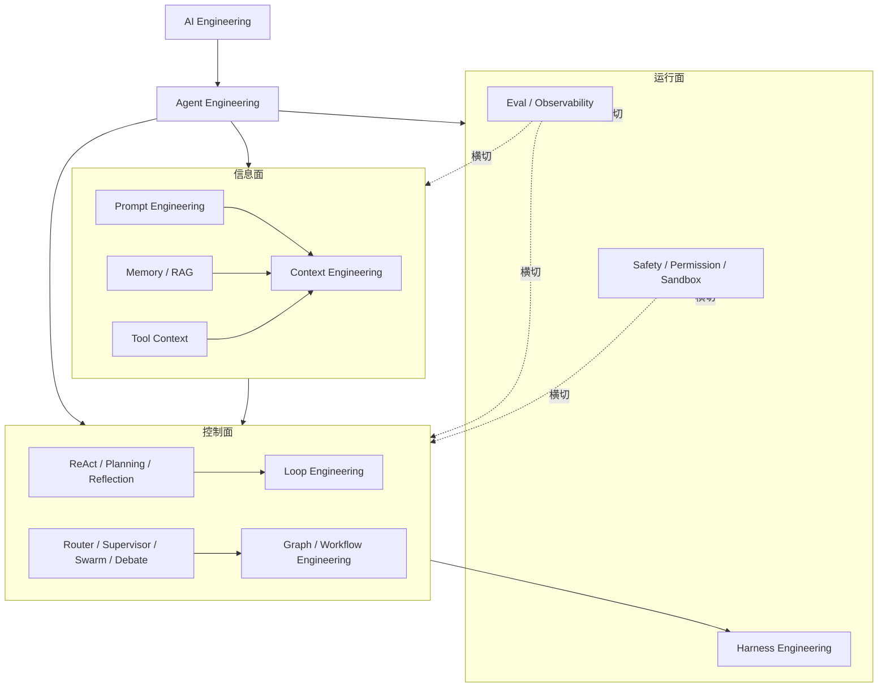

# AI 工程专题一手资料研究底稿

> 研究日期：2026-09-14  
> 输入材料：`C:\Users\LENOVO\Desktop\Agent工程分类.md`、Datawhale Hello-Agents 第四章，以及文末列出的一手论文、官方文档和官方项目仓库。  
> 用途：供正式的“AI 工程”多篇笔记编写使用。本文件是研究底稿，不是最终文章。

## 1. 结论先行

桌面源文档提出的“AI Engineering → Agent Engineering → 五个设计面 → 六个设计模式”适合作为教学目录，但应作为**实用工程框架**，不能写成业界已有统一标准。建议正式笔记使用三层结构：

1. **上位领域**：AI Engineering 是把模型、数据、检索、工具、Agent、评估与运行基础设施组合成可交付系统的工程；Agent Engineering 是其中面向智能体系统的子集。
2. **设计面**：Prompt、Context、Loop、Graph、Harness 回答“系统在哪个维度被设计”。其中 Prompt/Context 已有较稳定用法；Loop、Graph、Harness 是有实际工程对象支撑、但术语仍在快速演化的归纳。
3. **模式与拓扑**：ReAct、Plan-and-Execute、Reflection、Tool Use 是执行循环或能力模式；Router、Supervisor、Swarm/Handoff、Debate 是多 Agent 的路由或协作拓扑；Graph/Workflow 是承载这些模式的显式控制结构。

还应增加三个横切关注点：**评估与可观测性、安全与权限、成本与延迟**。它们不适合硬塞成 L6/L7，因为会横跨信息、控制和运行三个面。

## 2. 对源文档的保留与修正

### 2.1 可以保留的核心判断

- 五个 Engineering 是“设计面”，六种模式是控制面上的可复用做法，二者不是同一层级。
- ReAct、Plan-and-Execute、Reflection 可以组合，例如 Supervisor 的 worker 内部使用 ReAct，生成器和评审器之间使用 Reflection。
- Harness 是模型外部真正驱动系统运行的执行层。Hugging Face 的术语表把它描述为调用模型、处理工具调用和决定何时停止的层，并把 harness engineering 归纳为停止条件、错误处理与护栏的设计。[Hugging Face：Agent glossary](https://huggingface.co/blog/agent-glossary)
- Agentic Engineering 与 Agent Engineering 不同。IBM 2026 年的定义将 Agentic Engineering 描述为“用工程专业知识编排和监督 AI Agent 完成软件开发”，它强调**用 Agent 做工程**，不是**构造 Agent 系统**。[IBM：What is agentic engineering?](https://www.ibm.com/think/topics/agentic-engineering)

### 2.2 必须加上的限定

| 源文档说法 | 更严谨的写法 |
| --- | --- |
| 五层是 Agent Engineering 的层级树 | 五项更适合称为“设计面/观察视角”，它们会交叠，不是严格 OSI 式分层 |
| Prompt 只管单次调用 | Prompt 是指令、示例和输出约束的设计；它通常是一次调用输入的一部分，但模板也可跨调用复用 |
| Context 是 Prompt 的上一层 | Prompt 本身也是 context 的组成部分；Context Engineering 还管理消息历史、检索结果、工具定义、运行状态和记忆 |
| ReAct 的 Thought 必须明文输出 | 原论文用显式推理轨迹研究该范式；现代工具调用 Agent 不要求向用户暴露私有推理，只需要保留行动、观察和可审计决策摘要 |
| Plan-and-Solve 等于 Plan-and-Execute | 前者原论文是零样本 CoT 提示策略；后者是带执行器、状态、工具和可选 replanning 的 Agent 架构 |
| Reflection 等于 Reflexion | Reflection 是通用“生成—评审—修订”模式；Reflexion 是 Shinn 等人的特定框架，包含环境反馈、反思文本和情景记忆 |
| Supervisor 与 Router 都是中心调度 | Router 多为一次分类后分发；Supervisor 是完整 Agent，会跨步骤/多轮动态选择 worker 并综合结果 |
| Swarm 等于任意多 Agent | LangGraph Swarm 的具体含义是对等 Agent 通过 handoff 转移 active agent，并用 checkpointer 保留跨轮状态 |
| Debate 总能提高质量 | Debate 是候选—互评—修订/裁决的研究模式；收益依赖角色差异、独立证据和裁决规则，多 Agent 也可能产生群体偏差和额外成本 |

证据：

- ReAct 将语言推理轨迹与任务动作交错生成，让动作取得环境反馈、反馈继续修正后续推理。[ReAct 论文](https://arxiv.org/abs/2210.03629)、[Google Research 解读](https://research.google/blog/react-synergizing-reasoning-and-acting-in-language-models/)
- Plan-and-Solve 原论文明确是先制定把任务拆成子任务的计划，再逐步执行这些子任务，以减少 Zero-shot-CoT 的漏步、计算与语义理解错误。[ACL 2023 / arXiv](https://arxiv.org/abs/2305.04091)
- Reflexion 使用语言反馈而非更新模型权重，并把反思保存在 episodic memory 中供后续尝试使用。[Reflexion 论文](https://arxiv.org/abs/2303.11366)
- LangChain 官方多 Agent 文档区分了 Subagents、Handoffs、Skills 和 Router，并明确指出 Supervisor 是维护对话上下文的完整 Agent，Router 通常是一次分类分发。[LangChain：Multi-agent](https://docs.langchain.com/oss/python/langchain/multi-agent)、[Subagents](https://docs.langchain.com/oss/python/langchain/multi-agent/subagents)
- LangGraph Supervisor 官方仓库当前建议：多数新项目优先用“把子 Agent 包装成工具”的手工 supervisor 模式，以获得更好的上下文控制；`langgraph-supervisor` 包主要继续服务既有系统迁移。[langgraph-supervisor-py](https://github.com/langchain-ai/langgraph-supervisor-py)
- LangGraph Swarm 官方实现通过 handoff tool 转移当前 active agent，并依赖 checkpointer 在多轮对话中持久化该状态。[langgraph-swarm-py](https://github.com/langchain-ai/langgraph-swarm-py)
- 多智能体辩论论文让多个实例先独立提出答案，再读取和批评其他实例、迭代更新答案。[Du et al., 2023](https://arxiv.org/abs/2305.14325)

## 3. 建议的正式专题目录

建议新增 `docs/llm-applications/ai-engineering/`，按以下顺序组织。RAG 已经有完整独立专题，因此这里只解释它在 Context Engineering 中的位置并交叉链接，不重复十几篇 RAG 内容。

| 顺序 | 建议文件 | 标题 | 必须覆盖 |
| --- | --- | --- | --- |
| 1 | `index.md` | AI 工程总览 | AI/Agent/Agentic Engineering 区分；信息面、控制面、运行面；模式可组合；选型路线 |
| 2 | `prompt-engineering.md` | Prompt Engineering | 指令、角色、约束、few-shot、结构化输出、版本化、prompt eval；说明 prompt 是 context 子集 |
| 3 | `context-engineering.md` | Context Engineering | context 构成、选择与排序、JIT 加载、压缩、隔离、token 预算、长任务上下文退化 |
| 4 | `memory-and-rag.md` | Memory、RAG 与外部知识 | working/short-term/long-term memory；checkpoint vs store；RAG 与 memory 区别；链接既有 RAG 专题 |
| 5 | `tool-engineering.md` | Tool Use 与工具工程 | schema、描述、输入验证、幂等、超时、分页/截断、错误语义、权限、MCP、工具评估 |
| 6 | `agent-loop-and-harness.md` | Loop 与 Harness Engineering | model-call/tool-result 循环、状态机、停止条件、预算、重试、恢复、sandbox、HITL、trace |
| 7 | `single-agent-patterns.md` | 单 Agent 经典范式 | ReAct、Plan-and-Solve、Plan-and-Execute、Reflection/Reflexion；公式、伪代码、可运行示例、选型 |
| 8 | `routing-and-supervisor.md` | Router 与 Supervisor | 一次路由、并行 fan-out、中心 supervisor、worker 隔离、综合与失败传播 |
| 9 | `swarm-debate-and-collaboration.md` | Swarm、Debate 与多智能体协作 | handoff、active agent、共享/隔离上下文、对抗式评审、共识/投票、通信成本 |
| 10 | `graph-and-workflow-engineering.md` | Graph / Workflow Engineering | state/node/edge/reducer、分支、循环、并行、子图、checkpoint、interrupt、确定性与 agentic 混合 |
| 11 | `production-agent-systems.md` | 生产级智能体系统 | eval、可观测性、质量门、权限、安全、成本/延迟、回放、灰度、故障恢复 |
| 12 | `sources-and-coverage.md` | 来源与覆盖清单 | 原始 MD 项目逐项映射到文章；论文、官方文档、复用图片与许可证说明 |

### 3.1 首页推荐的一张总图



## 4. 五个设计面的证据化定义

### 4.1 Prompt Engineering：设计明确的模型输入契约

Prompt 文章不应只列“角色 + 任务 + 格式”模板，而应把它写成可测试的输入契约：

- system/developer/user 指令的职责与优先级；
- 正例、反例和边界示例；
- 输出 schema、拒绝条件和不确定性表达；
- prompt 与模型版本一起固定；
- 用测试集验证任务成功率，而非凭主观“看起来更好”。

Anthropic 将 prompt engineering 解释为为最佳输出而编写、组织指令的方法，并将 context engineering 视为它的自然延伸。[Anthropic：Effective context engineering](https://www.anthropic.com/engineering/effective-context-engineering-for-ai-agents)

**推荐示例**：同一“工单分类”任务先用自由文本输出，再改成 Pydantic/JSON schema；对 10 条包含模糊、越权和多意图的样例自动断言分类、置信度和理由字段。这样示例展示的不只是“提示词技巧”，还展示可回归测试。

### 4.2 Context Engineering：每次推理前装配最有用的 token

Anthropic 的定义是：在推理时策划并维持最优 token 集合，范围不仅是 prompt，还包括系统指令、消息历史、工具定义、工具结果、检索文档、持久记忆和运行状态。[Anthropic：Effective context engineering](https://www.anthropic.com/engineering/effective-context-engineering-for-ai-agents)

应围绕四种工程动作来讲：

1. **选择**：按当前步骤选择相关消息、记忆、检索片段和工具，不把“可能有用”的全部内容塞入。
2. **按需加载**：先给文件路径、查询 ID、URL 等轻量标识，需要时再用工具读取。Anthropic 将其称为 just-in-time context retrieval。
3. **压缩**：清除过时工具结果、总结完成阶段、只保存决策与证据指针；原始材料留在外部存储中可追溯。
4. **隔离**：让子 Agent 使用独立上下文窗口，只把结构化结论和证据返回主 Agent。多 Agent 同时也是一种 context isolation/compression 技术。

**必须强调**：更长的上下文窗口不等于可以停止筛选。无关内容会造成 context pollution，长任务仍需 compaction、structured note-taking 和多 Agent 隔离。[Anthropic：Effective context engineering](https://www.anthropic.com/engineering/effective-context-engineering-for-ai-agents)

**推荐可运行示例**：实现一个 `ContextBuilder`，输入 `messages/memories/documents/tools/token_budget`，先固定系统指令，再选择本轮必要工具，再按相关性放入记忆和文档，最后从最近向前装入消息；打印每类 token 占比和被舍弃项。示例可先用字符估算，明确标注生产应换成模型 tokenizer。

### 4.3 Memory：保存状态或经验，不等于把所有聊天历史永久塞回 prompt

LangGraph 官方将 memory 分为：

- **短期记忆**：线程内状态，通常由 checkpointer 保存，支持多轮连续性、恢复、human-in-the-loop 和 time travel；
- **长期记忆**：跨线程的应用数据，由 store 保存，例如用户偏好、事实和经验。

[LangGraph：Memory](https://docs.langchain.com/oss/python/langgraph/add-memory)、[Persistence](https://docs.langchain.com/oss/python/langgraph/persistence)

长对话的处理方式包括 trim、delete、summarize 和自定义过滤。存储与注入必须分开：**“记住”是写入策略，“想起”是检索策略，“放进本轮”是上下文装配策略。**

**推荐示例**：用 `InMemorySaver` + 固定 `thread_id` 演示线程级连续性，再用 store 维护跨线程用户偏好；另加一段超过预算后先总结旧消息的逻辑。

### 4.4 RAG：外部语料检索增强，不等于 Agent Memory

RAG 原论文把参数化模型和非参数化外部记忆结合，用检索到的文档支持知识密集型生成。[Lewis et al., 2020](https://arxiv.org/abs/2005.11401)

在本专题中只需讲清：

- RAG 的主索引通常是共享知识语料，Memory 更常是某个用户、线程或 Agent 的经验与状态；
- 二者都经历“写入/索引 → 检索 → 选择 → 注入 context”，技术可以复用；
- Agentic RAG 会让 Agent 决定何时检索、改写查询、判断证据是否足够以及是否重试；
- 具体 chunking、embedding、hybrid search、rerank、GraphRAG、评估和生产实践链接到现有 `docs/llm-applications/rag/`，不要重复复制。

### 4.5 Tool Context 与 Tool Engineering：工具既是能力，也是上下文负担

工具不是只有函数体，模型真正看见的是名称、描述、输入 schema、可用时机和返回结果。Anthropic 的工程经验包括：

- 工具边界清楚、名称空间明确；
- 描述解释何时使用、何时不要使用；
- 输入 schema 严格，错误信息要告诉 Agent 如何修正；
- 大返回值支持分页、范围选择、过滤和截断；
- 以评估集检查工具是否被正确选择、参数是否正确，而非只测 HTTP 成功。

[Anthropic：Writing effective tools for agents](https://www.anthropic.com/engineering/writing-tools-for-agents)

MCP 将工具、资源和 prompts 作为三类核心 server primitives；它解决的是客户端与外部能力/上下文之间的协议，不自动解决工具选择、权限、token 预算或业务幂等。[MCP 2026-07-28 Architecture](https://modelcontextprotocol.io/specification/2026-07-28/architecture)

**推荐示例**：同一个 `search_orders` 工具先返回全部订单，再改成 `status/date_from/date_to/cursor/limit/fields` 参数和摘要返回，展示工具描述与返回压缩如何减少 token 并提高选择准确率。

## 5. Loop、Graph 与 Harness 的边界

### 5.1 Loop Engineering：设计单个执行体如何继续、纠错和停止

IBM 将其定义为设计迭代引导 Agent 完成目标的 workflow/loop：Agent 动作、观察、决策并迭代，直到完成。[IBM：What is loop engineering?](https://www.ibm.com/think/topics/loop-engineering)

最小循环不是一句“while true”，而是以下状态机：

```text
load state -> build context -> call model -> validate decision
  -> final: verify and stop
  -> tool call: authorize -> execute -> normalize observation -> persist -> continue
  -> invalid/error: bounded retry or escalate
```

需要显式设计：`max_steps`、token/cost/time budget、工具错误重试、相同调用去重、无进展检测、停止验证、取消、人工升级、状态持久化。

### 5.2 Graph / Workflow Engineering：把控制流从 prompt 移到可检查结构

LangGraph 官方把自身定位为面向长运行、有状态 Agent 的低层 orchestration/runtime，支持 durable execution、streaming、human-in-the-loop、memory，并允许在同一图中混合确定性节点和模型驱动节点。[LangGraph overview](https://docs.langchain.com/oss/python/langgraph/overview)

核心对象：

- **State**：输入、消息、计划、证据、计数器、路由决定和中间产物；
- **Node**：一个有边界的函数、模型调用、工具、校验器或子 Agent；
- **Edge**：固定、条件、循环、错误或人工路由；
- **Reducer**：并行节点更新同一字段时的合并规则；
- **Checkpoint / Interrupt**：暂停、恢复、审批和故障重放。

“Graph Engineering”仍应标注为工程归纳，不要声称是正式学科。真正成熟且可引用的是上述状态图、工作流和运行时能力。

### 5.3 Harness Engineering：承载模型和循环的运行系统

Harness 负责模型调用、tool dispatch、停止判断、状态/上下文装配、权限、sandbox、重试、恢复、日志和评估挂钩。它与 loop 的区别：

- loop 是控制策略；
- harness 是实现并约束这个策略的运行系统；
- orchestrator 管理多个 Agent，而每个 Agent 可以有自己的 harness。

Hugging Face 的术语表提供了这一区分。[Harness, Scaffold, and the AI Agent Terms Worth Getting Right](https://huggingface.co/blog/agent-glossary)

**推荐的零框架、可测试最小 Harness 示例**：

```python
from dataclasses import dataclass, field
from time import monotonic
from typing import Any, Callable, Literal, Protocol


@dataclass
class Decision:
    kind: Literal["tool", "final"]
    name: str | None = None
    arguments: dict[str, Any] = field(default_factory=dict)
    answer: str | None = None


class Model(Protocol):
    def decide(self, messages: list[dict[str, str]]) -> Decision: ...


def run_agent(
    model: Model,
    tools: dict[str, Callable[..., Any]],
    user_input: str,
    *,
    max_steps: int = 8,
    timeout_s: float = 30.0,
) -> str:
    messages = [{"role": "user", "content": user_input}]
    deadline = monotonic() + timeout_s

    for step in range(1, max_steps + 1):
        if monotonic() >= deadline:
            raise TimeoutError("agent exceeded its time budget")

        decision = model.decide(messages)
        if decision.kind == "final":
            if not decision.answer:
                raise ValueError("empty final answer")
            return decision.answer

        if decision.name not in tools:
            observation = {"ok": False, "error": "tool_not_allowed"}
        else:
            try:
                value = tools[decision.name](**decision.arguments)
                observation = {"ok": True, "value": value}
            except Exception as exc:
                observation = {"ok": False, "error": type(exc).__name__}

        messages.append({
            "role": "user",
            "content": f"step={step}; observation={observation!r}",
        })

    raise RuntimeError("agent exceeded max_steps without a final answer")
```

这是“真实的 harness 代码骨架”，但模型适配器可用 fake model 做单元测试、用任意支持结构化工具调用的 SDK 做生产适配。正式文章应补：schema validation、幂等键、调用超时/取消、日志脱敏、危险工具批准和持久化接口。

## 6. 单 Agent 模式

### 6.1 ReAct

**机制**：模型依据任务和历史行动/观察选择下一动作，环境执行后返回新观察，循环直至 final。形式可写为：

$$
(r_t, a_t) = \pi(q, a_1,o_1,\ldots,a_{t-1},o_{t-1}),\qquad o_t=T(a_t)
$$

适合：路径不可完全预知、需要外部检索/API/计算、观察会改变下一步的任务。

主要失败：错误工具选择、参数格式错误、观察污染上下文、重复调用、循环不终止、工具结果被错误解释。

正式示例建议：

- 教学版：沿用 Hello-Agents 的 `Thought → Action → Observation` parser，清楚展示原理；
- 工程版：使用当前 `langchain.agents.create_agent` 和带 docstring 的真实工具，让 provider-native tool calling 取代脆弱正则解析；
- 必须有 `max_steps`、工具 allowlist、结构化返回和失败重试；UI 日志只展示“动作、参数摘要、观察、结果”，不展示私有推理全文。

来源：[ReAct](https://arxiv.org/abs/2210.03629)、[Hello-Agents 第四章](https://github.com/datawhalechina/hello-agents/blob/main/docs/chapter4/%E7%AC%AC%E5%9B%9B%E7%AB%A0%20%E6%99%BA%E8%83%BD%E4%BD%93%E7%BB%8F%E5%85%B8%E8%8C%83%E5%BC%8F%E6%9E%84%E5%BB%BA.md)

### 6.2 Plan-and-Solve 与 Plan-and-Execute

| 维度 | Plan-and-Solve | Plan-and-Execute |
| --- | --- | --- |
| 起源/重点 | 提示模型先列推理计划，再按计划解题 | 工程架构：planner + executor + state + 可选 replanner |
| 外部工具 | 非必需 | 通常会调用搜索、代码、API 等工具 |
| 状态 | 可只存在 prompt 文本中 | 显式保存 plan、past_steps、result、budget |
| 变化处理 | 原始方案倾向按初始计划执行 | 每步后可 replan、删改剩余步骤或结束 |

正式示例建议以 LangGraph 状态图实现：

```text
START -> planner -> executor -> replanner
                           ^       |
                           |       +-- response ready -> END
                           +---------- remaining plan
```

Context7 核验到的当前 Graph API 是 `StateGraph(State)`、`add_node`、`add_edge`、`add_conditional_edges`、`compile`，使用 `START/END`；正式代码应为 planner/replanner 使用 Pydantic 结构化输出，禁止用 `ast.literal_eval` 解析任意模型文本。[LangGraph Plan-and-Execute tutorial](https://langchain-ai.github.io/langgraph/tutorials/plan-and-execute/plan-and-execute/)

### 6.3 Reflection 与 Reflexion

通用 Reflection：`generate -> evaluate -> revise -> evaluate...`。Evaluator 最好返回结构化字段：`passed`、`issues`、`evidence`、`revision_instructions`；必须限定轮数，并优先使用测试、schema、检索证据等外部反馈，不能只相信模型的自评。

Reflexion 特定框架：Actor 产生轨迹，Evaluator 给外部反馈，Self-Reflection 生成语言反思，并写入 episodic memory 影响下一次尝试。[Reflexion](https://arxiv.org/abs/2303.11366)

正式示例建议：代码生成—运行 pytest—评审失败日志—修改，直到测试通过或 3 轮结束。它比纯文本“请反思一下”更能体现工程价值。

### 6.4 Tool Use 是跨层能力，不只是 ReAct 的别名

Tool Use 可以出现在：单次 function calling、ReAct 循环、Plan executor、Supervisor 调 worker、Graph 节点。因此它横跨：

- 信息面：工具定义占 context；
- 控制面：模型或路由器决定调用哪个工具；
- 运行面：harness 校验、授权和执行工具。

正式文章应以这个跨层视角讲解，避免把“有工具”自动等同于“ReAct”。

## 7. 多 Agent 模式与拓扑

### 7.1 Router

Router 的典型流程是 `classify -> fan-out -> gather -> synthesize`。适合输入能被明确分域、一次分发即可完成、并行能降低延迟的任务。路由最好是结构化输出；确定性规则能覆盖时，不必让 LLM 决定。

LangChain 官方示例使用 `StateGraph`、Pydantic 分类结果和 `Send` 将 GitHub/Notion/Slack 子问题并行发给专门 Agent，再用 reducer 合并结果。[Router knowledge base](https://docs.langchain.com/oss/python/langchain/multi-agent/router-knowledge-base)

### 7.2 Supervisor / Orchestrator-Workers

Supervisor 是中心 Agent，把 worker 包装成工具；它维护总体目标和对话上下文，动态决定调用、串并行顺序与综合方式。适合多个明确专业域且需要跨步骤协调的任务。

Anthropic 的 orchestrator-workers 定义与此相近：中心 LLM 动态拆分任务、委派 worker、综合结果；它与固定 parallelization 的差异是子任务由输入动态决定。[Building effective agents](https://www.anthropic.com/engineering/building-effective-agents)

正式示例采用 LangChain 当前推荐模式：

1. 用 `create_agent(model, tools, system_prompt=...)` 创建 research/math 两个 worker；
2. 用 `@tool` 包装 `worker.invoke(...)`，严格控制传给 worker 的任务和返回给 supervisor 的摘要；
3. 再创建一个拥有这两个工具的 supervisor；
4. 展示并行、失败传播、子上下文隔离与最终综合。

不要以旧 `create_supervisor` 包作为唯一推荐；官方仓库已说明多数用例推荐直接 tools pattern。[Supervisor tutorial](https://docs.langchain.com/oss/python/langchain/supervisor)、[langgraph-supervisor-py README](https://github.com/langchain-ai/langgraph-supervisor-py)

### 7.3 Swarm / Handoff

Swarm 没有永久中心调度者；当前 active agent 可以调用 handoff 工具把控制权转给另一个 Agent。适合需要专家直接接管用户对话、跨轮保持负责人的场景，不适合要求统一审计与集中控制的高风险流程。

Context7 核验的官方当前示例使用：

```python
from langchain.agents import create_agent
from langgraph.checkpoint.memory import InMemorySaver
from langgraph_swarm import create_handoff_tool, create_swarm

alice = create_agent(
    model,
    tools=[create_handoff_tool(agent_name="Bob")],
    system_prompt="You are Alice.",
    name="Alice",
)
bob = create_agent(
    model,
    tools=[create_handoff_tool(agent_name="Alice")],
    system_prompt="You are Bob.",
    name="Bob",
)
app = create_swarm([alice, bob], default_active_agent="Alice").compile(
    checkpointer=InMemorySaver()
)
result = app.invoke(
    {"messages": [{"role": "user", "content": "I need Bob"}]},
    {"configurable": {"thread_id": "demo-1"}},
)
```

来源：[langgraph-swarm-py](https://github.com/langchain-ai/langgraph-swarm-py)

### 7.4 Debate

最小拓扑：并行生成多个相互独立的候选 → 交换候选与证据 → 各自批评/修订 → judge 或规则聚合。为了避免伪多样性，应让辩手使用不同证据、角色或模型，并让最终裁决引用可验证证据。

正式示例建议：两个 reviewer 分别检查事实与逻辑，第三个 judge 读取原答案、两份结构化审查和引用，输出 `accept/revise`；限制 2 轮。不要把它写成无限群聊。

来源：[Improving Factuality and Reasoning in Language Models through Multiagent Debate](https://arxiv.org/abs/2305.14325)、[ChatEval](https://arxiv.org/abs/2308.07201)

### 7.5 多智能体协作的生产约束

Anthropic 的生产研究系统采用 lead agent + 并行 subagents，并总结出以下可迁移经验：

- 子任务必须带明确 objective、output format、工具/来源指引和边界，否则会重复与遗漏；
- worker 在独立上下文中搜索和压缩，只把高信号证据交回 lead；
- 长任务把计划和阶段摘要写入外部 memory；
- 并行能降低复杂检索延迟，但协调、token 成本和评估复杂度同时上升。

[Anthropic：How we built our multi-agent research system](https://www.anthropic.com/engineering/multi-agent-research-system)

## 8. Graph/Workflow 的当前可运行 API 建议

Context7 对 LangGraph 当前官方文档的核验结果：

```python
from typing import Literal, TypedDict
from langgraph.graph import END, START, StateGraph


class State(TypedDict):
    query: str
    evidence: list[str]
    answer: str
    retries: int
    passed: bool


def retrieve(state: State) -> dict:
    return {"evidence": [f"evidence for {state['query']}"]}


def generate(state: State) -> dict:
    return {"answer": "\n".join(state["evidence"])}


def verify(state: State) -> dict:
    enough = bool(state["evidence"] and state["answer"].strip())
    return {
        "passed": enough,
        "retries": state["retries"] if enough else state["retries"] + 1,
    }


def route(state: State) -> Literal["done", "retry"]:
    return "done" if state["passed"] or state["retries"] >= 2 else "retry"


builder = StateGraph(State)
builder.add_node("retrieve", retrieve)
builder.add_node("generate", generate)
builder.add_node("verify", verify)
builder.add_edge(START, "retrieve")
builder.add_edge("retrieve", "generate")
builder.add_edge("generate", "verify")
builder.add_conditional_edges("verify", route, {"done": END, "retry": "retrieve"})

app = builder.compile()
print(app.invoke({
    "query": "What is a graph agent?",
    "evidence": [],
    "answer": "",
    "retries": 0,
    "passed": False,
}))
```

这个纯函数示例可直接运行，正式文章再替换 `retrieve/generate/verify` 为真实 retriever、模型和质量校验器。质量门使用显式 `passed: bool` 字段，避免把“答案非空”误当作“答案合格”。

生产文章还应补：

- `RetryPolicy(max_attempts=...)` 只处理瞬时基础设施错误，内容质量重试应是显式边；
- checkpointer + `thread_id` 用于 durable state；
- `interrupt()` + `Command(resume=...)` 用于人工审核；
- 并行更新 list 字段时声明 reducer，避免覆盖；
- 每个节点输入输出使用 typed state，边的选择记录到 trace。

[StateGraph 与条件边](https://docs.langchain.com/oss/python/langgraph/overview)、[Interrupts](https://docs.langchain.com/oss/python/langgraph/interrupts)、[Persistence](https://docs.langchain.com/oss/python/langgraph/persistence)

## 9. 生产级文章必须增加的内容

### 9.1 评估与可观测性

最少记录：任务 ID、模型/提示版本、节点开始结束、route、工具名与参数摘要、工具结果摘要、token、成本、延迟、重试、验证结果、人工决定、最终任务结果。工具本身也需要 eval：正确选择率、参数正确率、任务完成率、错误恢复率。[Anthropic：Writing effective tools for agents](https://www.anthropic.com/engineering/writing-tools-for-agents)

### 9.2 安全与权限

- 工具最小权限与 allowlist；
- 读操作和写/删/支付/发布操作分级；
- 高影响动作前 human approval；
- sandbox 限制文件、网络和进程；
- prompt injection 输入与工具输出都视为不可信；
- secrets 不进入模型可见上下文和 trace；
- 幂等键、dry run、可回滚和审计日志。

### 9.3 预算与终止

每个 loop/graph 都应同时有 step、时间、token、成本和并发预算，并定义：完成、无进展、外部取消、工具不可用、需要人工、预算耗尽六类终止原因。不能只依赖模型输出“我完成了”。

### 9.4 从简单 workflow 开始

Anthropic 建议区分 workflow（由预定义代码路径编排）和 agent（由模型动态决定过程），并从能满足需求的最简单方案开始；只有在步骤数和路径难以预知时才增加自治循环。[Anthropic：Building effective agents](https://www.anthropic.com/engineering/building-effective-agents)

## 10. Hello-Agents 内容与图片复用清单

本机仓库快照：`D:\archlinux\hello-agents`，研究时 HEAD 为 `4f7682ceafe573d07cd8a7d0b89908500e83227d`。

第四章原文：

- `D:\archlinux\hello-agents\docs\chapter4\第四章 智能体经典范式构建.md`
- 在线来源：[Datawhale Hello-Agents 第四章](https://github.com/datawhalechina/hello-agents/blob/main/docs/chapter4/%E7%AC%AC%E5%9B%9B%E7%AB%A0%20%E6%99%BA%E8%83%BD%E4%BD%93%E7%BB%8F%E5%85%B8%E8%8C%83%E5%BC%8F%E6%9E%84%E5%BB%BA.md)

可复制到正式文章同级 `images/` 的四张原图：

| 源文件 | 内容 | 建议落点 |
| --- | --- | --- |
| `docs/images/4-figures/4-1.png` | ReAct 的 LLM、Tools、Environment 循环 | `single-agent-patterns.md` 的 ReAct 小节 |
| `docs/images/4-figures/4-2.png` | Planning、Task Agent、Replan 两阶段图 | Plan-and-Execute 小节；正文解释它比原始 Plan-and-Solve 多了 replanning |
| `docs/images/4-figures/4-3.png` | Actor、Evaluator、Self-reflection、短期/长期记忆 | Reflection/Reflexion 小节 |
| `docs/images/4-figures/4-4.png` | ReAct / Plan-and-Solve / Reflection 选型表 | 单 Agent 模式结尾，可改用 Markdown 表以适配移动端 |

该章未发现 GIF；不应为了满足“有 GIF”而虚构或生成。若后续从其他来源加入 GIF，需确认许可证、体积、暗色背景和静态首帧可读性。

Hello-Agents README 声明内容采用 [CC BY-NC-SA 4.0](https://creativecommons.org/licenses/by-nc-sa/4.0/)。复制图片时必须在正式文章参考资料中署名 Datawhale / Hello-Agents、链接原章并保留相同许可要求；如果 WindWiki 未来用于商业目的，应先处理该许可证兼容性。

Rspress 项目规则要求图片用 Markdown 相对路径：

```markdown

```

不要保留原章的 HTML ``，也不要远程热链 raw.githubusercontent.com。

## 11. 技术选型速查表

| 问题特征 | 首选模式 | 不宜默认使用 |
| --- | --- | --- |
| 固定步骤、强审计 | deterministic workflow / graph | 开放式 swarm |
| 路径未知、依赖环境反馈 | ReAct + bounded harness | 一次性长 prompt |
| 可预先拆解且步骤依赖强 | Plan-and-Execute + replan | 每步重新无计划探索 |
| 有自动测试/明确 rubric | Reflection / evaluator-optimizer | 纯主观自我反思 |
| 输入可一次分域并行 | Router + fan-out/fan-in | 跨轮 supervisor |
| 多专业域需中心协调 | Supervisor/subagents as tools | 所有工具塞给单 Agent |
| 专家需直接接管对话 | Handoff/Swarm | stateless router |
| 需要独立观点与交叉审查 | Debate + evidence + judge | 同模型同 prompt 无限群聊 |
| 长任务、暂停恢复、人工审批 | StateGraph + checkpointer + interrupt | 进程内裸 `while True` |

## 12. 一手来源清单

### 经典范式与论文

1. Yao et al. [ReAct: Synergizing Reasoning and Acting in Language Models](https://arxiv.org/abs/2210.03629), ICLR 2023.
2. Wang et al. [Plan-and-Solve Prompting: Improving Zero-Shot Chain-of-Thought Reasoning by Large Language Models](https://arxiv.org/abs/2305.04091), ACL 2023.
3. Shinn et al. [Reflexion: Language Agents with Verbal Reinforcement Learning](https://arxiv.org/abs/2303.11366), NeurIPS 2023.
4. Du et al. [Improving Factuality and Reasoning in Language Models through Multiagent Debate](https://arxiv.org/abs/2305.14325).
5. Lewis et al. [Retrieval-Augmented Generation for Knowledge-Intensive NLP Tasks](https://arxiv.org/abs/2005.11401), NeurIPS 2020.
6. Wu et al. [AutoGen: Enabling Next-Gen LLM Applications via Multi-Agent Conversation](https://arxiv.org/abs/2308.08155), COLM 2024.

### 官方工程文档

1. Anthropic, [Building effective agents](https://www.anthropic.com/engineering/building-effective-agents).
2. Anthropic, [Effective context engineering for AI agents](https://www.anthropic.com/engineering/effective-context-engineering-for-ai-agents).
3. Anthropic, [Writing effective tools for agents](https://www.anthropic.com/engineering/writing-tools-for-agents).
4. Anthropic, [How we built our multi-agent research system](https://www.anthropic.com/engineering/multi-agent-research-system).
5. LangChain, [Multi-agent](https://docs.langchain.com/oss/python/langchain/multi-agent).
6. LangChain, [Supervisor tutorial](https://docs.langchain.com/oss/python/langchain/supervisor).
7. LangGraph, [Overview](https://docs.langchain.com/oss/python/langgraph/overview).
8. LangGraph, [Memory](https://docs.langchain.com/oss/python/langgraph/add-memory).
9. LangGraph, [Persistence](https://docs.langchain.com/oss/python/langgraph/persistence).
10. LangGraph, [Plan-and-Execute tutorial](https://langchain-ai.github.io/langgraph/tutorials/plan-and-execute/plan-and-execute/).
11. LangGraph, [Supervisor repository](https://github.com/langchain-ai/langgraph-supervisor-py).
12. LangGraph, [Swarm repository](https://github.com/langchain-ai/langgraph-swarm-py).
13. Hugging Face, [Harness, Scaffold, and the AI Agent Terms Worth Getting Right](https://huggingface.co/blog/agent-glossary).
14. IBM, [What is loop engineering?](https://www.ibm.com/think/topics/loop-engineering).
15. IBM, [What is agentic engineering?](https://www.ibm.com/think/topics/agentic-engineering).
16. Model Context Protocol, [2026-07-28 Architecture](https://modelcontextprotocol.io/specification/2026-07-28/architecture).
17. Datawhale, [Hello-Agents 第四章：智能体经典范式构建](https://github.com/datawhalechina/hello-agents/blob/main/docs/chapter4/%E7%AC%AC%E5%9B%9B%E7%AB%A0%20%E6%99%BA%E8%83%BD%E4%BD%93%E7%BB%8F%E5%85%B8%E8%8C%83%E5%BC%8F%E6%9E%84%E5%BB%BA.md).

## 13. 写作与验证清单

- 每篇文章至少一个可运行示例；示例声明 Python 版本、安装命令、环境变量和运行命令。
- “纯 Python 教学实现”与“框架生产实现”明确分开；模拟工具必须标注模拟。
- 所有循环都有上限和停止原因；所有危险工具都有权限边界。
- 代码不要依赖正则解析自由文本作为唯一控制协议，优先 schema/typed state。
- Router、Supervisor、Swarm、Debate 各有独立示例，不能用同一个群聊示例换标题。
- 复用四张 Hello-Agents 图片时复制到文章同级 `images/`，用 Markdown 相对链接并署名许可证。
- 构建后验证页面内图片 `naturalWidth !== 0`，并检查 Mermaid、KaTeX、代码高亮和移动端表格。
- 对 LangChain/LangGraph 等时效性 API，在落文档当天再次用 Context7/官方文档核验；本底稿记录的是 2026-09-14 查询结果。

## 14. 本次检索记录

- **Tavily**：抽取用户指定的 Datawhale 页面；由于 Docsify `#/...` 路由只返回站点壳，随后定位并读取 GitHub 仓库中的第四章原始 Markdown。另以限定域搜索并抽取 ReAct、Plan-and-Solve、Reflexion、RAG、多 Agent Debate 论文，以及 Anthropic、IBM、LangChain、Hugging Face、MCP 的官方页面。
- **Context7**：将 LangGraph 解析为 `/websites/langchain_oss_python_langgraph`，核验 `StateGraph`、`START/END`、节点、普通边、条件边、checkpoint 和 interrupt；将 Supervisor 与 Swarm 分别解析为 `/langchain-ai/langgraph-supervisor-py` 和 `/langchain-ai/langgraph-swarm-py`，核验 `create_supervisor`、`create_swarm`、`create_handoff_tool` 及当前官方推荐用法。
- **本机源仓库**：读取 `D:\archlinux\hello-agents` 的第四章与四张原图，确认第四章没有 GIF，并记录仓库提交 `4f7682ceafe573d07cd8a7d0b89908500e83227d` 和 CC BY-NC-SA 4.0 许可。
